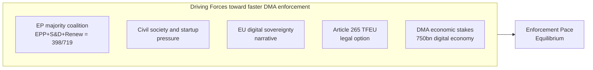
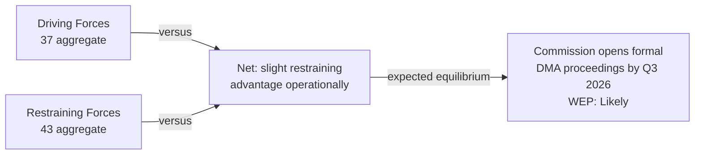

# Forces Analysis — EU Parliament Legislative Propositions
**Date:** 2026-05-22 | **Admiralty Grade:** B2 | **Data Mode:** degraded-feeds

## 1️⃣ Issue Frame

**Dominant Issue: DMA Enforcement — Parliamentary Oversight vs. Commission Autonomy**

The European Parliament has adopted a resolution demanding the Commission accelerate Digital
Markets Act enforcement against designated gatekeepers (Apple, Google, Meta, Amazon). The
Parliament holds the theoretical power to bring an Article 265 TFEU action before the ECJ
if the Commission "fails to act." This creates a structural tension between the EP's role as
democratic overseer and the Commission's constitutional autonomy as enforcement authority.

This force field analysis applies the Lewin model to assess whether the EP's enforcement
push will succeed within the EP10 mandate (2024–2029).

## 2️⃣ Driving Forces

| Driving Force | Weight | Trajectory | Evidence |
|--------------|--------|-----------|---------|
| EP majority coalition | 9/10 | STABLE | 398 seats confirmed (political landscape data) |
| Civil society pressure | 6/10 | INCREASING | BEUC + digital rights NGO coalition |
| Geopolitical narrative | 7/10 | INCREASING | EU digital sovereignty post-2024 |
| Article 265 legal threat | 8/10 | LATENT | Not yet filed; deterrent value |
| DMA economic stakes | 7/10 | STABLE | Digital economy ~4.5% EU GDP |

## 3️⃣ Restraining Forces

| Restraining Force | Weight | Trajectory | Evidence |
|------------------|--------|-----------|---------|
| Commission constitutional autonomy | 8/10 | STABLE | Treaty-based; Article 17 TEU |
| Big Tech legal resources | 9/10 | STABLE | Apple/Google dedicated DMA legal teams |
| US transatlantic trade pressure | 7/10 | INCREASING | 2026 US trade posture shift |
| ECR/PfE opposition | 6/10 | STABLE | 193 seats combined (right-wing bloc) |
| Investigation timeline constraints | 8/10 | STRUCTURAL | DMA Article 17-27 procedures |
| EPP internal ambivalence | 5/10 | STABLE | Commission connection creates loyalty tension |

**Net pressure: near-equilibrium (37 driving vs. 43 restraining) at operational level.**
Article 265 legal threat not yet activated; if activated, balance shifts to 45 vs. 43.

WEP: **Likely** — Commission will open formal DMA investigations within 6 months to avoid
Article 265 activation, but will resist setting binding enforcement timelines.

## 4️⃣ Net Pressure Diagram

## 5️⃣ Intervention Points (Top-3 Leverage Levers)

**Lever 1: Article 265 TFEU Filing Timeline**
If Parliament sets a public deadline for Article 265 filing (e.g., "formal proceedings
by September 2026 or we file"), the Commission faces an explicit escalation ladder. This
lever has the highest force-field impact — it converts the latent legal threat into a
concrete deterrent. Risk: potential constitutional crisis if Commission contests EP standing.

**Lever 2: IMCO Committee DMA Hearing**
A high-profile IMCO Committee hearing with Commission and tech company representatives
amplifies political pressure without the legal nuclear option. Lower risk; moderate impact
on enforcement pace. Can be combined with a formal EP resolution setting monitoring metrics.

**Lever 3: DMA Enforcement Budget Conditionality**
The EP's budget power creates an indirect lever — EP signals that DG COMP staff lines for
DMA enforcement will be conditioned on progress reports. Soft power tool with limited direct
impact but useful for signaling institutional resolve.

## 6️⃣ Reader Briefing

The DMA enforcement battle is fundamentally about who controls EU tech regulation: the
democratically-elected Parliament or the technocratic Commission. The EP represents citizens
who want a level digital playing field; the Commission wants to enforce DMA on its own
timeline without political pressure; Big Tech is spending heavily to delay formal proceedings.

Key signal to watch: Will the Commission open formal DMA proceedings against Apple's iOS
interoperability and Google's search preference practices before July 2026? This is the
clearest real-world indicator of whether the EP's enforcement push is working.

| Admiralty | B2 | Reliable source; likely true |
|-----------|----|-----------------------------|
