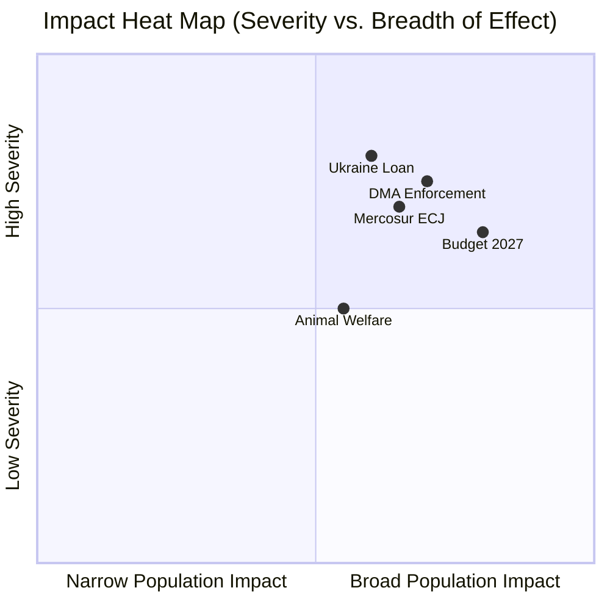

# Impact Matrix — EU Parliament Legislative Propositions
**Date:** 2026-05-22 | **Admiralty Grade:** B2 | **Data Mode:** degraded-feeds

## 1️⃣ Event List

Five legislative events assessed in this impact matrix (all confirmed via `get_adopted_texts(year=2026)`):

1. **DMA Enforcement Resolution** — EP demands Commission accelerate DMA enforcement
2. **EU-Mercosur ECJ Referral** — EP requests ECJ opinion on treaty consistency
3. **Ukraine Loan Authorization (COD 2025/0431)** — €17.6bn loan tranche, adopted 2026-04-24
4. **Animal Welfare Regulation (Dogs & Cats)** — New companion animal welfare standards
5. **2027 Budget Preliminary Guidelines** — EP sets political priorities for MFF 2027

## 2️⃣ Stakeholder & Citizen Roster

Stakeholders affected by the five events:
- **EU Citizens (450M)** — direct beneficiaries/cost-bearers of all five files
- **Tech Companies** (Apple, Google, Meta, Amazon) — DMA compliance objects
- **Farmers / COPA-COGECA** — Mercosur competition exposure; Animal Welfare compliance
- **Ukrainian Government** — Loan recipient; accountability conditionality
- **Net-payer Member States** (DE, NL, AT, SE) — Budget 2027 fiscal burden
- **Net-receiver Member States** (PL, HU, RO, southern MS) — Budget 2027 beneficiaries
- **Pet Industry (breeders, vets, retailers)** — Animal Welfare Regulation compliance

## 3️⃣ Impact Matrix — Direction × Severity × Time

| Event | EU Citizens | Tech Companies | Farmers | Ukrainian Gov | Net Payers | Net Receivers | Pet Industry |
|-------|------------|---------------|---------|--------------|------------|--------------|-------------|
| DMA Enforcement | 🟢 HIGH+ (competition) | 🔴 HIGH- (compliance) | neutral | neutral | 🟡 MED (competitiveness) | 🟡 MED | neutral |
| Mercosur ECJ | 🟡 MED (trade prices) | neutral | 🟢 HIGH+ (relief from competition) | neutral | 🔴 MED- (delayed export gains) | 🟡 MED | neutral |
| Ukraine Loan | 🟡 MED (security premium) | neutral | neutral | 🟢 HIGH+ (critical support) | 🔴 HIGH- (fiscal) | 🟡 MED | neutral |
| Animal Welfare | 🟢 HIGH+ (welfare) | neutral | 🟡 MED (precedent concern) | neutral | 🟡 MED (new regulations) | 🟡 MED | 🔴 MED- (cost) |
| Budget 2027 | 🟡 MED (public spending) | neutral | 🟢 MED+ (CAP) | neutral | 🔴 HIGH- (fiscal) | 🟢 HIGH+ (cohesion) | neutral |

## 4️⃣ Heat-Map Diagram

## 5️⃣ Cascade & Spillover Map

**DMA Enforcement cascade**: If EP activates Article 265 TFEU → Commission v. Parliament
legal battle → delays all DMA enforcement → creates legal uncertainty for tech markets.
Spillover: sets precedent for EP-Commission relations on all future regulatory enforcement.

**Mercosur cascade**: ECJ opinion (expected Q4 2026 earliest) → if negative, deal fails
permanently → EU loses credibility with Mercosur countries → Mercosur signs with China/US
instead → EU agricultural exporters lose alternative markets; EU consumers pay more for
Brazilian goods. Spillover: affects all future EP trade agreement vetoes.

**Ukraine Loan cascade**: Loan disbursement → Ukrainian reconstruction → EU contractor
participation → positive spillover for EU construction/engineering sectors.

## 6️⃣ Reader Briefing

The five legislative files in this cycle have very different impact profiles:

- **DMA Enforcement** and **Mercosur ECJ** are systemic issues affecting EU institutional
  architecture and international trade relationships respectively — the impacts are broad
  and long-lasting.
- **Ukraine Loan** is the most immediate high-stakes decision, with direct security and
  fiscal implications.
- **Budget 2027** is the most technically complex, with sharply different impacts depending
  on where you live in the EU (net payer vs. net receiver geography).
- **Animal Welfare** has the most popular support but narrowest institutional importance.

For citizens: Watch the DMA enforcement timeline and the Mercosur ECJ opinion — these will
shape EU competitiveness and institutional power for years.

| Admiralty | B2 | Reliable source; likely true |
|-----------|----|-----------------------------|
