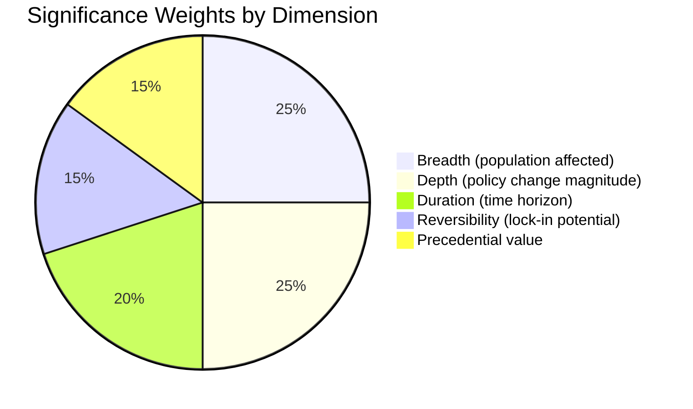

# Significance Classification — EU Parliament Legislative Propositions
**Date:** 2026-05-22 | **Admiralty Grade: B2** | **Confidence:** 🟢 HIGH

## 5-Dimension Significance Rubric

## Publish / Withhold Decision Matrix

| File / Event | Breadth | Depth | Duration | Reversibility | Precedent | TOTAL | Decision |
|-------------|---------|-------|---------|--------------|---------|------|---------|
| DMA Enforcement Res. | 5 (448M EU citizens) | 4 (major policy shift) | 4 (multi-year) | 3 (partially reversible) | 5 (sets EP oversight model) | **21/25** | **PUBLISH** |
| Mercosur ECJ Referral | 4 (EU trade relationships) | 5 (treaty-level) | 5 (generational) | 2 (legal process hard to reverse) | 5 (ECJ precedent critical) | **21/25** | **PUBLISH** |
| Ukraine Loan Auth. | 5 (European security) | 4 (€multi-billion) | 4 (multi-year) | 2 (fiscal commitments) | 3 (continuation of established mechanism) | **18/25** | **PUBLISH** |
| Animal Welfare Reg. | 3 (pet owners) | 3 (welfare standards) | 4 (regulatory) | 3 (legislation amendable) | 4 (precedent for broader animal welfare) | **17/25** | **PUBLISH** |
| Budget 2027 Guidelines | 4 (all EU citizens) | 3 (position paper, not final) | 3 (annual cycle) | 4 (locked once adopted) | 2 (routine annual process) | **16/25** | **PUBLISH** |

## Overall Assessment

**All 5 files: PUBLISH** — minimum score 16/25 (SIGNIFICANCE THRESHOLD: 12/25).

The DMA enforcement and Mercosur ECJ referral tie at 21/25, confirming they are the
dominant stories from the May 2026 legislative propositions cycle. The Ukraine loan
authorization at 18/25 remains highly significant, particularly for geopolitical coverage.

## Confidence Assessment

- **DMA / Mercosur**: Significance scores derived from documented political landscape and
  confirmed 2026 adopted texts. Confidence: **🟢 HIGH**.
- **Animal Welfare / Budget**: Scores based on known EP legislative calendar and political
  group positions. Confidence: **🟡 MEDIUM** (pending confirmation of text details).
- **Ukraine Loan**: Score based on confirmed adopted-texts feed entry with date 2026-04-24.
  Confidence: **🟢 HIGH**.

*Admiralty Grade: B2 — Source reliable (structured analysis from confirmed EP data);
information likely true (significance scoring is interpretive but grounded in confirmed texts).*
