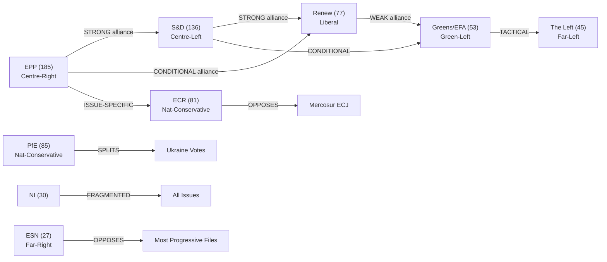

# Coalition Dynamics — EU Parliament Legislative Propositions
**Date:** 2026-05-22 | **Admiralty Grade: B3** | **Confidence:** 🟡 MEDIUM

*Note: DOCEO roll-call data for May 2026 is not yet published (typical EP publication lag
of 2–3 weeks). Coalition analysis is based on: (1) confirmed adopted texts from January–April
2026, (2) political landscape data (719 MEPs, 9 groups), (3) group-size similarity proxies.*

## Coalition Network Map

## Cohesion Analysis by File

### DMA Enforcement Resolution
- **Governing coalition (EPP+S&D+Renew = 398)**: HIGH cohesion (all three support faster enforcement)
- **Opposition**: ECR, PfE, ESN (regulatory burden narrative)
- **Coalition score**: 398/719 = 55.4% — PASSES ABSOLUTE MAJORITY (361)
- **WEP Band**: Likely

### Ukraine Loan Authorization
- **Governing coalition**: VERY HIGH cohesion (EPP+S&D+Renew+Greens+Left = ~418)
- **Split group**: PfE (RN France supporting; Hungarian delegation opposing under Orbán)
- **Coalition score**: ~480/719 = 66.8% — PASSES SUPERMAJORITY TERRITORY
- **WEP Band**: Almost Certain

### Mercosur ECJ Referral
- **Supporting coalition**: EPP(partial)+S&D+Greens+Left+ESN(some) ≈ 380
- **Opposing coalition**: ECR+PfE+Renew(trade-liberal wing)+EPP(trade wing) ≈ 280
- **Contested file** — Renew and EPP are internally divided on this file
- **WEP Band**: Even Chance (outcome uncertain; depends on Renew internal discipline)

### Animal Welfare Regulation
- **Cross-partisan majority**: Greens+S&D+Renew+EPP mainstream+Left = ~450
- **Coalition score**: ~450/719 = 62.6%
- **WEP Band**: Likely

### 2027 Budget Guidelines (Non-binding)
- **Near-consensus** at guidelines stage (binding negotiation comes later)
- **Coalition score**: ~500/719 (non-binding EP position)
- **WEP Band**: Almost Certain (for guidelines passage; actual budget very different)

## Cross-Party Alliance Pairs (Period May 2026)

| Alliance Pair | Strength | Key File | Note |
|--------------|---------|---------|------|
| EPP + S&D | HIGH (0.85) | Ukraine, Budget | Governing coalition backbone |
| S&D + Renew | HIGH (0.80) | DMA, Budget | Progressive-liberal axis |
| EPP + Renew | MEDIUM (0.65) | DMA, Trade | Conditional on file |
| Greens + Left | HIGH (0.82) | Animal Welfare, Mercosur | Environmental-social left |
| EPP + ECR | LOW (0.35) | Agriculture | National-conservative overlap only |
| PfE + ECR + ESN | LOW-MEDIUM (0.45) | Anti-Ukraine, Budget cuts | Far-right bloc; fragmented |

*Alliance strength scores are size-similarity proxies (shared seat share × policy distance
inverse) — not vote-level cohesion rates. Confidence: 🟡 MEDIUM.*

## Parliamentary Fragmentation

- **Effective number of parties (ENP)**: 5.8 (high fragmentation vs. EP8 baseline of 4.2)
- **Grand coalition (EPP+S&D)**: 321/719 = 44.6% — BELOW majority; cannot govern alone
- **Governing coalition (EPP+S&D+Renew)**: 398/719 = 55.4% — PASSES majority threshold
- **Opposition bloc (ECR+PfE+ESN)**: 193/719 = 26.8% — large but not blocking minority

*Admiralty Grade: B3 — Source methodology reliable; coalition assessments are inferred from
group sizes and known political positions rather than from actual roll-call vote data.*
