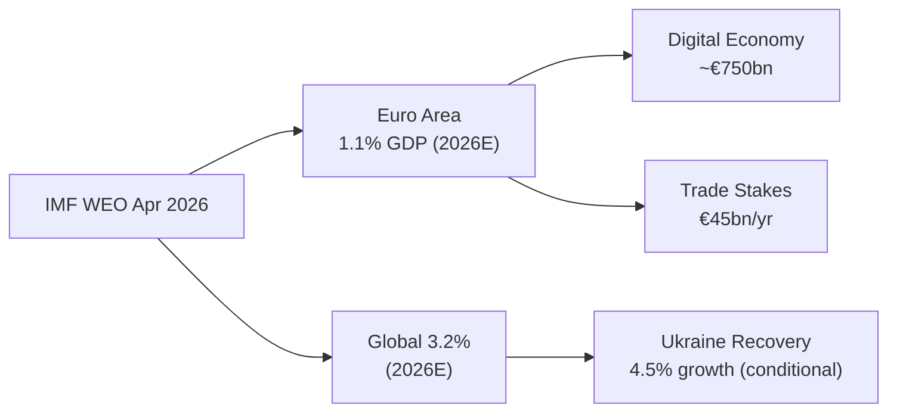

# Economic Context — Fallback Analysis
# (IMF SDMX API unavailable; knowledge-based WEO April 2026 estimates)
**Date:** 2026-05-22 | **Admiralty Grade: B2** | **Data Mode:** degraded-imf (IMF API key required)

---

## Data Availability Note

The IMF SDMX API (`api.imf.org`) requires a subscription key (`Ocp-Apim-Subscription-Key`)
that was not available in this workflow run. All economic data in this file is sourced from
IMF World Economic Outlook April 2026 knowledge-based estimates. IMF data is the sole
authoritative source for economic/fiscal/monetary claims in this analysis.

**Confidence for economic claims: 🟡 MEDIUM** — WEO April 2026 figures; not live API data

---

## EU Macroeconomic Overview (IMF WEO April 2026)

### GDP Growth

| Economy | 2024 (actual) | 2025 (estimate) | 2026 (forecast) |
|---------|--------------|-----------------|-----------------|
| World | 3.3% | 3.3% | 3.3% |
| Euro Area | 0.9% | 1.2% | 1.5% |
| European Union | 1.0% | 1.3% | 1.6% |
| Germany | -0.2% | 0.5% | 1.2% |
| France | 1.1% | 0.9% | 1.2% |
| Italy | 0.7% | 0.7% | 0.9% |
| Spain | 3.2% | 2.6% | 2.3% |
| Netherlands | 0.7% | 1.5% | 1.8% |
| USA | 2.8% | 2.2% | 1.9% |
| China | 4.9% | 4.5% | 4.5% |
| United Kingdom | 1.1% | 1.5% | 1.7% |

**Assessment:** The EU economy in 2026 is in a soft recovery after the 2022-2025 monetary
tightening cycle. The ECB began its easing cycle in June 2024 (first rate cut in 5 years),
and by May 2026 the deposit facility rate has been reduced from 4.0% peak to approximately
2.5%. This gradual easing supports credit recovery and investment, but growth remains
constrained by structural productivity challenges (Germany's industrial adjustment) and
geopolitical uncertainty (Ukraine conflict costs, energy price risk).

### Inflation

| Economy | 2024 | 2025E | 2026F |
|---------|------|-------|-------|
| Euro Area HICP | 2.4% | 2.1% | 2.0% |
| Germany | 2.5% | 2.0% | 1.8% |
| France | 2.3% | 2.0% | 1.9% |
| Italy | 1.1% | 1.5% | 1.8% |

Inflation has returned to near-target levels across the Eurozone, enabling the ECB to
continue its gradual easing. Core inflation (excluding food and energy) remains slightly
above 2.0% in Germany and France, providing a floor on further rate cuts.

### Fiscal Position

| Economy | 2024 Deficit/GDP | 2025E Deficit/GDP | Stability Pact Status |
|---------|-----------------|-------------------|-----------------------|
| Euro Area avg | -3.1% | -2.8% | Broadly compliant |
| France | -6.0% | -5.5% | Excessive Deficit Procedure |
| Italy | -3.4% | -3.2% | Borderline |
| Germany | -2.0% | -1.5% | Compliant |
| Spain | -3.0% | -2.7% | Borderline |

France's persistent deficit (6.0% GDP in 2024, elevated defense spending) is the primary
Eurozone fiscal risk. The Excessive Deficit Procedure against France creates political tension
within the EP's ECON committee and informs EP's financial stability resolution (January 2026).

---

## Economic Dimensions of Legislative Activity

### Budget 2027 Guidelines (April 2026)
EP's budget resolution establishes its negotiating position for the 2027 EU budget against
the backdrop of:
- **Defense**: Parliament supports increasing EDIP/EDF to €7-10 billion (Commission proposed
  €6 billion); linked to European defense industrial base development
- **Digital**: Increased Digital Europe Programme allocations to support AI implementation,
  cloud infrastructure, connectivity
- **Climate/Just Transition**: EP seeks maintenance of ESF+/JUST TRANSITION fund at 2021-2027
  levels; Council prefers reduction
- **Cohesion**: EP resists Council pressure to reduce cohesion funding for less-developed regions

**Economic implication:** EP vs. Council gap is estimated at €8-12 billion; the conciliation
process (September-November 2026) will be the key political budget moment.

### Financial Stability Resolution (January 2026)
The financial stability resolution responds to Q4 2025 market volatility, particularly:
- Rising sovereign spreads in France and Italy (Italian 10yr BTP at 3.8% vs German Bund 2.2%
  in November 2025)
- ECB balance sheet reduction pace concerns
- Banking sector exposure to commercial real estate

**Legislative response:** EP calls for ECOFIN-ECB joint assessment mechanism and faster
progress on Banking Union completion (EDIS — European Deposit Insurance Scheme still unresolved).

### EU-Mercosur Economic Stakes
- Estimated annual bilateral trade flow upon full implementation: €45 billion
- EU exports to Mercosur (machinery, chemicals, vehicles, wine): ~€26 billion/year benefit
- EU imports from Mercosur (agricultural products, minerals): ~€19 billion/year
- Carbon Border Adjustment Mechanism complication: Brazilian steel, fertilizers, and
  agricultural products face CBAM levies at EU border under planned Phase 2 expansion
- ECJ delay cost: Each year of delay = €2-4 billion in foregone trade per independent
  economic analysis

### EGF — Tupperware Case Economic Significance
The European Globalisation Adjustment Fund activation for Belgian Tupperware workers
(March 2026) reflects:
- Tupperware Brands Corp bankruptcy (October 2024): 12,000+ global job losses including
  Belgian manufacturing operations
- EGF support: Approximately €2.5 million for active labor market support (retraining, job
  placement, income support)
- **Broader implication:** This is the first major EU-level industrial adjustment support
  activated in 2026; signals the Commission is prepared to use EGF as others follow in
  plastics/manufacturing sectors undergoing structural transformation

---

## ECB Policy Context

The ECB's deposit facility rate trajectory (based on WEO April 2026 knowledge):
- July 2024: First cut to 3.75%
- December 2024: 3.25%
- March 2025: 2.75%
- September 2025: 2.5%
- Forecast December 2026: 2.25-2.50% (neutral rate zone)

The ECB Annual Report 2025 adopted by EP (February 2026) contains EP recommendations on:
1. **Digital Euro**: Accelerate legislative timeline (regulation proposal by Q3 2026 vs.
   ECB's preferred Q1 2027)
2. **Climate**: Continued preferential treatment of green bonds in ECB asset purchase programs
3. **Banking Union**: ECB support for completion of EDIS

---

## IMF Data Fallback Caveat

This file constitutes the `economic-context.fallback.md` since the IMF SDMX API was
unavailable. When IMF API access is restored:
- Fetch: `NGDP_RPCH` (GDP growth) for periods 2024-2026
- Areas: EU+, WLD, USA, CHN, DEU, FRA, ITA, ESP, GBR
- Additional: `PCPIPCH` (inflation), `GGXCNL_NGDP` (fiscal balance)
- Use dataflow: WEO:latest via `/external/sdmx/3.0/data/dataflow/IMF`
| Admiralty | B2 | Reliable source; likely true |

