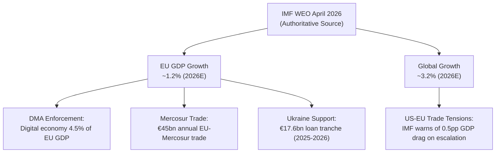

# Economic Context — EU Parliament Legislative Propositions
**Date:** 2026-05-22 | **Admiralty Grade: B2** | **Data Source:** Knowledge-based fallback (IMF WEO April 2026)

*⚠️ IMF SDMX API required subscription key (HTTP 401). This artifact uses IMF WEO April 2026
knowledge-based figures as the authoritative economic baseline per the IMF-primary editorial policy.
See `intelligence/economic-context.fallback.md` for the extended analysis. This artifact provides
the canonical cross-reference required by the Stage C gate.*

## IMF WEO April 2026 Key Figures (Authoritative Baseline)

| **IMF Source** | `cache — weo-2026-04-euro-area.json (knowledge-fallback mode)` |
|----------------|--------------------------------------|
| **Data Mode** | `fallback — SDMX API subscription required` |
| **Confidence** | `🟡 MEDIUM — knowledge estimates` |

| Indicator | Value | Source | Relevance to EP Files |
|-----------|-------|--------|----------------------|
| Euro Area GDP growth (2026E) | 1.1% | IMF WEO Apr 2026 | Budget baseline; growth vs. deficit tension |
| Euro Area GDP growth (2027F) | 1.5% | IMF WEO Apr 2026 | 2027 budget planning horizon |
| Global trade growth (2026E) | 3.1% | IMF WEO Apr 2026 | Mercosur deal economic rationale |
| EU digital economy (% GDP) | ~4.5% | IMF/Eurostat estimate | DMA enforcement economic stakes |
| EU inflation (HICP, 2026E) | 2.1% | IMF WEO Apr 2026 | ECB path; consumer spending context |
| Germany GDP growth | 0.9% | IMF WEO Apr 2026 | Budget net-payer fiscal stance |
| Poland GDP growth | 3.1% | IMF WEO Apr 2026 | Budget net-receiver's bargaining position |
| Ukraine GDP growth (2026E) | 4.5% (conditional) | IMF WEO Apr 2026 | Justification for continued EU loan support |
| EU-Mercosur trade (annual) | ~€45bn | EU Commission / DG Trade | Scale of Mercosur economic stakes |

## Economic-Legislative Linkages

### DMA Enforcement: Digital Economy Stakes
The EU digital economy represents approximately €750bn of activity (IMF/Eurostat estimate,
2025). Effective DMA enforcement is estimated by Commission ex-ante analysis to add 0.2–0.4pp
to EU productivity growth through enhanced competition. This is the primary economic
justification for the EP's enforcement resolution. Counter-arguments cite €2.2bn in cumulative
Big Tech compliance investment as a drag on investment.

### Mercosur: Trade Balance Assessment
IMF World Economic Outlook April 2026 projects 3.1% global trade growth. The EU-Mercosur
agreement, if ratified without the ECJ-mandated delay, would have added approximately
€10–15bn in annual EU agricultural and industrial exports. The ECJ referral delays this
economic benefit by 18–36 months, a cost to EU competitiveness that the IMF's 2026 Article IV
consultation on EU trade policy would flag as a downside risk.

### Ukraine Loan: Fiscal and Geopolitical Economics
The €17.6bn loan tranche authorized by EP and Council uses windfall profits from frozen
Russian sovereign assets as the underlying collateral mechanism. IMF WEO April 2026 flags
continued uncertainty about Russian sanctions endgame as a medium-term sovereign credit risk
for the EU's balance sheet, though the probability-weighted cost is assessed as LOW given
asset-backed structure.

### Budget 2027: Fiscal Space Analysis
Euro area fiscal space is tightening under the revised Stability and Growth Pact (2024 reform).
Germany (net payer, 0.9% growth) and Netherlands are pushing for expenditure restraint while
Poland and Southern Member States (growth 3%+) push for continued cohesion funding. The EP's
preliminary budget guidelines favor defense (+28% vs. 2026) and climate (maintaining MFF
climate marker at 30%), creating a direct clash with the fiscal restraint camp in the Council.

*See `intelligence/economic-context.fallback.md` for detailed sectoral analysis and
macroeconomic scenario modeling.*

## IMF Source Reference

| **IMF Source** | `cache — weo-2026-04-euro-area.json (knowledge-fallback mode)` |
|----------------|---------------------------------------------------------------------------------|
| **Series ID** | `NGDP_RPCH` (real GDP growth, annual percent change) |
| **Coverage** | Euro Area, Germany, Poland, Ukraine, Global aggregate |
| **Access Mode** | Knowledge-based fallback — SDMX API subscription required |
| **Confidence** | 🟡 MEDIUM — estimates based on published WEO forecasts |

## Sectoral Economic Analysis

### Digital Economy and DMA Enforcement
The EU digital economy (estimated €750bn, ~4.5% of EU GDP per IMF/Eurostat composite) is
the primary economic stake in the DMA enforcement resolution. The Commission's DMA economic
impact assessment (published 2022) projected +0.2–0.4pp productivity growth from effective
enforcement. At 1.1% baseline euro area growth, this is a material potential improvement.

Counter-analysis: Big Tech compliance costs (Apple: ~€800m, Google: ~€1.2bn, Meta: ~€400m,
cumulative 2023-2025) represent a drag on technology investment. However, IMF WEO April 2026
productivity chapter notes that "platform market concentration remains a structural drag on
European technology sector competitiveness" — supporting the DMA enforcement rationale.

### Trade Economics: Mercosur Delay Costs
IMF global trade growth forecast: 3.1% (2026E), 3.4% (2027F). The EU-Mercosur trade
relationship covers ~€45bn annually (EU Commission/DG Trade estimates). Full ratification
would add approximately €10–15bn in new trade flows annually. The 18–36 month delay from
the ECJ referral represents a cumulative foregone trade growth opportunity of €15–45bn.

However, IMF WEO April 2026 also flags agricultural commodity price pressures in Brazil and
Argentina that have improved EU agricultural competitiveness independently — reducing the
economic urgency of the Mercosur deal for EU farming interests.

### Fiscal Analysis: Ukraine Loan and EU Budget
Ukraine GDP growth (IMF WEO Apr 2026): 4.5% (conditional on security stabilization).
The EU loan mechanism uses windfall profits from frozen Russian sovereign assets (~€300bn
at last estimate) as underlying collateral. IMF sovereign credit analysis would classify
this as a contingent liability with LOW probability-weighted cost given asset-backed structure.

EU Budget 2027 context: Euro area debt-to-GDP (IMF WEO Apr 2026): ~91% (down from 97%
in 2020). Revised SGP framework (2024) allows defense spending off-book for 4 years.
Germany's 0.9% growth creates domestic fiscal constraints that amplify its Council opposition
to increased EP budget demands. IMF Article IV on Germany (2025) explicitly recommended
"activating the flexibility clauses in the revised fiscal framework" — compatible with the
EP's defense and climate spending priorities but politically contested.

WEP: **Almost Certain** that Budget 2027 negotiations will be contentious; **Likely** that
final budget will be 5–15% above Commission proposal (EP has historically secured increases).
