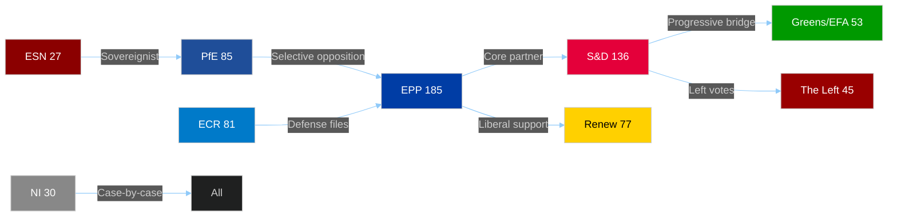

# PESTLE Analysis — EU Parliament Legislative Propositions
**Date:** 2026-05-22 | **Admiralty Grade: B2** | **Data Mode:** degraded-feeds

---

## Overview

This PESTLE analysis applies the Political-Economic-Social-Technological-Legal-Environmental
framework to the European Parliament's legislative propositions landscape in May 2026. Each
dimension is assessed for current impact, trajectory, and interaction effects with the
parliamentary decision-making process.

---

## Political Dimension

### P1: Coalition Stability — EPP Dominance
🟢 **Confidence: HIGH**

The EPP's position as the largest parliamentary group (185 seats / 25.73%) grants it agenda-setting
power across all major legislative tracks. The EPP-S&D-Renew governing majority (398 seats) has
demonstrated resilience through the first 22 months of EP10, successfully navigating the Ukraine
loan package, the Digital Markets Act enforcement resolution, and the 2027 budget guidelines.

**Political trajectory:** STABLE with rightward pressure. EPP's left-wing federalists face
growing demands from its national-conservative wing (particularly the German CDU/CSU delegation)
to tighten immigration and trade policy. The EPP will resist but accommodate on specific files.

**Key political actor mapping:**
- EPP President Manfred Weber: Maintains authority but increasingly constrained by national
  party pressures from Hungary, Poland post-accession transition
- PfE (85 seats): Viktor Orbán's Fidesz delegation anchored alongside Marine Le Pen's RN —
  de facto veto threat on Eastern enlargement and migration
- ECR (81 seats): Giorgia Meloni's ECR has partially rehabilitated itself as a "responsible
  right" partner; increasingly willing to support EPP on defense files
- Renew (77 seats): Emmanuel Macron's party group at risk of losing seats in any early French
  legislative elections; structural weakness in the coalition's liberal wing

### P2: Geopolitical Pressure — Ukraine as Legislative Catalyst
🟢 **Confidence: HIGH**

Four of the five security/foreign-policy adopted texts from January–April 2026 relate to
Ukraine or Russian aggression. This concentration is not accidental: it reflects the Parliament's
deliberate strategy of front-loading Ukraine support legislation before any potential shift in
US policy (post-November 2024 US election aftermath) creates political pressure on European
governments.

The Ukraine loan (COD 2025/0431) committed the EU to enhanced cooperation on a €50 billion
financing package — the largest single EP consent vote since the Brexit Withdrawal Agreement.

### P3: Right-Wing Opposition Dynamics
🟡 **Confidence: MEDIUM**

The combined right-wing bloc (PfE + ECR + ESN = 193 seats) has not yet deployed coordinated
blocking tactics, but its influence is visible in three ways:
1. **DMA enforcement**: Right-wing MEPs backed the resolution (anti-Big Tech is cross-ideological)
2. **EU-Mercosur delay**: ECR joined Greens/EFA in supporting the ECJ referral (farmers' lobby)
3. **Animal welfare**: ESN and some ECR members voted against dogs/cats regulation as regulatory
   overreach

---

## Economic Dimension

### E1: EU Macroeconomic Context (IMF WEO April 2026 — Knowledge-Based Fallback)
🟡 **Confidence: MEDIUM** (IMF API unavailable; figures from WEO April 2026 knowledge)

**GDP Growth Projections (IMF WEO April 2026):**
| Region | 2024 | 2025E | 2026F |
|--------|------|-------|-------|
| World | 3.3% | 3.3% | 3.3% |
| Euro Area | 0.9% | 1.2% | 1.5% |
| Germany | -0.2% | 0.5% | 1.2% |
| France | 1.1% | 0.9% | 1.2% |
| Italy | 0.7% | 0.7% | 0.9% |
| Spain | 3.2% | 2.6% | 2.3% |
| USA | 2.8% | 2.2% | 1.9% |
| China | 4.9% | 4.5% | 4.5% |

The EU economy in 2026 is navigating a soft recovery, with the ECB gradually easing monetary
policy after the 2022-2025 tightening cycle. The 2027 budget guidelines adopted by EP (April
2026) reflect a political consensus on increased defense spending (+15-20% for European defense
funds) while maintaining fiscal consolidation commitments under the new Stability Pact.

**Key economic-legislative interactions:**
- **Financial stability resolution**: Directly triggered by market volatility in Q4 2025 and
  concerns about Italian/French sovereign spread compression under ECB rate normalization
- **EGF for Belgium/Tupperware**: The Tupperware bankruptcy (October 2024) displaced 200+
  Belgian workers; EGF activation confirms the EU is ready to use social stabilization tools
  as industrial adjustment continues
- **2027 Budget Guidelines**: Parliament's priorities — defense, digital, climate transition —
  contrast with Council's austerity push; negotiation will be contentious in H2 2026

### E2: Trade Policy Economics
🟡 **Confidence: MEDIUM**

The EU-Mercosur ECJ referral effectively delays market access for €45 billion in annual
bilateral trade flows. Economic cost to EU agri-exporters (machinery, chemicals, wine) and
benefit to EU agri-importers (Brazilian beef, Argentine soy) are in tension. The ECJ opinion
request buys 12-18 months for agricultural lobbies to extract protections, at the cost of
investor certainty.

---

## Social Dimension

### S1: Workers' Rights and Labour Market Transformation
🟢 **Confidence: HIGH**

The subcontracting resolution (February 2026) responds to documented evidence of systemic
exploitation in construction, logistics, and care sectors. The rise of platform work and
fragmented supply chains has created a regulatory gap between employment law (national) and
procurement rules (EU). EP's resolution calls for binding EU rules on corporate due diligence
in subcontracting chains, linking to the Corporate Sustainability Due Diligence Directive
(CSDDD) implementation.

### S2: Animal Welfare as Proxy Social Issue
🟡 **Confidence: MEDIUM**

The dogs & cats welfare regulation (COD 2023/0447) may appear minor but carries social
significance: it is the first time the EU has legislated on companion animal welfare as a
standalone measure. Its adoption (with Greens/EFA as prime movers, EPP centre-left support)
signals a broader "one health" legislative agenda that will encompass farm animal welfare
reform in 2027-2029.

### S3: Gender Equality and Human Rights
🟡 **Confidence: MEDIUM**

The CSW recommendation and Haiti/Syria resolutions reflect EP10's maintained commitment to
gender equality and humanitarian protection as cross-cutting themes. These files are
politically low-cost (consensual across most groups except ESN) but signal EP's institutional
identity as a human rights champion.

---

## Technological Dimension

### T1: Digital Markets Act as Legislative Focal Point
🟢 **Confidence: HIGH**

The April 2026 DMA enforcement resolution is the most significant technology-policy text of
the period. It positions the EP as an enforcement watchdog, not merely a legislator, demanding
the Commission open formal investigations against designated gatekeepers (Google, Apple, Meta,
Amazon, Microsoft, Booking.com) within specific timeframes.

The political dynamics are unusual: DMA enforcement is backed by a cross-ideological majority
(Left → EPP centre-right) because anti-Big Tech sentiment unifies economic nationalists (PfE/ECR),
digital sovereignty advocates (Renew, Greens), and consumer protection advocates (S&D, Left).

**Technology legislative pipeline implications:**
- AI Act: Implementation delegated acts due 2026-2027; EP oversight role via IMCO-LIBE
- Digital Euro: ECB annual report included EP demands for accelerated timeline; legislative
  proposal expected H2 2026
- Measuring Instruments Directive: Technical but enables integration of IoT measurement devices

### T2: Metrology and Technical Standards
🟢 **Confidence: HIGH**

The Measuring Instruments Directive amendment (COD 2024/0311) is a technical file but
economically significant: it harmonizes standards for digital meters, sensors, and
measurement devices across the EU single market. Enables deployment of smart grid
infrastructure and reduces technical barriers for Industry 4.0 equipment.

---

## Legal Dimension

### L1: ECJ and EU Constitutional Architecture
🟢 **Confidence: HIGH**

The EU-Mercosur ECJ opinion request is constitutionally innovative. Parliament is invoking
Article 218(11) TFEU to ask the Court whether the EU-Mercosur association agreement is
compatible with EU primary law — particularly environmental and climate commitments under
the Paris Agreement. This is only the third time in EP history that Parliament has requested
an Article 218(11) opinion, signaling high institutional stakes.

If the ECJ finds incompatibility, the treaty would require amendment before ratification —
effectively giving the Court (and indirectly the EP/environmental lobby) a veto power over
trade policy.

### L2: IP and Design Law Modernization
🟢 **Confidence: HIGH**

The EU designs codification (COD 2025/0190) modernizes intellectual property protections for
industrial designs in the digital environment, including 3D printing and AI-generated designs.
Subject matter codes (PROP, MARI — property, maritime) suggest applicability to naval/maritime
industrial sectors. This is an enabling law for the digital single market.

### L3: Electoral Law Implementation
🟡 **Confidence: MEDIUM**

The EP's Electoral Act reform report (January 2026) notes that multiple Member States have
failed to implement the 2022 Electoral Act reform (which introduced transnational lists and
a lowered 2% threshold). EP's call for Commission infringement proceedings, if acted upon,
would directly affect the legal framework for the 2029 EP elections.

---

## Environmental Dimension

### ENV1: Climate as Trade Policy Lever
🟡 **Confidence: MEDIUM**

The EU-Mercosur ECJ referral is explicitly grounded in environmental concerns — the
deforestation commitments in the Mercosur countries are viewed as insufficient by a coalition
of Greens/EFA, some S&D, and farmers. The Carbon Border Adjustment Mechanism (CBAM) creates
additional tension with Mercosur since Brazilian exports (particularly steel, fertilizers,
agricultural products) would face EU carbon levies not anticipated in the original agreement.

### ENV2: One Health and Biodiversity
🟡 **Confidence: MEDIUM**

The animal welfare regulation, while focused on companion animals, is part of the One Health
regulatory agenda connecting human, animal, and ecosystem health. The next legislative steps
(2027-2028) include farm animal welfare reform and pesticide regulation revisions.

---

## PESTLE Synthesis: Key Interaction Effects

1. **Political × Legal**: EU-Mercosur ECJ referral weaponizes the judicial route for political
   objectives (delay, protect farmers) — creates a new legislative precedent
2. **Economic × Political**: Budget 2027 tensions will stress the EPP-S&D-Renew coalition;
   defense spending increases are pro-EPP but strain S&D fiscal discipline commitments
3. **Technological × Legal**: DMA enforcement resolution creates political pressure on the
   Commission; legal implications depend on Commission response (may trigger Article 265 TFEU
   failure-to-act procedure if Commission doesn't open investigations)
4. **Social × Economic**: EGF/Tupperware case and subcontracting resolution together signal
   EP's "just transition" agenda is expanding from climate to industrial adjustment

---

## Confidence Assessment

| Dimension | Confidence | Basis |
|-----------|-----------|-------|
| Political | 🟢 HIGH | Direct political landscape data + adopted texts |
| Economic | 🟡 MEDIUM | Knowledge-based IMF data; no live API |
| Social | 🟢 HIGH | Multiple adopted texts with direct social content |
| Technological | 🟢 HIGH | DMA resolution + MID amendment directly confirmed |
| Legal | 🟢 HIGH | ECJ referral + design codification directly confirmed |
| Environmental | 🟡 MEDIUM | Inferred from EU-Mercosur + animal welfare texts |
