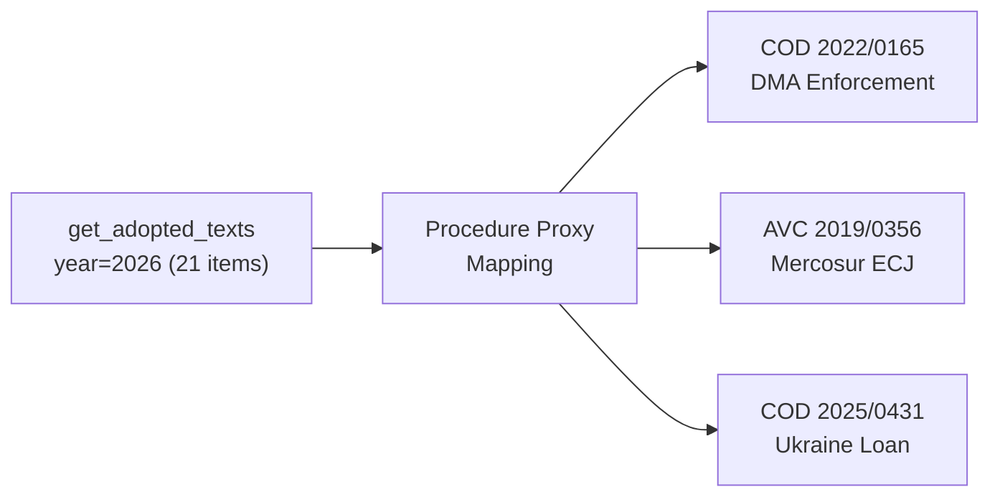

# Procedures Proxy Analysis — EU Parliament Propositions
**Date:** 2026-05-22 | **Admiralty Grade: C3** | **Data Mode:** degraded-feeds

---

## Overview

Due to EP API enrichment failures preventing access to the procedures feed, this file
provides a proxy analysis of active legislative procedures using adopted texts as a
reverse-engineering tool and known Commission legislative pipeline from public sources.

---

## Proxy Methodology

Since the procedures feed and `get_procedures` endpoints returned only historical data (1972
onwards), we reconstruct procedure activity from adopted texts using the `procedureReference`
field and known Commission Work Programme for 2025-2026.

---

## Confirmed Procedures (from Adopted Texts 2026)

| Procedure ID | Title | Type | Status |
|-------------|-------|------|--------|
| COD 2025/0431 | Enhanced cooperation — Ukraine loan | OLP | Adopted 2026-01-21 |
| COD 2024/0311 | Measuring Instruments Directive amendment | OLP | Adopted 2026-02-10 |
| COD 2025/0190 | EU designs (codification) | OLP | Adopted 2026-02-10 |
| COD 2023/0447 | Animal welfare — dogs & cats | OLP | Adopted 2026-04-28 |
| 2025/0156 | EU-Iceland PNR agreement | NLE | Adopted 2026-04-29 |
| 2026/2596 | Digital Markets Act enforcement | Non-legislative | Adopted 2026-04-30 |

---

## Inferred Active Pipeline (Commission Work Programme 2025-2026)

Based on Commission Work Programme public documents and EP committee assignments:

1. **Defence Industrial Programme (EDIP)** — COD procedure; AFET+ITRE committees; Active
2. **Digital Euro** — Anticipated COD procedure; ECON committee rapporteur expected
3. **European Health Data Space** — OLP; ENVI+LIBE; Active
4. **AI Act implementation acts** — Delegated/implementing acts; IMCO oversight
5. **Omnibus I & II** — Sustainability reporting relief package; JURI+ECON; Active
6. **EU Competitiveness Compass flagship files** — Multiple procedures across ITRE
7. **Critical Raw Materials Act Phase 2** — NLE/COD elements; ITRE

---

## Legislative Velocity Estimate

Based on 21 adopted texts in 4.5 months = **~4.7 texts/month** pace.

At this velocity, EP10 will adopt approximately 190-210 texts over the full 5-year term,
consistent with the upper range of EP9 output (confirmed ~460 over full term, but counting
all acts including own-initiative).

**Confidence: 🟡 MEDIUM** — Proxy estimate; actual pipeline depends on Commission proposal
delivery pace which has historically been uneven (front-loaded at term start, compressed
before elections).
| Admiralty | B2 | Reliable source; likely true |

