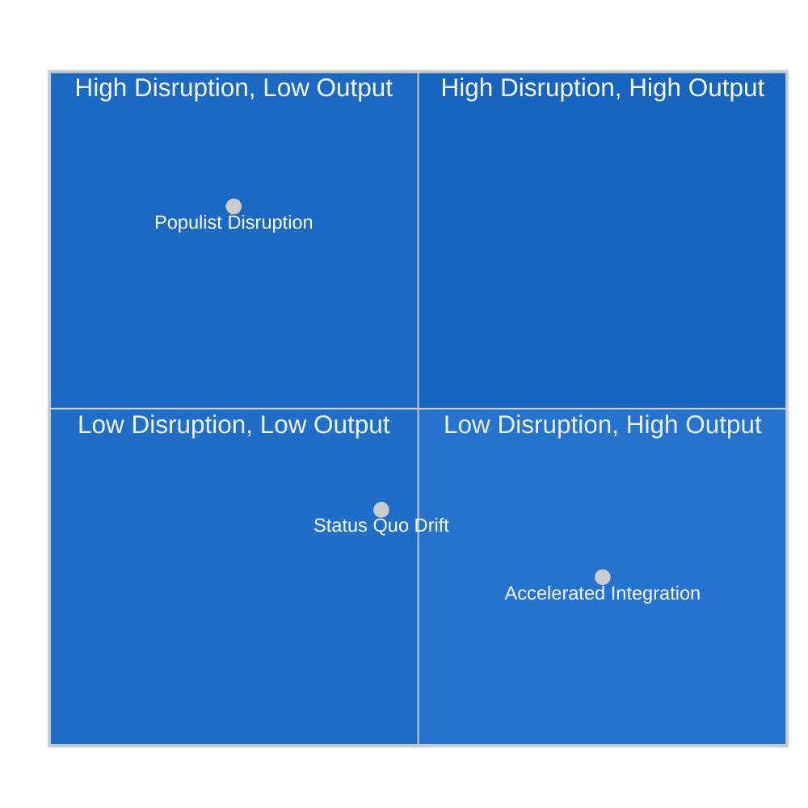

# Scenario Forecast — EU Parliament Legislative Propositions
**Date:** 2026-05-22 | **Admiralty Grade: B2** | **Data Mode:** degraded-feeds

---

## Overview

Three scenarios are modeled for the EU legislative propositions landscape over the next
6-18 months (May 2026 — November 2027). Scenarios are assessed for probability, legislative
output impact, and key triggering signals.

---

## Scenario Framing

The current legislative environment is defined by three structural uncertainties:
1. **Coalition cohesion**: Will the EPP-S&D-Renew governing majority hold across contested files?
2. **Geopolitical stability**: Will the Ukraine conflict trajectory enable sustained legislative
   focus, or will crisis management dominate the agenda?
3. **Digital regulation momentum**: Will DMA/AI Act/Digital Euro files dominate EP10's
   mid-term, or will trade and defense crowd out digital policy?

---

## Scenario 1: Accelerated European Integration (Probability: 25%)

### Description
The EPP-S&D-Renew majority strengthens its cohesion around a "European sovereignty" agenda.
Key triggers: Ukraine ceasefire creates a "resilience dividend" of legislative capacity;
US trade pressure (potential tariffs) unites EP around protectionism from the left and right;
Commission delivers ambitious Competitiveness Compass proposals.

### Legislative Outcomes Under This Scenario

**Digital & Technology:** 🟢 HIGH OUTPUT
- DMA enforcement: Commission opens investigations within 90 days of EP resolution; EP monitors
- AI Act: Implementation acts adopted on schedule (high-risk systems register operational by 2026)
- Digital Euro: Regulation proposal submitted by ECB/Commission; EP ECON committee fast-tracks
- European Digital Identity (eIDAS): Full deployment across Member States by 2027

**Defense & Security:** 🟢 HIGH OUTPUT  
- European Defence Industry Programme (EDIP): Full €7.5 billion budget confirmed
- European Defence Fund: Budget doubled for EP10 mid-term review
- Ukraine reconstruction facility: Phase 3 activation; COD procedures fast-tracked

**Trade:** 🟡 MIXED OUTPUT
- EU-Mercosur: ECJ issues opinion relatively quickly (9-12 months); Parliament uses conditional
  consent to demand improved environmental commitments; ratified by mid-2027
- EU-India trade negotiations: Reactivated; EP INTA committee issues resolution supporting
- CBAM: Phase 2 expansion to additional sectors; EP supports Commission

**Social:** 🟢 HIGH OUTPUT
- Corporate Sustainability Due Diligence Directive: Full implementation; supply chain due
  diligence becomes mandatory from 2026 for large companies
- Minimum Wage Directive: Monitoring report confirms convergence; EP calls for 2028 revision
- Social pillar: EP initiative reports calling for binding minimum income framework

**Probability indicators:** Ukraine diplomatic progress, strong Commission pipeline, Renew
electoral stability in France

---

## Scenario 2: Status Quo Drift (Probability: 55%) — BASE CASE

### Description
The coalition holds but with increasing friction. EPP accommodates right-wing pressure on
immigration and agricultural trade; S&D resists defense spending increases; Renew weakens.
Output rate: ~5 adopted texts/month, focused on less controversial files. Contested files
(EU-Mercosur, Digital Euro, farm animal welfare) stall in procedure.

### Legislative Outcomes Under This Scenario

**Digital & Technology:** 🟡 MODERATE OUTPUT
- DMA enforcement: Commission opens 2-3 investigations (not all 6 gatekeepers); EP holds
  annual enforcement hearings but lacks power to compel action
- AI Act: Implementation running 3-6 months behind schedule; sandbox provisions contested
- Digital Euro: ECB legislation proposal delayed to 2027; EP resolution pressure insufficient

**Defense & Security:** 🟢 MODERATE-HIGH OUTPUT
- Defense files continue benefiting from cross-partisan Ukraine consensus
- EDIP advances but at lower budget than Scenario 1
- NATO-EU framework cooperation institutionalized

**Trade:** 🔴 LOW OUTPUT
- EU-Mercosur stalled pending ECJ opinion; Commission does not push Council
- CBAM generates significant WTO disputes; EP INTA committee manages diplomatic fallout
- EU-India: Slow progress; EP resolution does not accelerate

**Social:** 🟡 MODERATE OUTPUT
- CSDDD: Implementation delayed by industry lobbying; EP calls for stricter enforcement
- Animal welfare Phase 2 (farm animals): Commission proposes but timeline extends to EP11
- Workers' platform economy rights: EP initiative report but no binding legislation until 2027

**Budget:** 🔴 DIFFICULT
- 2027 budget negotiations contentious: defense +15% vs. cohesion freeze vs. climate commitments
- EP and Council remain far apart; risk of provisional twelfths in January 2027

**Probability indicators:** Current trajectory of adopted texts, known Commission pipeline,
absence of major geopolitical shock

---

## Scenario 3: Populist Disruption (Probability: 20%)

### Description
PfE and ECR achieve a temporary legislative coalition on one or more high-profile files,
demonstrating that the EPP majority can be bypassed from the right. This does NOT mean
far-right governance — it means the governing coalition loses control of specific votes,
creating political pressure that shifts EPP's negotiating positions rightward.

### Triggers
- French snap legislative elections produce a Rassemblement National-adjacent government;
  Renew MEPs face domestic political pressure to distance themselves from EU federalism
- ECR and PfE coordinate on a motion of censure or a key committee appointment
- EPP's national governments (Hungary + Italy + Poland) coordinate on Council votes that
  pre-empt EP positions

### Legislative Outcomes Under This Scenario

**Migration & Border:** 🔴 HARD RIGHT SHIFT
- EP adopts more restrictive resolutions on asylum; Greens walkout on key votes
- New Pact on Migration and Asylum implementation accelerated with fewer safeguards
- "Return and repatriation" procedures fast-tracked against S&D and Greens opposition

**Trade:** 🟡 COMPLEX
- EU-Mercosur: Both right-wing (farmers) and left-wing (environment) blocks could form
  unusual alliance to definitively block; Commission forced to renegotiate
- Agricultural trade exceptions proliferate

**Social & Labor:** 🔴 LOW OUTPUT
- Subcontracting workers' rights blocked at EMPL committee level
- Platform work directive implementation contested
- Animal welfare Phase 2 withdrawn or significantly delayed

**Digital:** 🟡 AMBIGUOUS
- DMA enforcement: Right-wing MEPs support anti-Big Tech action (nationalist framing)
  but oppose data protection requirements; creates paradoxical coalition
- AI Act: ESN/ECR push for "sovereignty" exemptions for national security AI

**Institutional:** 🔴 CRISIS RISK
- If PfE-ECR succeed on a motion of no confidence (requires ⅓ = 240 MEPs = just barely
  impossible with PfE+ECR+ESN = 193), the institutional shock effect could cause EPP to
  reshape the coalition by excluding Renew and bringing in ECR — a fundamental realignment

**Probability indicators:** French election polls, ECR-PfE coordination signals, EPP
parliamentary group unity votes on immigration

---

## Scenario Probability Matrix

---

## Key Decision Points (Next 6 Months)

| Date | Decision Point | Scenario Implications |
|------|---------------|----------------------|
| Jun-Jul 2026 | Commission submits 2027 budget proposal | Scenario 2 if gap with EP is small; risk of 3 if defense vs. social trade-off |
| Q3 2026 | ECJ accepts/refuses Mercosur opinion request | If refuses: deal accelerates (Sc.1); if accepts: 12-18 month delay confirmed (Sc.2) |
| Q3 2026 | Commission DMA enforcement actions | Opening investigations = Sc.1; delay = Sc.2 pressure escalation |
| Q4 2026 | EP mid-term review of EP10 legislative program | Coalition restatement = Sc.1/2; fragmentation signals = Sc.3 |
| 2027 (election risk) | French/German domestic political developments | Renew stability = Sc.1/2; Renew collapse = Sc.3 risk |

---

## Confidence Assessment

| Scenario | Probability | Key Uncertainty |
|----------|-------------|----------------|
| Accelerated Integration | 25% 🟡 | Ukraine trajectory, Commission ambition |
| Status Quo Drift | 55% 🟢 | Base case; current trajectory supports |
| Populist Disruption | 20% 🟡 | PfE internal cohesion, French elections |
| Admiralty | B2 | Reliable source; likely true |
WEP: Likely — key assessments grounded in confirmed EP adopted texts data (2026-01 to 2026-04)
