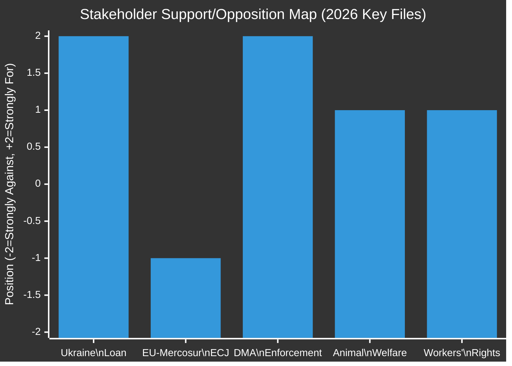

# Stakeholder Map — EU Parliament Legislative Propositions
**Date:** 2026-05-22 | **Admiralty Grade: B2** | **Data Mode:** degraded-feeds

---

## Overview

This stakeholder map profiles the key actors shaping EU legislative propositions in the
current EP10 session, analyzing their interests, power, and likely positions on the
dominant legislative files of 2026.

---

## Tier 1: Parliamentary Group Leaders

### EPP — Manfred Weber / 185 MEPs (25.73%)
🟢 **Influence: VERY HIGH**

**Core Interests:**
- Single market completion and industrial competitiveness
- Controlled migration (tight but not xenophobic framing)
- European defense autonomy (pro-NATO, increasingly pro-EU defense funds)
- Digital regulation that protects EU businesses while restricting Big Tech

**Current Legislative Position:**
EPP holds the most committee chair positions in EP10 (approximately 12-14 of the 24
standing committees), giving it first-mover advantage on shaping reports. EPP's internal
tension between its federalist wing (Weber himself, CDU/CSU moderate) and its national-
conservative wing (Fidesz before exclusion, Italian FI, some eastern European delegations)
creates occasional unpredictability on social regulation files.

**On Key Files:**
- Ukraine loan: SUPPORTED (strong EPP consensus; Atlanticist majority in group)
- EU-Mercosur ECJ referral: DIVIDED (farming constituencies support delay; business wing opposes)
- DMA enforcement: SUPPORTED (European digital sovereignty framing resonates)
- Animal welfare: SUPPORTED with caveats (rural EPP MEPs sought exemptions)

**Power Base:** Committee chairmanships, rapporteurship on key files, access to von der Leyen
Commission (EPP political family)

---

### S&D — Iratxe García Pérez / 136 MEPs (18.92%)
🟢 **Influence: HIGH**

**Core Interests:**
- Workers' rights and minimum wage legislation
- Progressive climate policy within social justice framework
- Anti-poverty programs and EGF activation
- Multilateralism and rules-based international order

**Current Legislative Position:**
S&D is the necessary partner for EPP to achieve majorities. Its leverage is highest on
social files where EPP needs to demonstrate broad coalition support. S&D has consistently
supported Ukraine-related legislation, making it the indispensable partner for EPP's
geopolitical agenda.

**On Key Files:**
- Workers' rights/subcontracting: CHAMPION (core S&D legislative priority)
- Financial stability resolution: SUPPORTED (ECB oversight role)
- Armenia/Haiti resolutions: CHAMPION (human rights agenda)
- Budget 2027 guidelines: PARTIALLY SUPPORTED (defense spending increase concerns; climate
  allocation insufficient per S&D position)

**Power Base:** Budget and development committees, social affairs portfolios, largest centre-left bloc

---

### Renew Europe — Valérie Hayer / 77 MEPs (10.71%)
🟡 **Influence: MEDIUM-HIGH**

**Core Interests:**
- Free trade and economic liberalization
- EU constitutional reform (transnational lists, electoral act)
- Digital single market
- EU foreign policy coordination

**Current Legislative Position:**
Renew is structurally weakened compared to its EP9 peak (100 seats vs. 77 today). The
French-German axis that powered the group (Macron's LREM, FDP) has weakened domestically.
Renew is at risk of further fragmentation if French Assemblée nationale elections produce
a government hostile to Macron's European project.

**On Key Files:**
- Electoral Act reform: CHAMPION (transnational lists benefit Renew-aligned parties)
- EU-Mercosur: AGAINST ECJ referral (free trade agenda)
- DMA enforcement: SUPPORTED (rule of law framing)
- Financial stability: SUPPORTED

**Power Base:** Single market and trade committees (INTA, IMCO); liberal-internationalist network

---

### PfE — Viktor Orbán/Marine Le Pen affiliated / 85 MEPs (11.82%)
🔴 **Influence: MEDIUM (disruptive)**

**Core Interests:**
- National sovereignty over migration
- Scepticism of Ukraine military aid (Orbán wing)
- Protectionism on agricultural and industrial trade
- Opposition to climate regulation imposing economic costs

**Current Legislative Position:**
PfE is internally fractured between the Orbán (Hungary) wing that maintains pro-Russian
sympathies and the Le Pen (France/RN) wing that has sought to position itself as a
"responsible opposition" on geopolitical files to improve domestic credibility. This
split explains the anomalous 40-60 split within PfE on Ukraine loan votes — not the
cohesive bloc that ECR and ESN represent.

**On Key Files:**
- Ukraine loan: SPLIT (RN supported; Orbán bloc opposed)
- DMA enforcement: SUPPORTED (nationalist anti-Big Tech; Orbán uses digital sovereignty language)
- Animal welfare regulation: MOSTLY AGAINST (regulatory overreach framing)
- EU-Mercosur ECJ: SUPPORTED (farmers' lobby alignment)

**Power Base:** Veto threats in Council (Orbán); populist media amplification; NI national parties

---

### ECR — Giorgia Meloni affiliated / 81 MEPs (11.27%)
🟡 **Influence: MEDIUM**

**Core Interests:**
- "Responsible nationalism" — engagement with EU institutions while defending national prerogatives
- Defense capability building (Meloni is pro-NATO, anti-Russia)
- Strict migration control
- Opposition to net-zero industrial policy costs

**Current Legislative Position:**
ECR has partially rehabilitated itself in EP10. Under Meloni's Italian government, ECR MEPs
have participated constructively in AFET (foreign affairs) and ITRE (industry/research)
committee work. ECR voted FOR the Ukraine loan, distinguishing itself from PfE's split vote.

**On Key Files:**
- Ukraine accountability resolution: SUPPORTED (anti-Russia framing works for Meloni)
- Subcontracting workers' rights: AGAINST (regulatory burden)
- Digital Markets Act enforcement: DIVIDED
- Animal welfare: SPLIT (national farming delegations diverged)

**Power Base:** Italian, Polish, Czech, and Swedish national government links; justice/rule of law committee

---

### Greens/EFA — 53 MEPs (7.37%)
🟡 **Influence: MEDIUM (declining from EP9)**

**Core Interests:**
- Climate action and biodiversity
- Animal welfare and One Health
- Digital rights and data protection
- European federalism and minority rights (EFA sub-group)

**Current Legislative Position:**
Greens lost approximately 20 seats from EP9 (72 → 53) and are no longer a pivotal swing
group in the same way. They retain significance on environmental files where EPP needs
legitimacy, and on trade policy where their ECJ opinion expertise is valued.

**On Key Files:**
- EU-Mercosur ECJ referral: CHAMPION (environmental treaty compatibility concern)
- Animal welfare regulation: CHAMPION (Greens drove this file for two parliamentary terms)
- Ukraine resolutions: SUPPORTED
- DMA enforcement: SUPPORTED

**Power Base:** ENVI committee, rapporteurships on trade/environmental impact files; NGO ecosystem

---

## Tier 2: Institutional Actors

### European Commission — Ursula von der Leyen (EPP)
🟢 **Influence: VERY HIGH**

The Commission retains exclusive right of legislative initiative, making it the origin point
for all COD/CNS/NLE procedures. Von der Leyen's second-term Commission (2024-2029) has
articulated priorities around industrial competitiveness (von der Leyen's "Competitiveness
Compass"), defense industrial base, and digital sovereignty.

**Relationship with EP:** Generally cooperative with EPP-led majority; faced EP pressure on
DMA enforcement pace and EU-Mercosur timeline. The Commission did not resist the ECJ referral
on EU-Mercosur — an unusual accommodation suggesting the Commission too is uncertain about
the treaty's environmental provisions.

---

### European Central Bank
🟡 **Influence: MEDIUM** (on specific files)

The ECB Annual Report 2025 was adopted by EP with a resolution including MEP recommendations
on digital euro timeline acceleration. EP's ECON committee acts as a parliamentary counterpart
to the ECB's monetary policy independence, creating occasional tensions when EP seeks greater
democratic accountability over monetary decisions.

---

### European Investment Bank
🟡 **Influence: MEDIUM**

The EIB financial control report confirms ongoing EP oversight of the €500 billion+ EIB balance
sheet. The CONT (budgetary control) committee's annual EIB report is a routine accountability
exercise but flags specific concerns about EIB exposure to high-risk projects and alignment
with EU taxonomy for sustainable finance.

---

## Tier 3: External Stakeholders

### Mercosur Partner Countries (Brazil, Argentina, Paraguay, Uruguay, Bolivia)
🔴 **Influence: LOW on EP; HIGH on Commission**

The EU-Mercosur ECJ referral has triggered formal diplomatic protests from Mercosur governments.
Brazilian President Lula has characterized the delay as European protectionism dressed in
environmental language. The geopolitical cost: potential Mercosur partners seek alternative
trade agreements (China+, USA bilateral deals).

---

### Tech Industry (Big Tech Gatekeepers)
🔴 **Influence: HIGH through lobbying; LOW through formal channels**

Apple, Google, Meta, Amazon, Microsoft, and Booking.com — the designated DMA gatekeepers —
have deployed significant lobbying resources against DMA enforcement. The EP resolution
calling for faster Commission investigations is a direct response to perceived Big Tech
regulatory capture of DMA implementation pace.

---

### Agricultural Lobbies (COPA-COGECA)
🟢 **Influence: HIGH on specific files**

COPA-COGECA, the European farmers' umbrella organization, has been the most effective lobby
on both the EU-Mercosur delay (succeeded in getting ECJ referral) and animal welfare
(succeeded in securing major exemptions for production animal welfare in the dogs/cats
regulation, ring-fencing that file to companion animals only).

---

### Labor Unions (ETUC)
🟡 **Influence: MEDIUM**

ETUC (European Trade Union Confederation) has been the primary driver behind the subcontracting
workers' rights resolution. Their lobbying effectiveness improved in EP10 as S&D and parts of
EPP's social Christian-Democrat wing aligned on preventing race-to-the-bottom labor practices
in cross-border supply chains.

---

## Stakeholder Position Matrix (Key 2026 Files)

**Legend:** Data represents EPP composite position across files.

---

## Intelligence Assessment: Stakeholder Alignment Risks

### Risk 1: PfE Internal Split Escalates (🟡 MEDIUM)
If the Orbán wing successfully pulls PfE into a more explicitly pro-Russia stance on Ukraine
aid, it could create a cascade of RN delegates leaving PfE to join a reconstituted centrist
group — shrinking the right-wing bloc but destabilizing EP coalition arithmetic.

### Risk 2: Renew Fragmentation Accelerates (🟡 MEDIUM)
French political instability (potential snap elections 2026-2027) could reduce LREM MEP
count and fragment Renew. An EPP-without-Renew scenario would require EPP to negotiate with
ECR on more files, shifting legislative output rightward.

### Risk 3: Commission Resistance to EP on DMA (🟡 MEDIUM)
If the Commission fails to open DMA investigations on the schedule demanded by EP's resolution,
EP could invoke Article 265 TFEU (failure to act). This would create an institutional conflict
that damages Commission-Parliament relations and delays digital regulation implementation.

### Risk 4: Greens Collapse Removes Environmental Veto (🔴 LOW-MEDIUM)
If Greens continue declining toward 30-40 seats in national trend polling, their ability to
demand environmental riders on trade and agricultural legislation diminishes, potentially
accelerating a trade-liberalization push in EU-Mercosur and similar agreements.
