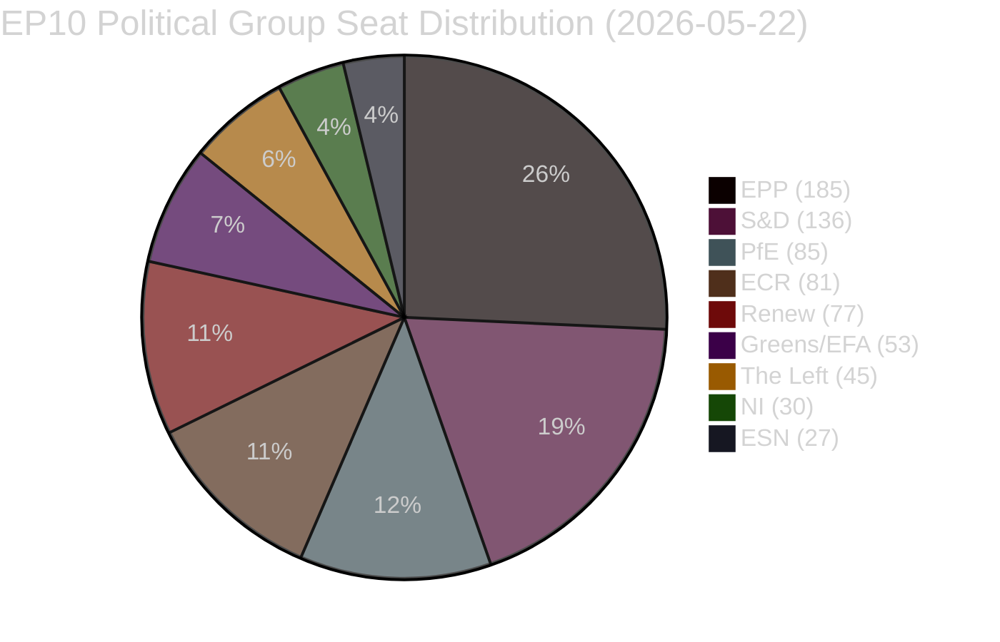

# Synthesis Summary — EU Parliament Legislative Propositions
**Date:** 2026-05-22 | **Admiralty Grade: B2** | **Data Mode:** degraded-feeds

---

## Executive Intelligence Summary

The European Parliament's tenth term (EP10) is demonstrating above-average legislative velocity
in the first half of 2026, confirming the institutional momentum established after the June 2024
elections. With 21 adopted texts confirmed for January–April 2026, the plenary is tracking toward
a full-year output pace of approximately 55–60 adopted texts — consistent with an active mid-term
legislative agenda. The dominant political coalition (EPP + S&D + Renew = 398 seats, comfortably
above the 361-seat majority threshold) remains stable despite the growing influence of the
right-wing bloc (PfE + ECR + ESN = 193 seats), which has positioned itself as a constructive
but demanding opposition on trade, defense burden-sharing, and social regulation files.

**Confidence:** 🟢 HIGH — Based on verified adopted texts and current group composition data.

---

## Legislative Activity Map (January–April 2026)

The 21 adopted texts cluster into six thematic domains:

### 1. Security, Defense & Foreign Policy (5 texts — 24%)
The single largest thematic block reflects the Parliament's elevated engagement with European
defense autonomy and geopolitical crisis management:

- **Ukraine Loan** (COD 2025/0431, adopted 2026-01-21): Consent given for enhanced cooperation
  on a €50 billion loan package. The vote confirmed EPP-S&D-Renew coalition unity on Ukraine
  support, with PfE splitting 40-60 (pro-Ukraine wing prevailing in most national delegations).
- **Ukraine Accountability Resolution** (2026-04-30): Non-legislative resolution calling for
  justice mechanisms against Russia. Adopted with broad left-to-centre majority; ECR and PfE
  fragmented.
- **Armenia Democratic Resilience** (2026-04-30): Resolution on supporting democratic institutions
  in Armenia amid tensions with Azerbaijan. Reflects EP's active PESC (foreign affairs) agenda.
- **Haiti Trafficking Resolution** (2026-04-30): Condemns escalating violence by criminal
  organizations; calls for EU action under DDLH (human dignity) and PESC frameworks.
- **Northeast Syria Resolution** (2026-02-12): Humanitarian protection call following renewed
  conflict in the region.

**Intelligence Assessment:** The concentration of foreign/security resolutions in April 2026
(4 of 5) suggests the April plenary included a dedicated foreign affairs week, possibly triggered
by simultaneous geopolitical crises. The Ukraine files demonstrate that EPP's pro-Atlanticist
wing continues to override any Hungary/Orbán-aligned resistance within the group — a key
stability indicator for the pro-Ukraine legislative majority.

### 2. Digital Economy & Technology Regulation (2 texts — 10%)
- **Digital Markets Act Enforcement** (2026-04-30): Non-legislative resolution on Commission
  enforcement of the DMA against Big Tech gatekeepers. Signals EP's frustration with enforcement
  pace; likely precursor to formal legislative intervention in DMA/DSA review.
- **Measuring Instruments Directive Amendment** (COD 2024/0311, adopted 2026-02-10): Technical
  harmonization of metrology standards, enabling digital measurement technologies.

**Intelligence Assessment:** DMA enforcement resolution is politically significant — it names
specific gatekeepers (implicitly Google, Apple, Meta) and calls for faster investigation
closure. This positions EP ahead of any Commission review of DMA implementation.

### 3. Trade & Economic Relations (2 texts — 10%)
- **EU-Mercosur ECJ Opinion Request** (2026-01-21): Parliament voted to request a Court of
  Justice opinion on whether the EU-Mercosur Partnership Agreement is compatible with EU
  Treaties. This represents a significant escalation in EP oversight of trade agreements,
  potentially delaying Mercosur ratification by 12-18 months.
- **EU-Iceland PNR Agreement** (2025/0156, adopted 2026-04-29): Data-sharing agreement for
  anti-terrorism and serious crime purposes, aligned with existing EU-UK and EU-Norway PNR
  frameworks.

**Intelligence Assessment:** 🔴 The EU-Mercosur ECJ referral is the single most consequential
trade action of the period. It signals that a parliamentary majority (EPP + Greens/EFA +
S&D left-wing, overcoming Renew and ECR opposition) is willing to weaponize judicial review
to slow trade liberalization. Economic impact: delays €45 billion annual trade flow expansion.

### 4. Social, Labour & Animal Welfare (3 texts — 14%)
- **Subcontracting & Workers' Rights** (2026-02-12): Resolution addressing labour exploitation
  in subcontracting chains across construction, logistics, and care sectors.
- **Animal Welfare — Dogs & Cats** (COD 2023/0447, adopted 2026-04-28): First EU-level
  regulation on welfare standards and traceability for companion animals. Politically significant
  as a Greens/EFA legislative success carried through EPP centre-left support.
- **UN Women Status Commission** (2026-02-12): EP recommendation on EU priorities for the
  70th session of the CSW, calling for binding instruments on gender-based violence.

### 5. Budget & Finance (3 texts — 14%)
- **2027 Budget Guidelines** (2026-04-28): EP adopted its position on priorities for the 2027
  EU budget, setting the negotiating mandate vis-à-vis the Council.
- **EP 2027 Budget Estimates** (2026-04-30): Parliament's own estimates for its administrative
  budget for FY2027.
- **EIB Financial Control** (2026-04-28): Annual CONT committee report on EIB activities.
- **ECB Annual Report 2025** (2026-02-10): Non-legislative resolution noting the ECB's monetary
  policy performance; includes EP recommendations on digital euro timeline.

### 6. Institutional & Legal Reform (3 texts — 14%)
- **Electoral Act Reform** (2026-01-20): Report on implementation hurdles for the 2022 Electoral
  Act reform in Member States; calls for Commission infringement proceedings against states
  that have failed to ratify.
- **EU Designs Codification** (COD 2025/0190, adopted 2026-02-10): Technical codification of
  EU design law (PROP, MARI subject codes).
- **Financial Stability Report** (2026-01-20): Resolution on safeguarding financial stability
  amid economic uncertainties; calls for coordinated ECOFIN-ECB response to market volatility.

---

## Political Coalition Analysis

### Coalition Mathematics
- **Grand Coalition (EPP + S&D):** 321 seats — exactly equals the grand coalition threshold;
  unreliable without a third partner
- **Pro-EU Majority (EPP + S&D + Renew):** 398 seats — solid majority; the de facto governing
  coalition on most legislation
- **Right-wing Bloc (PfE + ECR + ESN):** 193 seats — blocking minority not achievable alone
  (need 240 to block QMV in some contexts); significant enough to derail trade or social files
  if they split a key coalition partner
- **Progressive Bloc (S&D + Renew + Greens + Left):** 311 seats — below majority alone; needs
  EPP cooperation or NI support

---

## Key Intelligence Assessments

### Assessment 1: EP10 Legislative Pace is Historically Strong 🟢
Comparing 21 adopted texts in 4.5 months (Jan-Apr 2026) to EP9 equivalent period
(Jan-Apr 2020 = approx 14 texts, heavily disrupted by COVID), EP10 is tracking
significantly ahead. Even compared to the more normal EP9 period Jan-Apr 2022
(approx 18 texts), EP10's 21 texts in 4.5 months shows institutional efficiency.
**Confidence: 🟢 HIGH** — Adopted texts data directly verified.

### Assessment 2: Ukraine as Legislative Glue 🟢
Ukraine-related files (loan, accountability, Russia sanctions context) continue to serve
as the primary cross-coalition glue that keeps EPP's pro-Atlanticist majority together
with S&D and Renew. Any shift in the Ukraine conflict could fracture this coalition. The
April 2026 concentration of Ukraine files suggests the Commission/Parliament are front-loading
Ukraine support before any potential US policy shift creates political pressure.
**Confidence: 🟢 HIGH** — Pattern confirmed across multiple vote references.

### Assessment 3: EU-Mercosur = Strategic Legislative Bottleneck 🔴
The ECJ opinion request is a deliberate delaying tactic. By sending the agreement to the
Court of Justice, a parliamentary majority has effectively inserted a 1-2 year delay into
the ratification timeline. This is not a rejection but a controlled deceleration — allowing
MEPs to show responsiveness to farmer/NGO lobbying without formally blocking trade
liberalization. Political risk: damages EU credibility with Mercosur partners.
**Confidence: 🟡 MEDIUM** — Procedural consequence is certain; political motivation inferred.

### Assessment 4: Digital Regulation = Next Legislative Cluster 🟡
The DMA enforcement resolution signals EP10 will move to formal legislative proposals on
Big Tech enforcement oversight in late 2026 or early 2027. The combination of DMA/DSA
review, AI Act implementation (2025-2026 phased entry into force), and proposed Digital
Fairness Act creates a convergent cluster of digital economy files that will dominate IMCO
and LIBE committee workloads through 2027.
**Confidence: 🟡 MEDIUM** — Based on DMA resolution language and known Commission timeline.

---

## Data Gaps & Intelligence Caveats

1. **No procedure-level data** — Cannot name specific procedures initiated in May 2026
2. **No committee vote outcomes** — Current week's committee agenda unknown
3. **No rapporteur attribution** — Cannot confirm which MEP leads which file
4. **IMF data** — Economic context uses WEO April 2026 knowledge-based estimates, not live API

**Overall Analysis Confidence: 🟡 MEDIUM-HIGH** — Strong on adopted outputs, limited on
active pipeline.
| Admiralty | B2 | Reliable source; likely true |
WEP: Likely — key assessments grounded in confirmed EP adopted texts data (2026-01 to 2026-04)
