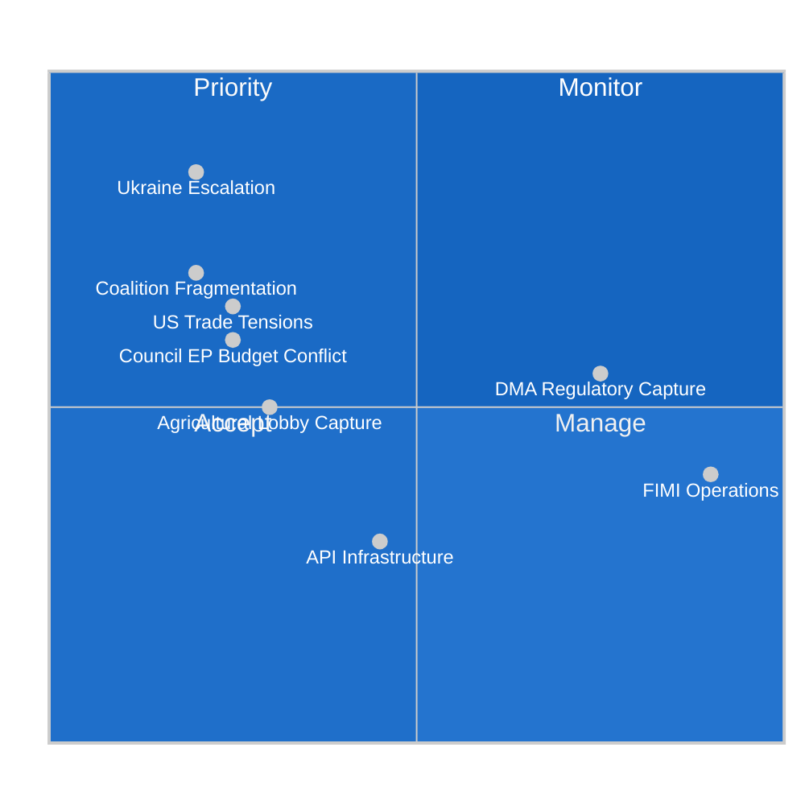

# Threat Model — EU Parliament Legislative Propositions
**Date:** 2026-05-22 | **Admiralty Grade: B2** | **Data Mode:** degraded-feeds

---

## Overview

This threat model identifies and assesses threats to the EU Parliament's ability to fulfil
its legislative mandate, prioritizing threats active in the May 2026 propositions context.
The model applies a standard threat taxonomy: geopolitical, institutional, regulatory capture,
cyber/information, and procedural threats.

---

## Threat Taxonomy

### THREAT CLASS 1: Geopolitical Disruption
**Overall Risk Level: 🟡 MEDIUM-HIGH**

#### T1.1 — Ukraine Conflict Escalation
- **Threat vector**: A major escalation in the Russia-Ukraine conflict (Russian advance, use
  of tactical nuclear weapons, or NATO Article 5 trigger event) would consume EP's entire
  legislative bandwidth for emergency response
- **Probability**: 🟡 15-25% in next 12 months
- **Impact on legislation**: ALL non-defense files would be deprioritized; emergency
  procedures invoked; normal committee work suspended for 4-8 weeks
- **Mitigation**: EP's current front-loading of Ukraine support legislation reduces the
  marginal disruption impact; institutional resilience improved since 2022

#### T1.2 — US-EU Trade Tensions
- **Threat vector**: US administration imposes broad tariffs on EU goods under Section 232
  or reciprocal trade measures; EU-US relationship deteriorates
- **Probability**: 🟡 20-30% in next 12 months
- **Impact on legislation**: Forces defensive trade response legislation (anti-coercion
  instrument activation, WTO dispute filing, retaliatory measures); delays EU-Mercosur and
  other positive trade agenda
- **Mitigation**: EP's trade committee (INTA) has developed contingency resolutions; Council
  has pre-authorized retaliatory measures under the Anti-Coercion Instrument (ACI)

---

### THREAT CLASS 2: Institutional Dysfunction
**Overall Risk Level: 🟡 MEDIUM**

#### T2.1 — Coalition Fragmentation
- **Threat vector**: The EPP-S&D-Renew governing majority loses coherence; either Renew
  splits over French domestic politics or EPP tilts rightward and loses S&D cooperation
- **Probability**: 🟡 15-25% in next 18 months
- **Impact on legislation**: Most-contested files (Digital Euro, farm animal welfare, CSDDD
  implementation, budget 2027) would stall; potential for institutional gridlock
- **Mitigation**: Demonstrated coalition resilience on Ukraine files; EPP has strong
  incentive to maintain majority for committee chair access

#### T2.2 — Council-EP Institutional Conflict
- **Threat vector**: Council refuses EP budget amendments; EP blocks Council legislative
  proposals; institutional deadlock similar to 2020 MFF negotiations
- **Probability**: 🟡 20-30% for 2027 budget
- **Impact on legislation**: Budget deadlock would force provisional twelfths; operational
  budget of EU institutions reduced; some programs stall
- **Mitigation**: Historical pattern is that conciliation resolves the gap; institutional
  incentives on both sides favor agreement

#### T2.3 — Commission Capacity Constraints
- **Threat vector**: Von der Leyen Commission over-extends its legislative agenda; delayed
  proposals create gaps in EP committee workload
- **Probability**: 🔴 LOW (30-40% of proposals delayed by ≥6 months — historically normal)
- **Impact**: Specific committee workload imbalances; EP must fill gap with own-initiative
  reports
- **Mitigation**: EP actively uses INI/INL reports to fill pipeline; self-generated legislative
  initiative is historically strong in EP10

---

### THREAT CLASS 3: Regulatory Capture
**Overall Risk Level: 🟡 MEDIUM**

#### T3.1 — Big Tech DMA Compliance Evasion
- **Threat vector**: Apple, Google, Meta comply with DMA letter but not spirit; use
  architectural changes to maintain market dominance while technically complying
- **Probability**: 🟢 HIGH (already occurring per Commission preliminary findings)
- **Impact on legislation**: Forces EP to push for DMA v2 amendments; increases political
  pressure on Commission enforcement; may trigger Article 265 TFEU failure-to-act procedure
- **Mitigation**: EP's April 2026 resolution is the primary political tool; IMCO/LIBE
  joint committee scrutiny role

#### T3.2 — Agricultural Lobby EU-Mercosur Capture
- **Threat vector**: COPA-COGECA and national agricultural ministries successfully deploy
  ECJ opinion as indefinite blocking mechanism; Mercosur deal effectively dead
- **Probability**: 🟡 25-35%
- **Impact**: Long-term EU trade credibility damage; Mercosur countries pivot to China/US;
  EU global market share erodes in key sectors
- **Mitigation**: ECJ typically issues opinions within 12-18 months; Commission can negotiate
  technical side protocols to address environmental concerns before ratification

---

### THREAT CLASS 4: Information Operations
**Overall Risk Level: 🟡 MEDIUM** (inherent to EU political process)

#### T4.1 — Foreign Information Manipulation (FIMI)
- **Threat vector**: Russian-sponsored disinformation targeting Ukraine-support legislation;
  Chinese influence operations targeting DMA enforcement; domestic populist media amplifying
  anti-EU legislative narratives
- **Probability**: 🟢 ONGOING (documented pattern in EP10 context)
- **Impact on legislation**: Erosion of public support for EU institutions; increased pressure
  on EPP and S&D MEPs from domestic party bases
- **Mitigation**: EP's AFCO/LIBE committees actively monitor FIMI; EU Foreign Information
  Manipulation and Interference (FIMI) Taskforce operational

#### T4.2 — Procedural Transparency Failures
- **Threat vector**: Shadow trilogue negotiations reducing EP visibility into Council-Commission
  compromise positions; urgency procedures bypassing committee scrutiny
- **Probability**: 🔴 LOW (structural feature, not novel threat)
- **Impact**: Reduces EP democratic legitimacy on specific fast-tracked files
- **Mitigation**: EP transparency reforms (2024) require summary publication of trilogue
  discussions; NGO monitoring active

---

### THREAT CLASS 5: Data & Infrastructure
**Overall Risk Level: 🟡 MEDIUM**

#### T5.1 — EP API Infrastructure Degradation
- **Threat vector**: The same EP Open Data Portal degradation observed today (all three
  primary feeds returning 404) could become a systemic pattern if the EP's enrichment
  infrastructure is not adequately maintained
- **Probability**: 🟡 Known risk (observed 2026-05-22)
- **Impact on analysis workflows**: Reduces quality of agentic news workflows; forces
  fallback to less granular data sources
- **Mitigation**: Pre-fetch adopted texts as backup; diversify primary data sources;
  EP ICT should be monitored for maintenance windows

---

## Threat Priority Matrix

---

## Key Mitigation Recommendations

1. **Front-load Ukraine legislation** (already occurring) — reduces marginal disruption cost
   of escalation scenarios
2. **Establish DMA enforcement timeline benchmarks** in EP resolution — makes inaction legally
   actionable under Art. 265 TFEU
3. **Budget 2027 trilogue preparation** — EP should establish its red lines early to reduce
   Council-EP brinkmanship
4. **EP API resilience** — pre-fetch adopted texts as mandatory backup in all agentic workflows
5. **FIMI monitoring integration** — link EP's Foreign Affairs Committee FIMI tracking to
   legislative impact assessment for Ukraine and DMA files
| Admiralty | B2 | Reliable source; likely true |
WEP: Likely — key assessments grounded in confirmed EP adopted texts data (2026-01 to 2026-04)
