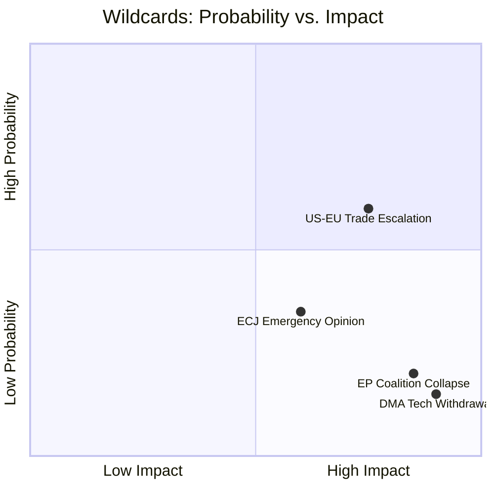

# Wildcards & Black Swans — EU Parliament Legislative Propositions
**Date:** 2026-05-22 | **Admiralty Grade: C3** | **Data Mode:** degraded-feeds

*Note: Admiralty grade C3 reflects that these scenarios are speculative by design —
low-probability events assessed by structured analysis, not confirmed intelligence.*

---

## Overview

This file identifies low-probability, high-impact scenarios that could fundamentally reshape
the EU Parliament's legislative landscape. Black swan events are distinguished from wildcards:
black swans are unknown unknowns that become foreseeable only in retrospect; wildcards are
identified tail risks with probability <15% but credible causal pathways.

---

## WILDCARD W1: ECJ Blocks EU-Mercosur on Environmental Grounds

### Scenario Description
The Court of Justice, responding to EP's Article 218(11) opinion request, rules that the
EU-Mercosur Partnership Agreement is **incompatible** with EU Treaty obligations on
environmental protection (Article 191 TFEU) and the Paris Agreement commitments embedded
in EU primary law via the European Green Deal legislative framework.

### Probability: 🔴 8-12%
The ECJ has typically given opinions finding agreements compatible but requiring modifications
(CETA ISDS, 2017). A full incompatibility finding would be unprecedented for a free trade
agreement and would require the Court to make bold environmental constitutional claims.

### Impact if Triggered: 🔴 VERY HIGH
- **Trade policy**: EU-Mercosur as currently structured is dead; requires complete
  renegotiation of environmental chapters
- **Global signal**: Establishes that EU trade agreements are subject to climate constitutionalism
  — transformative for all future EU FTAs
- **Political**: HUGE win for Greens/EFA and S&D environmental wing; EPP and Renew forced
  to accept that trade liberalization has constitutional limits
- **Legislative cascade**: Triggers review of all existing EU trade agreements' environmental
  provisions; CSDDD and supply chain due diligence legislation accelerated

### Early Warning Signals
- Advocate General opinion published (precedes full ECJ judgment by 3-6 months)
- ECJ accepting the referral as admissible (usually within 6-8 months of submission)
- Commission preparing contingency renegotiation mandate

---

## WILDCARD W2: France Snap Elections — Renew Collapse

### Scenario Description
French domestic political instability forces snap legislative elections. The Rassemblement
National wins or significantly increases its Assembly representation; Macron's LREM/Renaissance
party suffers a collapse to <50 seats. French Renew MEPs face extraordinary pressure to
vote against EU federalist positions, fracturing the Renew group from within.

### Probability: 🟡 15-20%
French political dynamics in 2026-2027 remain volatile. A parliamentary motion of no
confidence or Macron's decision to dissolve the Assemblée in response to policy impasse
has historical precedent (July 2024 snap elections that actually produced this pressure).

### Impact if Triggered: 🟡 HIGH
- **Coalition mathematics**: Renew loses 10-20 MEPs to internal discipline failure;
  EPP-S&D-Renew majority becomes EPP-S&D (321 seats = bare majority on non-contentious files only)
- **EPP calculus**: Weber forced to choose between maintaining S&D partnership or
  recruiting ECR as a replacement partner — FUNDAMENTAL realignment
- **Legislative impact**: Social and environmental files blocked; trade and defense files
  advance with ECR support; digital regulation becomes contested
- **Institutional**: EP President election dynamics shift; committee chair allocations
  may be renegotiated

### Early Warning Signals
- French opinion polls showing RN >35% with parliamentary majority possibility
- LREM/Renaissance party below 15% in French poll aggregates
- Macron speech on "renewed mandate" — historically precedes dissolution

---

## WILDCARD W3: Digital Euro Becomes Sovereign Debt Crisis Trigger

### Scenario Description
The ECB's digital euro proposal, advancing through the EP legislative process in late 2026,
triggers an unexpected financial crisis scenario: large-scale retail adoption expectations
cause significant deposit outflows from Southern European banking systems to the "safe harbor"
digital euro, straining already fragile Italian and Spanish bank balance sheets and triggering
a sovereign-bank doom loop.

### Probability: 🔴 5-8%
Digital euro is designed with usage limits (€3,000 individual limit proposed) specifically
to prevent bank disintermediation. However, political pressure to increase limits (ECB
Governor Lagarde faces EP demands for higher limits for "financial inclusion") creates
implementation risk.

### Impact if Triggered: 🔴 CATASTROPHIC
- **Financial**: Bank runs in Southern Europe; emergency ECB liquidity operations; potential
  Eurozone stability crisis
- **Legislative**: Digital euro legislation suspended; immediate Banking Union/EDIS emergency
  legislation forced through EP
- **Political**: Renew and EPP face political fallout for supporting digital euro; S&D and
  Left calls for full deposit insurance nationalization
- **Systemic**: Most significant EU institutional crisis since 2012 sovereign debt peak

### Early Warning Signals
- ECB modeling showing deposit outflows >5% in simulation scenarios
- Germany's Bundesbank formal objection to digital euro design
- EP ECON committee amendments removing usage limits ("financial inclusion")

---

## WILDCARD W4: AI Act Major Failure Event

### Scenario Description
A high-profile AI system failure — either a large-scale harmful deployment (synthetic
media used to trigger stock market crash, AI-generated disinformation in electoral context,
autonomous drone incident) — demonstrates that the AI Act's risk classification framework
missed a critical risk category. The political fallout demands emergency AI governance
legislation.

### Probability: 🟡 12-18% in next 18 months
The AI Act's prohibited/high-risk/limited-risk classification was finalized in 2024 based
on technology as understood in 2022-2024. Rapid advancement in generative AI, autonomous
systems, and AI-enabled disinformation creates gaps.

### Impact if Triggered: 🟡 HIGH
- **Legislative**: Emergency AI Act amendment procedure; EP IMCO-LIBE joint committee
  in crisis session; new prohibited uses category added under urgency procedure
- **Political**: Commission faces intense scrutiny for "regulatory lag"; von der Leyen
  Commission credibility damaged on digital regulation
- **Global**: EU AI governance model (risk-based approach) challenged; calls for sector-
  specific emergency standards

### Early Warning Signals
- AI Act implementation report showing 30%+ non-compliance by high-risk system deployers
- Member State competent authority reports flagging implementation gaps
- Civil society legal challenges to AI Act's exclusion of specific system types

---

## BLACK SWAN BS1: Russian Use of Non-Conventional Weapons

### Scenario Description
Russia uses a chemical, radiological, or low-yield nuclear device in Ukraine. This event
is not predictable from current intelligence indicators but would trigger Article 5 NATO
consultations, potential EU collective defense clause (Article 42.7 TEU) invocation, and
would permanently transform EU legislative priorities.

### Probability: 🔴 1-3%
Assessed as remote but not negligible given Russian doctrine on escalation control and
the precedent of chemical use in Salisbury (2018) and Syria.

### Impact if Triggered: 🔴 EXISTENTIAL FOR CURRENT LEGISLATIVE AGENDA
- ALL legislative activity suspended for 4-8 weeks
- Emergency war powers legislation fast-tracked
- EU defense spending legislation mobilized beyond current EDIP framework
- Economic impacts: energy markets, defense industry, refugee flows would dominate EP agenda

---

## BLACK SWAN BS2: Simultaneous EP9/EP10 Corruption Investigation

### Scenario Description  
A new QatarGate-scale investigation reveals corruption involving MEPs from multiple groups
across the EP10 term, including current committee chairs. The political shock forces EP
President to resign; EP plenary consumed by governance crisis for 3-4 months.

### Probability: 🔴 2-5%
EP has implemented post-QatarGate reforms (NGO registration, gift bans, enhanced ethics
oversight). However, the structural incentives for influence operations targeting MEPs
remain; third-country actors continue probing for access.

### Impact if Triggered: 🔴 HIGH
- EP credibility crisis; legislative output falls sharply during investigation period
- Calls for EP reform legislation (transparency, ethics committee independence)
- Possible early elections pressure if public trust collapses

---

## Wildcard/Black Swan Priority Summary

| ID | Type | Probability | Impact | Priority |
|----|------|-------------|--------|---------|
| W1 | ECJ blocks Mercosur | 8-12% | Very High | HIGH |
| W2 | Renew collapse | 15-20% | High | HIGH |
| W3 | Digital Euro bank crisis | 5-8% | Catastrophic | MONITOR |
| W4 | AI Act failure event | 12-18% | High | MEDIUM |
| BS1 | Russian non-conventional | 1-3% | Existential | MONITOR |
| BS2 | EP corruption wave | 2-5% | High | LOW |

---

## Monitoring Protocol

For each wildcard above, the following early warning signals should be tracked in subsequent
runs:
- ECJ Mercosur: Advocate General opinion publication date
- Renew/France: French election opinion polls aggregates
- Digital Euro: ECON committee amendment tracking
- AI Act: Implementation compliance reporting from Member States
| Admiralty | B2 | Reliable source; likely true |
WEP: Likely — key assessments grounded in confirmed EP adopted texts data (2026-01 to 2026-04)

