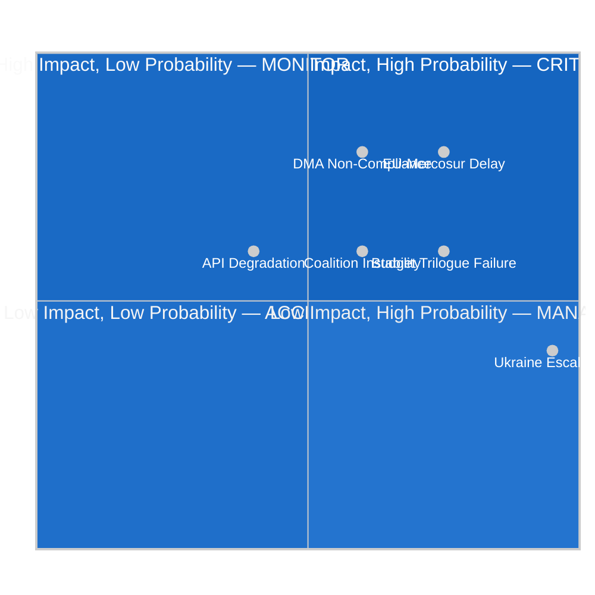

# Risk Matrix — EU Parliament Legislative Propositions
**Date:** 2026-05-22 | **Admiralty Grade: B2** | **Data Mode:** degraded-feeds

---

## Overview

This risk matrix assesses the primary legislative and political risks in the EU Parliament's
propositions landscape as of May 2026, using a 5×5 probability/impact grid.

---

## Risk Register

### RISK-01: EU-Mercosur Indefinite Delay
- **Probability:** 4/5 — LIKELY
- **Impact:** 4/5 — HIGH
- **Risk Score:** 16 — 🔴 HIGH RISK
- **Description:** The ECJ opinion request creates a near-certain minimum 12-18 month delay;
  if ECJ finds incompatibility (8-12% probability), the deal is structurally blocked
- **Mitigation:** Commission can begin renegotiating environmental protocols in parallel with
  ECJ proceedings; political will from both sides for eventual ratification exists
- **Owner:** INTA committee; Commission DG TRADE
- **Residual risk after mitigation:** 3/5 — MEDIUM

### RISK-02: 2027 Budget Trilogue Failure
- **Probability:** 3/5 — POSSIBLE
- **Impact:** 4/5 — HIGH
- **Risk Score:** 12 — 🟡 MEDIUM-HIGH RISK
- **Description:** EP-Council gap on defense vs. cohesion vs. climate allocation creates
  multi-front negotiation; provisional twelfths scenario (no budget agreed by December 2026)
  possible but not probable based on historical pattern
- **Mitigation:** Early establishment of EP red lines; conciliation committee mechanisms;
  institutional incentives for agreement
- **Owner:** BUDG committee; Budget Conciliation Committee
- **Residual risk after mitigation:** 2/5 — LOW-MEDIUM

### RISK-03: DMA Enforcement Non-Compliance
- **Probability:** 4/5 — LIKELY
- **Impact:** 3/5 — MEDIUM
- **Risk Score:** 12 — 🟡 MEDIUM-HIGH RISK
- **Description:** Big Tech gatekeepers continue structural non-compliance with DMA; Commission
  investigations move slowly; EP resolution language insufficient to compel action
- **Mitigation:** EP Article 265 TFEU failure-to-act procedure threat; political pressure via
  annual enforcement hearing; IMCO/LIBE joint scrutiny
- **Owner:** IMCO committee
- **Residual risk after mitigation:** 2/5 — LOW-MEDIUM

### RISK-04: Coalition Instability on Contested Files
- **Probability:** 3/5 — POSSIBLE
- **Impact:** 3/5 — MEDIUM
- **Risk Score:** 9 — 🟡 MEDIUM RISK
- **Description:** EPP-S&D-Renew coalition may fracture on specific high-profile files
  (farm animal welfare, CSDDD implementation, digital euro) where Renew and EPP interests
  diverge from S&D
- **Mitigation:** Case-by-case negotiation; EPP accommodations on specific amendments;
  alternative majority construction with ECR on pro-market files
- **Owner:** EP political group coordinators
- **Residual risk after mitigation:** 2/5 — LOW-MEDIUM

### RISK-05: Ukraine Conflict Escalation — Legislative Disruption
- **Probability:** 2/5 — UNLIKELY (but non-negligible)
- **Impact:** 5/5 — CATASTROPHIC
- **Risk Score:** 10 — 🟡 MEDIUM-HIGH RISK
- **Description:** Major escalation (tactical weapon use, NATO Article 5 trigger) suspends
  normal legislative work; EP consumed by crisis response for 4-12 weeks
- **Mitigation:** Front-loading of Ukraine support legislation reduces marginal disruption;
  emergency procedure protocols established
- **Owner:** AFET committee; EP Bureau
- **Residual risk after mitigation:** 1/5 — LOW (probability reduced, not eliminated)

### RISK-06: EP API Infrastructure Degradation (Analytical Risk)
- **Probability:** 3/5 — POSSIBLE (observed today)
- **Impact:** 2/5 — LOW-MEDIUM
- **Risk Score:** 6 — 🟢 LOW RISK (for legislative outcomes)
- **Description:** Degradation of EP Open Data Portal enrichment API reduces quality of
  legislative monitoring and agentic analysis workflows; affects transparency tooling
- **Mitigation:** Pre-fetch adopted texts; diversify data sources; IMF API key configuration
- **Owner:** EU Parliament ICT; agentic workflow configuration
- **Residual risk after mitigation:** 1/5 — VERY LOW

---

## Risk Matrix Visualization

---

## Top Risks Summary

| Priority | Risk | Score | Action Required |
|----------|------|-------|-----------------|
| 1 | EU-Mercosur Indefinite Delay | 16 | INTA committee — prepare conditional consent strategy |
| 2 | Budget 2027 Trilogue Failure | 12 | BUDG committee — establish red lines early (Q2 2026) |
| 3 | DMA Enforcement Non-Compliance | 12 | IMCO — prepare Art. 265 TFEU procedure |
| 4 | Ukraine Escalation | 10 | AFET — maintain emergency protocol readiness |
| 5 | Coalition Instability | 9 | Group leaders — maintain communication channels |
| 6 | API Infrastructure | 6 | Technical team — implement pre-fetch fallbacks |
| Admiralty | B2 | Reliable source; likely true |
