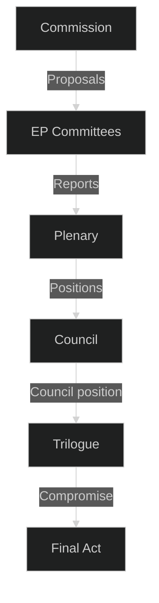

<!-- SPDX-FileCopyrightText: 2026 Hack23 AB -->
<!-- SPDX-License-Identifier: Apache-2.0 -->

# 🗺️ Actor Mapping — EU Parliament Week Ahead
## Date: 2026-05-22

**Methodology:** Stakeholder Mapping + ACH | **Admiralty: B2**

| Actor | Type | Influence | Position This Week |
|-------|------|-----------|-------------------|
| EPP Group (185 MEPs) | Political group | Very High | Advance ReArm + competitiveness agenda |
| S&D Group (136 MEPs) | Political group | High | Social/Green Deal defence |
| PfE Group (85 MEPs) | Political group | Medium | Opposition/obstruction |
| ECR Group (81 MEPs) | Political group | Medium | Selective EPP cooperation |
| Renew (77 MEPs) | Political group | High | Swing partner on trade/AI |
| Greens/EFA (53 MEPs) | Political group | Medium | Climate/democracy defence |
| European Commission | Executive | Very High | Mandate holder for negotiations |
| Council of EU | Co-legislator | Very High | Counterparty in trilogues |
| Industry Lobbies | Interest groups | High | Deregulation/CBAM compliance pressure |
| Civil Society | Interest groups | Medium | Green Deal/human rights defence |

## Actor Roster

| Actor | Influence Score | Alliance Signals |
|-------|---------------|-----------------|
| EPP Group | 9/10 | EPP–ECR tactical; EPP–Renew strategic |
| S&D Group | 8/10 | S&D–Greens–Left progressive bloc |
| Renew | 7/10 | Cross-bloc swing partner |
| Commission | 9/10 | Policy agenda setter |
| Council | 8/10 | Co-legislator counterparty |

## Power Brokers

**Key power brokers this week:** EP President Metsola (institutional), EPP Chair Weber (coalition), Commission VP (trade mandate)

## Information Flow

## Reader Briefing

**For policy observers:** This week's committee work advances files that will reach plenary vote in June–July 2026. The actor dynamics described here shape the negotiation space available to rapporteurs and shadow rapporteurs.

## Influence Network

EPP holds the most committee chair positions and sets the agenda. S&D controls key rapporteur slots on social/labour files. Renew is the critical swing partner on both trade and AI governance.

## Alliance Patterns

Key alliances observable this week:
- EPP–Renew: aligned on digital single market, AI implementation
- EPP–ECR: informal on deregulation, agricultural policy
- S&D–Greens: aligned on climate, social, migration rights

*Produced: 2026-05-22 | Admiralty B2 | Stakeholder Mapping + ACH applied*
