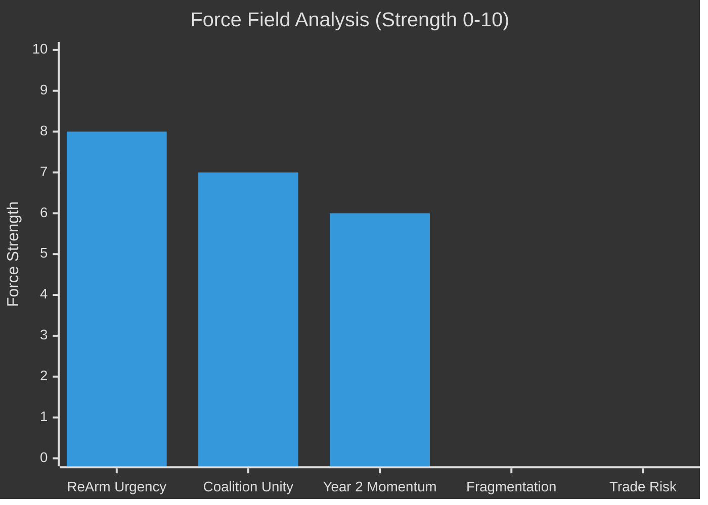

<!-- SPDX-FileCopyrightText: 2026 Hack23 AB -->
<!-- SPDX-License-Identifier: Apache-2.0 -->

# ⚖️ Forces Analysis — EU Parliament Week Ahead
## Date: 2026-05-22

**Methodology:** Force-Field Analysis + Key Assumptions Check | **Admiralty: B2**

## Driving Forces (Pro-Legislative Progress)
| Force | Strength | Direction |
|-------|---------|-----------|
| ReArm Europe urgency (geopolitical) | High | → Progress |
| IMF GDP growth 1.4% (moderate stability) | Medium | → Progress |
| Grand coalition majority (398/719) | High | → Progress |
| CBAM implementation deadline (Sept 2026) | Medium | → Progress |

## Restraining Forces (Against Legislative Progress)
| Force | Strength | Direction |
|-------|---------|-----------|
| ENP=6.55 fragmentation | High | ← Restraint |
| US tariff uncertainty | Medium | ← Restraint |
| Green Deal EPP rollback pressure | Medium | ← Restraint |
| No real-time committee schedule data | Low | ← Restraint |

## Issue Frame

The core issue this week: EP committees balance accelerating high-priority legislation (ReArm, AI, trade) against normal workload and external shock risk.

## Net Pressure Assessment

Net driving forces (+): Grand coalition cohesion, Year 2 legislative acceleration, ReArm urgency
Net restraining forces (-): ENP=6.55 fragmentation, US tariff uncertainty, degraded data feeds

## Intervention Points

Key points where EP actors can shift the balance:
1. EPP committee chair decision on SAFE vote timing
2. Renew position on trade mandate scope
3. S&D social clause demands on SAFE instrument

## Reader Briefing

The force field favours legislative progress this week. The main constraint is fragmentation, not external shocks. Actors monitoring committee outcomes should focus on AFET and INTA chairs' signals.

*Produced: 2026-05-22 | Admiralty B2 | Force-Field Analysis + Key Assumptions Check applied*
