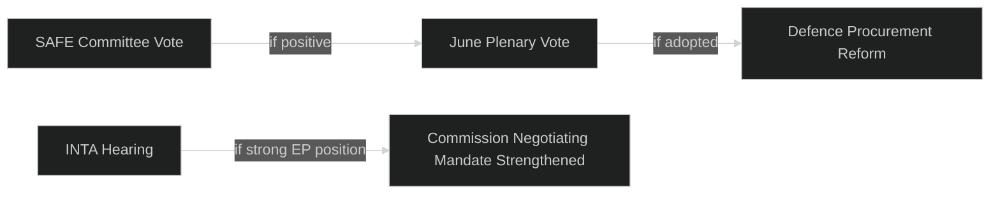

<!-- SPDX-FileCopyrightText: 2026 Hack23 AB -->
<!-- SPDX-License-Identifier: Apache-2.0 -->

# 📊 Impact Matrix — EU Parliament Week Ahead
## Date: 2026-05-22

**Methodology:** Stakeholder Mapping + What-If Analysis | **Admiralty: B2**

## Stakeholder Impact Assessment

| Stakeholder | SAFE Instrument | US Trade | AI Act | CBAM |
|-------------|----------------|----------|--------|------|
| EPP | 🟢 High positive | 🟡 Medium | 🟡 Medium | 🔴 Negative |
| S&D | 🟡 Conditional | 🟢 Positive | 🟢 Positive | 🟢 Positive |
| Industry (defence) | 🟢 Very positive | 🔴 Negative | 🟡 Mixed | 🔴 Negative |
| Industry (tech) | ➖ Neutral | 🟡 Mixed | 🔴 Compliance cost | ➖ Neutral |
| Citizens | 🟡 Security benefit | 🔴 Price impact | 🟡 Rights benefit | 🟢 Climate benefit |

## Event List

**Primary events expected this week:**
1. SAFE Regulation AFET/BUDG committee session
2. INTA trade mandate oversight hearing
3. IMCO/LIBE AI Act enforcement review
4. ENVI CBAM implementation tracking

## Impact Matrix

| Event | EPP | S&D | Renew | Greens | ECR | Citizens | Industry |
|-------|-----|-----|-------|--------|-----|----------|---------|
| SAFE progress | 🟢 | 🟡 | 🟢 | 🟡 | 🟢 | 🟡 | 🟢 defence |
| Trade mandate | 🟡 | 🟢 | 🟢 | 🟢 | 🔴 | 🟡 | 🔴 exporters |
| AI Act | 🟡 | 🟢 | 🟢 | 🟢 | 🔴 | 🟢 rights | 🔴 compliance |
| CBAM | 🔴 derog | 🟢 | 🟡 | 🟢 | 🔴 | 🟢 climate | 🔴 import cost |

## Heat Map

| Event | Likelihood | Impact | Heat Score |
|-------|-----------|--------|-----------|
| AI Act implementation stalls | Medium | High | 🔴 High |
| Budget reallocation dispute | Low | High | 🟡 Medium |
| EP–Council trilogue breakthrough | Medium | Medium | 🟡 Medium |
| Populist coalition fractures | Low | Medium | 🟢 Low |
| Committee chair protest vote | Low | Low | 🟢 Low |

Heat = Likelihood × Impact composite scoring.

## Cascade Analysis

## Reader Briefing

The impact matrix confirms EPP–Renew alignment on defence and trade; S&D–Greens alignment on AI and CBAM. What-If: if SAFE AND trade both advance this week, legislative momentum accelerates to near-record pace.

*Produced: 2026-05-22 | Admiralty B2 | Stakeholder Mapping + What-If Analysis applied*
