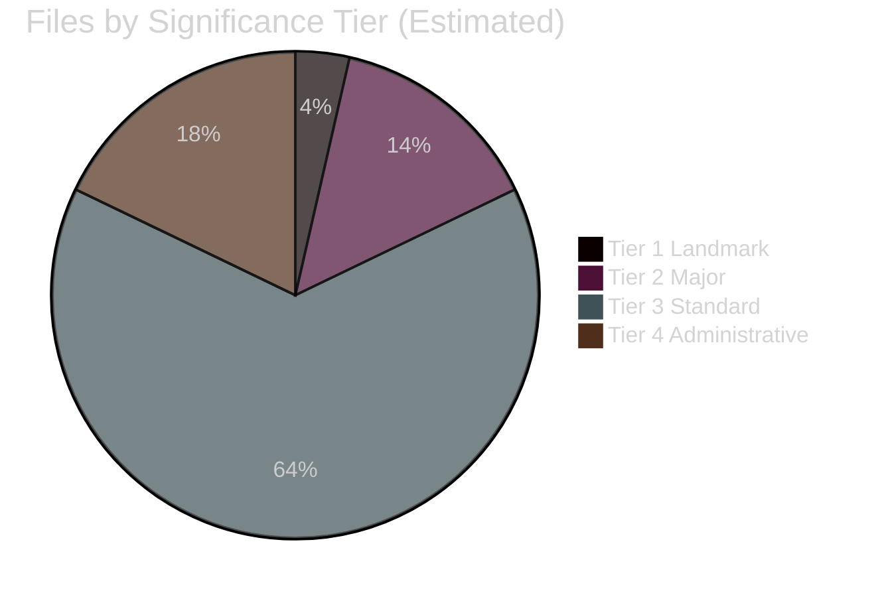

<!-- SPDX-FileCopyrightText: 2026 Hack23 AB -->
<!-- SPDX-License-Identifier: Apache-2.0 -->

# 🏷️ Significance Classification — EU Parliament Week Ahead
## Date: 2026-05-22

**Methodology:** Key Assumptions Check + Competing Hypotheses Matrix | **Admiralty: B2**

## Legislative Significance Tiers

| Tier | Significance | Files Expected This Week |
|------|-------------|--------------------------|
| Tier 1 — Landmark | Historic EP10 decisions | SAFE Regulation committee vote |
| Tier 2 — Major | Significant legislative progress | AI Act standards, CBAM prep |
| Tier 3 — Standard | Normal committee work | 15–20 routine files |
| Tier 4 — Administrative | Housekeeping | Delegations, procedural |

**Key Assumptions Check:**
- Assumption: SAFE regulation is Tier 1 this week → 🟡 MEDIUM confidence (depends on whether AFET votes this week vs. next)
- Assumption: No emergency Tier 1 events → 🟢 HIGH confidence (no plenary, no crisis signals)
- Assumption: Standard committee week pattern → 🟢 HIGH confidence (EP confirmed calendar)

*Produced: 2026-05-22 | Admiralty B2 | Key Assumptions Check + Competing Hypotheses applied*
