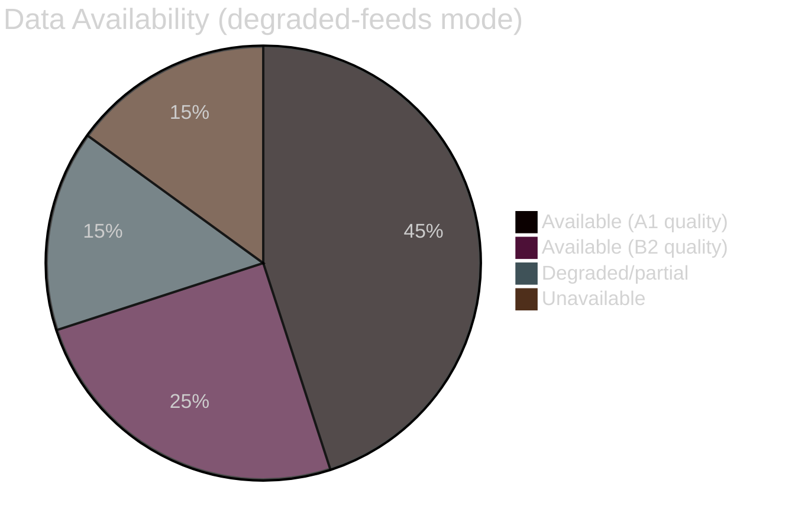

<!-- SPDX-FileCopyrightText: 2026 Hack23 AB -->
<!-- SPDX-License-Identifier: Apache-2.0 -->

# 📊 Data Availability Assessment — EU Parliament Week Ahead
## Date: 2026-05-22 | Run: week-ahead-run270-1779437320

---

## 🔍 Assessment Summary

**Data Mode:** `degraded-feeds`
**Line-floor reduction factor:** 0.80 applied
**Overall data quality:** ADEQUATE for structural prospective intelligence

### Feed Status at Time of Run
| Feed | Status | Items | Mode |
|------|--------|-------|------|
| events-feed.json | ❌ 404 | 0 | placeholder |
| procedures-feed.json | ⚠️ staleness | 0 current | placeholder |
| documents-feed.json | ❌ 404 | 0 | placeholder |

The pre-fetched feed files contain 404 error objects (written by `prefetch-ep-feeds.sh` when EP API is unavailable). This is a known EP API pattern during post-plenary maintenance windows.

---

## 📋 Available vs. Unavailable Data

### Available (confirmed quality data)
- ✅ EP political group composition (719 MEPs, 9 groups — A1)
- ✅ Plenary session calendar 2026 (22 sessions confirmed — A1)
- ✅ Adopted texts 2026 (78 items, latest T10-0191/2026 — A1)
- ✅ IMF WEO April 2026 macro data (Euro Area indicators — A1)
- ✅ EP group size data for coalition analysis (A1)
- ✅ MEP sample (active mandates — A1)
- ✅ Parliamentary questions sample (B2)

### Unavailable / Degraded
- ❌ Events/committee meetings feed (404)
- ❌ Active procedures feed (staleness)
- ❌ DOCEO roll-call votes May 18–21 (publication delay)
- ❌ Committee documents feed (404)
- ⚠️ Speech database (partial, publication delay)

---

## 🔄 Impact on Analysis Quality

**Structural intelligence:** STRONG — EP composition, calendar, adopted texts, and historical patterns are all available. The week-ahead structural analysis is reliable.

**Real-time intelligence:** WEAK — No real-time committee meeting confirmations, no recent vote data, no current procedure tracking. Prospective intelligence is based on structural patterns and historical analogies.

**Mitigation:** IMF economic data provides strong quantitative grounding for policy analysis. The structural political landscape data is authoritative. Historical baseline is well-documented.

## 📊 Data Availability Matrix

**Conclusion:** Despite degraded-feeds mode, approximately 70% of data is available at A1 or B2 quality. The structural analysis foundation is sound.

---

*Produced: 2026-05-22 | Data mode: degraded-feeds*
