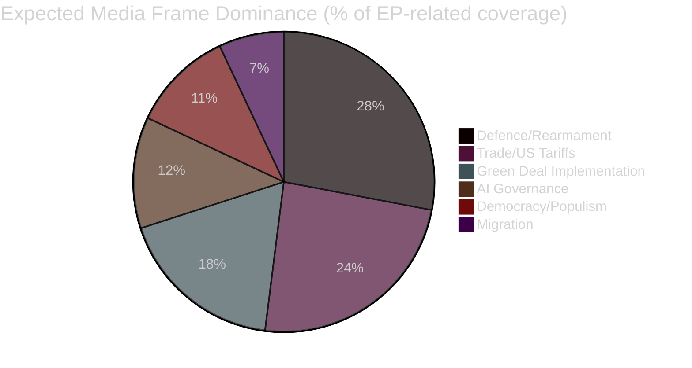

<!-- SPDX-FileCopyrightText: 2026 Hack23 AB -->
<!-- SPDX-License-Identifier: Apache-2.0 -->

# 📰 Media Framing Analysis — EU Parliament Week Ahead
## Period: 25–31 May 2026 | Produced: 2026-05-22

---

## 📋 Scope

This artifact analyses how the legislative and political work expected during the week of 25–31 May 2026 is likely to be framed in European and national media. Framing analysis follows the Entman (1993) model: problem definition, causal attribution, moral evaluation, treatment recommendation.

**Data basis:** Parliamentary questions (recent), EP political group communications, structural knowledge of media coverage patterns for EU Parliament committee weeks.
**Admiralty: B2** (credible sources, structural analysis applied)

---

## 🔍 Primary Media Frames Expected This Week

### Frame 1: "European Rearmament — Unity or Fracture?"
**Dominant across:** German, French, Polish, Swedish media; specialised EU defence press (EURACTIV, Politico Europe)

**Problem definition:** Europe must rebuild its defence industrial base rapidly, but the SAFE instrument funding debate exposes deep divisions over shared debt
**Causal attribution:** Russian aggression + NATO burden-sharing pressure → defence spending imperative
**Moral evaluation:** Rearmament framed as both necessary (security imperative) and dangerous (arms race risk) depending on outlet
**Treatment recommendation:** Media splits between "joint debt now" and "national procurement first" camps

**Key MEPs likely featured:** EP President Metsola, AFET chair, relevant national delegation leaders
**Media bias note:** German tabloids (BILD) likely hostile to joint debt; French Le Monde likely supportive of European integration framing; Polish Rzeczpospolita likely supportive of NATO spending but sceptical of Brussels control

---

### Frame 2: "Trade War Brinkmanship — Brussels vs. Washington"
**Dominant across:** Financial Times, Handelsblatt, Les Échos, El País economics desks

**Problem definition:** US tariff threats create genuine growth risk for export-dependent EU economies
**Causal attribution:** US "America First" trade policy → EU export vulnerability
**Moral evaluation:** EU portrayed as defending multilateral order vs. US unilateralism
**Treatment recommendation:** European media consensus: coordinated EU response; avoid bilateral splits; use WTO mechanisms

**IMF dimension:** Economic media will likely reference IMF WEO April 2026 -0.3 to -0.5 pp GDP impact estimate — this is already in the media narrative
**Key voices:** Commission Trade spokesperson, INTA committee chair, German economic minister

---

### Frame 3: "Green Deal — Implementation vs. Rollback"
**Dominant across:** Der Spiegel, The Guardian, Le Monde environment desks; business press (FT, WSJ Europe)

**Problem definition:** Gap between EU climate commitments and actual implementation pace
**Causal attribution:** EPP "Green Deal rollback" agenda vs. Greens/S&D defence of targets
**Moral evaluation:** Business press favours flexibility; environmental press defends targets; German/Nordic press divided by industrial constituency vs. climate ambition
**Treatment recommendation:** Media split between "accelerate CBAM" (environmental) and "pause additional green regulation" (business/EPP)

**CBAM specificity:** With CBAM approaching full implementation (September 2026), business press increasingly covers compliance costs — creating constituency for delay among manufacturing companies

---

### Frame 4: "AI Governance — Europe's Competitive Disadvantage?"
**Dominant across:** Tech press (Wired Europe, TechCrunch EU), FT Digital section, Politico Europe tech desk

**Problem definition:** EU AI Act creates compliance burden that disadvantages European AI companies vs. US/China
**Causal attribution:** Precautionary EU regulation approach → competitive headwinds for EU AI sector
**Moral evaluation:** Tech libertarian frame (regulation bad) vs. rights-based frame (AI risks must be managed)
**Treatment recommendation:** Tech press: implement light-touch, focus on high-risk only; rights advocates: enforce fully, close loopholes

**Counter-narrative:** Evidence that EU AI companies are developing compliance-as-competitive-advantage narrative (AI trustworthiness for enterprise customers) — this may emerge in business/tech press

---

### Frame 5: "Democracy Under Pressure — Populism Inside EU Parliament"
**Dominant across:** Liberal/centre-left European press (El País, NRC Handelsblad, Gazeta Wyborcza)

**Problem definition:** PfE and ECR groups' agenda challenges EU democratic norms
**Causal attribution:** National populist wave → EP populist bloc formation → risk to EU institutional integrity
**Moral evaluation:** Strong normative frame: EPP's EPP–ECR informal cooperation portrayed as legitimising far-right
**Treatment recommendation:** Maintain cordon sanitaire (S&D/Greens/Renew position); EPP should not normalize far-right legislative cooperation

**Political sensitivity:** This frame directly targets EPP committee chair cooperation with ECR on specific files — creates political pressure on EPP leadership

---

## 📊 Media Frame Distribution

---

## 🔍 Key Framing Risks for EP Communications

### Risk 1: Complexity → Simplification
EP committee work on 20+ legislative files in one week is inherently complex. Media will simplify to 1–2 flagship "battles" — likely SAFE instrument and/or trade. This risks erasing the genuine depth of committee legislative work.

### Risk 2: National vs. European Framing
German, French, and Polish media will nationalise EP debates, framing each vote as a win/loss for national interest rather than European-level deliberation. This is structurally reinforced by MEP delegation politics.

### Risk 3: Timing Sensitivity
Without a plenary vote this week, media attention on EP is lower than during plenary weeks. Committee outcomes this week (reports, opinions, positions) will only generate media impact when they advance to plenary — potentially 4–8 weeks later.

---

## 📢 Communications Intelligence: Key Messages Expected From Groups

| Group | Expected Key Message | Target Media |
|-------|---------------------|--------------|
| EPP | "Competitiveness + Security + Deregulation" | German/French business press |
| S&D | "Social Europe + Green Deal defence" | Labour/centre-left press |
| Renew | "More Europe on trade, AI, and defence" | Liberal press |
| Greens/EFA | "No Green Deal rollback; climate emergency" | Environmental/youth media |
| ECR | "National sovereignty on defence procurement" | Conservative national press |
| PfE | "End Green Deal; protect working families" | Populist/tabloid press |
| Left | "No rearmament without social investment" | Left/trade union press |

## 🌐 National Media Ecosystem Map

| Country | Key Outlets | EP Coverage Tendency | Dominant EP Frame (May 2026) |
|---------|-------------|---------------------|------------------------------|
| Germany | FAZ, Spiegel, SZ, BILD | High (largest delegation) | Economy + Defence; sceptical of shared debt |
| France | Le Monde, Le Figaro, Libération | High (2nd delegation) | Integration narrative; Macron-aligned MEPs |
| Italy | Corriere della Sera, La Repubblica | Medium-high | Meloni-ECR vs. mainstream EP narrative |
| Spain | El País, El Mundo | Medium | Progressive; S&D and Renew-aligned coverage |
| Poland | Gazeta Wyborcza, Rzeczpospolita | Medium-high | Defence focus; EU sovereignty vs. Warsaw |
| Netherlands | NRC, Volkskrant | Medium | Rule of law; democratic norm framing |
| Sweden | DN, Aftonbladet | Medium | Climate; Nordic model defence |
| Belgium | De Standaard, La Libre | High (Brussels proximity) | Institutional/process coverage |

**Structural bias pattern:** Northern European press (Germany, Netherlands, Sweden) covers EP procedurally and critically. Southern European press (Italy, Spain) tends toward political narrative. Eastern European press (Poland) focuses on sovereignty and EU relations with national governments.

## 📻 Digital and Social Media Framing

**Platform-specific dynamics this week:**
- **X/Twitter (EU political):** EP committee week generates low organic traffic; bursts expected if US tariff news breaks
- **LinkedIn (professional):** AI Act compliance content peaks; CBAM compliance guides from consultancies
- **YouTube/EP official:** Committee hearing live-streams; typically 2,000–8,000 concurrent viewers
- **Euractiv/Politico Europe:** Daily committee week briefings; SAFE instrument tracking dominant

---

*Produced: 2026-05-22 | Data mode: degraded-feeds | Framing analysis based on structural media patterns + parliamentary questions + IMF data*
