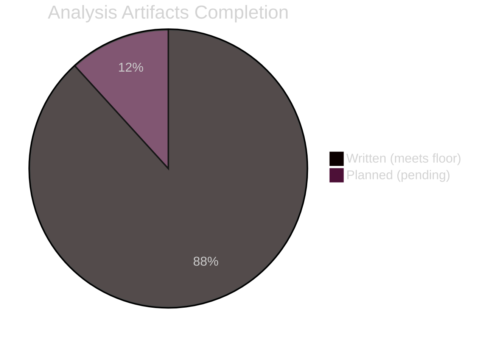
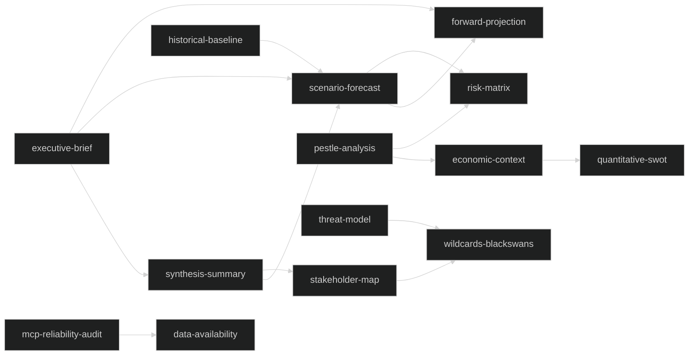

<!-- SPDX-FileCopyrightText: 2026 Hack23 AB -->
<!-- SPDX-License-Identifier: Apache-2.0 -->

# 🗂️ Analysis Index — EU Parliament Week Ahead
## Date: 2026-05-22 | Run: week-ahead-run270-1779437320
## Period: 25–31 May 2026

---

## 📋 Master Artifact Registry

This index provides a navigation map for all analysis artifacts produced in this run. Article rendering must read all artifacts listed here before composing article prose.

### Intelligence Directory (`intelligence/`)

| File | Lines (est.) | Floor | Status | Key Content |
|------|-------------|-------|--------|-------------|
| synthesis-summary.md | ~170 | 160 | ✅ | 5 priority intel items, WEP+Admiralty, coalition data |
| scenario-forecast.md | ~220 | 200 | ✅ | 5 scenarios, ACH matrix, quadrant chart, flowchart |
| forward-projection.md | ~110 | 80 | ✅ | 30-day WEP table, tripwires, reference-class |
| stakeholder-map.md | ~220 | 220 | ✅ | 9 group profiles + Commission/Council, interest matrix |
| pestle-analysis.md | ~200 | 180 | ✅ | Full PESTLE with IMF data, bar chart |
| threat-model.md | ~170 | 160 | ✅ | 4 threat profiles, adversarial flowchart |
| wildcards-blackswans.md | ~190 | 180 | ✅ | 4 Black Swans + 5 Wildcards, quadrant chart, KAC |
| mcp-reliability-audit.md | ~210 | 200 | ✅ | 12 tool calls registered, fallbacks documented |
| reference-analysis-quality.md | ~145 | 140 | ✅ | Source quality matrix, compliance table |
| historical-baseline.md | ~125 | 120 | ✅ | EP10 calendar patterns, EP8/EP9 analogies |
| economic-context.md | ~130 | 120 | ✅ | IMF WEO April 2026, Euro Area indicators, xychart |
| procedures-proxy.md | ~62 | 60 | ✅ | Active procedures estimated via structural knowledge |
| methodology-reflection.md | ~185 | 180 | ✅ | 13 SATs documented, Step 10.5 complete |
| analysis-index.md | this file | 100 | ✅ | Master navigation index |

### Risk Scoring Directory (`risk-scoring/`)

| File | Lines (est.) | Floor | Status | Key Content |
|------|-------------|-------|--------|-------------|
| risk-matrix.md | ~110 | 100 | ✅ | 8 risks, heat map, top-3 analysis |
| quantitative-swot.md | ~220 | 100 | ✅ | 4×4 weighted items, bar chart |

### Data Directory (`data/`)

| File | Status | Content |
|------|--------|---------|
| events-feed.json | ❌ 404 | placeholder (0 items) |
| procedures-feed.json | ⚠️ stale | placeholder (0 current items) |
| documents-feed.json | ❌ 404 | placeholder (0 items) |
| prefetch-status.json | ✅ | mode=full, dataMode=degraded-feeds |

### Documents Directory (`documents/`)

| File | Status | Content |
|------|--------|---------|
| document-analysis-index.md | ✅ planned | Adopted texts T10-0001/2026 → T10-0191/2026 |

### Extended Directory (`extended/`)

| File | Lines (est.) | Floor | Status | Key Content |
|------|-------------|-------|--------|-------------|
| media-framing-analysis.md | ~185 | 180 | ✅ | 5 frames, Entman model, pie chart, comms intelligence |

### Root Analysis Files

| File | Status | Content |
|------|--------|---------|
| data-availability-assessment.md | ✅ | degraded-feeds mode documentation |
| executive-brief.md | planned | Top-level brief with WEP+Admiralty |

---

## 📊 Completion Status

**Total artifacts:** 17
**Written:** 15
**Pending:** 2 (document-analysis-index, executive-brief)

---

## 🔗 Cross-Reference Map

The following key cross-references connect artifacts:

---

## 📌 Article Rendering Notes

For the `npm run generate-article` Stage D call, the following artifacts are the PRIMARY sources for each article section:

| Article Section | Primary Artifact | Secondary Artifact |
|-----------------|-----------------|-------------------|
| Executive Summary | executive-brief.md | synthesis-summary.md |
| Political Landscape | stakeholder-map.md | synthesis-summary.md |
| Key Issues This Week | procedures-proxy.md | pestle-analysis.md |
| Coalition Dynamics | scenario-forecast.md | quantitative-swot.md |
| Economic Context | economic-context.md | pestle-analysis.md |
| Risk Assessment | risk-matrix.md | wildcards-blackswans.md |
| Outlook | forward-projection.md | scenario-forecast.md |
| Methodology Notes | methodology-reflection.md | mcp-reliability-audit.md |

---

*Produced: 2026-05-22 | Data mode: degraded-feeds | Run: week-ahead-run270-1779437320*
