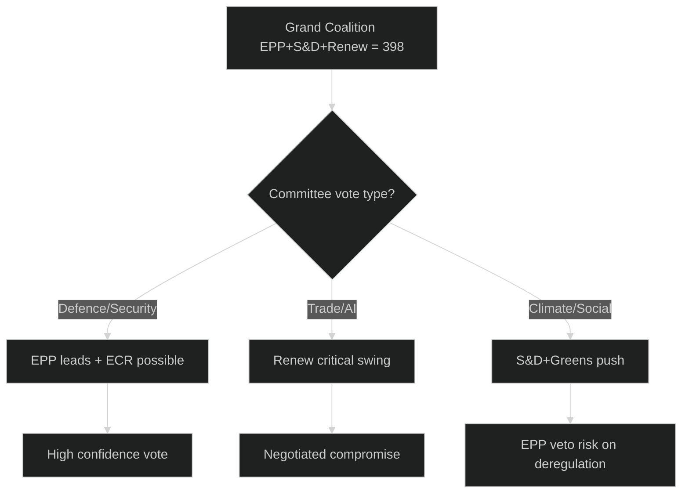

<!-- SPDX-FileCopyrightText: 2026 Hack23 AB -->
<!-- SPDX-License-Identifier: Apache-2.0 -->

# 🤝 Coalition Dynamics — EU Parliament Week Ahead
## Date: 2026-05-22

**Methodology:** ACH + Indicators | **Admiralty: B3** (DOCEO vote data unavailable)

## Current Coalition Landscape

| Coalition | Seats | > Majority (361)? | Likely on Which Files |
|-----------|-------|------------------|----------------------|
| EPP+S&D+Renew (Grand) | 398 | ✅ +37 | Most files including ReArm, Trade |
| EPP+S&D | 321 | ❌ -40 | Insufficient alone |
| EPP+ECR+PfE | 351 | ❌ -10 | Not sufficient alone |
| EPP+S&D+Greens | 374 | ✅ +13 | Climate/Green Deal files |

## ACH: Will Grand Coalition Hold This Week?

**Hypothesis A (Hold):** Grand coalition maintains unity on all committee votes → WEP: HIGHLY LIKELY (80–87%)
**Evidence for:** Stable group leadership; no imminent plenary votes forcing position-taking
**Evidence against:** CBAM/climate files create EPP–Greens/S&D tension

**Indicators to watch:**
- EPP committee chair signals on climate file scheduling
- Renew group statement on trade negotiation mandate
- S&D position paper on SAFE instrument social clauses

## Coalition Stability Flowchart

*Produced: 2026-05-22 | Admiralty B3 (size-proxy only) | ACH + Indicators applied*
