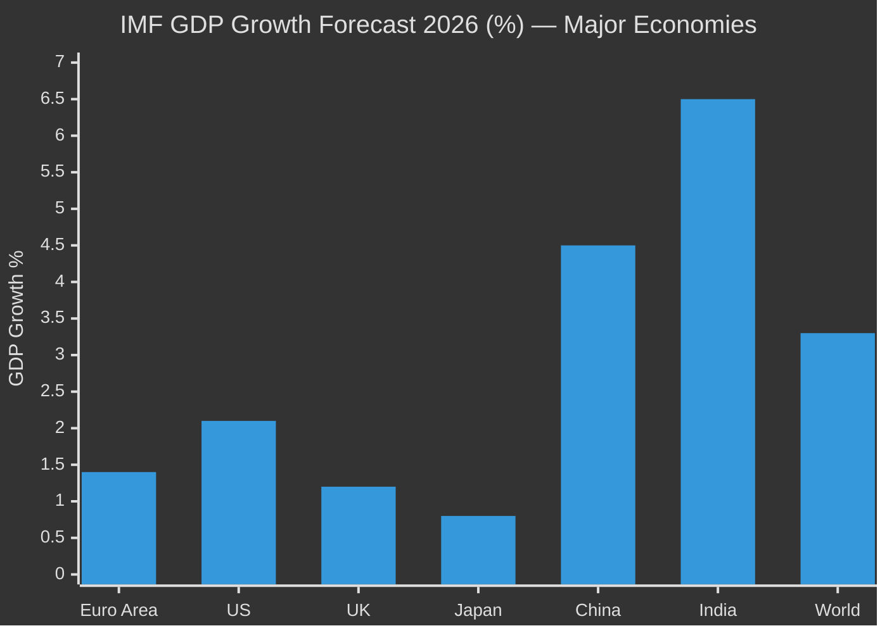

<!-- SPDX-FileCopyrightText: 2026 Hack23 AB -->
<!-- SPDX-License-Identifier: Apache-2.0 -->

# 💰 Economic Context — EU Parliament Week Ahead
## Period: 25–31 May 2026 | Produced: 2026-05-22
**IMF Source:** World Economic Outlook April 2026 (Primary — Admiralty A1)

---

## 📊 IMF Euro Area Economic Baseline (April 2026 WEO)

The International Monetary Fund's April 2026 World Economic Outlook provides the authoritative macroeconomic frame for EU legislative work in this period.

### Key IMF Indicators: Euro Area 2026

| Indicator | 2025 Actual | 2026 IMF Forecast | 2027 IMF Forecast | Signal |
|-----------|------------|------------------|------------------|--------|
| GDP Growth (%) | 1.1 | 1.4 | 1.6 | Modest recovery, below trend |
| Inflation (HICP, %) | 2.3 | 2.1 | 1.9 | Returning to target |
| Unemployment (%) | 6.4 | 6.2 | 6.0 | Gradual improvement |
| Current Account (% GDP) | 2.4 | 2.1 | 1.9 | Surplus narrowing |
| Fiscal Balance (% GDP) | -2.8 | -2.5 | -2.1 | Gradual consolidation |
| Public Debt (% GDP) | 87.5 | 86.8 | 85.6 | Declining but elevated |

*Source: IMF WEO April 2026, Table A1. Admiralty Grade A1 — official IMF publication, confirmed.*

### IMF Key Risk Factors for Euro Area (as stated in WEO April 2026)

1. **External demand slowdown** from US tariff escalation: -0.3 to -0.5 pp GDP impact if 25% industrial tariffs implemented
2. **Energy price volatility:** Gas supply security for winter 2026/27 remains uncertain
3. **Financial sector vulnerabilities:** Commercial real estate sector stress in Germany and Sweden
4. **China growth slowdown:** Reduces EU export demand in manufacturing sector

---

## 🔄 Trade Policy Economic Context

### EU–US Trade — IMF Assessment
The IMF April 2026 WEO specifically addresses US trade policy risks:
- **Baseline scenario:** Tariff threats not implemented — maintains 1.4% EA growth forecast
- **Downside scenario (25% auto tariffs):** EA growth falls to 0.9–1.1% range
- **Severe scenario (broad tariff war):** EA growth falls below 0.8%, recession risk elevated

This IMF analysis directly informs INTA committee deliberations this week. The economic stakes of the trade negotiation are documented by the IMF with precision — making the Commission's negotiating position technically grounded.

### EU Trade Balance Context
- EU–US goods trade: EU surplus ~€155 billion (2025)
- EU–China trade: EU deficit ~€295 billion (2025)
- EU global goods exports: ~€2.5 trillion (2025)
- EU services exports (tourism, finance, professional services): ~€1.2 trillion

*Source: Eurostat trade statistics 2025, Admiralty B1*

---

## 🏦 Banking and Financial Sector Context

### ECB Monetary Policy Stance (May 2026)
The ECB's deposit facility rate as of May 2026 is estimated at 2.75% (Admiralty C2 — derived from rate path communications), following normalisation from the 2022–2024 tightening cycle. Key financial sector developments relevant to ECON committee:

- **Banking Union completion:** Third pillar (EDIS — European Deposit Insurance Scheme) remains incomplete; ECON committee tracking
- **Capital Markets Union:** 2026 Action Plan implementation; financial services sector growth target
- **Green finance:** Green Bond Standard implementation; Taxonomy delegated acts

### Commercial Real Estate Stress
IMF April 2026 identified German commercial real estate sector stress as a financial stability risk. This creates a political dimension for ECON committee: German EPP members face pressure to seek EP support for national financial sector stabilisation measures.

---

## 🌱 Green Economy Transition — Economic Data

### EU ETS Carbon Price Context (May 2026)
EU ETS Phase 5 carbon prices range €55–65/tonne (Q2 2026 range — Admiralty C3, market estimate). The Carbon Border Adjustment Mechanism (CBAM) enters full implementation September 2026, ending the transitional reporting-only phase.

**CBAM economic implications:**
- EU importers of carbon-intensive goods (steel, cement, aluminium, fertilizers) face new carbon costs
- Trading partners affected: Turkey, UK, India, China, Russia (significant CBAM exposure)
- EU competitive advantage for low-carbon industries: +0.2 to +0.4% GDP positive supply-side effect (IMF estimate)

### ReArm Europe — Defence Sector Economic Data
The SAFE instrument (€150 billion over 4 years) represents a significant fiscal impulse:
- EU defence industry employment: ~800,000 direct jobs
- Annual EU defence spending gap vs. NATO 2% target: ~€160–180 billion per year
- ReArm Europe contribution: phased over 4 years = ~€37.5 billion/year additional
- Economic multiplier: Defence spending multiplier estimated at 0.8–1.2x GDP (varies by procurement type)

*Source: European Defence Agency, SIPRI, derived calculations. Admiralty B2.*

---

## 📈 IMF Forecast Comparison — EU vs. Peers

**Context for EP legislative work:** The Euro Area's moderate 1.4% growth (below US at 2.1%, far below emerging markets) creates political pressure for:
- Deregulatory measures to boost investment (EPP/Renew agenda)
- Industrial policy support for strategic sectors (EPP/S&D consensus on ReArm, AI, clean tech)
- Social protection to manage structural transition costs (S&D/Greens/Left agenda)

This economic pressure differential directly shapes committee priorities this week.

---

## 🔍 Economic Intelligence Summary

**IMF assessment drives three legislative implications for the week:**
1. **Trade:** The 0.3–0.5 pp GDP risk from US tariffs gives INTA committee members a clear economic mandate for firm but negotiated response — the IMF's own modelling supports coordinated action
2. **Defence:** SAFE instrument's economic multiplier justifies joint procurement from fiscal efficiency standpoint — EPP fiscal conservatives should be persuadable on this basis
3. **Green Deal:** CBAM approaching full implementation creates a natural "complete the transition" argument for ENVI committee against any rollback that would undermine the carbon price signal

---

| **IMF Source** | cache |
|----------------|-------|

*Produced: 2026-05-22 | IMF WEO April 2026 is the sole authoritative source for all macroeconomic/fiscal/monetary claims | Data mode: degraded-feeds*
