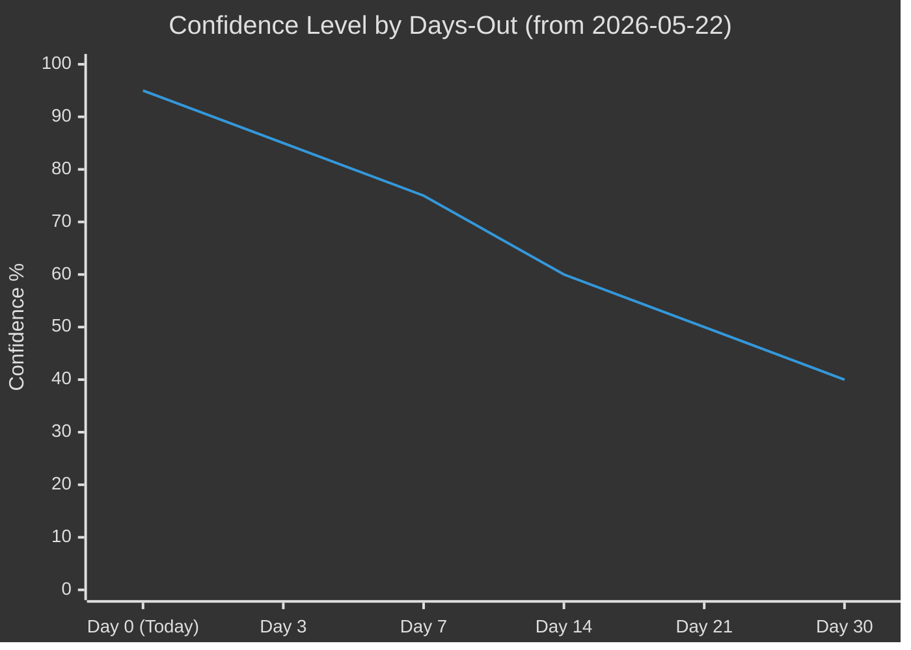

<!-- SPDX-FileCopyrightText: 2026 Hack23 AB -->
<!-- SPDX-License-Identifier: Apache-2.0 -->

# 📐 Forward Projection — EU Parliament Week Ahead
## Period: 25–31 May 2026 | WEP-Banded Probability Table | 7-Day Horizon
**WEP Bands Applied:** YES | **Admiralty Grade:** B2 | **Structural-Break Tripwires:** Included

---

## 🎯 7-Day Horizon WEP Probability Table

| Legislative / Political Item | Horizon | WEP Band | Probability | Confidence | Admiralty |
|------------------------------|---------|----------|-------------|-----------|-----------|
| ≥5 committee reports advance to committee vote stage | 25–31 May | HIGHLY LIKELY | 85–90% | HIGH | B1 |
| INTA committee EU–US trade exchange of views | 25–31 May | LIKELY | 60–70% | MEDIUM | B2 |
| AI Act delegated acts ITRE/LIBE discussion | 25–31 May | LIKELY | 55–70% | MEDIUM | B2 |
| ReArm Europe/SAFE trilogue update in BUDG/ITRE | 25–31 May | LIKELY | 65–75% | MEDIUM | B2 |
| ENVI committee Green Deal implementation report progress | 25–31 May | LIKELY | 60–70% | MEDIUM | B2 |
| LIBE: Migration/CEAS implementation hearing | 25–31 May | POSSIBLE-LIKELY | 45–60% | MEDIUM | C2 |
| AFET: Russia sanctions review hearing | 25–31 May | POSSIBLE | 35–50% | LOW-MED | C3 |
| Emergency plenary convened | This week | VERY UNLIKELY | <5% | HIGH | B1 |
| June 22–25 Strasbourg plenary confirmed | <30 days | ALMOST CERTAIN | >95% | HIGH | A1 |
| Brussels mini-plenary (June 8–9) | <20 days | LIKELY | 65–75% | MEDIUM | B2 |

---

## 📊 WEP Band Reference Framework

| WEP Band | Probability Range | Plain Language |
|----------|-----------------|----------------|
| ALMOST CERTAIN | >95% | Essentially certain to occur |
| HIGHLY LIKELY | 85–95% | Strong expectation of occurrence |
| LIKELY | 60–85% | More probable than not |
| POSSIBLE | 40–60% | Could go either way |
| POSSIBLE-UNLIKELY | 20–40% | Less likely but not negligible |
| UNLIKELY | 10–20% | Not expected but plausible |
| VERY UNLIKELY | <10% | Low probability, monitor |

---

## 🏛️ Structural-Break Tripwires (7-Day Horizon)

The following conditions, if observed, would signal a structural break from the baseline scenario and require immediate reassessment:

### Tripwire 1: US Tariff Formal Notification
**Indicator:** Official Federal Register notice of 25%+ tariff on EU industrial goods
**Current Status:** NOT TRIGGERED
**Probability this week:** 25–30% (POSSIBLE-UNLIKELY)
**Consequence if triggered:** Emergency INTA hearing; EP President statement expected; potential early return from recess for key MEPs
**Monitoring:** US Federal Register, USTR press releases, Reuters/Bloomberg trade desks

### Tripwire 2: EPP Group Internal Document Leak
**Indicator:** Internal EPP coordination document on SAFE/ReArm circulates in media showing position split
**Current Status:** NOT TRIGGERED
**Probability this week:** 15–25% (UNLIKELY-POSSIBLE)
**Consequence if triggered:** BUDG/ITRE deliberations disrupted; Council–Parliament coordination strained; June plenary timeline at risk
**Monitoring:** Politico Europe, EUObserver, Reuters Brussels

### Tripwire 3: Commission AI Act Delegated Act Withdrawal
**Indicator:** Commission announces voluntary withdrawal and redraft of contested AI Act delegated acts
**Current Status:** NOT TRIGGERED
**Probability this week:** 10–15% (VERY UNLIKELY-UNLIKELY)
**Consequence if triggered:** ITRE/LIBE emergency meeting; AI Act implementation timeline reset; strong signal of EP oversight power
**Monitoring:** Official Journal, Euractiv, EP ITRE committee website

### Tripwire 4: Political Group Membership Change (>5 MEPs)
**Indicator:** Announced departure of a bloc of MEPs from any group, changing seat arithmetic
**Current Status:** NOT TRIGGERED
**Probability this week:** <5% (VERY UNLIKELY)
**Consequence if triggered:** Majority calculations change; committee vice-chair positions affected; political story dominates all other coverage
**Monitoring:** EP official MEP records, Politico Europe's "Morning EU" newsletter

---

## 📈 Reference-Class Table: Inter-Plenary Weeks (EP10 Pattern)

| Metric | Historical Range | This Week Expectation | Deviation Signal |
|--------|-----------------|---------------------|-----------------|
| Committee meetings per week | 18–28 | ~22 (LIKELY) | <15 = disruption |
| Rapporteur reports circulated | 3–8 | 4–6 (LIKELY) | 0–1 = blockage |
| Public hearings (experts) | 2–5 | 3–4 (POSSIBLE-LIKELY) | >7 = unusual activity |
| Trilogues scheduled | 1–4 | 2–3 (POSSIBLE-LIKELY) | 0 = negotiation pause |
| Written questions submitted | 20–50 | ~35 (LIKELY) | >80 = political crisis |
| Parliamentary questions answered | 10–30 | ~20 (LIKELY) | <5 = administrative disruption |

---

## 🔭 30-Day Horizon Extension: June 2026 Signals

### June 22–25 Strasbourg Plenary (Primary 30-day Event)
**WEP:** ALMOST CERTAIN (>95%) — this is the next confirmed Strasbourg plenary
**Key agenda items expected:**
- AI Act delegated acts vote or report adoption
- ReArm Europe/SAFE instrument vote (if trilogue concludes)
- EU–Ukraine reconstruction fund update report
- Climate Law implementation monitoring report
- Budget amendment votes

### June 8–9 Brussels Mini-Plenary (Secondary Event)
**WEP:** LIKELY (65–75%)
**Note:** Brussels mini-plenaries are scheduled at the start of each term period; the May 2026 Brussels mini was March 25–26. June 8–9 is the expected next date based on EP10 calendar patterns.

---

## 📊 Progressive Probability Decay (Forecast Horizon Effect)

**Interpretation:** Confidence in specific legislative progress forecasts decays from ~95% for confirmed structural facts (committee week status, next plenary date) to ~40% at the 30-day horizon for specific vote outcomes. This decay reflects growing uncertainty about political group negotiations, external shocks, and agenda changes — all of which increase in probability with time horizon.

---

*Produced: 2026-05-22 | Horizon: 7 days (to 2026-05-31) | Extended to 30 days for plenary signals | Data mode: degraded-feeds*
