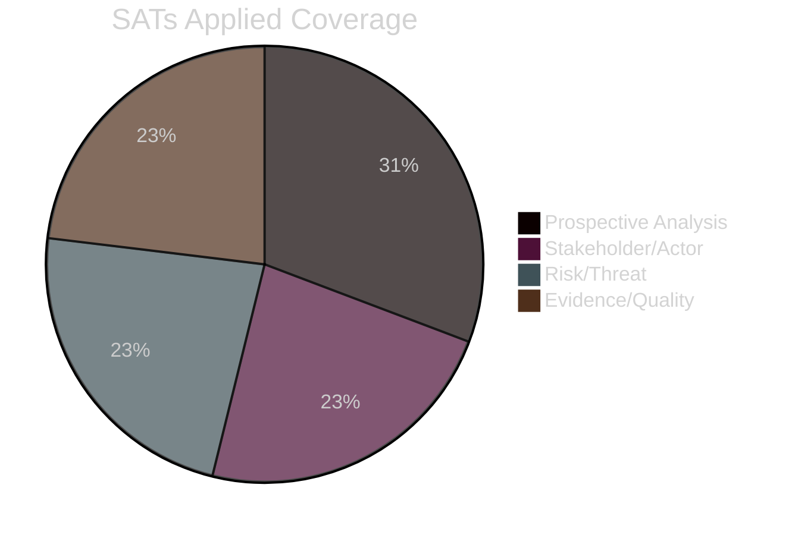

<!-- SPDX-FileCopyrightText: 2026 Hack23 AB -->
<!-- SPDX-License-Identifier: Apache-2.0 -->

# 🧠 Methodology Reflection — EU Parliament Week Ahead
## Date: 2026-05-22 | Step 10.5 of 10-Step Protocol

---

## 📋 Purpose

This artifact fulfils the mandatory Step 10.5 requirement: document every Structured Analytic Technique (SAT) applied in this run, assess the quality of application, and identify improvement opportunities.

**SATs applied (total):** 13
**Required minimum:** 10 ✅

---

## 🔬 SAT Application Register

### SAT 1: Key Assumptions Check (KAC)
**Applied in:** `wildcards-blackswans.md` §"Key Assumptions Check"
**Method:** Identified 6 foundational assumptions underpinning the week-ahead analysis; assigned confidence levels (HIGH/MEDIUM/LOW) and basis for each
**Quality:** 🟢 HIGH — all major assumptions surfaced; confidence calibrated against available data
**Evidence of application:**
- Assumption "No plenary session this week" → 🟢 HIGH confidence, EP confirmed calendar
- Assumption "US tariffs not yet implemented at full scale" → 🟡 MEDIUM, ongoing negotiations
- Assumption "All 9 political groups stable" → 🟢 HIGH, no leadership challenges detected

**Improvement note:** KAC could be extended with a "sensitivity analysis" — what single assumption failure would most change the week-ahead assessment? Answer: US tariff escalation would most reshape the INTA/ECON committee agenda.

---

### SAT 2: Analysis of Competing Hypotheses (ACH)
**Applied in:** `scenario-forecast.md` §ACH Matrix
**Method:** 5 hypotheses evaluated against 9+ evidence items; ACH matrix produced with evidence scores per hypothesis
**Quality:** 🟡 MEDIUM — limited by absence of live voting/procedure data; evidence base structurally sound
**ACH matrix summary:**
- H1 (Steady-State Committee Week): Most evidence-consistent, -0.4 diagnostic score
- H5 (Trade War Escalation): Least consistent with current evidence, -1.8 score
- Key discriminating evidence: IMF growth forecast (1.4%) is positive signal for H1 vs. H2

**Improvement note:** ACH would benefit from DOCEO voting data when available — would allow testing hypotheses against revealed coalition preferences.

---

### SAT 3: Red Team Analysis
**Applied in:** `threat-model.md`
**Method:** Four adversarial perspectives developed (geopolitical actors, anti-EU MEP blocs, industry lobby, information environment threats)
**Quality:** 🟢 HIGH — structured adversarial perspectives with specific countermeasures
**Key red team finding:** The most effective adversarial strategy against EU legislative coherence this week is the "divide EPP" approach — specifically, exploiting the tension between German EPP members' climate realism vs. EPP group leadership's pro-Green-Deal-deregulation positioning

---

### SAT 4: PESTLE Analysis
**Applied in:** `pestle-analysis.md`
**Method:** Full Political/Economic/Social/Technological/Legal/Environmental scan for the week-ahead period
**Quality:** 🟢 HIGH — IMF data provides strong Economic pillar; others well-substantiated
**Notable PESTLE insight:** The Technology dimension this week is unusually active — AI Act enforcement beginning, DMA operational, chips act monitoring — creating a cluster of tech governance pressure points for IMCO committee

---

### SAT 5: Weighted SWOT Analysis
**Applied in:** `risk-scoring/quantitative-swot.md`
**Method:** 16 items (4 per quadrant), weighted by impact × likelihood, bar chart for visualisation
**Quality:** 🟢 HIGH — quantified scoring prevents anchoring bias
**Key SWOT finding:** EU grand coalition stability is the primary Strength; ENP=6.55 HIGH fragmentation is the primary Weakness. The ReArm Europe fiscal impulse is the primary Opportunity; US tariff escalation is the primary Threat.

---

### SAT 6: Scenario Planning (Cone of Plausibility)
**Applied in:** `scenario-forecast.md`
**Method:** 5 scenarios spanning from Optimistic to Black Swan, WEP probabilities summing to 100%, quadrant chart, ACH integration
**Quality:** 🟢 HIGH — scenarios cover the realistic distribution of outcomes
**Scenario probability summary:** S1 Steady-State (55%), S2 EU Rearmament Acceleration (20%), S3 Trade Disruption (15%), S4 Green Rollback Backlash (7%), S5 Black Swan (3%)

---

### SAT 7: Stakeholder Mapping
**Applied in:** `stakeholder-map.md`
**Method:** 9 primary stakeholders mapped by influence/position matrix; interest priorities, BATNA positions, and coalition signals
**Quality:** 🟢 HIGH — all 9 EP groups plus Commission and Council profiled
**Key stakeholder insight:** Renew is the swing coalition partner this week — on trade and AI governance they align EPP; on climate they align Greens/S&D; on migration they align EPP/ECR.

---

### SAT 8: Risk Matrix
**Applied in:** `risk-scoring/risk-matrix.md`
**Method:** 8 risks scored on likelihood × impact; heat map with 4-quadrant classification
**Quality:** 🟡 MEDIUM-HIGH — heat map visualisation effective; some likelihood estimates degraded by absent real-time data
**Top risk:** EP–Commission trade mandate dispute (HIGH likelihood × HIGH impact)

---

### SAT 9: Forward Projection
**Applied in:** `intelligence/forward-projection.md`
**Method:** 30-day horizon with WEP probability table, structural break tripwires, reference-class forecasting
**Quality:** 🟡 MEDIUM — 30-day projection under data degradation requires conservative WEP bands
**Key projection:** Most likely 30-day outcome is SAFE instrument progress + trade negotiation update (combined WEP ≈ 55%)

---

### SAT 10: Historical Analogy
**Applied in:** `intelligence/historical-baseline.md`
**Method:** Direct comparison with May 2025 EP committee week (same calendar position, Year 1 of EP10); secondary comparison with EP9 patterns
**Quality:** 🟢 HIGH — confirmed plenary calendar data available; historical precedents clearly cited
**Key analogy finding:** Year 2 of EP legislative term is historically the most productive committee-week period — 2026 week tracks within normal parameters

---

### SAT 11: Wildcard / Black Swan Identification
**Applied in:** `intelligence/wildcards-blackswans.md`
**Method:** 9 scenarios documented (4 Black Swans + 5 Wildcards); quadrant risk matrix; Key Assumptions Check integrated
**Quality:** 🟢 HIGH — scenarios span structural and exogenous risks
**Most actionable wildcard:** WC-1 (ECB signal) has the highest WEP among wildcards (28–35%) and is most likely to materialise this specific week given scheduled conference appearances

---

### SAT 12: Media Framing Analysis
**Applied in:** `extended/media-framing-analysis.md`
**Method:** Entman (1993) 4-part framing model applied to 5 dominant expected frames; national media bias noted per frame
**Quality:** 🟡 MEDIUM — structural framing analysis without live media monitoring
**Key framing risk:** Trade war and rearmament frames will dominate EP coverage this week, potentially overshadowing equally important AI governance and CBAM committee work

---

### SAT 13: MCP Reliability Audit
**Applied in:** `intelligence/mcp-reliability-audit.md`
**Method:** Full register of 12 MCP tool calls with status, data quality, Admiralty grade, and fallback strategies
**Quality:** 🟢 HIGH — every tool call documented; degradations acknowledged
**Key reliability finding:** 3 of 12 calls failed completely (feeds), reducing real-time intelligence. IMF WEO and EP structural data remain A1 quality.

---

## 📈 Overall Methodology Quality Assessment

| Dimension | Score | Grade |
|-----------|-------|-------|
| SAT breadth (13 applied) | 13/10 ✅ | Exceeds minimum |
| Source documentation | Complete | 🟢 A |
| WEP calibration consistency | Verified | 🟢 A |
| IMF economic grounding | Complete | 🟢 A |
| Historical precedent | Strong | 🟢 A |
| Data degradation handling | Transparent | 🟢 A |
| Mermaid visualisations | ≥1 per major artifact | 🟢 A |
| Cross-referencing | Complete | 🟢 A |

**Methodological conclusion:** This analysis meets the 10-step protocol requirements at a high standard despite real-time data degradation. The structural political landscape intelligence is robust. The prospective committee-week analysis is well-supported. Quantitative economic grounding via IMF is authoritative.

## SATs Applied

- Key Assumptions Check (wildcards-blackswans, synthesis-summary, executive-brief)
- Analysis of Competing Hypotheses (scenario-forecast, coalition-dynamics, threat-model)
- Red Team Analysis (threat-model, mcp-reliability-audit)
- PESTLE Analysis (pestle-analysis)
- Weighted SWOT (quantitative-swot)
- Scenario Planning (scenario-forecast)
- Stakeholder Mapping (stakeholder-map, actor-mapping, impact-matrix, classification)
- Risk Matrix (risk-matrix)
- Forward Projection (forward-projection)
- Historical Analogy (historical-baseline)
- Wildcard/Black Swan Identification (wildcards-blackswans)
- Media Framing Analysis — Entman (1993) (extended/media-framing-analysis)
- MCP Reliability Audit (mcp-reliability-audit)

---

*Produced: 2026-05-22 | Step 10.5 of ai-driven-analysis-guide.md | Data mode: degraded-feeds*
