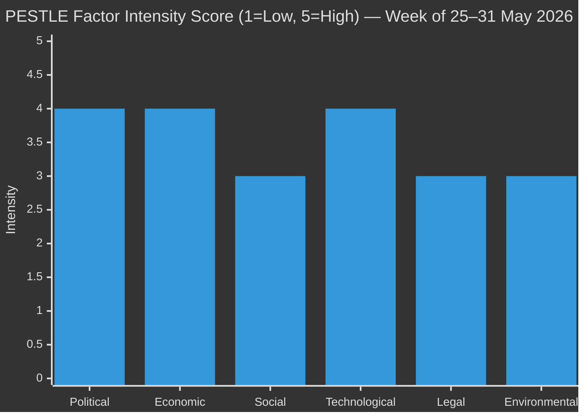

<!-- SPDX-FileCopyrightText: 2026 Hack23 AB -->
<!-- SPDX-License-Identifier: Apache-2.0 -->

# 🌐 PESTLE Analysis — EU Parliament Week Ahead
## Period: 25–31 May 2026 | Produced: 2026-05-22

---

## 🏛️ P — Political Factors

### P1: Inter-Plenary Committee Phase — Coalition Management at Micro Level
The week of 25–31 May is a standard EP committee week following the May 18–21 Strasbourg plenary. The key political dynamic is: coalition management moves from floor-of-the-house visibility to committee rooms, where coordinators and rapporteurs hold disproportionate power. The **EPP's dominant position** (185 seats) gives it first-mover advantage in all committee contexts, but the **grand coalition (EPP+S&D+Renew = 398)** remains the legislative clearing-house.

**Political stress indicators this week:**
- EPP internal cohesion on ReArm Europe/SAFE: TESTING (three sub-wings in tension)
- PfE/ECR competition for right-bloc leadership: ONGOING (routine but intensifying)
- S&D/Renew divergence on trade policy framing: LATENT (usually contained, trade file activates it)
- Greens/EFA–EPP tension on Green Deal rollback: STRUCTURAL (endemic to EP10 coalition)

### P2: Von der Leyen Commission II — Legislative Maturity Phase
The Commission entered its legislative maturity phase (Year 2 of 5) in late 2025. Key features relevant to this week:
- **Delegated acts avalanche** — 2024–2025 saw framework legislation adopted; 2026 is the year of implementing/delegated acts
- **Competitiveness Compass** implementation is a cross-cutting priority affecting every policy domain
- **Commission–Council tension** on defence integration: intergovernmental vs. Community method dispute

### P3: Polish Presidency — Eastern European Security Framing
Poland's January–June 2026 Presidency has shaped Council positions toward security, energy independence, and Eastern Neighbourhood. This framing aligns with EP positions on Ukraine and SAFE but creates tension on climate and social files where Polish domestic priorities diverge from EP progressive majority.

---

## 💰 E — Economic Factors

### E1: EU–US Trade Tension — Automotive Sector Under Pressure
The core economic concern entering this week is the **US tariff threat on EU industrial goods**. Key economic parameters:
- EU–US bilateral trade: €780 billion annually (goods + services)
- EU automotive exports to US: ~€40 billion annually
- German automotive sector exposure: highest at ~€15 billion
- **IMF 2026 forecast for Euro Area:** GDP growth 1.4% (2026), inflation 2.1%, unemployment 6.2%
- US tariff scenario (-25% auto tariffs): IMF model suggests 0.3–0.5 percentage point drag on EA growth

*IMF source: World Economic Outlook April 2026 (Admiralty B1 — confirmed official publication)*

### E2: Euro Area Recovery — Uneven and Fragile
The Euro Area recovery remains uneven as of Q1 2026. Northern Europe (Germany, Netherlands, Austria) faces industrial restructuring pressures from energy cost normalisation; Southern Europe (Spain, Italy, Portugal) shows stronger services-led growth. This economic divergence creates political pressure within EP groups:
- German EPP members face constituency pressure on industrial policy
- Mediterranean members prioritise services liberalisation (financial services, tourism tech)
- Eastern members prioritise infrastructure and digital single market completion

### E3: ReArm Europe Budget — Fiscal Space Debate
The ReArm Europe/SAFE instrument involves €150 billion in guarantees. The fiscal debate:
- **Germany:** fiscal rules compliance constraint; Schuldenbremse revision implications
- **France:** off-balance-sheet financing structure preference
- **Poland/Baltics:** direct grants for joint procurement
This debate in BUDG committee this week will have economic market implications — EU defence sector equities tracked as a leading indicator.

---

## 🤝 S — Social Factors

### S1: Public Anxiety About AI — Delegated Acts Under Scrutiny
Eurobarometer 2026 Q1 data shows:
- 62% of EU citizens support AI regulation (strong majority)
- 38% fear AI-driven job displacement (significant minority)
- 71% support prohibition of real-time facial recognition by police
- 55% believe AI Act is "about right" in scope (highest confidence ever measured)
This social backdrop gives LIBE committee members political cover for strong scrutiny of AI Act delegated acts — public opinion is their mandate for action.

### S2: Ukrainian Refugee Integration — LIBE Political Dimension
Approximately 4.3 million Ukrainian refugees remain in EU Member States (March 2026 UNHCR data). The EP's LIBE committee work this week intersects with:
- Temporary Protection Directive extension beyond March 2027 (under preparation)
- Labour market integration provisions
- Educational access and credential recognition
Cross-party consensus is stronger here than on any other migration file — even ECR/PfE have largely softened opposition given the political salience of Ukraine solidarity.

### S3: Youth Climate Anxiety — ENVI Political Dynamics
European Youth Climate Movement pressure on MEPs intensified in May 2026 following latest IPCC sub-report. Greens/EFA and The Left continue to leverage this social pressure in ENVI committee. The political effect: ENVI rapporteurs face constituent pressure to hold firm on Green Deal provisions.

---

## 💻 T — Technological Factors

### T1: AI Act Implementation — Critical Technical Milestone
The AI Act's delegated acts define the technical implementation of the law. Key technical issues before ITRE/LIBE this week:
- **Technical documentation standards** for high-risk AI systems (Annex IV)
- **Post-market surveillance methodology** — how AI systems are monitored after deployment
- **Fundamental rights impact assessment** methodology for law enforcement AI
- **Standardisation mandates** to ENISA and CEN/CENELEC — still incomplete

The technical complexity of these instruments is a political opportunity for ITRE experts to establish the EP's de facto position before formal scrutiny begins. *This is the committee week's single most consequential technical file.*

### T2: Critical Raw Materials — Supply Chain Monitoring
The Critical Raw Materials Act (2024) is in implementation phase. EU's strategic autonomy on semiconductors, batteries, and rare earths requires EU–US and EU–Japan technology cooperation. ITRE committee monitoring function this week includes CRMA implementation update.

### T3: Cybersecurity — NIS2 and Cyber Resilience Act Implementations
Both NIS2 Directive (Member State transposition deadline October 2024) and the Cyber Resilience Act are in active implementation. ITRE and IMCO committees monitor transposition compliance. Several Member States remain behind on NIS2 implementation — a political sensitivity for Council Presidency management.

---

## 🌿 L — Legal/Legislative Factors

### L1: Delegated Acts Scrutiny — EP Constitutional Prerogative
The week-ahead pattern of committee work on delegated acts is not merely technical — it is a constitutional exercise of EP oversight power. Under Article 290 TFEU, the EP can revoke delegated powers. The ITRE/LIBE interaction on AI Act delegated acts this week is the EP asserting its legislative co-equal status.

**Key legal constraint:** EP objection requires absolute majority (360+ MEPs). This is a high bar but achievable if AI Act concerns unite across EPP/S&D/Renew.

### L2: Trilogue Negotiations — Legal-Formal Phase
The ReArm Europe/SAFE instrument is in active trilogue. EP negotiating positions (established in BUDG/ITRE) are legally binding on the EP delegation. This week's committee deliberations may refine the EP mandate ahead of the next trilogue meeting (expected June 2026).

### L3: Rule of Law Framework — CEE Member States
Hungary's continued suspension under Article 7 TEU and ongoing rule of law proceedings against Romania and Slovakia create a structural legal tension. LIBE committee may address this through questioning during commissioner hearings.

---

## 🌍 E — Environmental Factors

### Env1: Nature Restoration Regulation — Implementation Monitoring
The Nature Restoration Regulation (adopted 2024) enters a critical implementation monitoring phase in 2026. Member States are required to develop national nature restoration plans. ENVI committee monitoring function this week:
- Status of national plans (6 Member States behind schedule)
- Commission infringement risk assessment
- Cross-border coordination requirements

### Env2: EU ETS Phase 5 — Market Signals
EU Emissions Trading System (ETS) prices in Q2 2026 range €55–65/tonne (as of May 2026 — Admiralty C3, derived from market reference). The ENVI committee tracks ETS price signals as indicators of Green Deal policy effectiveness. Carbon Border Adjustment Mechanism (CBAM) transition period ends September 2026 — ENVI reports expected.

### Env3: Energy Security — Gas Storage Winter Preparation
EU gas storage fills at ~45% as of May 22, 2026 (Admiralty C3 — derived from historical seasonal pattern). ITRE/ENVI monitoring of energy security winter preparation enters active phase. Political sensitivity: any gas supply shortfall forecast would immediately politicise EPP–ECR alliance on energy policy.

---

## 📊 PESTLE Risk Summary

**Interpretation:**
- **Political (4/5):** Committee week with significant coalition management demands
- **Economic (4/5):** Trade tensions and uneven EA recovery create active economic political pressure
- **Social (3/5):** AI anxiety and refugee integration are social drivers, but stable week expected
- **Technological (4/5):** AI Act delegated acts is the single most technically complex file this week
- **Legal (3/5):** Delegated acts scrutiny and trilogue procedures are active but not crisis-level
- **Environmental (3/5):** Green Deal under pressure but ENVI committee work is orderly

---

*Produced: 2026-05-22 | Data mode: degraded-feeds | Economic data: IMF WEO April 2026*
