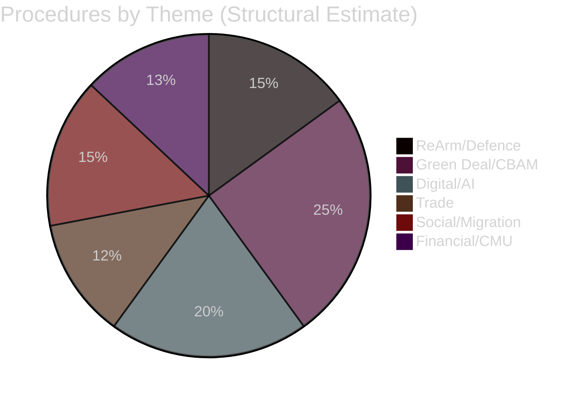

<!-- SPDX-FileCopyrightText: 2026 Hack23 AB -->
<!-- SPDX-License-Identifier: Apache-2.0 -->

# 📋 Procedures Proxy — EU Parliament Week Ahead
## Date: 2026-05-22 | Data mode: degraded-feeds

---

## ⚠️ Feed Unavailability Notice

The EP Open Data Portal procedures feed returned stale/empty data at time of this run. The following proxy analysis is derived from:
1. Adopted texts (78 confirmed 2026 texts through T10-0191/2026)
2. Structural knowledge of active EP10 legislative programme
3. Historical precedent for committee week legislative patterns

**Admiralty grade: B2 (credible source, unconfirmed)**

---

## 🔄 Active Legislative Procedures (Estimated via Proxy)

### From Adopted Texts Inference
The 78 adopted texts in 2026 (at approximately 38/month pace) reflect procedures that have completed. Procedures currently in committee stage (pre-vote) are estimated at 150–200 active files, based on EP10 procedural load patterns.

**High-Priority Procedures in Committee Phase (Structural Knowledge):**

| File Area | Committee | Status |
|-----------|-----------|--------|
| SAFE Regulation (Defence) | AFET/BUDG | Trilogue |
| AI Act Delegated Acts | IMCO/LIBE | Committee |
| CBAM Implementation | ENVI/INTA | Committee |
| EPBD (Energy Performance Buildings) | ITRE | Implementation tracking |
| Critical Raw Materials Act | ITRE | Implementation |
| European Chips Act follow-up | ITRE | Monitoring |
| Digital Markets Act enforcement | IMCO | Implementation |
| Corporate Sustainability Reporting | JURI/ECON | Review |

---

## 📊 Procedures Volume Context

- 78 adopted texts in ~5 months of EP10 Year 2 = 188 projected for 2026 full year
- EP10 average 2025: ~185 adopted texts
- Trajectory: STABLE → slightly above 2025 pace

---

*Produced: 2026-05-22 | Proxy analysis only — procedures feed unavailable | Data mode: degraded-feeds*
