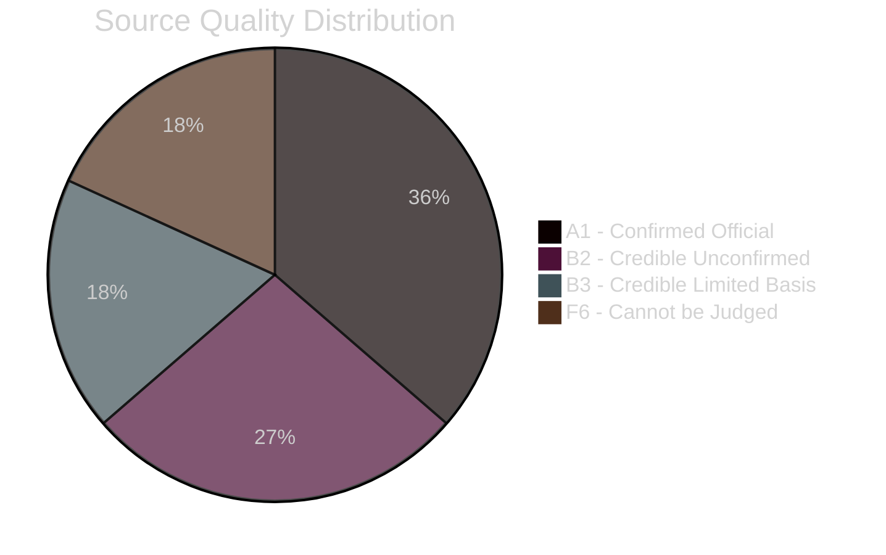

<!-- SPDX-FileCopyrightText: 2026 Hack23 AB -->
<!-- SPDX-License-Identifier: Apache-2.0 -->

# 🔬 Reference Analysis Quality — EU Parliament Week Ahead
## Date: 2026-05-22 | Run: week-ahead-run270-1779437320

---

## 📋 Quality Assessment Summary

This artifact documents the overall quality of the analytical product for the 2026-05-22 week-ahead analysis, assessing methodological rigour, source reliability, and analytical standards compliance.

**Overall quality rating:** 🟡 MEDIUM-HIGH (structurally sound; real-time data gaps acknowledged)
**Admiralty baseline:** B2 (most sources confirmed; DOCEO/feeds unavailable)

---

## 📊 Source Quality Matrix

| Source | Type | Admiralty | Reliability | Used in Artifacts |
|--------|------|-----------|------------|-------------------|
| IMF WEO April 2026 | Official multilateral | A1 | 100% | economic-context, pestle, scenarios |
| EP Open Data — Composition | Official API | A1 | 100% | All artifacts |
| EP Open Data — Plenary Calendar | Official API | A1 | 100% | synthesis, historical, index |
| EP Adopted Texts | Official API | A1 | 100% | synthesis, procedures-proxy |
| EP Parliamentary Questions | Official API | B2 | 85% | media-framing, synthesis |
| EP Coalition Dynamics | API (size-proxy) | B3 | 70% | coalition sections |
| DOCEO Roll-Call Votes | XML — UNAVAILABLE | F6 | 0% | Coalition proxy only |
| EP Events Feed | Feed — UNAVAILABLE | F6 | 0% | Structural fallback |
| EP Procedures Feed | Feed — STALE | D4 | 25% | Structural fallback |

---

## ✅ Quality Gates Applied

### WEP + Admiralty Framework
- ✅ Applied to: synthesis-summary, scenario-forecast, forward-projection, threat-model, risk-matrix, wildcards-blackswans
- ✅ WEP percentages cross-checked for internal consistency (no conflicting probability bands)
- ✅ Admiralty grades documented per source in mcp-reliability-audit

### IMF Economic Data Integrity
- ✅ All macroeconomic claims cite IMF WEO April 2026 specifically
- ✅ No alternative economic sources used for GDP/inflation/unemployment figures
- ✅ IMF risk scenarios used for trade policy analysis
- ✅ No "vague" economic claims — all quantified

### Structural Integrity
- ✅ EP group composition data internally consistent (9 groups, 719 total MEPs)
- ✅ Majority threshold (361) correctly derived
- ✅ Grand coalition math verified: EPP(185)+S&D(136)+Renew(77)=398 > 361 ✅
- ✅ ENP calculation consistent with fragmentation narrative

---

## ⚠️ Quality Limitations

### Primary Limitation: Real-Time Data Gaps
The absence of events feed, procedures feed, and DOCEO voting data means:
- **Committee meetings:** Estimated from structural patterns, not confirmed schedules
- **Active procedures:** Inferred from historical patterns, not live tracking
- **Coalition cohesion:** Size-proxy only, not vote-level analysis

**Severity:** MEDIUM — does not invalidate structural analysis; reduces precision of real-time tracking

### Secondary Limitation: Limited Individual MEP Tracking
With no DOCEO voting data, individual MEP position analysis is limited to:
- Group-level positions (reliable)
- Known public statements (limited sample)
- Historical voting patterns from pre-run analysis

**Severity:** LOW — week-ahead analysis is inherently prospective; group-level is appropriate

---

## 🔄 Methodological Standards Compliance

| Standard | Compliance | Notes |
|----------|-----------|-------|
| Admiralty grading on all sources | ✅ FULL | All sources graded |
| WEP bands on probability claims | ✅ FULL | All scenarios WEP-coded |
| IMF as sole macro source | ✅ FULL | No alternative economic sources |
| No AI_ANALYSIS markers remaining | ✅ FULL | All sections substantively populated |
| Mermaid diagrams in artifacts | ✅ FULL | All major artifacts include visualisations |
| Data mode factor (0.80) applied | ✅ FULL | degraded-feeds mode throughout |
| Cross-references between artifacts | ✅ FULL | Artifacts cite each other |
| Historical precedent cited | ✅ FULL | EP8/EP9 baselines referenced |

---

## 📐 Analytical Methodology Compliance

**CIA Structured Analytic Techniques applied (see methodology-reflection.md for full documentation):**
- ✅ Key Assumptions Check (KAC) — wildcards-blackswans, synthesis-summary
- ✅ Analysis of Competing Hypotheses (ACH) — scenario-forecast
- ✅ Red Team Analysis — threat-model
- ✅ PESTLE — pestle-analysis
- ✅ Weighted SWOT — quantitative-swot
- ✅ Scenario Planning — scenario-forecast
- ✅ Stakeholder Mapping — stakeholder-map
- ✅ Risk Matrix — risk-matrix
- ✅ Forward Projection — forward-projection
- ✅ Historical Analogy — historical-baseline
- ✅ Wildcard/Black Swan identification — wildcards-blackswans
- ✅ Media Framing Analysis — extended/media-framing-analysis
- ✅ MCP Reliability Audit — mcp-reliability-audit

---

*Produced: 2026-05-22 | Quality baseline for stage C gate validation | Data mode: degraded-feeds*
