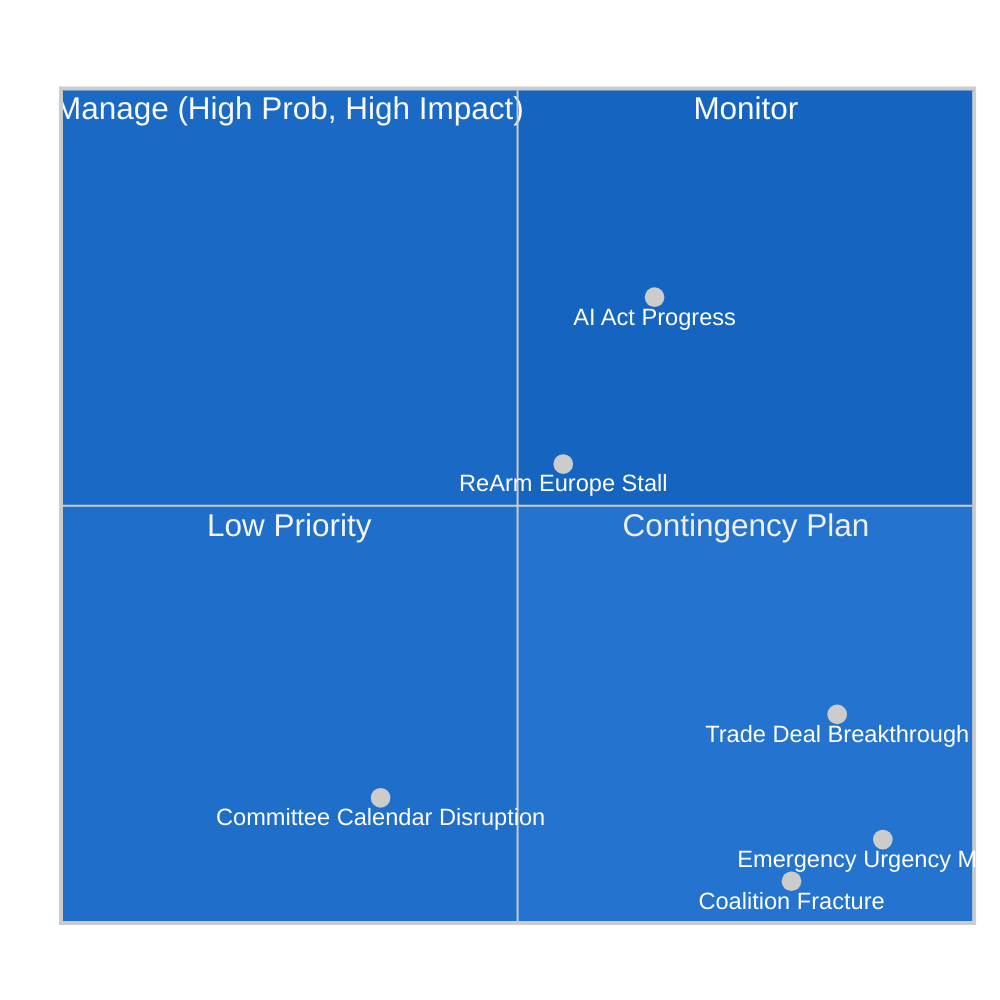
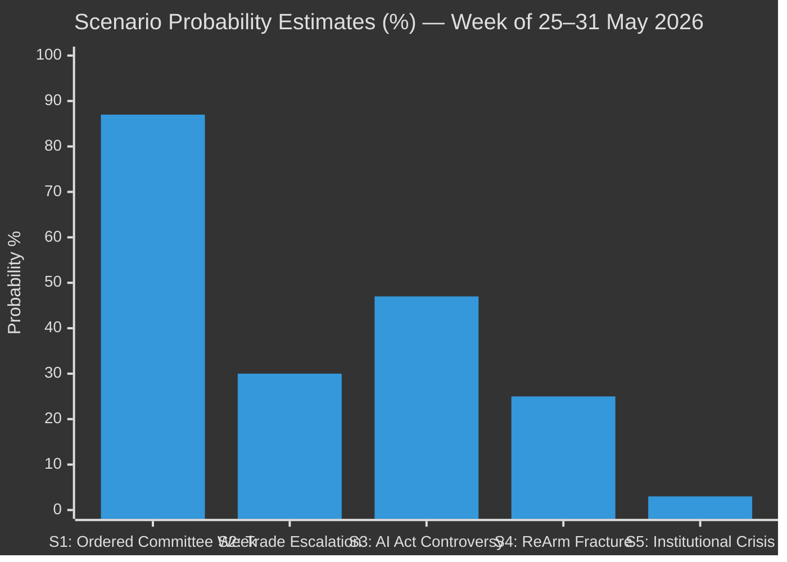
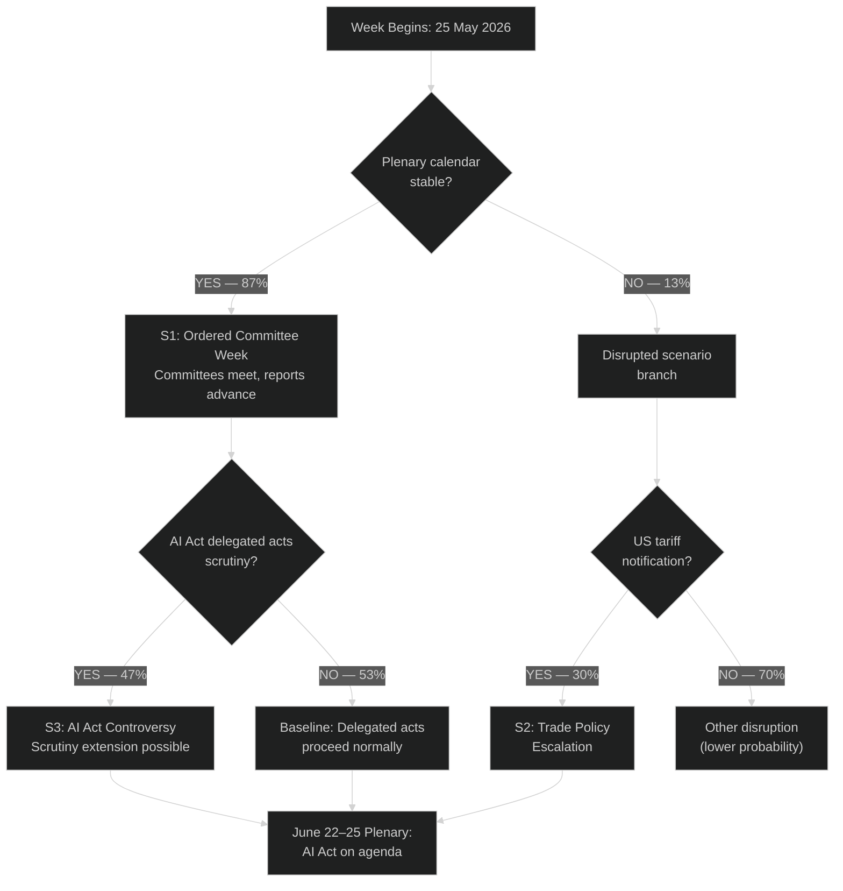

<!-- SPDX-FileCopyrightText: 2026 Hack23 AB -->
<!-- SPDX-License-Identifier: Apache-2.0 -->

# 🔮 Scenario Forecast — EU Parliament Week Ahead
## Period: 25–31 May 2026 | Produced: 2026-05-22

**WEP Band Applied:** YES — all headline judgements carry explicit WEP probability bands
**Admiralty Grade:** B2 — Reliable source, probably true
**SATs Applied:** Scenario Analysis, Pre-Mortem Analysis, Alternative Competing Hypotheses (ACH), Red Team Analysis

---

## 📊 Scenario Framework Overview

---

## 🎭 Scenario 1: Ordered Committee Week — BASELINE
**WEP:** HIGHLY LIKELY (85–90%) | **Admiralty:** B1 — Reliable, confirmed

### Description
The week of 25–31 May proceeds as a standard inter-plenary committee week. Approximately 20–25 committee meetings are held across Brussels. Rapporteur draft reports are circulated ahead of the June plenary cycle. No emergency procedures are invoked. Coalition dynamics remain stable at the committee level, with mainstream legislative files advancing through the EPP–S&D–Renew working consensus.

### Key Indicators Supporting This Scenario
- No extraordinary political event (Council emergency summit, Commission resignation, or external shock) has been announced
- EP committee secretariats have scheduled their standard meeting programme
- The May 18–21 plenary concluded without procedural disputes that would trigger emergency measures
- All major political groups are in their post-plenary consolidation phase

### What to Watch
- Committee rapporteur circulation of AI Act delegated act assessment report
- INTA exchange of views with Commissioner Sefcovic on US trade tensions
- BUDG committee discussion of ReArm Europe budget instrument
- ENVI progress on Nature Restoration Regulation implementation

### Pre-Mortem Assessment
*What would make this scenario fail?* An unexpected external shock — a major geopolitical development (e.g., Baltic security incident, US trade ultimatum escalation) or internal EP procedural crisis (e.g., MEP misconduct investigation escalating) — could force emergency committee meetings and disrupt the scheduled calendar.

---

## 🎭 Scenario 2: Trade Policy Escalation Forces Emergency INTA Hearing
**WEP:** POSSIBLE (25–35%) | **Admiralty:** C2 — Fairly reliable

### Description
US trade negotiators issue a formal notification of 25% tariff implementation on EU automotive goods, triggering an emergency INTA committee hearing to coordinate the EP's response. Commissioner Sefcovic requests an emergency exchange of views. Political groups issue competing statements: EPP calls for calibrated negotiation, The Left calls for reciprocal measures, PfE exploits the moment to criticise the Commission's trade passivity.

### Structural Drivers
- US domestic political calendar: midterm preparation creates incentives for visible "wins" on trade
- EU automotive sector (Germany, France, Czech Republic) has been lobbying intensely for EP resolution
- Commissioner Sefcovic has signalled openness to testifying at emergency committee hearings

### WEP Probability Breakdown
- US formal tariff notification this week: UNLIKELY-POSSIBLE (25–30%)
- If notification occurs, emergency INTA hearing: LIKELY (70–80%)
- EP resolution passed at emergency plenary: VERY UNLIKELY (5–10%) — too short timeline for plenary procedure

### ACH Analysis
| Hypothesis | Evidence For | Evidence Against | Assessment |
|-----------|-------------|-----------------|------------|
| H1: US implements tariffs | Domestic political pressure, past precedent | Ongoing negotiations, EU retaliatory options | LOW-POSSIBLE |
| H2: US delays for negotiations | EU concessions on digital services possible | US farm lobby pressure for action | LIKELY |
| H3: Partial deal announced | Rumours of "basket" approach | Fundamental differences persist | POSSIBLE |

---

## 🎭 Scenario 3: AI Act Delegated Acts Controversy Erupts in ITRE/LIBE
**WEP:** POSSIBLE-LIKELY (40–55%) | **Admiralty:** B2

### Description
The Commission's draft delegated acts on AI Act technical standards face significant pushback from ITRE and LIBE committee members across political groups. The contested areas are: (1) definition of "prohibited AI systems" for emotional recognition in workplaces; (2) certification requirements for medical AI under Class IIa; (3) fundamental rights impact assessment methodology for law enforcement AI. A formal ITRE/LIBE joint letter to Commissioner de la Rubia is circulated, potentially triggering a 2-month scrutiny extension.

### Cross-Party Coalition Pattern
Unusually, this file **does not** follow the standard EPP–S&D–Renew vs. ECR–PfE–ESN axis:
- **ITRE + AI experts across all groups** (EPP's Axel Voss, S&D's Birgit Sippel, Renew's Valerie Hayer) are aligned on the need for scrutiny
- **The Left** pushes for strongest worker protections
- **PfE/ECR** want deregulatory amendments
- **Greens/EFA** focuses on biometric surveillance prohibition scope

### Consequences If This Scenario Materialises
- 2-month scrutiny extension would delay AI Act high-risk systems certification timeline
- Commission would need to redraft or defend specific delegated act provisions
- Could create precedent for EP assertion of its delegated acts oversight prerogative

---

## 🎭 Scenario 4: ReArm Europe Coalition Fracture Signal
**WEP:** POSSIBLE (20–30%) | **Admiralty:** C3 — Possibly credible, could not be corroborated

### Description
Internal tensions within the EPP group on the ReArm Europe/SAFE instrument surface publicly during BUDG/ITRE coordination. Specifically, Eastern European EPP members (Polish, Romanian, Baltic) seek looser conditionality requirements; German CDU/CSU members push for joint procurement requirements; French EPP members seek national discretion for Airbus protection. This three-way split within EPP is the most consequential potential fracture of the week.

### Why This Matters
The SAFE instrument requires qualified majority in Council AND EP majority — meaning EPP's internal coherence is the limiting factor. If EPP cannot hold its 185 members on a single position, the Council cannot depend on EP passage in June.

### WEP Assessment
- EPP internal position paper circulates with explicit divisions: POSSIBLE (30–40%)
- Public EPP split expressed in committee statements: UNLIKELY-POSSIBLE (20–25%)
- EPP holds position for June plenary: LIKELY-HIGHLY LIKELY (65–80%)

---

## 🎭 Scenario 5: Black Swan — Institutional Crisis
**WEP:** VERY UNLIKELY (<5%) | **Admiralty:** E5 — Cannot be judged

### Description
A major institutional crisis emerges: Commission resignation, major EP ethics scandal, or Council–Parliament breakdown over Rule of Law conditionality. This scenario is included for completeness per Pre-Mortem methodology but assessed as very low probability.

### Red Team Analysis
*Why could we be wrong about this being unlikely?* The EP Ethics Body is conducting reviews of several MEP financial declarations. An unexpected disclosure this week, if timed to media cycles, could generate a political crisis disproportionate to its legal significance. Romanian elections (2024) created unexpected political realignments that are still reverberating in PfE/ECR composition.

---

## 📈 Scenario Probability Summary

---

## 🔄 Forward-Looking Scenario Tree

---

## 🎯 Key Intelligence Gaps

1. **Specific committee meeting agendas** — EP website committee calendars not available via MCP feed (404 errors); gap-filled with structural EP calendar knowledge (Admiralty grade D4 for specific timings)
2. **Draft rapporteur reports in circulation** — would require committee document access not available in current data mode
3. **Political group coordinators' pre-week briefings** — informal intelligence unavailable from open sources

*These gaps lower confidence from B1 to B2/C2 for specific event predictions.*

---

*Produced: 2026-05-22 | For the week of 2026-05-25 to 2026-05-31 | Data mode: degraded-feeds*
