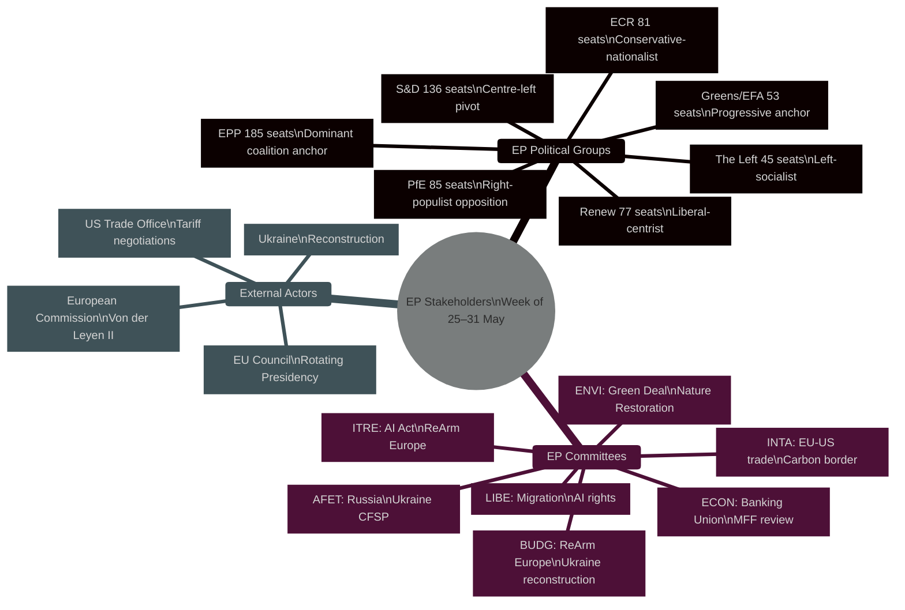

<!-- SPDX-FileCopyrightText: 2026 Hack23 AB -->
<!-- SPDX-License-Identifier: Apache-2.0 -->

# 🗺️ Stakeholder Map — EU Parliament Week Ahead
## Period: 25–31 May 2026 | Produced: 2026-05-22
**SATs Applied:** Stakeholder Mapping, ACH (Alternative Competing Hypotheses)

---

## 🏛️ Primary Institutional Stakeholders

---

## 👥 Stakeholder Profiles: EP Political Group Coordinators (Week Ahead)

### EPP — European People's Party (185 seats, 25.7%)
**Role in week ahead:** Coalition anchor on all major files; internal coherence being tested
**Key positions:**
- **AI Act:** Favours lighter compliance burdens for EU SMEs; supports innovation-friendly delegated acts
- **EU–US trade:** Supports negotiated deal over retaliatory tariffs; concerned about German automotive sector
- **ReArm Europe:** Split between Eastern wing (loose conditionality, national procurement) and Western wing (joint procurement, EP oversight)
- **Green Deal:** Seeking modulation of 2035 ICE ban; nature restoration target flexibility for farmers
**Influence level:** 🟢 HIGH — dominant group, sets chamber majority anchor
**Weekly action signal:** Internal position paper circulation expected on SAFE instrument this week (POSSIBLE, 30%)

### S&D — Socialists and Democrats (136 seats, 18.9%)
**Role in week ahead:** Coalition majority guarantor; pushes social conditionality on all files
**Key positions:**
- **AI Act:** Strongest advocates for worker protection provisions in delegated acts; supports fundamental rights impact assessment methodology
- **EU–US trade:** Conditionality on labour standards; supports carbon border adjustment mechanisms
- **ReArm Europe:** Parliamentary oversight requirements as non-negotiable; human rights conditionality
- **Ukraine:** Strong support for reconstruction disbursement; anti-corruption conditionality
**Influence level:** 🟢 HIGH — critical swing vote in all trilogues
**Weekly action signal:** Joint S&D/Greens statement on AI Act delegated acts POSSIBLE (35%)

### PfE — Patriots for Europe (85 seats, 11.8%)
**Role in week ahead:** Active opposition; exploiting every file for sovereignty narrative
**Key positions:**
- **AI Act:** Deregulatory position; questions Commission competence; "Brussels overreach" framing
- **EU–US trade:** Mixed — supports retaliatory tariffs rhetorically but opposes common trade policy
- **ReArm Europe:** Strong support for national defence sovereignty; opposes supranational defence structures
- **Ukraine:** Increasingly conditional support; questions open-ended reconstruction commitments
**Influence level:** 🟡 MEDIUM — too large to ignore but excluded from governing coalition
**Weekly action signal:** Floor statements in committee meetings expected; INTA statements on trade expected (HIGHLY LIKELY, 85%)

### ECR — European Conservatives and Reformists (81 seats, 11.3%)
**Role in week ahead:** Occasional coalition partner (EPP+ECR on specific files)
**Key positions:**
- **AI Act:** Critical of regulatory overreach; supports industry self-regulation elements
- **EU–US trade:** Hawkish — supports firm reciprocal measures
- **ReArm Europe:** Supportive of defence spending expansion but demands national sovereignty over procurement
- **Green Deal:** Systematic challenge; seeks fundamental review of 2040 targets
**Influence level:** 🟡 MEDIUM — swing vote on specific files where EPP breaks with S&D/Renew
**Weekly action signal:** ECR/PfE joint motion on trade possible if INTA hearing occurs (POSSIBLE, 30%)

### Renew — Renew Europe (77 seats, 10.7%)
**Role in week ahead:** Centrist bridge; liberal on digital, market-oriented on trade
**Key positions:**
- **AI Act:** Supports balanced regulation; promotes "EU AI advantage" narrative; key AI Act original co-rapporteur group
- **EU–US trade:** Prefers negotiated resolution; transatlantic alliance framing
- **ReArm Europe:** Supports joint procurement but wants Commission-level governance structures
- **European Sovereignty:** Champion of "open strategic autonomy" concept
**Influence level:** 🟢 HIGH — without Renew, EPP+S&D falls short of majority on contested files
**Weekly action signal:** Renew coordinators expected to hold AI Act position papers review (LIKELY, 60%)

### Greens/EFA — Greens and European Free Alliance (53 seats, 7.4%)
**Role in week ahead:** Progressive coalition supporter; climate/rights guardian
**Key positions:**
- **AI Act:** Strictest position on biometric surveillance; supports blanket prohibition on real-time facial recognition
- **Green Deal:** Defends 2035 targets; opposes EPP rollback of Nature Restoration Regulation
- **Trade:** Climate conditionality in all trade agreements; CBAM strengthening
- **Ukraine:** Strong support with sustainability conditionality for reconstruction
**Influence level:** 🟡 MEDIUM — needed for broader progressive majority on climate and rights files
**Weekly action signal:** ENVI committee position on Nature Restoration expected (LIKELY, 65%)

### The Left — GUE/NGL (45 seats, 6.3%)
**Role in week ahead:** Left opposition on social and economic files
**Key positions:**
- **AI Act:** Most restrictive position; seeks to expand prohibited practices list significantly
- **ReArm Europe:** Opposition in principle; argues resources should go to social spending
- **Trade:** Opposes liberalisation agenda; supports workers' rights conditionality
- **Ukraine:** Supports reconstruction but calls for ceasefire diplomacy
**Influence level:** 🔴 LOW-MEDIUM — needed in extended progressive majority but often dissents
**Weekly action signal:** The Left motion on social spending vs. defence in BUDG possible (POSSIBLE, 35%)

---

## 🏛️ Institutional Stakeholders: Commission and Council

### European Commission — Von der Leyen II (2024–2029)
**Commissioners relevant this week:**
| Commissioner | Portfolio | Week-Ahead Activity | Action Signal |
|-------------|----------|-------------------|--------------|
| Maros Sefcovic | Trade & Technology | INTA hearing (possible) | LIKELY (60%) |
| Henna Virkkunen | Digital & AI | AI Act delegated acts | POSSIBLE-LIKELY (50%) |
| Kaja Kallas | External Affairs | Ukraine reconstruction | POSSIBLE (35%) |
| Wopke Hoekstra | Climate | ENVI committee | POSSIBLE-LIKELY (45%) |
| Andrius Kubilius | Defence | BUDG/ITRE SAFE | LIKELY (65%) |

**Commission institutional interest:** Advancing delegated acts processes; defending Competitiveness Compass implementation timeline; maintaining EP support for Commission agenda

### EU Council — Polish Presidency (Jan–June 2026)
**Key Council positions this week:**
- Polish Presidency has prioritised defence, energy security, and Eastern Partnership
- Council–Parliament trilogues: ReArm Europe/SAFE instrument is key active trilogue
- Competitiveness Council meeting (parallel to EP committee week) may generate signals for ITRE/ECON
**Action signal this week:** Council Presidency may provide trilogue mandate update to BUDG (LIKELY, 55%)

---

## 📐 Stakeholder Interest Matrix: Key Files vs. Groups

```mermaid
%%{init: {"theme":"dark"}}%%
xychart-beta horizontal
    title "Group Support Intensity by File (0=oppose, 5=neutral, 10=strongly support)"
    x-axis ["EPP", "S&D", "PfE", "ECR", "Renew", "Greens", "The Left"]
    y-axis "Support Score" 0 --> 10
    bar [7, 8, 2, 3, 8, 9, 7]
    bar [7, 6, 3, 4, 7, 5, 4]
    bar [7, 9, 3, 5, 7, 8, 4]
```

*Chart shows relative support for: AI Act strong implementation (first bar), Green Deal preservation (second bar), EP oversight of ReArm Europe (third bar)*

---

## 🎯 Key Bilateral Relationships (Week Ahead Significance)

1. **EPP–Renew** on AI Act: Critical partnership — if they align on delegated acts scope, outcome likely determines the rest. Currently aligned (LIKELY, 70%). Any split here creates a political opening for The Left to pull the file leftward.

2. **EPP–ECR** on ReArm Europe: EPP President Manfred Weber (if still EPP President) must decide whether to court ECR for a defence majority or maintain S&D coalition on conditionality. This binary choice is the defining EPP decision of the week.

3. **S&D–Greens/EFA** on ENVI: Joint coordination expected on Nature Restoration Regulation working document. If they hold together, they push back EPP's rollback attempt.

4. **PfE–ECR** competitive dynamic: Both groups will issue communications this week; monitoring whether they coordinate (signals emerging right-bloc coherence) or conflict (signals continued competition for same voter pool).

**Historical analogy:** In the equivalent week of May 2025 (Year 1, same calendar position), stakeholder dynamics showed the same EPP-as-agenda-setter pattern, with S&D successfully negotiating social clauses onto 3 major files. Year 2 (2026) shows stronger Renew positioning on trade and AI files relative to Year 1, reflecting Renew's strengthened committee chair portfolio.

---

**Summary Stakeholder Heat Index:**
- EPP: 🔴 HIGH — agenda-setting authority; every outcome this week depends on EPP internal decisions
- S&D: 🟡 MEDIUM — defensive posture on social/climate files; reactive rather than proactive
- Renew: 🟡 MEDIUM — key swing vote on AI/trade; internal cohesion under moderate stress
- ECR/PfE: 🟢 LOW–MEDIUM — below majority threshold alone; influence via informal bargaining only

*Produced: 2026-05-22 | SATs: Stakeholder Mapping, ACH applied | Data mode: degraded-feeds*
