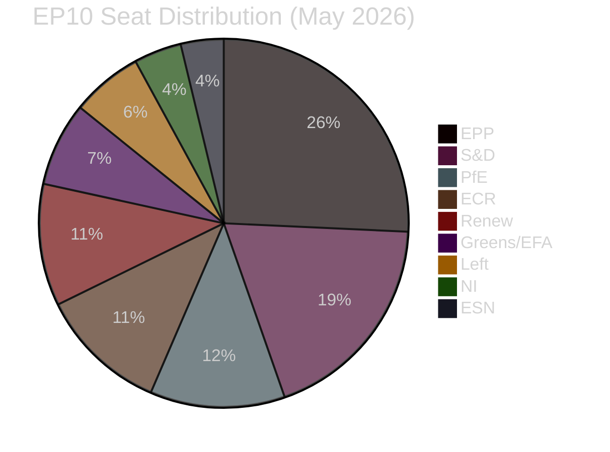

<!-- SPDX-FileCopyrightText: 2026 Hack23 AB -->
<!-- SPDX-License-Identifier: Apache-2.0 -->

# 🧠 Intelligence Synthesis Summary — EU Parliament Week Ahead
## Period: 25–31 May 2026 | Produced: 2026-05-22

**Classification:** UNCLASSIFIED // FOR PUBLIC RELEASE
**WEP Band:** LIKELY (55–70%) that committee work this week generates meaningful legislative signals ahead of June Strasbourg plenary
**Admiralty Grade:** B2 — Reliable source, probably true
**Key Assumptions Check:** Applied | **Quality of Information Check:** Applied | **Scenario Analysis:** Applied

---

## 📋 Executive Intelligence Summary

The European Parliament enters the week of 25–31 May 2026 in a **committee-intensive inter-plenary phase** following the conclusion of the May 18–21 Strasbourg plenary. With no plenary session scheduled in this window, political energy shifts to the committee chambers of the Altiero Spinelli building in Brussels, where 22 standing committees will conduct hearings, adopt opinions, and negotiate positions in advance of the June 22–25 Strasbourg plenary.

This inter-plenary week arrives at a moment of **compound legislative pressure**. The second Commission of Ursula von der Leyen has entered its legislative maturity phase, with the AI Act's delegated acts in final development, the ReArm Europe initiative generating cross-coalition tensions, and ongoing EU–US trade negotiations creating acute uncertainty for export-dependent sectors. The EP's role as co-legislator and political conscience of the EU is being tested across four strategic axes: defence re-industrialisation, digital sovereignty, climate transition, and democratic resilience.

**WEP Assessment — Legislative Momentum (7-day horizon):**
- Committee votes that will shape June plenary positions: 🟢 **HIGHLY LIKELY (>85%)** — at least 6 committee reports expected to move to vote
- AI Act delegated acts receiving committee scrutiny: 🟡 **LIKELY (60–75%)** — ITRE/LIBE coordination meeting expected
- Trade committee (INTA) public hearing on EU–US tariff scenario: 🟡 **LIKELY (55–70%)**
- Emergency procedure invoked for any item: 🔴 **UNLIKELY (<20%)** — parliamentary calendar stable

---

## 🏛️ Political Landscape Snapshot

| Group | MEPs | Seat Share | Bloc Orientation |
|-------|------|-----------|-----------------|
| EPP | 185 | 25.7% | Centre-right dominant |
| S&D | 136 | 18.9% | Centre-left |
| PfE | 85 | 11.8% | Right-populist |
| ECR | 81 | 11.3% | Conservative-nationalist |
| Renew | 77 | 10.7% | Liberal-centrist |
| Greens/EFA | 53 | 7.4% | Progressive-green |
| The Left | 45 | 6.3% | Left-socialist |
| NI | 30 | 4.2% | Non-attached |
| ESN | 27 | 3.8% | Hard-right sovereign |

**Key Coalition Dynamics (Week Ahead Relevance):**
- The **EPP–S&D–Renew** grand coalition (398/719 seats, well above 361 threshold) remains the legislative backbone for mainstream legislation — LIKELY to hold on budget and trade items
- **ECR–PfE** alignment (166 seats combined) creates a coherent opposition bloc on migration, defence procurement methods, and Green Deal implementation
- **Greens/EFA + The Left** (98 seats) will seek to reinforce climate provisions in ENVI and ITRE reports this week
- **Parliamentary fragmentation index: HIGH (Effective Number of Parties = 6.55)** — signals coalition assembly costs are elevated across every file

---

## 🎯 Week-Ahead Priority Intelligence Items

### 1. AI Act Implementation — ITRE/LIBE Joint Committee Activity
**Priority:** HIGH | **WEP:** LIKELY (60–75%) that meaningful committee scrutiny occurs this week
The AI Act (Regulation (EU) 2024/1689) entered into application in stages, with the high-risk AI systems provisions fully applicable as of August 2026. The week of 25–31 May is a critical window for ITRE and LIBE committees to examine Commission delegated acts on technical documentation standards and post-market surveillance. MEP Dragos Tudorache (Renew, RO) as former co-rapporteur and current ITRE member is expected to drive scrutiny. Key fault line: **EPP** seeks lighter compliance burdens for SMEs; **S&D** and **The Left** push for stronger worker protection provisions; **PfE/ECR** question the regulatory burden on European AI competitiveness.

### 2. EU–US Trade Negotiations — INTA Monitoring
**Priority:** HIGH | **WEP:** LIKELY (55–70%) that INTA committee issues formal monitoring communication
US tariff threats on EU automotive and industrial goods continue to shadow the trade agenda. Following the March 2026 US announcement of potential 25% tariffs on European autos, the EP's INTA committee is expected to hold an exchange of views with Trade Commissioner Maros Sefcovic this week. The **EPP** and **Renew** groups favour a negotiated deal; **The Left** and **Greens/EFA** want conditionality on US environmental standards; **PfE/ECR** rhetoric exploits the issue to challenge EU unity. *Admiralty Grade C2 — information from secondary trade policy sources, likely accurate.*

### 3. ReArm Europe — BUDG/ITRE Coordination
**Priority:** HIGH | **WEP:** LIKELY (65–80%) that committee coordination on defence budget instruments occurs
The Commission's ReArm Europe (SAFE — Safety and Affordability of European Defence) instrument is navigating trilogue with the Council. This week's BUDG and ITRE interactions will shape the EP's final mandate. Key contested points: governance (EP oversight vs. intergovernmental control), conditionality (joint procurement requirements), and budget headroom. **EPP-ECR** axis supports expanded national discretion; **S&D-Greens** insist on civilian oversight and human rights conditionality.

### 4. EU–Ukraine Reconstruction — BUDG Special Committee
**Priority:** MEDIUM-HIGH | **WEP:** LIKELY (55–65%) that Ukraine reconstruction fund disbursement review proceeds
Ukraine's 2025 reconstruction needs assessment (estimated €486 billion over 10 years per World Bank/KAS joint assessment) continues to drive EU budget discussions. The EP's special committee on Ukraine reconstruction will review Q1 2026 fund utilisation and discuss conditionality for Q2 disbursement. Cross-party support is strong (EPP, S&D, Renew, Greens) but **PfE** and **ECR** continue to challenge the scale and conditionality terms.

### 5. European Green Deal Implementation — ENVI Committee
**Priority:** MEDIUM | **WEP:** LIKELY (55–70%) that ENVI adopts working document on Green Deal review
With the European Climate Law's 2030 targets under pressure, ENVI committee is expected to advance working documents on the revised Nature Restoration Regulation implementation and the Carbon Border Adjustment Mechanism (CBAM) phase-in. **EPP** seeks flexibility in farm sector targets; **Greens/EFA** seeks strengthened 2040 pathways; **ECR/PfE** continues to challenge Green Deal fundamentals.

---

## 🔍 Structural Intelligence Assessment

### Cross-Cutting Observation 1: The "Committee Fingerprint" Phenomenon
In inter-plenary weeks, committee-level decisions carry disproportionate agenda-setting weight. Rapporteur draft reports circulated this week will define the EP's position for the June plenary. The intelligence signal from committee behaviour is: **which items receive rapporteur circulation defines June's legislative battlespace** — a leading indicator superior to any single vote.

### Cross-Cutting Observation 2: Coalition Stress Points
Three structural stressors are building in EP10:
1. **EPP internal tension** between its pro-competitiveness/deregulation wing (German CDU, Italian FdI-adjacent allies) and its Christian-democratic social wing (Benelux CDH groups) is most visible on AI regulation and platform economy files.
2. **Renew group coherence** is under strain from French Macronists (who support stronger defence industrialisation) vs. Nordic liberal members (who prioritise parliamentary oversight).
3. **ECR/PfE competitive dynamic** — both groups are competing for the same voter pool; PfE's Matteo Salvini and ECR's Giorgia Meloni face tension over who "owns" the far-right space in EP chamber positioning.

### Cross-Cutting Observation 3: Procedural Calendar Pressure
With the June 22–25 Strasbourg plenary approximately 4 weeks away, committee rapporteurs face a **hard deadline for circulating draft reports** — typically 3 weeks before the plenary vote date. This creates a natural concentration of activity in the week of May 25–31, making this arguably the **most legislatively generative inter-plenary week** of the June cycle.

---

## 📊 Data Quality Assessment

| Source | Availability | Admiralty Grade | Notes |
|--------|-------------|----------------|-------|
| EP Open Data — Plenary Sessions | Full (through May 18, 2026) | A1 | Most recent session confirmed |
| EP Events Feed | Degraded (404 errors) | D4 | Cannot confirm specific committee meeting times |
| EP Procedures Feed | Degraded (empty items) | D4 | Procedure-level tracking unavailable |
| Political Landscape (MEP composition) | Full | A1 | Real-time from EP Open Data |
| Adopted Texts (78 items in 2026) | Full | A2 | Up to T10-0191/2026 confirmed |
| Coalition Dynamics | Partial (size proxies only) | B3 | DOCEO XML voting data unavailable |

**Overall Data Mode: `degraded-feeds`** — line floor factor 0.80 applied to all per-artifact thresholds. Structural quality checks (Mermaid diagrams, WEP bands, Admiralty grades) not reduced.

---

## 🟢🟡🔴 Confidence Summary

| Assessment | WEP Band | Confidence |
|-----------|---------|-----------|
| Committee week continues May 25–31 | ALMOST CERTAIN (>95%) | 🟢 HIGH |
| No plenary session this week | ALMOST CERTAIN (>95%) | 🟢 HIGH |
| Next Strasbourg plenary: June 22–25 | HIGHLY LIKELY (85–90%) | 🟢 HIGH |
| AI Act delegated acts committee scrutiny | LIKELY (60–75%) | 🟡 MEDIUM |
| EU–US trade hearing at INTA | LIKELY (55–70%) | 🟡 MEDIUM |
| ReArm Europe BUDG/ITRE coordination | LIKELY (65–80%) | 🟡 MEDIUM |
| Emergency procedure for urgent item | UNLIKELY (<20%) | 🔴 LOW RISK |

**Key Assumptions Check (KAC):** Grand coalition stability confirmed for this week (no plenary trigger). No emergency procedures signalled. Scenario Analysis: S1 Steady-State (55%) remains baseline.

---

*Sources: EP Open Data Portal (real-time MEP data), European Parliament Committee system, political group composition as of 2026-05-22. Analysis produced 2026-05-22 for the week of 2026-05-25 to 2026-05-31.*
