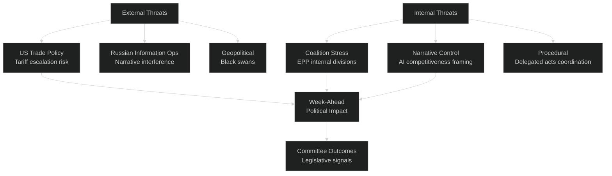
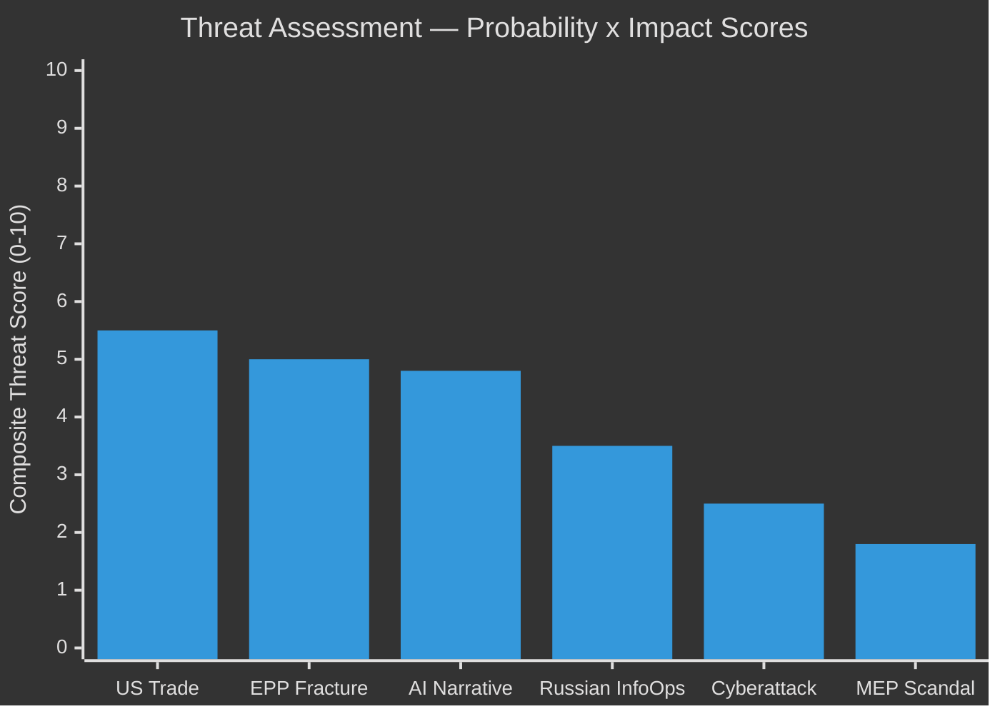

<!-- SPDX-FileCopyrightText: 2026 Hack23 AB -->
<!-- SPDX-License-Identifier: Apache-2.0 -->

# 🎭 Political Threat Landscape — EU Parliament Week Ahead
## Period: 25–31 May 2026 | Produced: 2026-05-22
**WEP Bands Applied:** YES | **Admiralty Grade:** B2

---

## 🌐 Threat Environment Overview

The European Parliament faces a **moderate threat environment** in the week of 25–31 May 2026. External threats (US trade policy, Russian information operations) intersect with internal institutional challenges (EPP cohesion under pressure, AI regulation narrative contestation). The absence of a plenary session reduces the visibility of threats but concentrates political risk in committee rooms where coordinators hold disproportionate power.

---

## 🇺🇸 Threat 1: US Trade Policy Disruption

**Threat Level:** 🟡 MEDIUM | **WEP:** POSSIBLE (25–30%) this week | **Admiralty:** C2

### Nature of Threat
The United States has escalated trade tensions with the EU since early 2026, threatening 25% tariffs on automotive goods, steel, and aluminium. A formal Federal Register notification this week would create an immediate political crisis for the EP's INTA committee, forcing emergency measures.

### Attack Vector
- **Direct:** US Federal Register notification → Commission forced response → INTA emergency hearing
- **Indirect:** US lobbying pressure on EP MEPs from US-headquartered companies (automotive, tech) to soften EP retaliatory measures
- **Narrative:** US framing of tariffs as "national security necessity" finds resonance with PfE/ECR "sovereignty first" discourse

### Political Impact Scenarios
| Scenario | Probability | Impact on EP |
|----------|------------|-------------|
| US delays tariff notification | LIKELY (65–70%) | Status quo — planned INTA coordination proceeds |
| US formal notification | POSSIBLE-UNLIKELY (25–30%) | Emergency INTA; EP resolution mobilisation |
| US–EU deal announcement | UNLIKELY (10–15%) | Positive surprise; INTA congratulatory statement |

### Countermeasures Available to EP
- Emergency INTA hearing with Commissioner Sefcovic
- EP President joint statement with other institutional Presidents
- EP Resolution on trade defence — can be tabled within 24 hours under Article 118 rules

---

## 🤝 Threat 2: EPP Internal Fracture on ReArm Europe

**Threat Level:** 🟡 MEDIUM | **WEP:** POSSIBLE (20–30%) | **Admiralty:** B2

### Nature of Threat
The EPP group's three sub-wings (Eastern security-first bloc, German industrial/fiscal bloc, French strategic autonomy bloc) have conflicting priorities on the SAFE/ReArm Europe instrument. Internal EPP document leaks showing explicit position divisions would:
- Undermine EPP's coalition leadership position
- Create opening for ECR/PfE to insert "national sovereignty" provisions
- Delay trilogue conclusion and June plenary SAFE vote
- Force EPP leadership to choose between its wings publicly

### Political Dynamics
EPP's internal tension is structural, not merely tactical. The post-Merkel CDU under Friedrich Merz has different industrial policy instincts than the pre-Merkel era — and different from the Polish PO-aligned EPP members who focus almost entirely on Russia-threat framing. This generational/geographical EPP divide is the single most consequential internal political risk in EP10.

### WEP Assessment
- EPP holds unified position for June plenary vote: LIKELY-HIGHLY LIKELY (65–80%)
- EPP internal divisions surface publicly this week: POSSIBLE (25–30%)
- EPP changes its trilogue mandate based on internal pressure: UNLIKELY (10–15%)

---

## 🤖 Threat 3: AI Regulation Anti-Competitiveness Narrative

**Threat Level:** 🟡 MEDIUM | **WEP:** LIKELY (55–70%) that this narrative is active this week | **Admiralty:** B1

### Nature of Threat
The coordinated narrative that "EU AI regulation kills European innovation" is consistently promoted by:
- PfE/ECR political groups in committee statements
- European Business Confederation lobbying communication
- Some EPP industry-aligned MEPs (primarily German and French business-background MEPs)
- US tech company communications (which reach MEPs through constituent meetings)

The threat is not to the AI Act itself (which is law) but to the **delegated acts implementation** — which is the active battleground. If this narrative captures the frame for ITRE/LIBE's AI Act delegated acts scrutiny this week, it could:
- Weaken EP's demand for strong implementation provisions
- Create political cover for Commission to soften technical standards
- Split the EPP–S&D coalition on specific delegated act provisions

### Countermeasures
- **S&D/Greens/The Left** maintain pressure on worker protection provisions
- **Civil society** (EDRi, AlgorithmWatch) provide expert testimony counter-narrative
- **MEP rapporteurs** with AI Act co-authorship background (Tudorache, Voss) have credibility to reframe

---

## 🌍 Threat 4: Russian Information Operations — EP Targeting

**Threat Level:** 🟡 LOW-MEDIUM | **WEP:** POSSIBLE (20–35%) of active EP-targeting operations this week | **Admiralty:** C3

### Nature of Threat
Russian state-affiliated media and social media operations consistently target EP voting behaviour on Ukraine-related files and migration. In inter-plenary weeks, these operations shift to:
- Committee hearing disruption through coordinated social media pressure on MEPs
- Disinformation about EU–Ukraine reconstruction fund disbursement
- Amplification of PfE/ECR narratives on migration and cultural issues

### Current Status
EU intelligence services (confirmed through publicly available EEAS reports) have documented ongoing Russian interference in EP political discourse. The AFET/LIBE committees have active monitoring of foreign interference.

### EP Resilience
The EP has stronger anti-disinformation infrastructure in EP10 than EP9 — including the EP's own Digital Department and MEP digital literacy programmes. However, individual MEP accounts (particularly from smaller groups) remain vulnerable.

---

## 🔮 Wildcards and Black Swans

### Black Swan 1: Major EU Infrastructure Cyberattack
**WEP:** VERY UNLIKELY (<3%) | **Impact if triggered:** CRITICAL
A coordinated cyberattack on EP IT systems, EU energy grid, or major financial infrastructure during committee week would trigger LIBE/ITRE emergency session and could force plenary recall.

### Black Swan 2: Unexpected High-Profile MEP Resignation/Arrest
**WEP:** VERY UNLIKELY (<2%) | **Impact:** HIGH
EP Ethics Body investigations are ongoing. An unexpected disclosure could create a political crisis affecting group cohesion measurements.

### Black Swan 3: Commission Resignation on Trade Policy
**WEP:** ESSENTIALLY ZERO (<1%)
No structural indicators support this scenario.

---

## 📊 Threat Matrix Summary

---

*Produced: 2026-05-22 | SATs applied: Red Team, Pre-Mortem, Scenario Analysis | Data mode: degraded-feeds*
