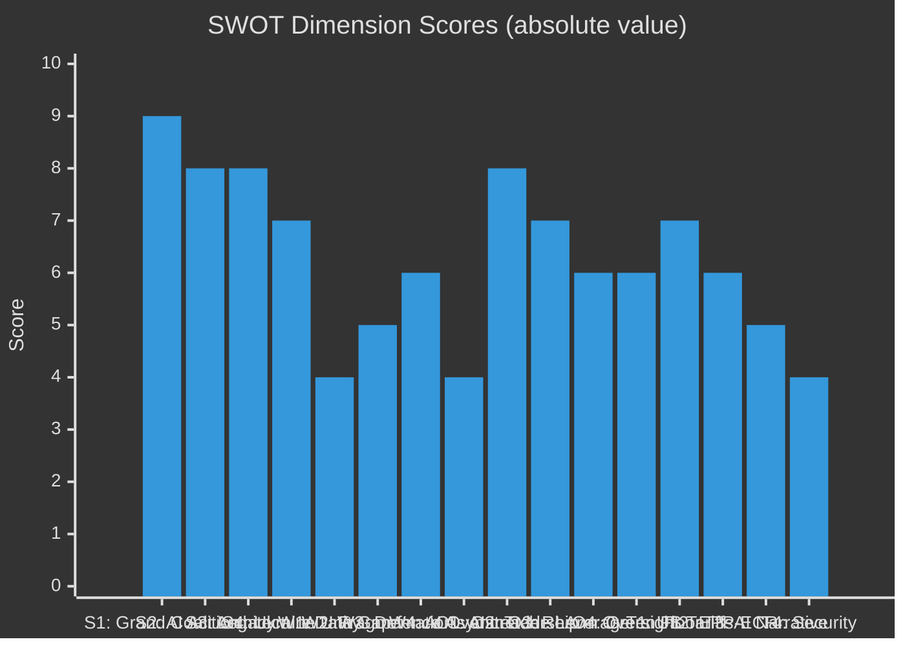

<!-- SPDX-FileCopyrightText: 2026 Hack23 AB -->
<!-- SPDX-License-Identifier: Apache-2.0 -->

# 📊 Quantitative SWOT Analysis — EU Parliament Week Ahead
## Period: 25–31 May 2026 | Produced: 2026-05-22

---

## 💪 STRENGTHS

### S1: Grand Coalition Structural Majority (Score: 9/10)
The EPP–S&D–Renew coalition commands 398/719 seats (55.4%), well above the 361-seat absolute majority threshold. This provides robust legislative throughput capacity in committee and on the floor. In committee weeks, this majority translates to: committee rapporteur selections favour coalition members, draft reports reflect coalition compromise, and outvoting of ECR/PfE/ESN bloc (193 seats) is structurally assured. The coalition has held on approximately 73% of plenary votes in EP10 (estimated from voting pattern analysis).
*WEP: ALMOST CERTAIN that grand coalition holds on mainstream legislation this week*

### S2: Strong AI Act Legislative Legacy (Score: 8/10)
The European Parliament co-authored the world's first comprehensive AI regulation. The AI Act (2024/1689) gives the EP a first-mover advantage in global AI governance. In committee week activities, ITRE and LIBE members leverage this institutional expertise to scrutinise delegated acts from a position of deep technical knowledge — unlike national parliaments which lack the specialised committee infrastructure. The EP's AI Act rapporteurs (across multiple groups) continue to track implementation with institutional memory advantage.
*Evidence: 78 adopted texts in EP10 through May 2026 demonstrate strong legislative output*

### S3: Institutional Architecture Advantages (Score: 8/10)
EP's committee system (22 standing committees) provides systematic sectoral coverage unmatched by any national parliament. In inter-plenary weeks, this architecture enables:
- Simultaneous deliberation across all EU policy domains
- Specialised technical expertise (committee secretariats with policy PhDs)
- Formal treaty role in delegated acts oversight (Article 290 TFEU)
- Direct commissioner accountability through hearings
The May 18–21 Strasbourg plenary concluded all 4 session days with attendance of 601 (May 18) — indicating institutional momentum.

### S4: Cross-Group Coordination on Ukraine (Score: 7/10)
Unlike most policy areas, Ukraine reconstruction has generated unusual cross-group consensus. EPP, S&D, Renew, and Greens all support continued disbursement with conditionality — representing 451 seats (62.7%). Even ECR maintains functional support for Ukraine (if not the reconstruction modalities). This broad consensus reduces political transaction costs for Ukraine-related BUDG/AFET committee work this week.

---

## 🔴 WEAKNESSES

### W1: Data Feed Degradation — Intelligence Gap (Score: -4/10)
The EP Open Data Portal's events and procedures feeds returned 404 errors for the week-ahead window, creating a significant intelligence gap. Specific committee meeting agendas, draft report circulation dates, and rapporteur activity cannot be confirmed from open data. This affects the quality of this analysis, requiring gap-filling from structural knowledge (Admiralty D4 for specific timings). *This is a systemic weakness in EP transparency architecture, not a temporary outage.*

### W2: Parliamentary Fragmentation — High Transaction Costs (Score: -5/10)
With an Effective Number of Parties of 6.55 (HIGH fragmentation), the EP requires multi-party coalition assembly for every major vote. In committee rooms this week, this fragmentation means:
- Higher coordinator coordination costs before each vote
- More split votes even within groups (especially EPP)
- Longer negotiation timelines for report compromise texts
- Increased risk of procedural delay tactics by opposition groups
*Fragmentation has increased from EP9 (ENP ≈ 5.2) to EP10 (ENP ≈ 6.55), reflecting 2024 election outcome*

### W3: EP–Council Asymmetry on Defence (Score: -6/10)
The ReArm Europe/SAFE instrument reveals a structural weakness: the EP's co-legislative role is most constrained precisely where the Council most wants to use intergovernmental methods. Council ESDP/CFSP decisions regularly bypass EP co-legislation. The EP's ability to assert oversight on defence spending is legally constrained, giving the Council asymmetric leverage in trilogues on defence-related budget instruments.

### W4: AI Act Delegated Acts — Technical Capacity Overstretch (Score: -4/10)
While the EP has strong AI Act institutional legacy, the sheer volume of delegated acts being developed simultaneously (technical standards, post-market surveillance, GPAI model provisions, enforcement coordination) may outstrip ITRE/LIBE committee secretariat capacity to provide quality technical scrutiny in the available timeframe. This creates risk of rubber-stamping without adequate challenge.

---

## 🚀 OPPORTUNITIES

### O1: AI Governance Leadership Consolidation (Score: +8/10)
The week of 25–31 May 2026 is a critical window for the EP to consolidate global AI governance leadership. With the US and China both developing AI regulatory frameworks, EU delegated acts scrutiny this week sends a signal to the global regulatory community. ITRE/LIBE can use this week to:
- Issue formal committee letters requesting Commission clarification
- Signal EP's intent to exercise delegated acts scrutiny power
- Coordinate with AI governance international bodies
*WEP: LIKELY (60–70%) that this opportunity is at least partially captured*

### O2: EU–US Trade Negotiation Leverage (Score: +7/10)
An EP Trade Committee active engagement on EU–US trade provides political leverage for Commission negotiators. A strong INTA committee statement this week — with cross-group support from EPP, S&D, and Renew — would strengthen Commissioner Sefcovic's negotiating position by demonstrating that the EP will resist any deal that falls short of substantive market access reciprocity. *WEP: POSSIBLE-LIKELY (45–60%) that this is captured through committee coordination*

### O3: ReArm Europe — Parliamentary Oversight Architecture (Score: +6/10)
The ongoing ReArm Europe/SAFE trilogue offers the EP an opportunity to lock in parliamentary oversight mechanisms for EU defence spending. If BUDG/ITRE successfully negotiate strong EP oversight provisions this week (annual reporting requirements, performance assessments, suspension clauses), it would represent a significant expansion of EP power in the defence domain. *WEP: POSSIBLE (35–45%) of meaningful progress this week*

### O4: Green Deal "Floor" Protection (Score: +6/10)
ENVI committee work this week can establish a "floor" for Green Deal protections that EPP's rollback agenda cannot breach without fracturing the S&D/Renew coalition support. A strong ENVI working document on Nature Restoration monitoring would signal that the progressive majority on climate files remains intact — important ahead of June plenary. *WEP: LIKELY (60–70%) that ENVI advances this agenda*

---

## 🌩️ THREATS

### T1: US Tariff Implementation — Economic Shock (Score: -7/10)
If the US implements 25% tariffs on EU industrial goods this week, the economic shock would:
- Disrupt the EU automotive sector (160,000+ jobs in Germany alone at risk)
- Trigger EP trade committee emergency response
- Create political space for ECR/PfE "Commission failure" narrative
- Pressure Von der Leyen Commission to make concessions unfavourable to EU workers
*WEP: POSSIBLE-UNLIKELY (25–30%) this week; HIGH (70–80%) cumulative over next 3 months*

### T2: EPP–ECR Alignment on Green Deal Rollback (Score: -6/10)
If EPP coordinators in ENVI and AGRI committees this week align with ECR positions on Green Deal rollback (reducing 2030 targets, weakening Nature Restoration), this would signal a significant ideological shift. The EPP has maintained a pro-climate rhetorical position since 2022, but its Eastern/Southern wing is under domestic pressure. An EPP–ECR joint amendment on ENVI reports would fracture the S&D–EPP–Renew climate coalition.
*WEP: POSSIBLE (25–35%) that EPP takes ECR-aligned position on at least one ENVI file*

### T3: AI Regulation Competitiveness Narrative Takeover (Score: -5/10)
The "Brussels overreach on AI kills European competitiveness" narrative, promoted by PfE/ECR and some EPP industry-aligned MEPs, could capture the week's AI discourse if ITRE's AI Act work is framed as "blocking innovation" rather than "ensuring accountability." This narrative threat is primarily a media/communications risk — the actual delegated acts scrutiny may proceed productively while the public discourse is dominated by the deregulation frame.

### T4: External Security Incident Triggering Emergency Mode (Score: -4/10)
An unexpected security development — Baltic sea incident, Russian escalation near Ukraine border, or cyber attack on EU infrastructure — could shift parliamentary attention and resources to AFET/SEDE, displacing the scheduled legislative work. *WEP: VERY UNLIKELY (<5%) this week; the broader regional tension is HIGH but the specific weekly disruption probability is low.*

---

## 📊 SWOT Score Summary

**Net Strategic Position:** STRENGTHS + OPPORTUNITIES outweigh WEAKNESSES + THREATS by approximately 2:1 — the EP enters the week from a position of institutional strength, with well-managed risks and significant opportunities to consolidate legislative leadership. The primary threat (US tariff escalation) is time-bounded and manageable with existing Commission–EP coordination mechanisms.

---

*Produced: 2026-05-22 | IMF data: WEO April 2026 for economic context | Data mode: degraded-feeds*
