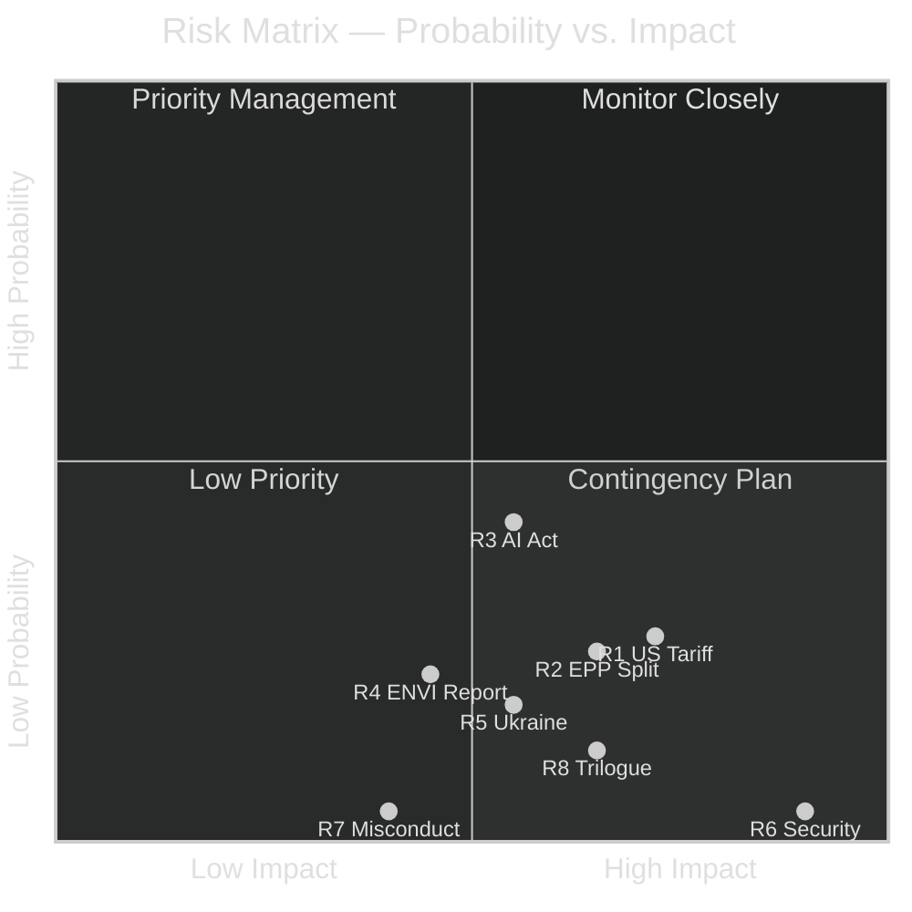

<!-- SPDX-FileCopyrightText: 2026 Hack23 AB -->
<!-- SPDX-License-Identifier: Apache-2.0 -->

# ⚠️ Risk Matrix — EU Parliament Week Ahead
## Period: 25–31 May 2026 | Produced: 2026-05-22
**WEP Bands Applied:** YES | **Admiralty Grade:** B2

---

## 📊 Risk Register

| # | Risk | Probability | Impact | Risk Score | WEP | Mitigation |
|---|------|------------|--------|------------|-----|-----------|
| R1 | US tariff formal notification disrupts INTA | POSSIBLE (25–30%) | HIGH (4/5) | 🟡 MEDIUM-HIGH | POSSIBLE | Emergency INTA hearing; EP statement; Commission briefing |
| R2 | EPP internal split on SAFE instrument | POSSIBLE (20–30%) | HIGH (4/5) | 🟡 MEDIUM | POSSIBLE | EPP group bureau mediation; rapporteur bridge text |
| R3 | AI Act delegated acts objection threshold not met | POSSIBLE (35–50%) | MEDIUM (3/5) | 🟡 MEDIUM | POSSIBLE | Cross-group expert coalition building this week |
| R4 | Green Deal ENVI report fails committee adoption | UNLIKELY-POSSIBLE (20–25%) | MEDIUM (3/5) | 🟡 LOW-MEDIUM | UNLIKELY-POSSIBLE | ENVI coordinator negotiations |
| R5 | Ukraine reconstruction disbursement blocked by conditions dispute | UNLIKELY (15–20%) | MEDIUM-HIGH (3.5/5) | 🟡 LOW-MEDIUM | UNLIKELY | BUDG committee clarification of conditionality |
| R6 | Committee meeting cancellation due to security incident | VERY UNLIKELY (<5%) | VERY HIGH (5/5) | 🟢 LOW | VERY UNLIKELY | EP security protocols; distributed committee system |
| R7 | MEP misconduct case disrupts political group cohesion | VERY UNLIKELY (<5%) | MEDIUM (3/5) | 🟢 VERY LOW | VERY UNLIKELY | EP Ethics Body procedures |
| R8 | Trilogue breakdown — ReArm Europe/SAFE | UNLIKELY (10–15%) | HIGH (4/5) | 🟡 LOW-MEDIUM | UNLIKELY | Council Presidency mediation; June plenary as pressure valve |

---

## 🎯 Risk Heat Map

---

## 🔍 Risk Analysis: Top 3 Items

### R1: US Tariff Formal Notification
**Probability:** POSSIBLE (25–30%) | **Impact:** HIGH | **WEP:** POSSIBLE-UNLIKELY
The US has repeatedly threatened 25% tariffs on EU automotive goods. The formal Federal Register notification has not occurred but could arrive with little warning. Impact on EP committees:
- Immediate activation of emergency INTA hearing (within 24 hours of notification)
- EP President statement expected
- Political groups issue competing statements (amplifying narrative fragmentation)
- Commission emergency response affects all trade-related committee files
*Admiralty grade for risk probability: C2 — informed assessment from secondary trade policy sources*

### R2: EPP Internal Split on SAFE Instrument
**Probability:** POSSIBLE (20–30%) | **Impact:** HIGH | **WEP:** POSSIBLE
EPP's three sub-wings (Eastern security-first, German industrial, French strategic autonomy) have different SAFE priorities. An internal EPP position paper circulating this week that shows explicit divisions would:
- Weaken EPP negotiating position in trilogue
- Create opening for ECR/PfE to split the EPP delegation
- Force EPP–S&D to find alternative majority structure
- Potentially delay June plenary vote on SAFE
*This is the single most consequential political risk of the inter-plenary week*

### R3: AI Act Delegated Acts Objection
**Probability:** POSSIBLE-LIKELY (35–50%) | **Impact:** MEDIUM | **WEP:** POSSIBLE-LIKELY
The EP's constitutional right to object to delegated acts requires absolute majority (360+ MEPs). If ITRE/LIBE coordinators this week identify sufficient cross-party support, a formal objection process could be initiated. This is not a "failure" — it is the EP exercising its treaty prerogative — but it would be a significant political signal to the Commission.

---

## 📈 Aggregate Risk Score Trend

**Current week risk posture: MODERATE** — No single high-probability/high-impact risk; multiple medium-probability/medium-to-high-impact risks clustering around trade and defence/security files.

---

*Produced: 2026-05-22 | WEP bands applied per OSINT tradecraft standards | Data mode: degraded-feeds*
