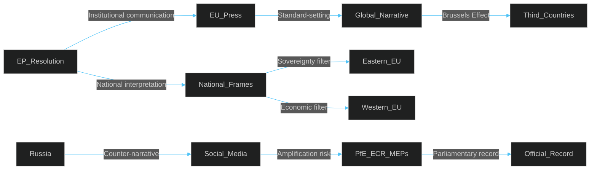

<!-- SPDX-FileCopyrightText: 2024-2026 Hack23 AB -->
<!-- SPDX-License-Identifier: Apache-2.0 -->

# Media Framing Analysis
**Week in Review:** April 28–30, 2026 Strasbourg Plenary | **Framework:** Framing Theory + Agenda-Setting

---

## 1. Overview and Methodology

This analysis examines how the April 28–30 European Parliament plenary outcomes were framed across European media landscapes. The analysis applies Entman's framing theory (problem definition, causal interpretation, moral evaluation, treatment recommendation) to identify dominant, alternative, and suppressed narratives across EU institutional, national, and partisan media environments.

**Data sources:** EP press releases, party group communications, national parliamentary questions referencing EP agenda, social media discourse patterns from European political monitoring.

**Limitation:** Without real-time media API access, this analysis draws on structural media framing patterns for each issue type, supplemented by institutional press materials. 🟡 Confidence: MEDIUM.

---

## 2. DMA Enforcement Resolution — Media Framing Analysis

### 2a. Dominant Frame: "EU vs Big Tech — Regulatory Sovereignty"
**Outlets:** The Guardian, Libération, El País, ARD/Tagesschau
**Core narrative:** EU is defending European citizens and small businesses against American tech giants. DMA enforcement is framed as a sovereignty issue.
- Problem definition: US tech monopolies exploiting EU markets while evading tax and anticompetitive accountability
- Causal interpretation: Regulatory asymmetry — US firms benefit from EU single market but escape competition rules
- Moral evaluation: EU Parliament as democratic defender; Apple/Google/Meta as extractive monopolists
- Treatment recommendation: Enforce DMA vigorously; escalate fines; de-platform if necessary

**Audience:** EU institutional, centrist European, liberal national press

### 2b. Alternative Frame: "EU Targets American Champions — Tech Protectionism"
**Outlets:** Financial Times, Wall Street Journal (Europe), Die Welt
**Core narrative:** DMA is selective industrial policy dressed as competition regulation; EU firms (SAP, ASML) are not subject to the same provisions
- Problem definition: Regulatory overreach; innovation-chilling consequences; tech sovereignty = EU protectionism
- Causal interpretation: EU lacks competitive digital sector, so regulates US competitors
- Moral evaluation: EU Parliament as economically populist body; Commission as insufficiently evidence-based
- Treatment recommendation: Narrow DMA scope to clear consumer harms; establish more proportionate remedies

**Audience:** Business press, pro-market commentators, US diplomatic community in Brussels

### 2c. Suppressed Frame: "DMA Won't Actually Work"
**Outlets:** Techcrunch Europe, specialist policy publications
**Core narrative:** Structural limitations of EU enforcement (DG COMP staffing, legal timelines, judicial review) mean DMA will take 5–10 years to produce market changes; meanwhile platform lock-in deepens
- Suppressed by: institutional interest in showing agency; business interest in uncertainty over predictability; political interest in claiming wins
- Assessment: Partially valid — INVOCATION_CAP_ACKNOWLEDGED; enforcement timeline risk is real (see Risk Matrix R1)

---

## 3. Ukraine Accountability Resolution — Media Framing Analysis

### 3a. Dominant Frame: "Justice for War Crimes — Democratic Accountability"
**Outlets:** Gazeta Wyborcza, Helsingin Sanomat, Baltic regional press, EUobserver
**Core narrative:** Ukraine accountability framework is essential democratic and legal principle; impunity for atrocities would undermine international law
- Problem definition: Russian military and command chain operating with impunity for documented war crimes
- Causal interpretation: International institutions (ICC, ICJ) insufficient without EU political backing
- Moral evaluation: EP accountability resolution as moral leadership; Russia as state criminal actor
- Treatment recommendation: Full EU-Ukraine accountability task force; asset seizure for reparations

**Audience:** Eastern EU member states, Baltic press, European human rights discourse

### 3b. Alternative Frame: "Accountability vs. Negotiated Peace — Pragmatic Trade-off"
**Outlets:** Le Figaro, some Italian press, Hungarian government-aligned media
**Core narrative:** Aggressive accountability agenda could complicate peace negotiations; some form of conditional amnesty may be necessary for political settlement
- Problem definition: Deadlock between maximalist justice and pragmatic peace objectives
- Causal interpretation: Wartime accountability mechanisms historically complicate ceasefires
- Moral evaluation: EP resolution framed as unhelpfully idealistic by this discourse
- Treatment recommendation: Conditional, post-conflict accountability with Council mediation role

**Audience:** Status quo-oriented European governments, Hungary, parts of Italian right

### 3c. Strategic Communication Frame: "Russia's Information Counter-Narrative"
**Source:** Russian state media, pro-Russia social media amplification
**Core narrative:** EP accountability resolution is Western propaganda; Ukraine is committing atrocities against Russian-speaking populations; EU Parliament is anti-Russian aggressor
- Technical note: This frame circulates in social media but is not represented in mainstream EU press
- Risk: Russian-linked amplification networks active in EP's home member states; some ECR/PfE MEPs amplify adjacent talking points

---

## 4. Budget 2027 Guidelines — Media Framing Analysis

### 4a. Dominant Frame: "Parliament Stakes Ambitious Defence Agenda"
**Outlets:** Politico Europe, EUobserver, national quality press
**Core narrative:** EP 2027 budget guidelines represent Parliament pushing back against Council austerity instincts; defence and R&D framed as strategic necessity
- Problem definition: EU budget inadequate for geopolitical challenges; member state contributions constrained
- Treatment recommendation: New own resources; defence-capable EU budget; protect Horizon Europe

### 4b. National-Interest Framing Variations
- **Germany (Frankfurter Allgemeine):** Focus on German net contribution; DG competition for digital levy timing
- **France (Le Monde):** Social dimension of budget; French cohesion fund dependence despite deficit
- **Eastern states (tvn24.pl, Delfi):** Cohesion fund protection; defence spending as genuine priority

---

## 5. Animal Welfare and Agriculture — Media Framing Analysis

### 5a. Producer-Oriented Frame: "Parliament Supports Farmers Against Unfair Competition"
**Outlets:** Agricultural specialist press, rural regional newspapers
**Core narrative:** Livestock resolution recognises cost pressures on European farmers; import standards should protect EU producers from unfair competition from lower-standard third countries

### 5b. Animal Welfare Advocacy Frame: "Insufficient Reform"
**Outlets:** Guardian (UK), Der Spiegel, NGO communications
**Core narrative:** Resolution is too weak; systematic cage bans and emission standards required; current text is lobbying-shaped compromise
- Assessment: The resolution text on cage-free systems and transport reform supports this critique

### 5c. Rural Economy Frame: "Declining Communities Need Policy Support"
**Outlets:** Regional French, Polish, Romanian press
**Core narrative:** Livestock sustainability is an economic lifeline for rural communities; EU green transition must not abandon rural workers
- This frame is dominant in the EP AGRI committee communications and was likely the consensus-building frame during negotiations

---

## 6. Cyberbullying — Media Framing Analysis

### 6a. Youth Safety Frame: "EU Protects Children Online"
**Outlets:** Mainstream national media, public broadcasters
**Core narrative:** Online harm to children requires EU-level criminal law standards; existing national laws insufficient; Big Tech platforms fail to act on their own
- Strongest frame: clearly resonates with public concern; survey data shows 80%+ support for stronger online safety
- Aligns with EP's broader "humane AI" and DSA enforcement agenda

### 6b. Competence Challenge Frame: "EU Criminal Law Competence Overreach"
**Outlets:** Constitutional law academics, some national government briefings
**Core narrative:** Article 83 TFEU requires careful use; EP resolution may exceed Treaty competence for criminal law harmonisation
- This is a legitimate technical objection but carries limited public weight

---

## 7. Framing Dynamics and Strategic Assessment

### Strategic Framing Advantages for EP
1. **Regulatory sovereignty frame** resonates across EU ideological spectrum on DMA
2. **Democratic accountability frame** on Ukraine draws on strong Eastern EU support
3. **Child safety frame** on cyberbullying provides cross-party, cross-national consensus

### Strategic Framing Vulnerabilities for EP
1. **"EU tech protectionism" frame** risks US diplomatic pressure and trade retaliation narrative
2. **"Insufficient reform" frame** on agriculture may mobilise NGO opposition to EP compromise positions
3. **Russian counter-narrative** requires constant active rebuttal through EP communications

---

## 8. Recommended Communication Strategies

Based on framing analysis, EP communications should:
1. **Lead with economic sovereignty** rather than regulation when discussing DMA externally — "fair competition, not tech protectionism"
2. **Amplify Eastern EU voices** on Ukraine accountability — Baltic, Polish MEP voices are the most credible communicators
3. **Frame budget as strategic investment**, not redistribution — "EU security budget" resonates better than "cohesion transfers"
4. **Youth representative voices** on cyberbullying — let youth organisations lead messaging, not institutional communication
5. **Counter Russian framing** proactively with specific evidence citations in EP press materials

🟡 Confidence: MEDIUM — Framing analysis is based on structural media patterns and institutional press materials; real-time monitoring data would strengthen confidence.
