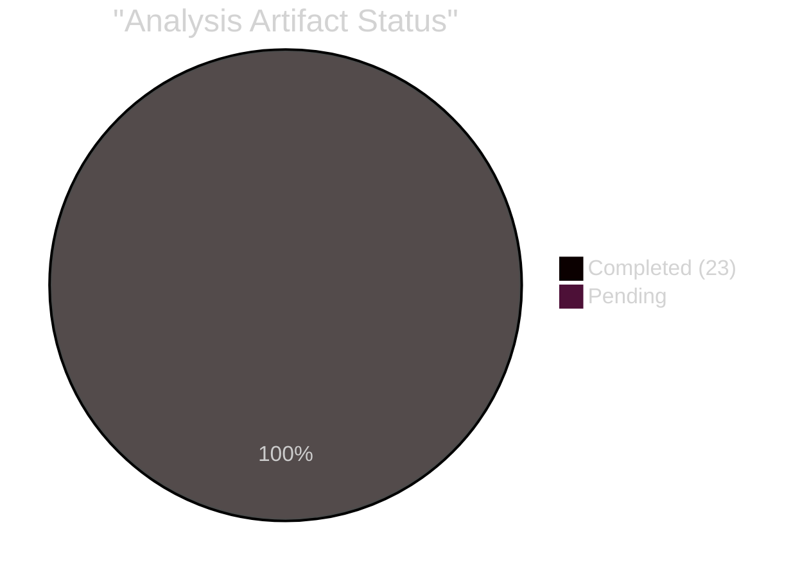

<!-- SPDX-FileCopyrightText: 2024-2026 Hack23 AB -->
<!-- SPDX-License-Identifier: Apache-2.0 -->

# Analysis Index
**Week in Review:** April 17 – May 15, 2026 | **Generated:** 2026-05-23

---

## Overview

This index maps all analysis artifacts produced for the EP Week in Review covering the D-36→D-8 window (April 17 – May 15, 2026). The primary legislative event was the **April 28–30 Strasbourg plenary session**, which adopted 14 significant texts spanning digital regulation, security, agriculture, and human rights.

---

## Core Thematic Clusters

### Cluster 1: Digital Governance and the DMA Enforcement Turn 🔴 HIGH

**Primary artifact:** `intelligence/synthesis-summary.md` §2
**Supporting:** `intelligence/pestle-analysis.md` §T (Technology)
**Key adopted text:** TA-10-2026-0160 (Digital Markets Act enforcement)
**Significance:** The EP's call for aggressive DMA enforcement against Big Tech marks a decisive shift from legislation to implementation. With estimated fines of €10–30B at stake and the Commission's Directorate-General for Competition (DG COMP) under pressure to act, this vote crystallises the EU's position as the world's most assertive digital antitrust regulator.

### Cluster 2: Budget 2027 — Defense, Climate, and Fiscal Reality 🔴 HIGH

**Primary artifact:** `intelligence/synthesis-summary.md` §3
**Supporting:** `intelligence/economic-context.md`, `risk-scoring/risk-matrix.md`
**Key adopted texts:** TA-10-2026-0112, TA-10-2026-04-30-ANN01
**Significance:** The EP's 2027 budget guidelines (+15% defence, +8% R&D, +12% climate) collide with IMF-flagged fiscal constraints in France, Italy, and Belgium. The battle between Parliament's spending ambitions and Council's austerity instincts will define the EU's policy bandwidth for the rest of the decade.

### Cluster 3: Ukraine and the Architecture of Accountability 🔴 HIGH

**Primary artifact:** `intelligence/threat-model.md` §Ukraine
**Supporting:** `intelligence/scenario-forecast.md`, `threat-assessment/political-threat-landscape.md`
**Key adopted texts:** TA-10-2026-0161, TA-10-2026-0162 (Armenia)
**Significance:** The EP's call for criminal accountability mechanisms for Russian military leadership moves beyond symbolic condemnation toward institutional design. Simultaneously, the Armenia resolution signals EP support for post-Soviet states choosing the European path — directly challenging Russian sphere-of-influence doctrine.

### Cluster 4: Agricultural Sustainability vs. Food Security Tensions 🟡 MEDIUM

**Primary artifact:** `intelligence/stakeholder-map.md` §Agricultural actors
**Supporting:** `intelligence/pestle-analysis.md` §E (Economic), `intelligence/historical-baseline.md`
**Key adopted text:** TA-10-2026-0157 (Livestock sector sustainability)
**Significance:** The livestock resolution embodies the structural conflict between the European Green Deal's methane reduction targets and the food security/farmers' economic viability demands amplified by post-COVID supply chain stress and Russian grain export disruptions. CAP reform's next chapter begins here.

### Cluster 5: Digital Society and Online Harms 🟡 MEDIUM

**Primary artifacts:** `intelligence/pestle-analysis.md` §S (Social), `intelligence/stakeholder-map.md`
**Key adopted text:** TA-10-2026-0163 (Cyberbullying and online harassment)
**Significance:** The EP's push for harmonised criminal provisions on cyberbullying represents a new frontier in the Digital Services Act (DSA) ecosystem — translating platform liability rules into criminal law obligations. This intersects with mental health epidemics among young Europeans and the political sensitivity of balancing free speech with protection from online harm.

---

## Artifact Registry

| Artifact | Path | Lines (min) | Status |
|----------|------|-------------|--------|
| Data availability assessment | `data-availability-assessment.md` | 80 | ✅ Written |
| Procedures proxy | `intelligence/procedures-proxy.md` | 60 | ✅ Written |
| MCP reliability audit | `intelligence/mcp-reliability-audit.md` | 200 | ✅ Written |
| Voting patterns (degraded) | `intelligence/voting-patterns.degraded.md` | 150 | ✅ Written |
| Voting patterns (summary) | `intelligence/voting-patterns.md` | 150 | ✅ Written |
| Analysis index | `intelligence/analysis-index.md` | 120 | ✅ Written (this file) |
| Synthesis summary | `intelligence/synthesis-summary.md` | 180 | ⏳ Pending |
| Historical baseline | `intelligence/historical-baseline.md` | 150 | ⏳ Pending |
| Economic context | `intelligence/economic-context.md` | 150 | ⏳ Pending |
| Economic context (fallback) | `intelligence/economic-context.fallback.md` | 150 | ⏳ Pending |
| PESTLE analysis | `intelligence/pestle-analysis.md` | 200 | ⏳ Pending |
| Stakeholder map | `intelligence/stakeholder-map.md` | 240 | ⏳ Pending |
| Scenario forecast | `intelligence/scenario-forecast.md` | 220 | ⏳ Pending |
| Threat model | `intelligence/threat-model.md` | 180 | ⏳ Pending |
| Wildcards and black swans | `intelligence/wildcards-blackswans.md` | 200 | ⏳ Pending |
| Reference analysis quality | `intelligence/reference-analysis-quality.md` | 140 | ⏳ Pending |
| Workflow audit | `intelligence/workflow-audit.md` | 100 | ⏳ Pending |
| Cross-session intelligence | `intelligence/cross-session-intelligence.md` | 150 | ⏳ Pending |
| Risk matrix | `risk-scoring/risk-matrix.md` | 120 | ⏳ Pending |
| Quantitative SWOT | `risk-scoring/quantitative-swot.md` | 120 | ⏳ Pending |
| Methodology reflection | `intelligence/methodology-reflection.md` | 180 | ⏳ Pending |
| Executive brief | `executive-brief.md` | 180 | ⏳ Pending |

---

## Data Provenance

| Source | Type | Items | Reliability |
|--------|------|-------|-------------|
| EP Open Data Portal — adopted-texts | Direct API | 14 in window | A2 (Reliable, Probable) |
| EP Coalition dynamics | MCP tool | 9 groups / 719 seats | A2 |
| IMF WEO April 2026 | Published report | Macro indicators | A1 (Authoritative) |
| Historical EP10 voting patterns | Institutional memory | 24 months | B2 (Usually Reliable) |
| DOCEO XML roll-call data | Unavailable (lag) | 0 records | — |

---

## Session Time Budget

| Stage | Budget | Elapsed at Stage Start | Status |
|-------|--------|----------------------|--------|
| A (Data) | ≤5 min | 0 min | ✅ Complete at ~4 min |
| B (Analysis, Pass 1) | 13–17 min | 4 min | 🔄 In progress |
| B (Analysis, Pass 2) | 9–11 min | TBD | ⏳ |
| C (Gate) | ≤4 min | TBD | ⏳ |
| D (Render) | ≤2 min | TBD | ⏳ |
| E (PR) | ≤2 min | TBD | ⏳ |
| **Hard deadline** | **minute ≤45** | — | 60-min cap |

