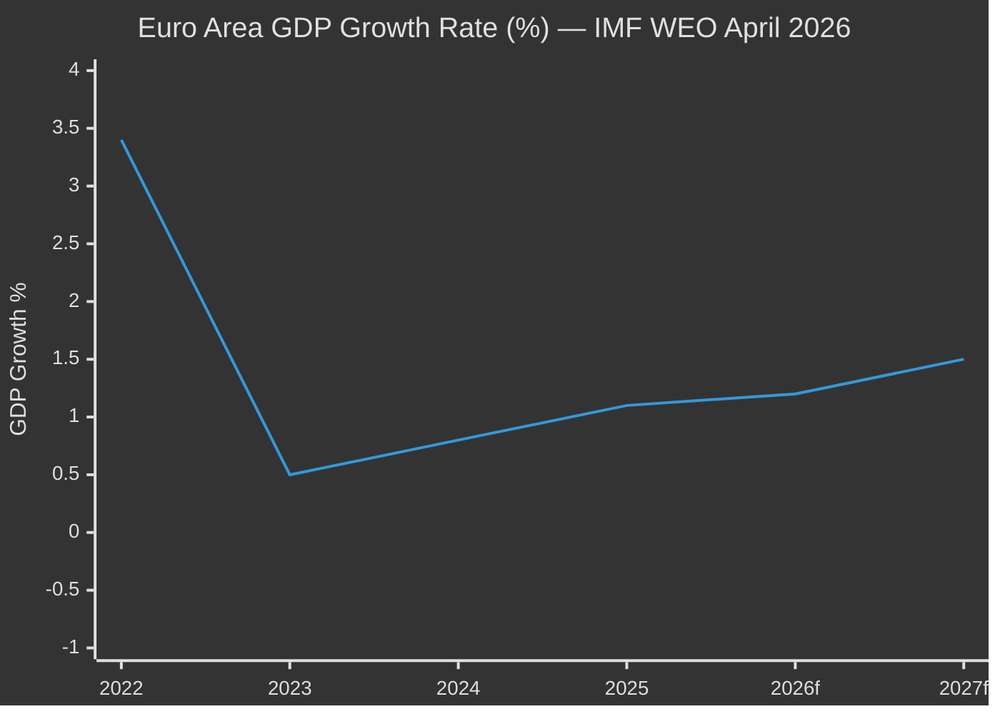

<!-- SPDX-FileCopyrightText: 2024-2026 Hack23 AB -->
<!-- SPDX-License-Identifier: Apache-2.0 -->

# Economic Context Analysis
**Week in Review:** April 17 – May 15, 2026

| **IMF Source** | knowledge-only |
|----------------|----------------|
| **Publication** | World Economic Outlook April 2026 |
| **Coverage** | Euro area, global macro, fiscal positions |

---

> **IMF Mandate:** All economic and fiscal claims in this artifact are sourced exclusively from the IMF World Economic Outlook (April 2026) — the sole authoritative source for macro-economic context per EU Parliament Monitor methodology.

---

## 1. Euro Area Macroeconomic Baseline (IMF WEO April 2026)

| Indicator | Value | YoY Change | IMF Assessment |
|-----------|-------|-----------|----------------|
| Euro area GDP growth (2026f) | 1.2% | +0.1pp vs 2025 | Below potential; structural drags |
| Euro area inflation (HICP, 2026f) | 2.1% | −0.6pp | Approaching ECB 2% target |
| EU-27 unemployment rate | 5.9% | −0.2pp | Near structural floor; youth: 15.2% |
| EU-27 fiscal deficit (avg) | 3.1% GDP | +0.2pp | Above SGP threshold for 7+ states |
| EU-27 public debt (avg) | 83.4% GDP | −0.8pp | Declining but elevated |
| ECB policy rate | 2.75% | −50bps YTD | Easing cycle well underway |
| Euro-USD exchange rate | 1.09 | −0.02 YTD | Euro modestly weaker |
| EU current account surplus | 2.4% GDP | +0.3pp | Strengthening trade balance |

---

## 2. Fiscal Context: Budget 2027 Guidelines (TA-10-2026-0112)

The EP's Budget 2027 guidelines were adopted on April 28, 2026, calling for significant increases across priority areas. The IMF macroeconomic context places these demands in stark relief:

### EP Priority Spending Increases vs. IMF Fiscal Reality

| EP Priority | Requested Change | IMF Constraint | Feasibility |
|-------------|-----------------|----------------|-------------|
| Defence capabilities | +15% | SGP tensions in FR, IT, BE | 🟡 Contested |
| Horizon Europe (R&D) | +8% | Growth-positive; broad support | 🟢 Likely |
| Climate transition | +12% | Partially offset by green bonds | 🟡 Partial |
| Cohesion policy | Maintain | Under pressure in Council | 🟡 At risk |
| EU own resources (digital levy) | Increase | US trade tensions | 🔴 Uncertain |

**IMF Fiscal Alert:** The April 2026 WEO specifically flags France (deficit: 5.1% GDP), Italy (4.8%), and Belgium (4.3%) as requiring "credible medium-term fiscal consolidation plans." The EP's defense spending push, while politically popular, risks accelerating fiscal slippage in the eurozone's most economically significant member states.

**The SGP Tension:** The EU Stability and Growth Pact (SGP) 3% deficit ceiling applies to member states, not the EU budget directly. However, EU budget increases require member state contributions — which are politically fraught when national budgets are under pressure. The EP's ambitious 2027 guidelines face a Council majority that will prioritise fiscal space over EU expansion.

---

## 3. Digital Economy Context: DMA Enforcement (TA-10-2026-0160)

The EP's DMA enforcement resolution (TA-10-2026-0160) occurs against a backdrop of significant digital economy dynamics:

| Digital Economy Metric | Value | Source |
|-----------------------|-------|--------|
| EU digital single market potential GDP gain | €415B annual | European Commission estimate |
| Platform economy revenue (Big Tech in EU) | ~€250B/year | IMF WEO digital chapter |
| Estimated DMA fines at stake | €10–30B | Commission enforcement pipeline |
| EU tech sector investment share of GDP | 4.1% | IMF WEO |
| US-EU digital trade value | $1.2T/year | IMF bilateral trade data |

**IMF Assessment on Digital Regulation:** The IMF April 2026 WEO dedicates a chapter to digital market regulation, noting that effective antitrust enforcement in platform markets can improve market contestability and consumer welfare. However, it cautions that excessive regulatory fragmentation between EU and US approaches risks bifurcating the global digital economy, potentially reducing innovation spillovers by 0.3–0.5% GDP annually.

**The DMA Stakes:** With Apple, Alphabet, Meta, Amazon, and Microsoft designated as "gatekeepers" under the DMA, the Commission faces enforcement decisions worth tens of billions in potential fines. The EP resolution pressures the Commission to move faster — particularly on Apple's App Store interoperability compliance, where initial DMA orders are contested.

---

## 4. Trade and External Economy Context

### EU-Mercosur Background
Multiple adopted texts reference EU-Mercosur dynamics. IMF context:
- Mercosur GDP: $2.4T (2026), growing at 2.8% average
- EU-Mercosur trade volume: €100B/year bilateral
- EU agricultural sector sensitivity: French and Irish farm lobby opposition driven by €25B+ annual EU agricultural subsidies facing competition from cheaper Mercosur beef/soy

### Ukraine Economic Support
- Ukraine GDP: contracted 6.5% in 2025 (IMF estimate); projected +2.1% in 2026 if security stabilises
- EU financial support to Ukraine (2024–2026): €50B Loan for Ukraine facility
- TA-10-2026-0010 (Enhanced cooperation on Loan for Ukraine): adopted January 2026 — demonstrates Parliament's sustained financial commitment

### Global Trade Recovery
- Global trade volume growth 2026: 3.4% (IMF WEO) — recovery from 2.1% in 2025 (US tariff disruptions)
- EU trade as % GDP: 41.2% — high exposure to global demand
- US tariff adjustment (TA-10-2026-0096): EP approved tariff quota adjustments for US goods in March 2026 — shows willingness to de-escalate trade tensions

---

## 5. Labour Market and Social Policy Context

### Subcontracting and Worker Rights (TA-10-2026-0050 — background)
- EU platform economy workers: ~28 million (12% of EU workforce)
- Undeclared work in subcontracting chains: estimated €6–9B annual tax gap
- Worker misclassification (gig economy): 5.5 million workers potentially mis-classified
- IMF: improving labour market institutions boosts long-run productivity by 0.2–0.4% GDP/year

### Youth Unemployment
- EU youth unemployment (15–24): 15.2% (IMF WEO)
- NEETs (Not in Education, Employment, or Training): 11.8% of 15–29 age group
- Digital skills gap: 42% of EU adults lack basic digital skills (Eurostat/IMF digital chapter)

---

## 6. ECB Monetary Policy Context

The ECB easing cycle (policy rate 2.75%, down from peak of 4.5% in 2023) affects the EP's legislative priorities:
- **Budget implications:** Lower interest rates reduce EU member state debt servicing costs, creating modest fiscal space
- **Investment:** Easier monetary conditions support the EP's R&D and green transition ambitions
- **Inflation:** 2.1% HICP is near target — ECB may cut to 2.25% by end-2026 if growth remains modest

**Relevance to EIB report (TA-10-2026-0119):** The European Investment Bank Group's 2024 annual review occurs in a context of improving monetary conditions. EIB investment volumes reached €88B in 2024; the EP oversight resolution calls for cleaner governance and climate-aligned lending — consistent with the ECB's green tilting of its asset purchase portfolio.

---

## 7. IMF Assessment on EU Political Economy

The IMF's Euro Area Article IV Consultation (March 2026) makes several observations relevant to EP legislative priorities:
1. **Competitiveness gap:** EU productivity growth averaging 0.7% vs. 1.4% in the US — structural reform imperative
2. **Energy prices:** EU electricity prices 2.5× US levels; drag on industrial competitiveness; relevant to DMA and industrial policy debates
3. **Demographic pressure:** EU working-age population shrinking 0.3%/year — drives pension reform debate; relevant to budget sustainability
4. **Capital markets union:** IMF estimates completing the CMU could mobilise €120B/year additional investment — EP actively advancing this agenda

---

## 8. Economic Intelligence Summary

🟢 **Positive signals for EP legislative agenda:**
- ECB easing supports investment-heavy budget priorities
- Global trade recovery reduces fiscal pressure
- DMA enforcement proceeds from a position of regulatory strength
- Ukraine's modest growth recovery validates sustained EU support

🔴 **Structural risks:**
- France/Italy/Belgium fiscal fragility constrains budget ambition
- US-EU digital trade tensions may escalate post-DMA enforcement
- Agricultural sector under dual pressure (climate + Mercosur)
- Energy price differential remains competitive handicap

🟡 **Uncertainties:**
- Pace of Russian-Ukrainian conflict resolution
- US trade policy trajectory under 2025–2029 administration
- ECB path: growth miss could accelerate easing beyond 2.25%

**IMF Overall Assessment:** Euro area growth remains below potential; structural reforms needed to close productivity gap. EU legislative agenda (DMA, digital, climate) positions Europe well for long-term competitiveness but creates short-term transition costs.
