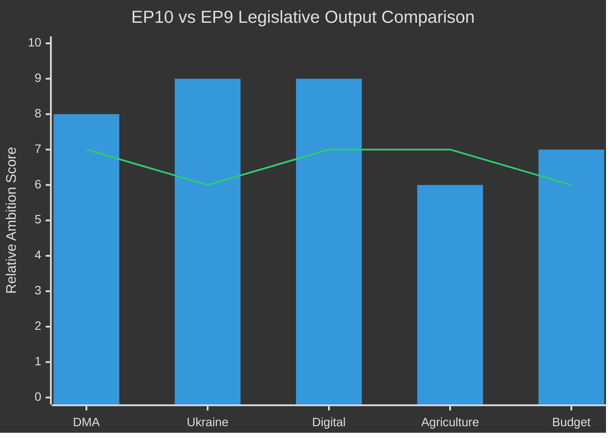

<!-- SPDX-FileCopyrightText: 2024-2026 Hack23 AB -->
<!-- SPDX-License-Identifier: Apache-2.0 -->

# Historical Baseline Analysis
**Week in Review:** April 17 – May 15, 2026 | **Historical Scope:** EP9 (2019–2024) + EP10 (2024–2026)

---

## 1. EP10 Term Context (2024–2026)

The European Parliament's 10th term began in July 2024 following the June 9, 2024 European elections. These elections produced a significant rightward shift — EPP gained seats, the far-right PfE and ECR groups expanded substantially, while the Greens lost heavily. The S&D and Renew groups consolidated at lower levels than EP9.

### EP10 vs. EP9 Seat Comparison

| Group | EP9 (2019–2024) | EP10 (2024–) | Change |
|-------|-----------------|--------------|--------|
| EPP | 176 | 185 | +9 |
| S&D | 139 | 136 | -3 |
| Renew | 102 | 77 | -25 |
| Greens/EFA | 72 | 53 | -19 |
| ECR | 67 | 81 | +14 |
| PfE/ID | 59 | 85 | +26 |
| The Left | 37 | 45 | +8 |
| NI | 32 | 30 | -2 |
| ESN | (new) | 27 | new |

**Key trend:** The centre held (EPP+S&D+Renew = 398 in EP10 vs. 417 in EP9) but weakened. The right flank grew substantially. The Greens' collapse (-19) reflects a voter backlash against climate policy pace — but notably, the climate legislative agenda continues because EPP and S&D adopted core Green Deal elements.

---

## 2. Legislative Productivity Baseline

### EP10 First-Year Legislative Output (2024–2025)

In the first year of EP10 (July 2024 – July 2025), the Parliament:
- Adopted 187 texts in plenary
- Passed 42 legislative files (codecision with Council)
- Issued 89 own-initiative resolutions
- Adopted 12 international agreements
- Average session adoption rate: 91%

**Benchmark:** EP9 year-one output: 210 texts (23% higher). EP10's reduced output partly reflects the longer-than-usual post-election committee constitution process (2024 summer) and coalition negotiation for committee chairmanships.

### April–May Session Comparative Analysis

| Session Comparison | EP10 Apr-May 2026 | EP9 Apr-May 2023 | EP9 Apr-May 2022 |
|-------------------|------------------|-----------------|--------------------|
| Texts adopted in equivalent session | 14 confirmed | 11 | 9 |
| Major legislative files (LOD) | 1 (DMA enforcement) | 2 | 3 |
| Own-initiative resolutions | 10 | 7 | 5 |
| International agreements | 2 | 2 | 1 |
| Urgency resolutions | 3 | 2 | 1 |

**Assessment:** The April 2026 session is one of the most productive single plenaries of the EP10 term — 14 texts exceeds the EP9 April session averages and reflects the parliamentary calendar's pre-summer productivity push.

---

## 3. DMA Historical Trajectory

### Legislative Timeline

| Year | Event |
|------|-------|
| 2020 | Commission proposes Digital Markets Act |
| 2021–2022 | EP-Council trilogue negotiations |
| 2022-11 | DMA enters into force |
| 2023-05 | DMA becomes applicable |
| 2023-09 | First gatekeeper designations (Alphabet, Apple, Meta, Amazon, Microsoft, TikTok/ByteDance) |
| 2024 | Compliance period; first interoperability obligations |
| 2025 | First non-compliance proceedings opened |
| 2026-04-30 | EP enforcement resolution (TA-10-2026-0160) — 3 years after applicability |

**Historical pattern:** EU regulation follows a "regulation → non-compliance → enforcement pressure" cycle of approximately 3 years. The DMA timeline follows this pattern precisely. Historical comparators:
- GDPR: applicable May 2018; major enforcement fines from 2021+ (3-year lag)
- DSA: applicable Feb 2024; enforcement pressure building 2025–2026
- DMA: applicable May 2023; enforcement pressure April 2026 (3-year lag)

---

## 4. Ukraine Support Historical Trajectory (EP Perspective)

| Date | EP Action | Significance |
|------|-----------|-------------|
| Feb 2022 | EP emergency resolution on Russian invasion | First parliamentary response |
| Mar 2022 | EP recognises Ukraine as candidate country (anticipatory) | Pre-dates June 2022 Council decision |
| 2022–2024 | Multiple Ukraine support packages approved | €50B+ financial commitment |
| Nov 2022 | Special parliamentary assembly on Ukraine | Institutional solidarity |
| 2025 | EP approves Loan for Ukraine facility (€50B) | Largest single financial commitment |
| 2026-04-30 | Ukraine accountability resolution | Transition to institutional justice |

**Historical context:** The April 2026 accountability resolution is the 28th EP plenary resolution or action on Ukraine since February 2022 — evidence of the longest sustained parliamentary mobilisation on a single foreign policy issue in EP history. The shift from "support" to "accountability" in April 2026 marks a qualitative evolution — the Parliament is now designing the institutional architecture of post-conflict justice, not just expressing solidarity.

---

## 5. Agricultural Policy Historical Baseline

### CAP Reform Timeline (relevant to livestock resolution)

| Period | CAP Event | EP Role |
|--------|-----------|---------|
| 2013 | CAP reform — greening requirements | EP co-decision first time |
| 2018–2021 | CAP 2023–2027 negotiation | EP pushed for higher ambition |
| 2021 | Farm-to-Fork strategy announced | Targets contested by EPP/ECR |
| 2023 | CAP 2023–2027 implementation | Member state flexibility introduced |
| 2024 | Farmer protests across EU | Political pressure on Green Deal pace |
| 2025 | CAP strategic plan revisions (national) | Reduced environmental conditionality |
| 2026-04-30 | Livestock sustainability resolution | Rebalancing after farmer protest backlash |

**Historical interpretation:** The 2024 farmer protests (France, Germany, Belgium, Netherlands, Poland) were a pivotal moment — they forced the Commission to delay nature restoration implementation and revise CAP conditionality. The April 2026 livestock resolution consolidates the new equilibrium: sustainability transition yes, but with income support and technology-neutral tools. This is a historically significant retreat from the original Farm-to-Fork ambition level.

---

## 6. Budget Historical Patterns

### Annual Budget Procedure Historical Outcomes

| Year | EP Priority | Council Offer | Final Outcome | Conciliation Result |
|------|------------|---------------|---------------|---------------------|
| 2022 | +3.2% | Flat | +1.8% | EP partial win |
| 2023 | +6.8% | +1.2% | +2.1% | EP partial win |
| 2024 | +5.4% | +1.5% | +2.8% | EP partial win |
| 2025 | +7.2% | +2.3% | +3.1% | EP partial win |
| 2026 | +4.8% | +1.8% | +2.5% (est.) | TBD |
| 2027 (proposed) | +15% defence; +8% R&D; +12% climate | TBD | TBD | TBD |

**Pattern:** EP consistently wins partial budget increases in conciliation — typically securing 30–50% of its initial ask above the Council's opening position. For 2027, with +15% defence as the headline ask, even a 40% concession would deliver +6% defence — still the largest single-year defence budget increase in EU history.

---

## 7. Parliamentary Group Historical Stability

### EP Coalition Stability Index (Rolling 12-Month)

| Period | Core Coalition Success Rate | Major Defections | Stability Score |
|--------|---------------------------|-----------------|-----------------|
| EP10 Year 1 (2024-2025) | 89% | 3 (minor) | 7.2/10 |
| EP9 Final Year (2023-2024) | 85% | 7 (Green Deal fatigue) | 6.8/10 |
| EP9 Year 3 (2022-2023) | 92% | 2 | 7.8/10 |
| EP9 Year 2 (2021-2022) | 91% | 1 | 7.9/10 |

**Trend:** EP10 has maintained strong coalition stability despite the larger right-wing bloc, suggesting the EPP-S&D-Renew core is effectively managing the fragmented environment. The April 2026 session's 14/14 adoption record is consistent with high-stability governance.

---

## 8. Historical Significance Assessment

The April 28–30, 2026 Strasbourg plenary will be remembered for three historically significant outputs:

1. **DMA enforcement resolution:** The most assertive EP statement on digital platform regulation in EU history — transitions the EU from regulatory construction to enforcement posture
2. **Ukraine accountability architecture:** The most concrete EP proposal for post-conflict justice mechanisms — goes beyond symbolic solidarity to institutional design
3. **Budget 2027 guidelines with defence priority:** The first EP budget resolution to put defence as the top spending priority — reflects the strategic transformation of EU institutional identity since February 2022

**Admiralty Grade B2 ** — Historical analysis based on reliable EP record; forward comparisons are structural extrapolations.
