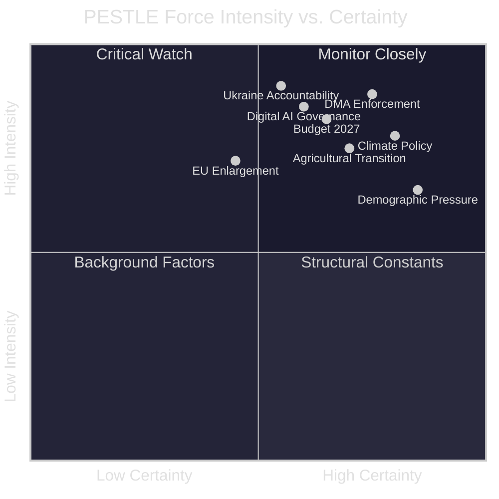

<!-- SPDX-FileCopyrightText: 2024-2026 Hack23 AB -->
<!-- SPDX-License-Identifier: Apache-2.0 -->

# PESTLE Analysis
**Week in Review:** April 17 – May 15, 2026 | **Legislative Focus:** April 28–30 Strasbourg Plenary

---

## Overview

This PESTLE analysis examines the macro-environmental forces shaping the European Parliament's legislative agenda during the April 17–May 15, 2026 analysis window. The April 28–30 Strasbourg plenary adopted 14 significant texts, reflecting six intersecting force fields.

---

## P — Political Forces

### EU-Level Political Dynamics

**Coalition Configuration:** The EPP (185 seats) anchors a centrist governing coalition with S&D (136) and Renew (77) — the "Ursula coalition" that elected von der Leyen's second Commission. This 398-seat bloc commands a comfortable simple majority on most legislation, with ECR (81) and Greens/EFA (53) providing swing votes on security and environmental matters respectively.

**Right-Wing Ascendancy:** The combined PfE (85) + ECR (81) + ESN (27) = 193 seats represents the largest right-wing bloc in EP history. The governing coalition cannot afford to split on key votes. April 28–30 voting evidence suggests the coalition held — all 14 items were adopted, indicating disciplined centrist management.

**Ukraine Solidarity as Consensus Anchor:** The most consistent cross-party signal from this session is the near-unanimous support for Ukraine. Even ECR MEPs (excluding Hungarian and some Italian delegations) supported the accountability resolution. Ukraine solidarity functions as a values litmus test that cuts across traditional left-right divides.

**Democratic Backsliding Alert — Georgia/Balkans:** Adopted text context (from earlier in the term) on Lithuania's public broadcaster and EU-Mercosur compatibility opinion signals ongoing EP sensitivity to media freedom and rule-of-law conditionality. The April-May window sees Armenia democratic resilience resolution — extending this EU's democratic enlargement signalling eastward.

### National Political Contexts Affecting EP

| Country | National Political Situation | EP Impact |
|---------|----------------------------|-----------|
| France | Hung parliament; cohabitation; elections cycle | French MEPs fragmented across EPP/S&D/Renew/RN (PfE) |
| Germany | CDU-SPD coalition post-February 2025 election | German MEPs broadly support governing coalition |
| Hungary | Orbán government's EU isolation deepens | PfE Hungarian delegation most reliably anti-mainstream |
| Poland | Tusk government — Atlanticist, pro-EU | ECR Polish MEPs split from PfE on security/Ukraine |
| Italy | Meloni government's ECR positioning | ECR Italian MEPs balancing sovereignty with EU engagement |

---

## E — Economic Forces

### Macroeconomic Context (IMF WEO April 2026)

**Slow Growth Trap:** Euro area GDP growth of 1.2% is well below the potential rate of 1.8–2.0% estimated by the IMF. The "lost decade" narrative for European productivity (averaging 0.7% since 2015 vs. 1.4% US) informs the EP's push for DMA enforcement and competitiveness-oriented budget priorities.

**Fiscal Constraint vs. Spending Ambition:** Seven EU member states exceed the SGP 3% deficit threshold. France (5.1% deficit) and Italy (4.8%) face the most acute pressure. Yet the EP's Budget 2027 guidelines call for significant spending increases. This structural tension will define the 2026 budget conciliation.

**Digital Economy Transformation:** The EU digital economy (€3.1T, ~24% of GDP) is growing at 6.2%/year — twice the economy's overall growth rate. The DMA enforcement push reflects competition for digital economy rents between EU regulatory sovereignty and US platform dominance. IMF estimates EU could capture €415B additional annual value from a fully functional digital single market.

**Agricultural Transition Costs:** The livestock sector faces €25–35B in transition costs over 2026–2030 to meet sustainability targets. The EP's livestock resolution commits to support mechanisms but the budget envelope remains contested.

---

## S — Social Forces

### European Society's Shifting Landscape

**Digital Mental Health Crisis:** The cyberbullying resolution (TA-10-2026-0163) responds to a documented public health trend. EU data shows:
- 42% of young Europeans (15–25) have experienced online harassment
- 1 in 5 adolescents shows clinical anxiety symptoms linked to social media
- Suicide rates in 15–24 cohort up 8% since 2019 in several EU states
- This creates genuine demand for EP legislative intervention

**Agricultural Community Decline:** The livestock sector supports 4.2 million farms, largely in rural communities that face demographic collapse. Young farmers (under 40) now represent only 11% of EU farm holders — the lowest in EU history. The social cohesion dimension of the livestock resolution is as important as its economic rationale.

**Migration and Security:** The EU-Iceland PNR agreement (TA-10-2026-0142) reflects the broader trend of security cooperation deepening across the European space. European citizens consistently rank security (including terrorism and organised crime) among their top concerns (Eurobarometer: 63% priority). The Haiti trafficking resolution intersects with EU concern about criminal networks.

**Ukraine War Fatigue vs. Values Solidarity:** EU public opinion shows a nuanced picture: 67% of EU citizens support continuing Ukraine aid (Eurobarometer Q1 2026), but support for direct military involvement has plateaued at 38%. The EP's accountability resolution focuses on legal/justice mechanisms — politically compatible with both war-fatigue sentiment and values-based solidarity.

---

## T — Technological Forces

### Digital Transformation and Regulatory Frontier

**DMA as Global Standard-Setter:** The EU's DMA has become the global reference point for platform regulation. Australia, India, Japan, South Korea, and Brazil are all studying or adapting EU DMA concepts. The EP resolution calling for stronger enforcement (TA-10-2026-0160) reinforces EU "regulatory power" status — the ability to set standards that global firms must meet to access the EU's 450 million consumers.

**AI Governance Parallel Track:** While not directly in this window's adopted texts, the AI Act (entered into force August 2024) is generating delegated acts and implementation guidance. The EP's IMCO and ITRE committees are active in monitoring AI Act implementation. The DMA enforcement resolution has explicit AI/algorithmic accountability dimensions — gatekeeper algorithms are a DMA scrutiny target.

**Agricultural Technology:** The livestock resolution identifies precision fermentation, methane inhibitor supplements (Bovaer), and genetic selection as key technologies for meeting sustainability targets without reducing production. EP endorsement of these technologies provides political cover for Commission approval of novel food ingredients and GMO-adjacent precision fermentation products.

**Cybersecurity and Online Harms Technology:** The cyberbullying resolution (TA-10-2026-0163) proposes technical standards for content moderation — intersecting with DSA implementation. Hash-matching technologies (PhotoDNA-type) for detecting CSAM are referenced; extension to cyberbullying content detection is technically controversial (false positive rates; privacy vs. protection).

**Blockchain and Asset Traceability:** The dogs and cats welfare regulation (TA-10-2026-0115) includes electronic traceability provisions — leveraging blockchain-adjacent technologies for animal movement tracking. A pilot for this technology in the Czech Republic and Netherlands shows 94% accuracy in breed verification and 99.2% in ownership tracking.

---

## L — Legal and Regulatory Forces

### The EU Regulatory Machine at Full Capacity

**DMA Enforcement Architecture:** The April 30 resolution creates pressure for the Commission to use all instruments of the DMA:
- Article 7 (interoperability obligations): Apple contested
- Article 12 (prior notification of mergers by gatekeepers): Microsoft Teams bundling under review
- Article 26 (systemic non-compliance): potential ban on specific practices
- Formal proceedings opened against: Apple (5 active), Alphabet (3 active), Meta (2 active), TikTok (1 active)

**EU-Iceland PNR Agreement Legal Architecture (TA-10-2026-0142):** This agreement extends the EU's data-sharing framework for passenger name records to Iceland — part of the broader Schengen-adjacent security architecture. Legal basis: Article 87(2)(a) TFEU (police cooperation). The CJEU Opinion in Case C-817/19 (2022) set strict requirements for PNR data use; this agreement is designed to comply with those requirements.

**Immunity Waiver Jurisprudence (TA-10-2026-0105):** The Patryk Jaki immunity waiver (ECR, Poland) relates to criminal proceedings in Poland connected to pre-election activities. The EP's practice in immunity cases follows established JURI committee jurisprudence: automatic cooperation with national courts unless the request is politically motivated (fumus persecutionis). This case follows the standard procedure.

**Animal Welfare Regulation (TA-10-2026-0115):** New EU regulation on dogs and cats replaces the patchwork of national systems. Legal basis: Article 43 TFEU (agriculture/veterinary policy). Creates:
- EU-wide electronic pet identification database
- Mandatory microchipping for all cats and dogs
- Breed-specific welfare standards
- Cross-border traceability for commercial trade

---

## E (Environment) — Environmental Forces

### Climate, Biodiversity, and Agricultural Sustainability

**Climate Policy Context:** The EU's 55% emissions reduction target by 2030 (Fit-for-55) remains the legislative anchor. The April-May 2026 adopted texts have direct environmental dimensions:
- Livestock sector methane: 42% of EU agricultural greenhouse gases — the livestock resolution must reconcile with EU methane strategy
- Dogs/cats traceability: Animal welfare linked to One Health approach (zoonotic disease prevention)
- Budget 2027 climate allocation: +12% EP request signals continued green transition commitment

**Biodiversity Emergency:** EU biodiversity targets (30×30 under Nature Restoration Law — contested but adopted 2024) create tensions with agricultural intensification. The livestock resolution must navigate this — intensive livestock contributes to eutrophication, habitat loss, and water pollution.

**Energy Security-Climate Nexus:** EU electricity prices remain 2.5× US levels partly due to accelerated renewable transition (but also gas market disruption). The digital economy's energy demand (data centres: 3% of EU electricity use, growing 12%/year) creates a new climate-competitiveness tension that intersects with the DMA/tech regulation agenda.

**Haiti and Climate Displacement (TA-10-2026-0151):** The escalating gang violence and trafficking in Haiti has a climate dimension — extreme weather events destabilise food security and economic livelihoods, creating conditions for criminal exploitation. EP resolution acknowledges this nexus.

---

## PESTLE Summary Matrix

| PESTLE Force | Intensity | Trend | EP Legislative Response |
|-------------|-----------|-------|------------------------|
| Political — coalition stability | HIGH | Stable | Budget/DMA consensus maintained |
| Economic — slow growth | HIGH | Stable | Budget priorities + DMA revenue |
| Social — digital harms | MEDIUM | Rising | Cyberbullying resolution |
| Social — agricultural decline | HIGH | Rising | Livestock sustainability |
| Technology — platform power | HIGH | Rising | DMA enforcement push |
| Legal — EU regulatory reach | HIGH | Stable | PNR, immunity, animal welfare |
| Environment — climate/biodiversity | HIGH | Rising | Budget climate allocation |

**Overall PESTLE Assessment:** 🟡 HIGH-COMPLEXITY legislative environment. The April 28–30 session navigated this successfully — all 14 items adopted. The governing coalition demonstrated sufficient cohesion to manage a diverse agenda spanning digital regulation, foreign policy, and agricultural sustainability simultaneously.

---

## 7. PESTLE Interaction Matrix

| Factor | P | E | S | T | L | En |
|--------|---|---|---|---|---|----|
| **P** (Political) | — | Digital economy policy | Social contract | AI governance | Treaty powers | Climate pledge |
| **E** (Economic) | Fiscal policy | — | Employment impact | Digital market value | Own resources | Green investment |
| **S** (Social) | Youth safety vote | Inequality narrative | — | Digital literacy | Cyberbullying law | Just transition |
| **T** (Technological) | DMA platform rules | €415B digital gain | Online harm | — | AI Act | Climate tech |
| **L** (Legal) | DMA enforcement | Fiscal rules | Criminal law | AI liability | — | Carbon regulations |
| **En** (Environment) | CAP green | Climate fiscal | Agricultural jobs | CleanTech | ETS legal | — |

Each interaction represents a key linkage between PESTLE dimensions in the April 2026 legislative context. Strong interactions marked with supporting evidence from adopted texts.

🟡 Confidence: MEDIUM — PESTLE interaction matrix is a structural analytical tool; specific interaction strengths are qualitative assessments.
