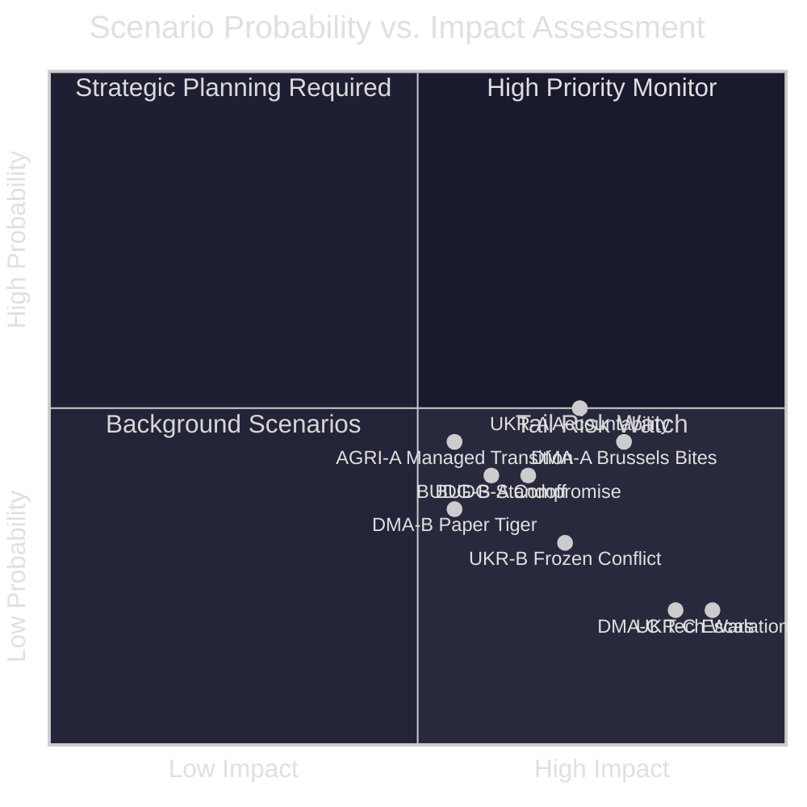

<!-- SPDX-FileCopyrightText: 2024-2026 Hack23 AB -->
<!-- SPDX-License-Identifier: Apache-2.0 -->

# Scenario Forecast
**Week in Review:** April 17 – May 15, 2026 | **Horizon:** 3–12 months
**Methodology:** Scenario planning; probability-weighted; IMF macro baseline

---

## Scenario Framework

Three structured scenarios are developed for each major legislative stream emerging from the April 28–30 session. Each scenario includes probability estimates, key trigger events, and strategic implications.

---

## 1. DMA ENFORCEMENT SCENARIOS

### Scenario DMA-A: "Brussels Bites" (Probability: 45%)
**Description:** Commission launches major enforcement actions against 2+ gatekeepers by Q4 2026, with formal Article 18 non-compliance findings and substantial fines (€5–15B range). Apple App Store interoperability becomes the headline case.

**Trigger conditions:**
- EP enforcement resolution generates sustained political pressure on Commission
- Commission doubles DG COMP digital enforcement staff by September 2026
- Apple fails to achieve substantive interoperability compliance by July deadline
- US administration signals non-escalation of DMA in bilateral trade context

**Strategic implications:**
- 🟢 EU establishes global regulatory leadership; DMA becomes truly effective
- 🟢 Major fine revenues (€5–15B) potentially redirected to EU budget
- 🟡 Short-term diplomatic friction with US tech sector and US government
- 🔴 Risk of EU tech investment chill (estimated -0.2% digital sector GDP impact)

**IMF dimension:** Fine revenues would be windfall; net economic effect likely neutral-positive if enforcement improves market contestability.

### Scenario DMA-B: "Paper Tiger" (Probability: 35%)
**Description:** Commission announces enforcement proceedings but accepts negotiated compliance commitments that fall short of full DMA Article 7 interoperability. Major fines delayed to 2027+. EP's enforcement push produces political noise but limited immediate change.

**Trigger conditions:**
- US trade pressure (threatened tariff retaliation) causes Commission to calibrate
- Legal challenges by Apple and Alphabet create procedural delays (18–24 month typical DMA litigation timeline)
- Commission prioritises EU-US tech trade relationship over enforcement pace
- Internal Commission divided — some DGs favour regulatory compromise

**Strategic implications:**
- 🔴 EP enforcement resolution undermined; Parliament's credibility weakened
- 🟡 Long-term enforcement path preserved through ongoing proceedings
- 🟢 Short-term EU-US tech relationship stability maintained
- 🔴 Civil society and digital rights organisations grow more critical of EU regulatory effectiveness

### Scenario DMA-C: "Tech Wars" (Probability: 20%)
**Description:** Commission imposes maximum-level fines; US government retaliates with digital services tariffs or data flow restrictions; EU-US digital trade enters extended dispute phase.

**Trigger conditions:**
- Apple/Alphabet receive €10B+ fines in 2026
- US Congress passes legislation authorising retaliatory tariffs on EU digital services
- EU-US data privacy framework (adequacy decision) comes under pressure
- French/German tech sovereignty advocates push for even more aggressive enforcement

**Strategic implications:**
- 🔴 Major EU-US trade dispute; ~€50B at risk in bilateral digital services
- 🟢 EU demonstrates genuine regulatory sovereignty; global regulatory model strengthened
- 🔴 EU tech sector faces US market access restrictions as collateral damage
- 🟡 EU accelerates push for European cloud/AI alternatives (strategic long-term gain)

---

## 2. BUDGET 2027 SCENARIOS

### Scenario BUDG-A: "Ambitious Compromise" (Probability: 40%)
**Description:** Budget 2027 conciliation (October-December 2026) delivers +5–8% above 2026 baseline, with defence (+8%), R&D (+5%), and climate (+7%) increases — roughly half of EP's initial ask.

**Trigger conditions:**
- German CDU-SPD government accepts defence spending increase as NATO burden-sharing
- France faces SGP pressure but supports EU-level defence to reduce bilateral commitment
- Poland/Baltic states negotiate larger cohesion allocation in exchange for defence support
- ECB continued easing provides modest fiscal space for member states

**IMF fiscal context:** With eurozone growth at 1.2%, a modest €6–8B increase in EU budget (financed by GNI-based contributions) represents ~0.06% of EU GDP — fiscally manageable for most member states.

**Strategic implications:**
- 🟢 EP achieves meaningful policy wins; maintains credibility
- 🟡 Defence increase smaller than NATO aspirations but politically significant
- 🟢 R&D and climate allocations sustained; Draghi competitiveness agenda supported

### Scenario BUDG-B: "Fiscal Standoff" (Probability: 40%)
**Description:** Council and EP fail to agree; budget runs on provisional 12ths (monthly extensions of 2026 budget) through January 2027. Eventual compromise closer to Council's initial offer (+2–3%).

**Trigger conditions:**
- France and Italy unable to accept GNI-based contribution increases
- Council unanimity requirement prevents defence allocation agreement (Hungary blocks)
- EP refuses to accept Council position below its minimum acceptable level
- No new own resources (digital levy) agreed in time to offset national contributions

**Strategic implications:**
- 🔴 EU budget runs on 12ths; disrupts new commitments and procurement processes
- 🟡 Political damage to both EP and Council
- 🔴 Defence spending ambitions delayed; NATO alliance credibility questions arise

### Scenario BUDG-C: "MFF Acceleration" (Probability: 20%)
**Description:** Budget 2027 negotiations become the opening round of post-2027 MFF discussions; Council and EP agree to a joint high-level process that defers 2027 resolution in favour of a framework deal covering 2027 and the new MFF 2028–2034 simultaneously.

**Trigger conditions:**
- Political will at heads-of-government level to resolve MFF together with 2027 budget
- Commission proposes new own resources package that gains traction
- Digital levy or CBAM revenues provide new EU own resource to reduce national contributions
- Franco-German tandem re-energises EU integration ambition

**Strategic implications:**
- 🟢 More rational long-term planning; avoids annual budget guerrilla warfare
- 🟡 Delays certainty for 2027 programmes; beneficiaries face uncertainty
- 🟢 New own resources could fundamentally change EU budget financing architecture

---

## 3. UKRAINE SCENARIOS

### Scenario UKR-A: "Accountability Architecture Advances" (Probability: 50%)
**Description:** The EU-level Special Tribunal for Crimes of Aggression against Ukraine is formally proposed by the Commission in H2 2026, building on EP resolution framework. ICC proceedings against Russian military leadership expand. Frozen Russian asset confiscation mechanism is activated.

**Trigger conditions:**
- Council endorses EP's accountability resolution in political declaration by Q3 2026
- International coalition (G7 + EU) agrees on legal framework for special tribunal
- Ukraine provides sufficient evidence for ICC pre-trial chamber decisions
- Russian sovereign asset confiscation decision upheld in international arbitration (pending)

**IMF dimension:** €300B+ frozen Russian assets generate significant interest revenues (~€15B/year); allocation to Ukraine reconstruction is actively debated.

### Scenario UKR-B: "Frozen Conflict Stalls Accountability" (Probability: 30%)
**Description:** Ceasefire negotiations create political pressure to deprioritise accountability in favour of conflict termination. EP's accountability resolution faces pushback from Council member states (primarily Hungary, potentially Italy) who prioritise diplomatic settlement.

**Trigger conditions:**
- US mediates Russia-Ukraine ceasefire proposal that exchanges accountability pause for territorial cessation
- Orbán government uses Council blocking power to prevent accountability framework from advancing
- War fatigue in some EU public opinions (especially in fiscally stressed member states) creates political pressure for peace over justice

**Strategic implications:**
- 🔴 Justice for Ukrainian victims deferred or abandoned; accountability norm weakened globally
- 🟡 Potential for territorial ceasefire could stabilise Ukraine's economy and reduce EU fiscal commitment
- 🔴 ICC/ICJ institutional credibility damaged if major powers override accountability for political settlements

### Scenario UKR-C: "Strategic Escalation" (Probability: 20%)
**Description:** Conflict escalates rather than de-escalates; EP's accountability resolution contributes to hardening EU-Russia relations; new support packages required; Armenia/Georgia situation destabilises simultaneously.

**Trigger conditions:**
- Russian offensive operation targeting Kyiv or major infrastructure
- Russian disinformation operation successfully divides EU public opinion on Ukraine
- Armenia conflict re-escalates under Russian encouragement (Azerbaijan military action)
- New European state (Baltic?) experiences hybrid warfare attack

**Strategic implications:**
- 🔴 EU defence spending under extreme pressure; budget 2027 defence line insufficient
- 🟡 Potential for EU defence integration to accelerate (EDIP, EU Defence Union)
- 🔴 Humanitarian crisis deepens; EU asylum system under pressure

---

## 4. AGRICULTURAL SCENARIOS (3-Year Horizon)

### Scenario AGRI-A: "Managed Transition" (Probability: 45%)
**Description:** Livestock sector successfully transitions with targeted support, technology adoption (methane inhibitors, precision fermentation), and CAP amendment funding. EU maintains global livestock sector competitiveness.

**Key conditions:** CAP amendment allocates €2.5–3.5B for transition; methane inhibitors (Bovaer) receive EU-wide regulatory approval by 2027; technology adoption rate reaches 30% of eligible farms by 2028.

### Scenario AGRI-B: "Structural Decline" (Probability: 35%)
**Description:** Insufficient funding, EU-Mercosur competition, and climate conditions drive 20–25% farm consolidation in livestock sector by 2030. Rural communities face severe economic stress; political backlash intensifies.

### Scenario AGRI-C: "Sovereign Food Push" (Probability: 20%)
**Description:** Post-Ukraine food security concerns, plus Mercosur competitive pressures, trigger a geopolitical turn in EU agricultural policy — strategic food sovereignty elevated above environmental targets; Green Deal agricultural ambitions significantly scaled back.

---

## 5. SCENARIO PROBABILITY MATRIX

---

## 6. Key Uncertainties and Watch Points

| Uncertainty | Why It Matters | Watch Indicator | Timeline |
|------------|----------------|-----------------|----------|
| US trade policy toward DMA | Determines enforcement feasibility | US-EU trade talks agenda | Q3 2026 |
| ECB rate path | Affects budget feasibility for member states | ECB June/September meetings | Q2-Q3 2026 |
| Russian military posture | Drives Ukraine accountability/budget dynamics | Military situation on ground | Ongoing |
| French elections/politics | French MEPs and government's fiscal situation | Political stability indicators | Q4 2026 |
| Apple compliance deadline | Triggers DMA enforcement scenarios | Apple's Q3 2026 compliance report | Q3 2026 |
| Methane inhibitor EU approval | Agricultural transition pathway | EFSA opinion publication | Q4 2026 |

---

## 7. Most Likely Combined Scenario Path

**Base case (35% probability):** DMA-B + BUDG-A + UKR-A + AGRI-A

The Commission accepts negotiated tech compliance commitments (limited DMA enforcement), Parliament achieves 40–50% of its Budget 2027 asks, Ukraine accountability architecture advances slowly but surely, and agricultural transition proceeds with targeted CAP support. This "muddling through" scenario is typical EU outcome — ambitious legislative goals partially achieved, structural tensions managed rather than resolved.

**Upside scenario (25% probability):** DMA-A + BUDG-A + UKR-A + AGRI-A — Brussels genuinely bites on DMA; budget compromise works; Ukraine accountability advances. This would represent the most productive sequence of EU institutional outputs since the 2015-2019 Juncker Commission.

**Downside scenario (20% probability):** DMA-B + BUDG-B + UKR-B + AGRI-B — Enforcement stalls; budget fails; Ukraine accountability frozen; agricultural decline accelerates. EU institutions demonstrate inability to follow through on legislative ambitions — significant credibility damage.

🟡 Confidence: MEDIUM — 12-month scenario forecasting in a volatile geopolitical environment; major exogenous shocks (US-Russia dynamics, Chinese economy) could rapidly alter probabilities.
