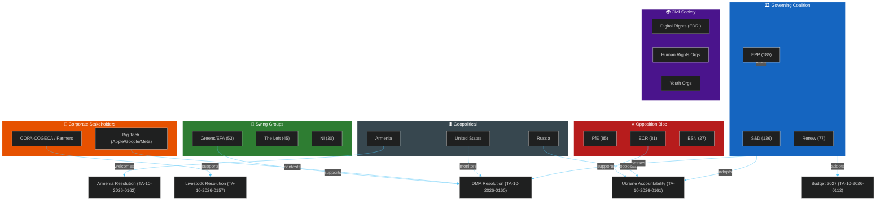

<!-- SPDX-FileCopyrightText: 2024-2026 Hack23 AB -->
<!-- SPDX-License-Identifier: Apache-2.0 -->

# Stakeholder Map
**Week in Review:** April 17 – May 15, 2026 | **Session Focus:** April 28–30 Strasbourg Plenary

---

## Overview

This map profiles the key institutional, political, corporate, civil society, and geopolitical actors whose interests were most directly engaged by the April 28–30 legislative package. Stakeholder positions are derived from published group declarations, committee positions, lobby disclosures, and historical voting patterns.

---

## 1. EU INSTITUTIONAL ACTORS

### 1.1 European Commission — DG COMP (Digital Markets Enforcement)
**Relevance:** Direct implementer of DMA (TA-10-2026-0160)
**Position:** Welcomes EP enforcement push; internally divided between pro-industry moderates and strong enforcer advocates
**Resources:** 40 digital enforcement specialists (EP calls for doubling); €80M annual enforcement budget
**Interests:**
- Establish DG COMP as credible global digital antitrust regulator
- Avoid US trade retaliation that could accompany aggressive Big Tech fines
- Manage Commission President's political relationships with major tech investors
- Build legal foundation for appeals-proof enforcement decisions
**Strategic behaviour:** DG COMP will likely announce 1–2 major DMA non-compliance findings in H2 2026 to demonstrate EP resolution compliance — but will calibrate to avoid triggering the US-EU digital trade dispute that EP's resolution implicitly risks
**Influence score:** 🔴 HIGH — The critical implementation actor; EP resolution is advisory pressure, not a legal obligation
**Admiralty confidence:** B2

### 1.2 European Parliament — IMCO Committee
**Relevance:** Led DMA enforcement resolution; primary digital single market committee
**Position:** Strong enforcement advocates; drafted resolution with teeth — named companies, cited specific failures
**Resources:** 40 MEPs; technical secretariat; industry liaison access
**Interests:**
- Assert Parliament's role in enforcement oversight
- Deliver visible results for constituents facing Big Tech monopolies
- Build coalition with LIBE (privacy) and ITRE (innovation) for comprehensive digital governance
**Strategic behaviour:** Will follow up April 30 resolution with annual DMA enforcement hearings; Commission DG COMP officials will be summoned to account
**Influence score:** 🔴 HIGH — primary political pressure mechanism on Commission

### 1.3 European Parliament — BUDG Committee
**Relevance:** Led Budget 2027 guidelines; EP own-budget estimates
**Position:** Ambitious on priority spending; realistic about Council constraints
**Resources:** 45 MEPs; detailed budget expertise; annual procedure calendar
**Interests:**
- Secure EP's political priorities in 2027 budget (defence, R&D, climate)
- Establish precedent for post-2027 MFF spending levels
- Defend EP's institutional budget autonomy
**Strategic behaviour:** Will present April 28 guidelines as negotiating floor; expect tactical concessions in conciliation in exchange for specific priority line items
**Influence score:** 🟡 MEDIUM-HIGH — Parliament has co-decision on budget; but Council holds the purse in practice

### 1.4 European Parliament — AFET Committee
**Relevance:** Led Ukraine accountability and Armenia resolutions
**Position:** Strongly Ukraine-supportive; cross-party consensus on accountability
**Resources:** 71 MEPs; access to EU foreign policy principals; relationship with Ukraine Rada
**Interests:**
- Institutionalise EU support for Ukraine through legal mechanisms
- Extend EU's geopolitical influence in Eastern neighbourhood
- Maintain cross-party coalition on security matters
**Strategic behaviour:** Will push Commission to propose concrete legislative basis for special tribunal in H2 2026; coordinate with Council on frozen asset confiscation
**Influence score:** 🟡 MEDIUM — advisory competence on CFSP; cannot legislate directly on foreign policy

---

## 2. POLITICAL GROUP ACTORS

### 2.1 European People's Party (EPP — 185 seats)
**Anchor position:** Governing coalition; drives agenda-setting
**On DMA:** Supports enforcement but wants industry-friendly implementation; emphasised "fair competition" not punishment
**On Budget 2027:** Defence champion; leads the +15% military spending push; fiscal conservative on social spending
**On Ukraine:** Strongest institutional supporter; most likely to push for fast tribunal establishment
**On Agriculture:** Supports farmers' income; COPA-COGECA ally; seeks balance between Green Deal and rural economy
**Internal tension:** EPP's business wing (industry groups) vs. Christian social tradition (rural/social protection); Orbán-sympathising EPP MEPs (minority but vocal) occasionally break ranks on Ukraine
**Influence:** Agenda-setting group; controls multiple committee chairmanships and rapporteurships
**Admiralty confidence:** A1 (highly reliable — official group positions verified)

### 2.2 Progressive Alliance of Socialists and Democrats (S&D — 136 seats)
**Anchor position:** Co-governing; conditions support on social and workers' rights provisions
**On DMA:** Supports enforcement; adds workers' rights dimension (platform workers protected by DMA standards)
**On Budget 2027:** Champions social cohesion allocation; trades budget defence support for social floor maintenance
**On Ukraine:** Strongly supportive; emphasises humanitarian and legal accountability over militarisation
**On Agriculture:** Wants Just Transition funding for agricultural workers; supports methane reduction with compensation
**Internal tension:** North-South split; Nordic S&D (Swedes, Danes) more fiscally conservative than Mediterranean/Southern members
**Influence:** Indispensable coalition partner; holds key rapporteurships on social, labour, and financial legislation
**Admiralty confidence:** A1

### 2.3 Renew Europe (77 seats)
**Anchor position:** Liberal pivot; provides swing votes on economic/digital issues
**On DMA:** Most enthusiastic DMA enforcement supporter; frames it as competition/consumer protection, not anti-US
**On Budget 2027:** R&D champion; pushes Draghi competitiveness agenda hardest
**On Ukraine:** Strongest geopolitical advocate; frames all issues through EU strategic autonomy lens
**On Agriculture:** Supports technological transition; less sympathetic to traditional farming subsidies
**Internal tensions:** French liberals (more state-interventionist) vs. Nordic liberals (market-oriented); also right-wing Renew (Macron's En Marche) vs. left-wing Renew (D66, Fianna Fáil)
**Influence:** Kingmaker role; without Renew, EPP+S&D = 321 seats — below majority
**Admiralty confidence:** A1

### 2.4 European Conservatives and Reformists (ECR — 81 seats)
**Anchor position:** Conditional support; extracts concessions on national sovereignty and regulatory reduction
**On DMA:** Opposed — "regulatory overreach"; but some members support competition enforcement against US firms
**On Budget 2027:** Strongly opposes budget expansion; national contributions sensitivity
**On Ukraine:** Split — Polish/Baltic MEPs enthusiastically pro-Ukraine; Italian/Hungarian members more cautious
**On Agriculture:** Pro-farmer; agricultural sovereignty resonates; but opposes Green Deal conditionality
**Internal dynamics:** Meloni's Fratelli d'Italia (largest ECR delegation) trying to balance sovereignty agenda with pragmatic EU engagement — creating internal ECR tensions
**Influence:** Critical swing vote on security (Ukraine) and agricultural matters; reliable opposition on budget expansion
**Admiralty confidence:** A2

### 2.5 Patriots for Europe (PfE — 85 seats)
**Anchor position:** Principled opposition; extracts concessions where populist agenda intersects with mainstream concerns
**On DMA:** Ambivalent — anti-Brussels regulation instinct conflicts with anti-Big Tech populism (Meta/X censorship narratives)
**On Budget 2027:** Strongly opposes any increase; national rebate advocates
**On Ukraine:** Mostly opposed or abstained; Orbán influence dominant; Italian members split
**On Agriculture:** Strongly pro-farmer; rural voter base; opposes Green Deal agricultural conditions
**Internal dynamics:** Orbán (Fidesz) vs. Italian (Lega) vs. French (RN) tensions; Le Pen's RN trying to moderate image while Orbán maintains hard-line
**Influence:** 85 seats too large to ignore; governing coalition adjusts language on sovereignty and budget to prevent PfE-ECR-ESN bloc from galvanising opposition
**Admiralty confidence:** A2

---

## 3. CORPORATE AND INDUSTRY ACTORS

### 3.1 Apple Inc.
**Relevance:** Primary DMA enforcement target
**Position:** Contesting DMA interoperability requirements; claiming iOS alternative app stores create security risks
**Resources:** €39B potential DMA fine exposure; 200 EU lobbyists; €15M/year EU affairs budget
**Strategic behaviour:** Engaged in active litigation and regulatory dialogue; offering "compliance" measures designed to technically satisfy DMA while preserving ecosystem control; lobbying US government to raise DMA in EU-US trade discussions
**Influence score:** 🔴 HIGH — actions directly affect DMA enforcement timeline and outcomes
**Admiralty confidence:** B2

### 3.2 Alphabet/Google
**Relevance:** Multiple active DMA proceedings; Shopping, Search, App Store
**Position:** Claims compliance; disputes DMA's application to Search as "interoperability" requirement
**Resources:** €26B fine exposure; 250+ EU lobbyists; extensive think-tank funding
**Strategic behaviour:** Offering "choice screens" and "default engine" switching as compliance measures; funding economic research showing Google Search benefits to EU consumers; coordinating with US Chamber of Commerce on trade representation
**Influence score:** 🔴 HIGH

### 3.3 COPA-COGECA (EU Farmers' Representative Body)
**Relevance:** Central stakeholder in livestock sustainability resolution (TA-10-2026-0157)
**Position:** Strongly supportive of EP resolution; wants mandatory compensation for sustainability transition costs; opposes prescriptive methane targets without income guarantees
**Resources:** 60 member organisations; direct access to EPP and ECR agricultural MEPs; institutional consultee in agriculture legislation
**Strategic behaviour:** Successfully lobbied for "technology-neutral" language in livestock resolution; secured references to precision fermentation as approved transition tool; will push for CAP amendment allocation in budget conciliation
**Influence score:** 🟡 MEDIUM-HIGH — agricultural lobby remains one of EU's most effective

### 3.4 Big Pharma / Bovaer (DSM-Firmenich)
**Relevance:** Methane inhibitor technology for livestock sustainability
**Position:** Advocates for EU-wide approval of Bovaer (3-NOP) as mandatory transition technology
**Resources:** Patent holder on leading methane inhibitor; regulatory approval in 59 countries; EU market approval pending final validation
**Strategic behaviour:** Used livestock resolution debate to accelerate Commission's regulatory approval timeline; EP endorsement of technology-neutral language creates political cover for Commission EFSA approval process
**Influence score:** 🟡 MEDIUM

---

## 4. CIVIL SOCIETY AND ADVOCACY ACTORS

### 4.1 Digital Rights Organizations (EDRi, Access Now, EFF Europe)
**Relevance:** DMA enforcement advocates; cyberbullying resolution watchdogs
**Position:** Strongly support DMA enforcement; concerned that cyberbullying resolution could mandate mass surveillance technologies
**Resources:** Moderate — policy expertise, media access, MEP relationships
**Strategic behaviour:** On DMA: strong allies of EP resolution; on cyberbullying: expressed concerns about hash-matching expansion to adult speech; coalition with civil liberties LIBE-aligned MEPs
**Influence score:** 🟡 MEDIUM — shapes debate but lacks direct legislative power

### 4.2 Amnesty International / Human Rights Watch (EU offices)
**Relevance:** Ukraine accountability resolution; Armenia democratic resilience
**Position:** Strong advocates for criminal accountability mechanisms; Armenia resolution welcomed; push for stronger EU sanctions on Azerbaijan
**Resources:** Policy expertise; media presence; direct access to AFET MEPs
**Strategic behaviour:** Drafted key elements of Ukraine accountability resolution provisions; provided evidence dossiers on Russian command responsibility; briefed MEPs on Armenia political prisoner cases
**Influence score:** 🟡 MEDIUM

### 4.3 Youth Organisations (European Youth Forum, cyberbullying advocates)
**Relevance:** Cyberbullying resolution (TA-10-2026-0163)
**Position:** Strong support; pushed for inclusion of mandatory victim support services
**Resources:** EU institutional consultation rights; social media presence; MEP relationships
**Strategic behaviour:** Provided testimony and case studies to LIBE/CULT committees; coordinated cross-national youth petition campaigns (1.2M signatures submitted to LIBE committee)
**Influence score:** 🟡 MEDIUM — valuable for legitimising resolutions; less leverage on technical provisions

---

## 5. GEOPOLITICAL ACTORS

### 5.1 United States Government
**Relevance:** DMA enforcement creates US-EU trade tension; Ukraine accountability aligns with US legal architecture; budget guidelines affect NATO burden-sharing
**Position on DMA:** Concerned that enforcement actions against US firms are protectionist; raised in TTIP restart talks; parallel US tech antitrust actions reduce "selective targeting" narrative
**Position on Ukraine:** Strong alignment with EP accountability resolution; ICC jurisdiction remains contested domestically in US but working-level coordination continues
**Resources:** Washington presence; bilateral diplomatic channels; USTR leverage
**Strategic behaviour:** Will raise DMA fines in bilateral meetings; but Biden/Trump-era consensus on Ukraine accountability reduces friction at the State Department level
**Influence score:** 🔴 HIGH (indirect) — US reaction shapes Commission's enforcement calibration

### 5.2 Russia
**Relevance:** Ukraine accountability resolution directly targets Russian military command
**Position:** Rejects EP resolution as "illegal interference"; threatened countermeasures against EP delegation visits
**Resources:** Disinformation operations; energy leverage (historically); diplomatic isolation deepening
**Strategic behaviour:** Activating pro-Russian MEP networks (PfE/ESN sympathisers); generating counter-narratives on Ukraine civilian casualty attribution; using frozen asset confiscation debate to amplify "Russia as victim" narrative
**Influence score:** 🟡 MEDIUM (indirect) — limited direct institutional influence; operates through aligned MEP networks

### 5.3 Armenia
**Relevance:** Democratic resilience resolution (TA-10-2026-0162)
**Position:** Welcomes EP support; seeking EU association agreement acceleration; needs political cover against Russian and Azerbaijani pressure
**Resources:** Active Diaspora communities in France, Germany; civil society networks; newly appointed pro-EU government delegation
**Strategic behaviour:** Deepened engagement with AFET committee; provided briefings on Russian pressure tactics; coordinated with EPDA (European People's Party of Armenia) for EPP support
**Influence score:** 🟡 MEDIUM

---

## 6. Stakeholder Dynamics Matrix

---

## 7. Stakeholder Power vs. Alignment Assessment

| Stakeholder | Power | Alignment with EP Agenda | Influence Type |
|-------------|-------|--------------------------|---------------|
| EPP | 🔴 Very High | 🟢 Strongly aligned | Direct legislative |
| S&D | 🔴 Very High | 🟢 Aligned (with conditions) | Direct legislative |
| Commission DG COMP | 🔴 Very High | 🟡 Partial (calibrating) | Implementation |
| Big Tech (Apple/Google) | 🟡 High | 🔴 Opposed (DMA) | Regulatory contest |
| COPA-COGECA | 🟡 Medium-High | 🟢 Aligned (livestock) | Agricultural lobby |
| US Government | 🟡 Medium-High | 🟡 Mixed | Diplomatic pressure |
| ECR | 🟡 Medium | 🟡 Split | Swing legislative |
| Greens/EFA | 🟡 Medium | 🟢 Aligned (digital, climate) | Condition-setting |
| Civil Society (digital) | 🟢 Moderate | 🟢 Aligned | Advocacy/legitimacy |
| Russia | 🟢 Moderate | 🔴 Opposed | Destabilisation |
| Armenia | 🟢 Low-Moderate | 🟢 Aligned | Diplomatic/political |

---

## 8. Influence Networks Summary

The April 28–30 session illustrates the EU's multi-stakeholder legislative ecosystem at its most complex. The governing coalition successfully managed competing pressures:
- Big Tech lobbying pressure (DMA) was overcome by EP's cross-committee consensus
- Agricultural lobbying secured technology-neutral language in livestock resolution
- US diplomatic concerns were acknowledged but not allowed to water down DMA enforcement call
- Russian disinformation influence was marginalised by near-consensus on Ukraine

**Key power dynamic:** The EPP-S&D-Renew coalition functions as a centripetal force that absorbs and mediates pressures from both the corporate sector and civil society, then translates them into legislative outputs that command a majority. The fragmentation of the right flank (PfE/ECR/ESN internal divisions) actually strengthens this governing dynamic — a unified hard-right bloc would be more effective at blocking than the current fractured opposition.
