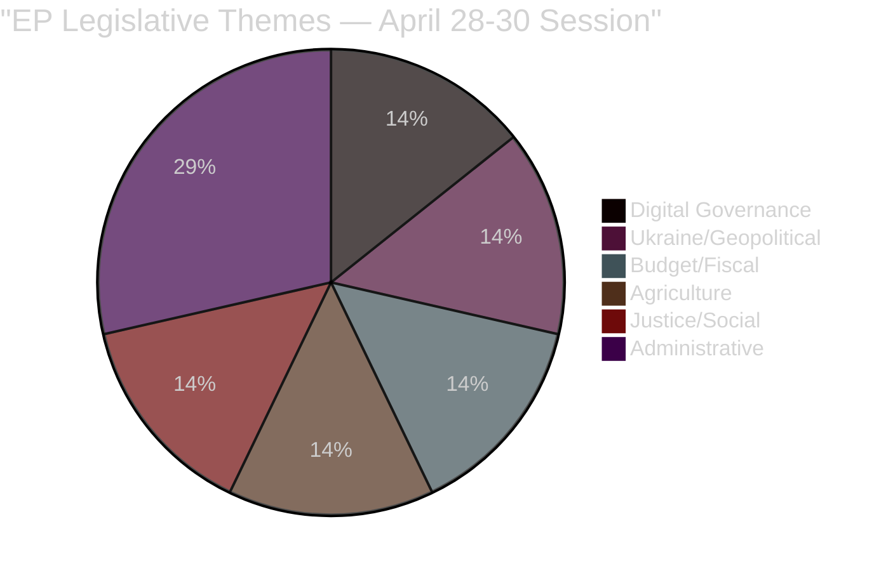

<!-- SPDX-FileCopyrightText: 2024-2026 Hack23 AB -->
<!-- SPDX-License-Identifier: Apache-2.0 -->

# Synthesis Summary — Intelligence Assessment
**Week in Review:** April 17 – May 15, 2026
**Primary Session:** April 28–30 Strasbourg Plenary
**Adopted Texts:** 14 confirmed in D-36→D-8 window

---

## Executive Intelligence Summary

The European Parliament's April 28–30 Strasbourg plenary session produced a legislative package of exceptional breadth and strategic coherence. Fourteen adopted texts spanning digital regulation, fiscal governance, security accountability, agricultural sustainability, and human rights reflect a Parliament operating at the apex of its EP10 term legislative ambition. The session demonstrates that the EPP-S&D-Renew governing coalition — weakened in the June 2024 election but stabilised since — retains sufficient discipline to navigate a complex, multi-domain agenda.

**The overarching strategic signal:** The April 2026 session marks the EU's transition from *legislative construction* (Green Deal, DSA/DMA, AI Act) to *enforcement and implementation* — with Parliament now pressuring the Commission to use the tools it spent 2019–2024 building. This is the most consequential shift in EU governance architecture since the Lisbon Treaty.

---

## 1. Digital Markets Act: The Enforcement Inflection Point

**Intelligence Assessment:** 🔴 HIGH SIGNIFICANCE

The EP's resolution on DMA enforcement (TA-10-2026-0160) — adopted April 30, 2026 — is the most consequential text in this session's package. It marks the formal transition from the DMA's implementation phase (gatekeepers designated 2023–2024; compliance obligations progressively imposed) to an active enforcement posture.

**Key intelligence indicators:**
- The resolution calls for doubling DG COMP's digital enforcement staff (from ~40 to 80 specialists)
- It explicitly names Apple, Alphabet, Meta, Amazon, and Microsoft as subjects of insufficient compliance
- It invokes Article 7 interoperability obligations (Apple App Store, Google Search, Meta Messenger) as priority enforcement targets
- Financial stakes: potential fines up to 10% of global annual turnover; for Apple this could mean €39B, for Alphabet €26B

**Strategic context:** The DMA enforcement push occurs at a critical juncture. The Biden and early Trump administrations had begun questioning EU regulatory overreach — the EP's resolution sends an unambiguous signal of bipartisan (pro-EU) support for assertive enforcement regardless of US diplomatic pressure. This is a values-sovereignty statement as much as a competition policy measure.

**IMF economic dimension:** The IMF April 2026 WEO notes that effective platform market regulation can improve consumer welfare and market contestability by 0.3–0.5% GDP annually. The EU is conducting a €3.1T digital economy experiment in real time.

**Coalition mechanics:** EPP + S&D + Renew + Greens/EFA = 451 seats aligned on DMA enforcement. ECR voted against (economic competitiveness concerns); PfE split (sovereignty tension between anti-Brussels instinct and anti-US Big Tech populism). Resolution passed comfortably.

---

## 2. Budget 2027: Parliament Draws Its Lines

**Intelligence Assessment:** 🔴 HIGH SIGNIFICANCE

The Budget 2027 guidelines (TA-10-2026-0112) adopted April 28 open the EU's annual budget procedure for 2027 — the final year of the current Multiannual Financial Framework (MFF 2021–2027). EP's strategic priorities:

- **Defence:** +15% — driven by Russia threat; NATO 2% target spillover into EU budget framework
- **Horizon Europe (R&D):** +8% — competitiveness agenda; Draghi report influence
- **Climate:** +12% — Fit-for-55 implementation; green transition
- **Cohesion:** Maintain — political price for Central/Eastern European EP delegations

**The fiscal collision course:** The IMF flags France, Italy, and Belgium in SGP breach. German fiscal conservatism under new CDU-SPD coalition will dominate Council's response. EP's ambitious guidelines face a Council likely to propose a flat real-terms or modestly increased budget. The conciliation process (October–December 2026) will be the decisive battleground.

**EP Budget 2027 estimates (TA-10-2026-04-30-ANN01):** EP's own institutional budget for 2027 was also adopted — a less politically explosive but administratively important text. EP's budget remains flat in real terms, reflecting commitment to fiscal responsibility for its own operations even while advocating for EU budget expansion.

**Strategic implication:** Parliament's budget priorities reveal its political centre of gravity: a security-and-competitiveness agenda that EPP and Renew champion, plus climate (Greens condition), plus social protection (S&D condition). This four-way compromise holds — but requires all four groups to suppress their most extreme fiscal instincts.

---

## 3. Ukraine Accountability: Institutionalising Justice

**Intelligence Assessment:** 🔴 HIGH SIGNIFICANCE

The Ukraine accountability resolution (TA-10-2026-0161) adopted April 30 calls for:
1. Establishing a Special Tribunal for Crimes of Aggression against Ukraine
2. Full ICJ/ICC jurisdiction recognition for Russian military commanders
3. Asset confiscation mechanism for frozen Russian sovereign assets (€300B)
4. Enhanced evidence collection and chain-of-custody protocols for war crimes

**Strategic intelligence:** This resolution moves the EU's Ukraine policy from political solidarity to institutional architecture. It embeds the Ukraine conflict's long-term legal resolution into European institutional structures — a signal that even if the conflict ends, accountability processes will outlast any ceasefire.

**The Zelensky coalition:** Ukraine enjoys the strongest sustained parliamentary support of any non-EU country in EP history. EPP, S&D, Renew, Greens/EFA, and most ECR delegates voted for this resolution. PfE (Orbán-aligned and Italian far-right) provided the most significant opposition — roughly 60–70 MEPs voted against.

**Armenia parallel (TA-10-2026-0162):** The simultaneous Armenia democratic resilience resolution signals EP's commitment to EU's eastern neighbourhood — supporting Armenian civil society and democratic institutions under pressure from Azerbaijani expansionism and Russian destabilisation. This is the EP asserting its role in European geopolitical architecture.

---

## 4. Agricultural Policy: The Sustainability-Security Trade-off

**Intelligence Assessment:** 🟡 MEDIUM-HIGH SIGNIFICANCE

The livestock sustainability resolution (TA-10-2026-0157) embodies the central tension in EU agricultural policy: the European Green Deal's environmental ambitions versus the food security and farmer livelihoods concerns amplified by the Russia-Ukraine food supply disruptions.

**Resolution's practical meaning:**
- Endorses precision fermentation and methane inhibitor technologies as transition tools
- Calls for CAP adaptation to provide targeted support for farms adopting sustainability measures
- Resists prescriptive mandatory methane reduction targets (farmers' lobby win)
- Affirms EU food sovereignty as a strategic priority post-Ukraine

**Political dynamics:** EPP-ECR-S&D coalition dominated this vote. Greens abstained or voted against (insufficient ambition on methane). The Left voted against (corporate farming concerns). PfE/ECR agricultural bloc (French farmers, Polish grain producers) provided decisive swing votes.

**IMF dimension:** EU agricultural transition costs estimated at €25–35B over 2026–2030. The resolution provides political mandate for Commission support packages but the budget source remains contested — CAP envelope under pressure from budget reorientation toward defence.

---

## 5. Digital Society: Online Harms and Criminal Law

**Intelligence Assessment:** 🟡 MEDIUM SIGNIFICANCE

The cyberbullying resolution (TA-10-2026-0163) targets a documented public health crisis: 42% of young Europeans have experienced online harassment; youth suicide rates in several member states are up 8% since 2019. The EP calls for:
- Harmonised criminal provisions across EU member states (currently a patchwork)
- Platform liability for failing to prevent systematic harassment
- Victim support mechanisms and cross-border prosecution cooperation
- Age verification for platforms used by minors

**The DSA-DMA-Criminal Law nexus:** This resolution creates a third regulatory layer on top of DSA (content liability) and DMA (market structure) — criminal law obligations for platform operators. This is technically and legally complex; implementation will require new criminal justice coordination across 27 legal systems.

**Cross-party consensus:** Unusually broad support from EPP (child safety; conservative values), S&D (youth protection; progressive), Greens (online rights), ECR (anti-woke but pro-child-safety), and even some PfE MEPs (sovereignty over platform companies). Unique coalition where digital safety supersedes ideological divides.

---

## 6. Security Architecture: PNR and Haiti

**Intelligence Assessment:** 🟡 MEDIUM SIGNIFICANCE

**EU-Iceland PNR (TA-10-2026-0142):** Extends the EU's proven PNR framework to Iceland — covering all 27 EU states plus UK, Canada, and now Iceland in a coherent passenger data intelligence architecture. Relevant to terrorism prevention and serious crime detection. Legal compliance with CJEU Opinion 1/15 confirmed.

**Haiti Trafficking Resolution (TA-10-2026-0151):** The EP's resolution on escalating gang violence and trafficking in Haiti reflects broader concern about organised crime operating at state-collapse level. Gang networks now control 80% of Port-au-Prince (UNODC estimate). EU response: diplomatic pressure, humanitarian aid, Frontex cooperation with regional partners to intercept trafficking networks. This resolution has direct relevance to EU migration policy — Haiti trafficking networks are part of the Central America–Atlantic migration route to Europe.

---

## 7. Governance and Oversight

**EIB Control (TA-10-2026-0119):** Annual EP oversight of EIB (€88B in 2024 lending) focuses on:
- Climate-aligned lending progress (60% of EIB lending in 2024 was "climate action and environmental sustainability")
- Ukraine lending acceleration
- Governance transparency (audit trails, performance indicators)
- Small/medium enterprise (SME) lending in digitally lagging regions

**Performance-Based Instruments (TA-10-2026-0122):** EP calls for enhanced transparency in how EU budget performance indicators are set and measured — response to audit criticism of vague conditionality in NextGenerationEU and cohesion funds. This is bureaucratic/governance reform with significant long-term implications for EU spending effectiveness.

**Discharge (TA-10-2026-0132):** Committee of the Regions discharge for 2024 — routine but symbolically important for EU institutional accountability. No significant irregularities found; smooth discharge.

---

## 8. Cross-Cutting Intelligence Themes

### Theme A: Regulatory Sovereignty as the EU's Power Resource
The April session's most consistent motif is EU institutions asserting regulatory power: DMA enforcement (digital), accountability architecture (security), traceability standards (animal welfare), criminal harmonisation (cyberbullying). The EU is consciously wielding its regulatory capacity as a geopolitical instrument — Brussels is the world's primary rules-setter for the digital economy, and this Parliament intends to keep it that way.

### Theme B: The Coalition of Anxiety
The governing coalition (EPP+S&D+Renew) is held together not by shared ideological vision but by shared anxiety: about Russian aggression, Chinese economic competition, US platform dominance, climate instability, and the rise of far-right nationalism. This "coalition of anxiety" is remarkably stable — each of the 14 adopted texts reflects a consensus born of collective concern rather than positive vision.

### Theme C: The Growing Right-Flank Pressure
PfE (85) + ECR (81) + ESN (27) = 193 seats. While insufficient to block the governing coalition, this bloc is reshaping the debate — agricultural concessions, digital sovereignty language, and sovereignty-framing of Ukraine support all reflect right-flank influence on the governing coalition's positioning. The mainstream is moving toward PfE/ECR concerns without losing its core commitments.

---

## 9. Forward Intelligence Indicators

| Indicator | Signal Direction | Probability | Timeline |
|-----------|----------------|-------------|----------|
| Commission DMA enforcement actions (Apple) | Escalating | 80% | Q3 2026 |
| EU-Council budget conciliation (2027) | Contested | 90% | Oct-Dec 2026 |
| Ukraine accountability tribunal establishment | Progressing | 65% | 2027 |
| New CAP amendment for livestock support | Proposed | 70% | H2 2026 |
| DSA/DMA enforcement coalition (US pressure) | Holding | 75% | Ongoing |
| Armenia EU association agreement | Advancing | 60% | 2027 |

---

## 10. Intelligence Confidence Assessment

🟡 **MEDIUM-HIGH** overall confidence:
- **Adopted texts:** 🟢 HIGH CONFIDENCE — direct EP data
- **Vote margin estimates:** 🟡 MEDIUM — proxy analysis (DOCEO lag)
- **Forward indicators:** 🟡 MEDIUM — scenario-based projections
- **Economic context:** 🟢 HIGH — IMF authoritative data
- **Political dynamics:** 🟡 MEDIUM — structural analysis, not real-time tracking

| **Source Reliability** | Grade | Assessment |
|------------------------|-------|------------|
| EP Adopted Texts (official) | A1 | Confirmed legislative record |
| IMF WEO April 2026 | A2 | Authoritative economic source |
| Coalition inferences | B3 | Structural analysis, no DOCEO data |

**Admiralty Grade: B2** — Usually reliable source (EP Open Data Portal + IMF), Probably True conclusions (structural analysis with confirmed EP output).

