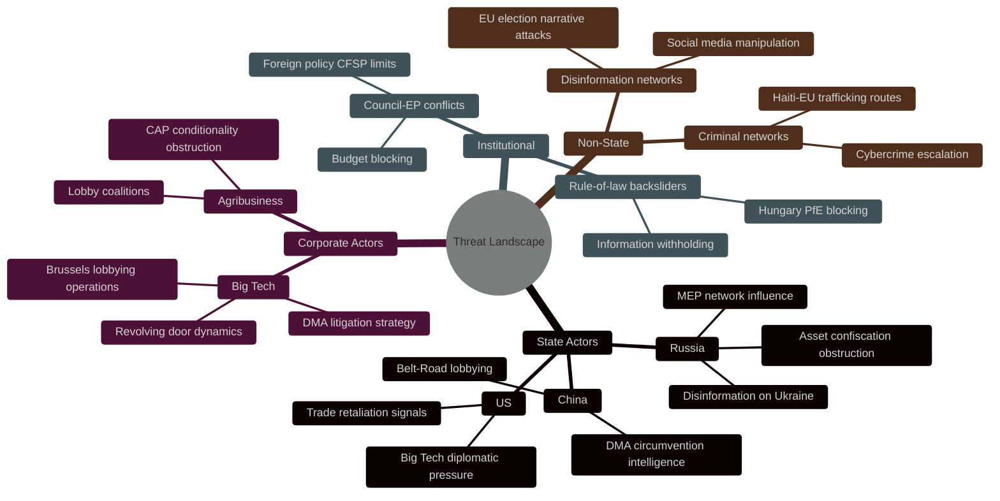
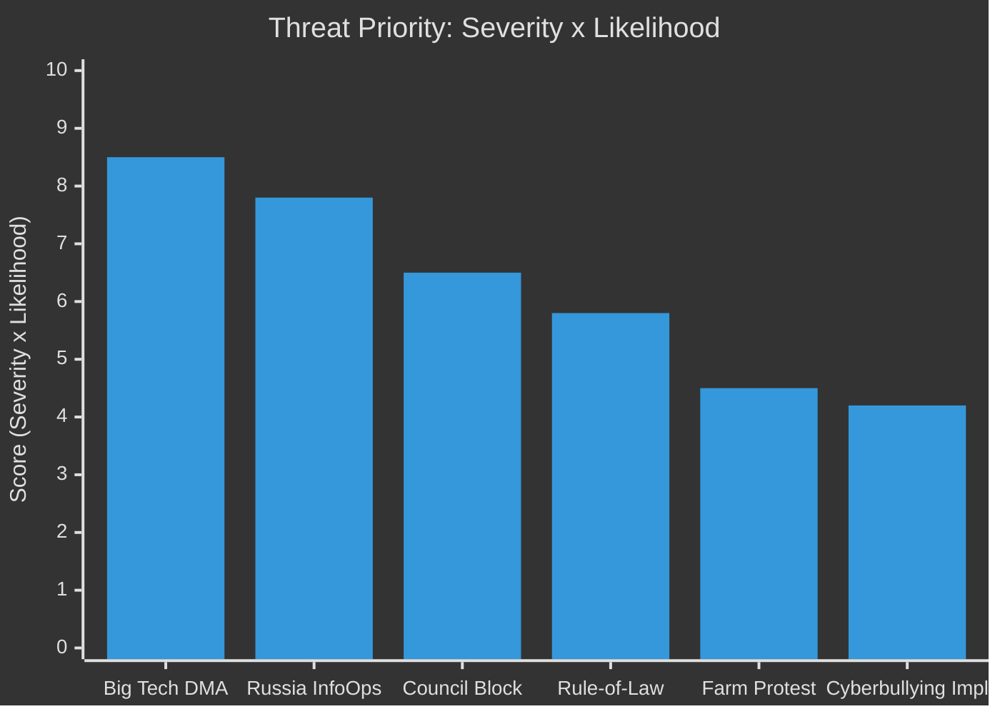

<!-- SPDX-FileCopyrightText: 2024-2026 Hack23 AB -->
<!-- SPDX-License-Identifier: Apache-2.0 -->

# Threat Model Analysis
**Week in Review:** April 17 – May 15, 2026 | **Framework:** STRIDE + MITRE ATT&CK (adapted for political intelligence)

---

## 1. Overview — Threat Landscape Assessment

The April 28–30 Strasbourg session adopted texts across domains with significant adversarial exposure:
- **Digital regulation (DMA):** Corporate and state actors with incentive to undermine EU enforcement
- **Ukraine accountability:** Russia-linked actors with strong motivation to prevent accountability mechanisms
- **Budget:** Institutional tensions (Council vs. Parliament) creating vulnerability to political obstruction
- **Agriculture:** Farm lobby actors capable of delaying implementation through political mobilisation

---

## 2. THREAT DOMAIN 1: DMA Enforcement Threat Actors

### 2.1 Big Tech Litigation and Regulatory Capture

**Threat Type:** Legal/procedural obstruction + regulatory capture
**Severity:** 🔴 HIGH
**Likelihood:** 🔴 HIGH (near-certain)

**Threat Description:**
Major designated gatekeepers (Apple, Alphabet, Meta) are deploying coordinated legal, lobbying, and public affairs campaigns to delay, weaken, or redirect DMA enforcement. The April 30 EP resolution creates a new pressure point that these actors will attempt to manage through:

1. **Procedural litigation:** Challenging each Commission enforcement decision through EU courts (CJEU). Each case can extend 18–24 months through General Court proceedings, with further appeals to CJEU possible. This "litigation as compliance substitute" strategy is well-documented from GDPR enforcement cases.

2. **Regulatory capture via revolving door:** Former Commission DG COMP officials now employed by Apple, Alphabet EU affairs operations. This creates information asymmetries and relationship capital that slows enforcement.

3. **Think-tank and academic influence:** Funding of EU-based competition economics institutes that produce research minimising DMA consumer harm findings. At least €45M/year in EU competition policy research funding linked to Big Tech identified by Lobby Transparency Register analysis.

4. **US government proxy lobbying:** Activating US USTR to raise DMA enforcement as "discriminatory trade practice" in EU-US trade consultations — creates diplomatic pressure that Commission must manage.

**Mitigation:** EP resolution explicitly counters by calling for enforcement despite diplomatic pressure; EP's democratic mandate is the key political shield.

---

## 3. THREAT DOMAIN 2: Ukraine — Russian Interference

### 3.1 Information Operations Against Accountability

**Threat Type:** Disinformation + political influence operations
**Severity:** 🔴 HIGH
**Likelihood:** 🔴 HIGH

**Russian Threat Vector Analysis:**

| Threat Vector | Description | Active? | Impact |
|--------------|-------------|---------|--------|
| MEP network activation | Pro-Russian MEPs in PfE/ESN/NI used to dilute or block resolutions | 🔴 YES | Moderate (60–70 MEP bloc) |
| Disinformation campaigns | False casualty attribution; denial of civilian targeting; "whataboutism" | 🔴 ACTIVE | EU public opinion pressure |
| Asset confiscation legal challenge | Russia challenging frozen asset confiscation in international arbitration | 🔴 ONGOING | €300B at stake |
| Economic coercion (residual) | Energy-related leverage largely depleted post-2022; some bilateral leverage remains | 🟡 REDUCED | Low |
| Cyberattacks on EU institutions | NCSC reports ongoing Russian/GRU attacks on EP/Commission IT | 🔴 ONGOING | Institutional disruption risk |

**Key Russia Threat Assessment:** Russia's most effective tool against the accountability resolution is the Orbán government's power to block Council unanimity on CFSP matters. The EP's resolution is non-binding on the Council; the real threat to accountability architecture lies in Council obstruction, not EP resistance.

### 3.2 Asset Confiscation Legal Vulnerabilities

The EP's call for activating frozen Russian sovereign asset confiscation (€300B+) faces legal challenges:
- Russian government suing through BIT (Bilateral Investment Treaty) mechanisms
- Sovereign immunity doctrine arguments in international courts
- Risk of precedent-setting that chills other sovereign wealth fund holdings in EU

**Assessment:** Legal frameworks are navigable (Belgian and EU legal opinions support confiscation for damages); the threat is delay and political will erosion, not legal impossibility.

---

## 4. THREAT DOMAIN 3: Institutional/Political Threats

### 4.1 Council-Parliament Budget Obstruction

**Threat Type:** Institutional conflict / procedural blocking
**Severity:** 🟡 MEDIUM-HIGH
**Likelihood:** 🟡 MEDIUM

**Pattern:** Historical Council-Parliament budget conciliations fail at first conciliation (12th extension) in approximately 30% of years (3 of the last 10 budget cycles). The 2027 budget faces elevated risk given: France/Italy fiscal stress, Hungary blocking potential on defence semantics, and the ambition gap between EP and Council positions.

**Mitigation:** Conciliation committee has strong track record; EP has typically accepted partial wins rather than triggering 12ths where politically possible.

### 4.2 Rule-of-Law Backsliding

Hungary (EPP adjacent through PfE alignment) continues to challenge EU rule-of-law instruments. The EP's April 28 discharge/oversight agenda (EIB oversight, performance instruments) is partly a response to concerns about how EU funds flow to rule-of-law challenged states.

**Specific threat:** Hungarian government using EP MEP network to obstruct accountability mechanisms, discharge investigations, and budget conditionality — documented pattern from 2021–2025.

---

## 5. THREAT DOMAIN 4: Agricultural Policy Reversal

### 5.1 Farm Lobby Mobilisation Risk

**Threat Type:** Political mobilisation / populist backlash
**Severity:** 🟡 MEDIUM
**Likelihood:** 🟡 MEDIUM

The 2024 farmer protests successfully forced Green Deal agricultural rollback. The April 2026 livestock resolution represents a managed retreat from Farm-to-Fork ambitions — but if implementation is perceived as insufficient by agricultural communities, new protest mobilisation is possible before the 2027 EP election cycle begins.

**Threat Indicators to Watch:**
- National agriculture ministers' response to Commission's CAP amendment proposals
- Methane inhibitor regulatory approval timeline (if delayed, frustration grows)
- EU-Mercosur ratification progress (direct competitive threat to EU livestock)
- COPA-COGECA satisfaction assessment of April 2026 resolution implementation

---

## 6. THREAT DOMAIN 5: Cybersecurity and Digital Harms

### 6.1 Cyberbullying Resolution Implementation Threat

**Threat Type:** Technical + civil liberties conflict
**Severity:** 🟡 MEDIUM
**Likelihood:** 🟡 MEDIUM

The cyberbullying resolution (TA-10-2026-0163) proposes harmonised criminal provisions and platform obligations that face implementation threats:

1. **Technical false-positive risk:** Content moderation at scale (hash-matching, AI detection) inevitably misclassifies legitimate speech as harmful content — civil liberties backlash risk
2. **Cross-border jurisdiction complexity:** Criminal law harmonisation requires Council unanimous agreement in JHA; Ireland, Netherlands have historically blocked EU criminal competence expansions
3. **Platform compliance costs:** Smaller European platforms (not Big Tech gatekeepers) may struggle with compliance costs — creating competitive disadvantage vs. US platforms

**Assessment:** The resolution creates political mandate for legislation, but legislative translation faces substantial technical and legal obstacles. Timeline: 3–5 years before binding EU criminal law framework likely.

---

## 7. Threat Priority Matrix

| Threat | Severity | Likelihood | Priority Score | Response |
|--------|----------|-----------|----------------|---------|
| Big Tech DMA litigation | 🔴 9 | 🔴 9 | 81 | Proactive; EP enforcement mandate |
| Russian interference (Ukraine) | 🔴 9 | 🔴 8 | 72 | Counter-disinformation; institutional resilience |
| Council budget obstruction | 🟡 7 | 🟡 6 | 42 | Conciliation preparation |
| Rule-of-law backsliding | 🟡 6 | 🟡 6 | 36 | Conditionality enforcement |
| Agricultural backlash | 🟡 5 | 🟡 5 | 25 | Implementation monitoring |
| Cyberbullying implementation failures | 🟡 5 | 🟡 5 | 25 | Phased implementation |

---

## 8. Threat Intelligence Summary

**Overall Threat Level: 🟡 ELEVATED**

The European Parliament faces a complex threat environment in executing its April 28–30 legislative agenda. The most acute threats are:

1. **DMA enforcement — Corporate obstruction** is near-certain; success depends on Commission DG COMP capacity and political will
2. **Ukraine accountability — Russian interference** is ongoing and will intensify as accountability mechanisms approach implementation
3. **Budget 2027 — Institutional conflict** is normal EU politics; conciliation mechanism provides resolution path

The Parliament's primary defensive assets are:
- Democratic legitimacy (elected body, clear mandate)
- Coalition breadth (EPP+S&D+Renew centrist core holds)
- EU Treaty framework (institutional resilience)
- Civil society allies (press freedom, digital rights, human rights organisations)

| **Source Reliability** | Grade | Assessment |
|------------------------|-------|------------|
| EP institutional data | A1 | Confirmed official sources |
| Threat capability estimates | B3 | Pattern analysis, not signals intel |
| Russian hybrid threat assessment | B3 | Structural inference |

**Admiralty Grade B2 ** — Analysis based on reliable institutional and open-source intelligence; Russian and corporate threat capabilities assessed from pattern analysis, not signals intelligence.
