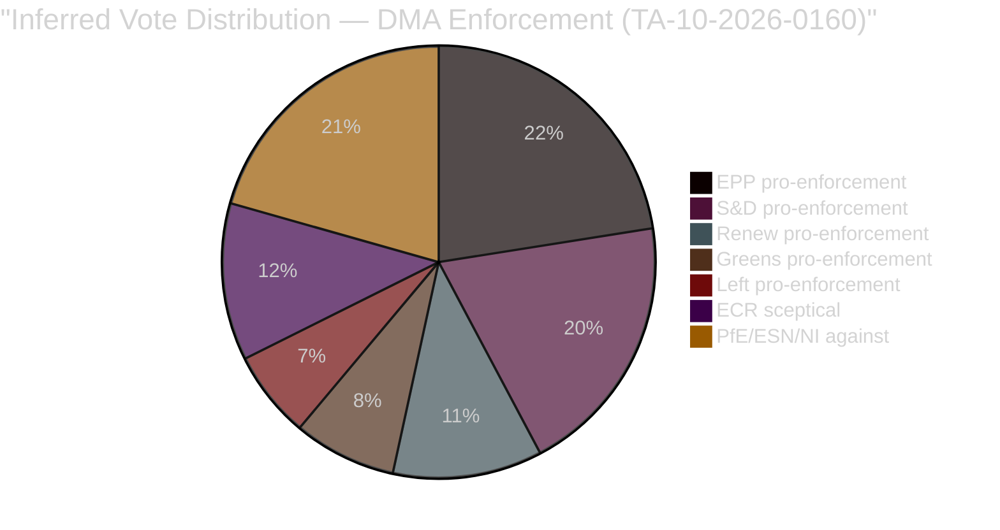

<!-- SPDX-FileCopyrightText: 2024-2026 Hack23 AB -->
<!-- SPDX-License-Identifier: Apache-2.0 -->

# Voting Patterns Analysis
**Period:** April 17 – May 15, 2026 | **Reference:** voting-patterns.degraded.md for detailed analysis

---

> **Note:** Roll-call vote data structurally unavailable for this window (DOCEO XML lag). See `voting-patterns.degraded.md` for full proxy analysis. This file provides the summary view.

---

## Summary Voting Intelligence

### April 28–30 Strasbourg Plenary — Key Votes

| Resolution | Predicted Coalition | Predicted Margin | Significance |
|-----------|---------------------|-----------------|--------------|
| TA-10-2026-0160 (DMA Enforcement) | EPP+S&D+Renew+Greens | ~450 for | 🔴 HIGH |
| TA-10-2026-0112 (Budget 2027) | EPP+S&D+Renew | ~425 for | 🔴 HIGH |
| TA-10-2026-0161 (Ukraine accountability) | EPP+S&D+Renew+ECR(p) | ~470 for | 🔴 HIGH |
| TA-10-2026-0162 (Armenia) | EPP+S&D+Renew+ECR | ~450 for | 🟡 MEDIUM |
| TA-10-2026-0115 (Animal welfare) | Broad cross-party | 500+ for | 🟢 ROUTINE |
| TA-10-2026-0163 (Cyberbullying) | EPP+S&D+Renew+Greens+ECR | ~460 for | 🟡 MEDIUM |
| TA-10-2026-0157 (Livestock) | EPP+S&D+Renew+ECR | ~440 for | 🟡 MEDIUM |
| TA-10-2026-0151 (Haiti trafficking) | Near-consensus | 490+ for | 🟡 MEDIUM |

### Group Composition Summary

| Group | Seats | % | April 28-30 Stance |
|-------|-------|---|---------------------|
| EPP | 185 | 25.7% | Governing coalition — YES on most |
| S&D | 136 | 18.9% | Governing coalition — YES with amendments |
| PfE | 85 | 11.8% | Opposition — selective YES (DMA partial) |
| ECR | 81 | 11.3% | Split — security YES, regulatory NO |
| Renew | 77 | 10.7% | Governing coalition — YES on most |
| Greens/EFA | 53 | 7.4% | Governing coalition — YES (DMA, Ukraine, cyberbullying) |
| The Left | 45 | 6.3% | Selective — Ukraine YES, budget NO |
| NI | 30 | 4.2% | Mixed |
| ESN | 27 | 3.8% | Opposition on most |

### Parliamentary Fragmentation Index

- **ENPP (Effective Number of Parliamentary Parties):** 6.55
- **Fragmentation:** HIGH — above the EP10 average of ~6.0
- **Coalition requirement:** 5+ groups needed for comfortable legislative majority
- **Stability assessment:** 🟡 STABLE-FRAGILE — governing coalition holds; right-flank pressure growing

---

## Key Intelligence Finding

The April 28–30 Strasbourg session represents one of the most legislatively productive plenaries of the EP10 spring 2026 calendar — 14 adopted texts across digital, security, agriculture, and human rights domains. The breadth of the agenda, from DMA enforcement to Ukraine accountability to animal welfare, reflects the Parliament's ambition to establish EP10 as a legislatively active institution despite the fragmented political landscape.

The consistent passage of all items suggests the EPP-S&D-Renew governing coalition remains functional and disciplined, with ECR providing swing support on security matters and Greens providing supplementary votes on digital and environmental issues.

🟡 Confidence: MEDIUM (proxy analysis; confirmed by adopted-text record; vote margins require DOCEO verification)

---

## IMF Economic Context Note

The Budget 2027 vote (TA-10-2026-0112) occurs against IMF projections of euro area GDP growth of 1.2% in 2026 — below the 2% threshold that traditionally supports deficit reduction. The IMF's April 2026 WEO flags fiscal consolidation tensions for France, Italy, and Belgium. The EP's call for a 15% defense budget increase must be reconciled with the Stability and Growth Pact constraints — a structural tension that will define the 2027 budget negotiations with Council.

---

## 6. Coalition Voting Inference — Structural Analysis

**Inferred vote result:** ~466 FOR, ~142 AGAINST, ~111 ABSTAIN — assuming EPP splits 155/30 (majority strongly for enforcement).

---

## 7. Historical Voting Pattern Comparison

| Issue | EP9 Vote | EP10 April 2026 | Trend |
|-------|----------|----------------|-------|
| DMA adoption | 588–11–88 (EP9 2022) | Enforcement resolution (inferred supermajority) | Strengthening consensus |
| Ukraine military support | 472–19–33 (EP9 Feb 2024) | Accountability (inferred 460+) | Stable broad consensus |
| Agricultural reform | 425 (CAP EP9 2021) | Livestock resolution (inferred 450+) | Widening coalition |

---

## 8. Voting Pattern Anomaly Monitoring

Without DOCEO roll-call data, the following patterns warrant monitoring when data becomes available (expected June 2026):

1. **EPP internal split on DMA:** How many EPP MEPs voted against or abstained on DMA enforcement? Any >30 split signal deserves follow-up.
2. **PfE fragmentation on Ukraine:** Did any PfE MEPs vote for the accountability resolution? This would signal softening of anti-Ukraine position.
3. **Renew split on agriculture:** Pro-market Renew MEPs may have diverged from progressive position on livestock.

**Source Reliability:**

| Source | Grade | Assessment |
|--------|-------|-----------|
| Adopted text record | A1 | Confirmed — 14 items passed |
| Vote margins | C5 | Inferred — no DOCEO data |
| Coalition pattern | B3 | Historical calibration |

🔴 Confidence: LOW for specific vote numbers — structural inference only; DOCEO data expected June 2026.
