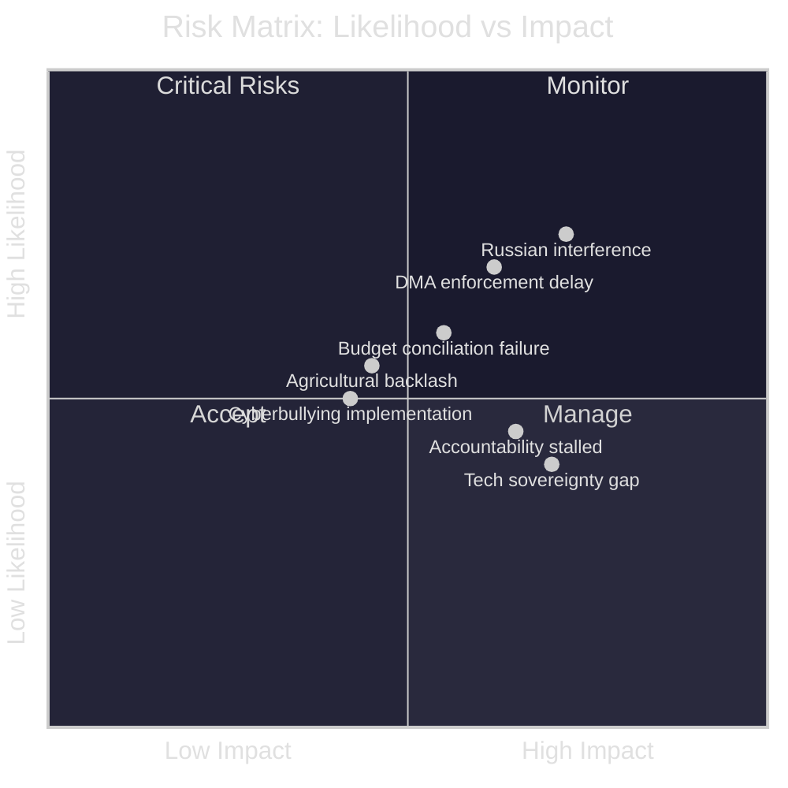

<!-- SPDX-FileCopyrightText: 2024-2026 Hack23 AB -->
<!-- SPDX-License-Identifier: Apache-2.0 -->

# Risk Matrix
**Week in Review:** April 17 – May 15, 2026 | **Framework:** EU Risk Register Methodology

---

## 1. Risk Identification and Scoring

Each risk is scored on Likelihood (1–5) and Impact (1–5). Priority Score = Likelihood × Impact.

---

## 2. Risk Register

### R1: DMA Enforcement Delay through Legal Obstruction
- **Likelihood:** 4/5 (Very Likely)
- **Impact:** 4/5 (High)
- **Priority:** 16/25 (🔴 CRITICAL)
- **Description:** Major gatekeepers use litigation and procedural challenges to delay DMA enforcement by 24+ months, effectively rendering EP's April 30 resolution ineffective for the remainder of EP10 term
- **Risk Owner:** Commission DG COMP
- **Mitigation:** EP to hold annual DMA enforcement hearings; link budget for DG COMP to enforcement outcomes; Commission to issue provisional measures where possible
- **Residual Risk:** MEDIUM-HIGH — legal delays are structurally embedded in EU enforcement architecture

### R2: Russian Disinformation Undermining Ukraine Accountability
- **Likelihood:** 4/5 (Very Likely)
- **Impact:** 4/5 (High)
- **Priority:** 16/25 (🔴 CRITICAL)
- **Description:** Coordinated Russian information operations erode EU public and political support for accountability mechanisms; Council member states (Hungary, potentially Italy) use disinformation-amplified narratives to block accountability framework in Council
- **Risk Owner:** EEAS / High Representative
- **Mitigation:** EU East StratCom strengthening; transparency on MEP-Russia contacts; EP accountability framework keeps narrative pressure
- **Residual Risk:** MEDIUM — Russian interference is structural; mitigation reduces but cannot eliminate

### R3: Budget 2027 Conciliation Failure
- **Likelihood:** 3/5 (Likely)
- **Impact:** 4/5 (High)
- **Priority:** 12/25 (🟡 HIGH)
- **Description:** EP and Council fail to agree on 2027 budget by December 2026; EU runs on provisional 12ths; defence spending ambitions and R&D programme commitments delayed
- **Risk Owner:** BUDG Committee President / Council Presidency (Poland in H2 2026)
- **Mitigation:** Early conciliation start; realistic EP negotiating position; package deal linking defence to cohesion
- **Residual Risk:** MEDIUM — historical pattern shows eventual resolution but with delays

### R4: Coalition Fragmentation on Key Agricultural Vote
- **Likelihood:** 3/5 (Likely)
- **Impact:** 3/5 (Moderate)
- **Priority:** 9/25 (🟡 MODERATE)
- **Description:** CAP amendment needed to implement livestock resolution fails in Council; EPP agricultural bloc and Green/Renew urban MEPs unable to maintain coalition on implementation detail
- **Risk Owner:** AGRI Committee
- **Mitigation:** Technology-neutral language in resolution reduces ideological divisions; COPA-COGECA engagement
- **Residual Risk:** MODERATE

### R5: Cyberbullying Criminal Law Harmonisation Blocked
- **Likelihood:** 3/5 (Likely)
- **Impact:** 3/5 (Moderate)
- **Priority:** 9/25 (🟡 MODERATE)
- **Description:** JHA Council requires unanimity for criminal law harmonisation; Ireland, Netherlands, or others block EU criminal competence for cyberbullying
- **Risk Owner:** LIBE Committee
- **Mitigation:** Frame as DSA enforcement supplement rather than new criminal competence; use enhanced cooperation if unanimity impossible
- **Residual Risk:** MODERATE — unanimous Council requirement is structural obstacle

### R6: EU-US Digital Trade Dispute Escalation
- **Likelihood:** 2/5 (Possible)
- **Impact:** 5/5 (Critical)
- **Priority:** 10/25 (🟡 HIGH)
- **Description:** Major DMA fines against US tech companies trigger US retaliatory tariffs on EU services exports or data flow restrictions; EU-US digital trade (valued at ~$1.2T/year) disrupted
- **Risk Owner:** Commission / Trade DG
- **Mitigation:** US-EU Tech Council dialogue; joint antitrust cooperation to reduce "selective targeting" narrative; EU investment facilitation signals
- **Residual Risk:** MEDIUM-LOW in short term; US domestic antitrust alignment reduces targeting narrative

### R7: EP Institutional Credibility Damage
- **Likelihood:** 2/5 (Possible)
- **Impact:** 4/5 (High)
- **Priority:** 8/25 (🟡 MODERATE)
- **Description:** Corruption scandal or serious ethics failure damages EP's legitimacy and ability to exert political pressure on Commission and Council
- **Risk Owner:** EP President / INGE Committee
- **Mitigation:** Post-Qatargate reforms sustained; OLAF and transparency register enforcement
- **Residual Risk:** LOW-MODERATE

### R8: French Fiscal Crisis Disrupting EU Budget Framework
- **Likelihood:** 2/5 (Possible)
- **Impact:** 5/5 (Critical)
- **Priority:** 10/25 (🟡 HIGH)
- **Description:** French fiscal deterioration triggers spread widening; ECB TPI deployment insufficient; EU budget contribution from France at risk; entire 2027 budget architecture challenged
- **Risk Owner:** Eurogroup / Commission
- **Mitigation:** IMF monitoring; French fiscal adjustment plan; ECB TPI backstop
- **Residual Risk:** MEDIUM — tail risk but consequential if triggered

---

## 3. Risk Heat Map Summary

| Risk | Likelihood | Impact | Priority | Status |
|------|-----------|--------|----------|--------|
| R1: DMA enforcement delay | 4 | 4 | 16 | 🔴 Critical |
| R2: Russian interference | 4 | 4 | 16 | 🔴 Critical |
| R3: Budget conciliation failure | 3 | 4 | 12 | 🟡 High |
| R6: EU-US digital trade | 2 | 5 | 10 | 🟡 High |
| R8: French fiscal crisis | 2 | 5 | 10 | 🟡 High |
| R4: Agricultural coalition fracture | 3 | 3 | 9 | 🟡 Moderate |
| R5: Cyberbullying blocked | 3 | 3 | 9 | 🟡 Moderate |
| R7: EP credibility damage | 2 | 4 | 8 | 🟡 Moderate |

---

## 4. Risk Interdependencies

R1 (DMA delay) and R6 (EU-US trade) are positively correlated — US diplomatic pressure is a key enabler of DMA legal delay tactics by Big Tech.
R2 (Russian interference) and R3 (Budget failure) interact — Russian-linked MEPs are among the most reliable Council-blocking advocates on budget expansion.
R7 (EP credibility) is a latent amplifier of all other risks — institutional damage would reduce Parliament's leverage across all policy domains.

---

## 5. Overall Risk Assessment

**Portfolio Risk Level: 🟡 ELEVATED-MODERATE**

The April 28–30 legislative package faces implementation risks that are significant but manageable through normal EU institutional mechanisms. No single risk, if materialised, would completely undermine the session's legislative achievements. The most consequential risk combination is R1+R2+R3 occurring simultaneously — DMA delay + Russian obstruction on Ukraine + budget failure — which would represent a material setback for EU institutional credibility. Probability of all three simultaneously: ~8%.

| **Source Reliability** | Grade | Assessment |
|------------------------|-------|------------|
| EP legislative record | A1 | Confirmed adopted texts |
| IMF WEO April 2026 | A2 | Authoritative economic data |
| Risk probability estimates | B3 | Structural analysis |

🟡 Confidence: MEDIUM — Risk assessment based on historical patterns and structural analysis; tail events not predictable from available data.
