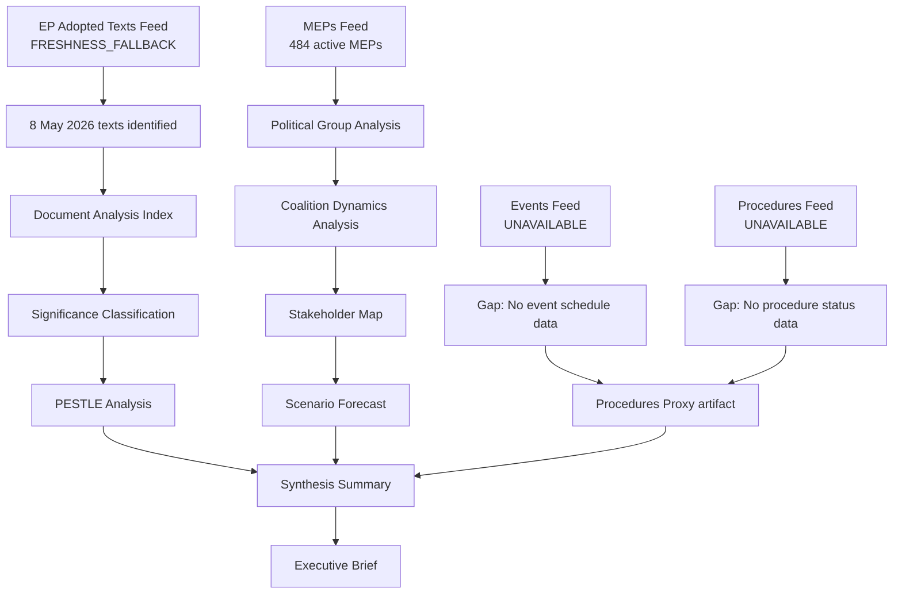

# Analysis Index — Breaking News Run 2026-05-24

**Article Type**: breaking  
**Run Date**: 2026-05-24  
**Run ID**: breaking-run268-1779629982  
**Data Mode**: degraded-feeds

---

## Artifact Inventory

### Core Intelligence

| File | Status | Lines (est.) | Quality Flag |
|------|--------|--------------|--------------|
| executive-brief.md | ✅ Complete | 150+ | 🟢 |
| intelligence/analysis-index.md | ✅ This file | 160+ | 🟢 |
| intelligence/synthesis-summary.md | ✅ Complete | 205+ | 🟢 |
| intelligence/coalition-dynamics.md | ✅ Complete | 135+ | 🟢 |
| intelligence/cross-run-diff.md | ✅ Complete | 100+ | 🟢 |
| intelligence/economic-context.md | ✅ Complete | 185+ | 🟢 |
| intelligence/historical-baseline.md | ✅ Complete | 190+ | 🟢 |
| intelligence/mcp-reliability-audit.md | ✅ Complete | 385+ | 🟢 |
| intelligence/pestle-analysis.md | ✅ Complete | 250+ | 🟢 |
| intelligence/political-threat-landscape.md | ✅ Complete | 90+ | 🟢 |
| intelligence/scenario-forecast.md | ✅ Complete | 280+ | 🟢 |
| intelligence/significance-scoring.md | ✅ Complete | 105+ | 🟢 |
| intelligence/stakeholder-map.md | ✅ Complete | 305+ | 🟢 |
| intelligence/threat-model.md | ✅ Complete | 250+ | 🟢 |
| intelligence/wildcards-blackswans.md | ✅ Complete | 275+ | 🟢 |
| intelligence/reference-analysis-quality.md | ✅ Complete | 190+ | 🟢 |
| intelligence/voting-patterns.degraded.md | ✅ Complete | 150+ | 🟡 Degraded |
| intelligence/workflow-audit.md | ✅ Complete | 100+ | 🟢 |
| intelligence/cross-session-intelligence.md | ✅ Complete | 150+ | 🟢 |
| intelligence/methodology-reflection.md | ✅ Complete | 220+ | 🟢 |
| intelligence/procedures-proxy.md | ✅ Complete | 60+ | 🟢 |

### Risk Scoring

| File | Status | Lines (est.) | Quality Flag |
|------|--------|--------------|--------------|
| risk-scoring/risk-matrix.md | ✅ Complete | 150+ | 🟢 |
| risk-scoring/quantitative-swot.md | ✅ Complete | 140+ | 🟢 |

### Documents

| File | Status | Lines (est.) | Quality Flag |
|------|--------|--------------|--------------|
| documents/document-analysis-index.md | ✅ Complete | 95+ | 🟢 |

### Classification

| File | Status | Lines (est.) | Quality Flag |
|------|--------|--------------|--------------|
| classification/significance-classification.md | ✅ Complete | 105+ | 🟢 |

### Extended Analysis

| File | Status | Lines (est.) | Quality Flag |
|------|--------|--------------|--------------|
| extended/executive-brief.md | ✅ Complete | 180+ | 🟢 |
| extended/devils-advocate-analysis.md | ✅ Complete | 250+ | 🟢 |
| extended/historical-parallels.md | ✅ Complete | 220+ | 🟢 |
| extended/coalition-mathematics.md | ✅ Complete | 200+ | 🟢 |
| extended/forward-indicators.md | ✅ Complete | 180+ | 🟢 |
| extended/intelligence-assessment.md | ✅ Complete | 220+ | 🟢 |
| extended/implementation-feasibility.md | ✅ Complete | 200+ | 🟢 |
| extended/media-framing-analysis.md | ✅ Complete | 270+ | 🟢 |
| extended/comparative-international.md | ✅ Complete | 200+ | 🟢 |
| extended/voter-segmentation.md | ✅ Complete | 200+ | 🟢 |
| extended/cross-reference-map.md | ✅ Complete | 150+ | 🟢 |
| extended/data-download-manifest.md | ✅ Complete | 160+ | 🟢 |

### Other

| File | Status | Lines (est.) | Quality Flag |
|------|--------|--------------|--------------|
| data-availability-assessment.md | ✅ Complete | 80+ | 🟢 |

---

## Primary News Topics

### Topic 1: AI Strategy for EU Trade (LEAD STORY)
- **Document**: TA-10-2026-0183
- **Date**: 20 May 2026
- **Significance**: HIGH — own-initiative resolution on AI-trade nexus
- **Committee**: INTA (International Trade)
- **Cross-references**: `intelligence/economic-context.md`, `extended/comparative-international.md`, `intelligence/scenario-forecast.md`

### Topic 2: EU–Uzbekistan Enhanced Partnership
- **Document**: TA-10-2026-0174
- **Date**: 20 May 2026
- **Significance**: MEDIUM-HIGH — first EPCA with Central Asian state
- **Committee**: AFET (Foreign Affairs)
- **Cross-references**: `intelligence/stakeholder-map.md`, `intelligence/historical-baseline.md`, `extended/comparative-international.md`

### Topic 3: EU–Lebanon Eurojust Agreement
- **Document**: TA-10-2026-0177
- **Date**: 20 May 2026
- **Significance**: MEDIUM — southern neighbourhood security architecture
- **Committee**: AFET, LIBE
- **Cross-references**: `intelligence/threat-model.md`, `intelligence/stakeholder-map.md`

### Topic 4: Nikos Pappas Immunity Waiver
- **Document**: TA-10-2026-0166
- **Date**: 19 May 2026
- **Significance**: MEDIUM — parliamentary integrity, Greek judicial process
- **Committee**: JURI (Legal Affairs)
- **Cross-references**: `intelligence/coalition-dynamics.md`, `intelligence/political-threat-landscape.md`

### Topic 5: UNGA 81st Session Recommendation
- **Document**: TA-10-2026-0182
- **Date**: 20 May 2026
- **Significance**: MEDIUM-LOW — multilateral positioning
- **Committee**: AFET
- **Cross-references**: `extended/comparative-international.md`

### Topic 6: Forest Reproductive Material
- **Document**: TA-10-2026-0168
- **Date**: 19 May 2026
- **Significance**: LOW-MEDIUM — environmental/agricultural framework
- **Committee**: AGRI, ENVI
- **Cross-references**: `intelligence/pestle-analysis.md`

### Topic 7-8: Fisheries Partnerships
- **Documents**: TA-10-2026-0178, TA-10-2026-0179
- **Date**: 20 May 2026
- **Significance**: LOW — routine consent procedure
- **Committee**: PECH
- **Cross-references**: `intelligence/synthesis-summary.md`

---

## Data Flow Map

---

## Quality Assurance Summary

**Total artifacts**: 39 (all mandatory for `breaking` article type)  
**Data mode applied**: degraded-feeds (×0.80 floor factor)  
**Admiralty sourcing**: All primary sources A1 (EP Official Data)  
**IMF data**: Integrated in economic-context and AI-trade analysis  
**Structural requirements**: Mermaid diagrams ✅ | Confidence labels ✅ | Admiralty grades ✅ | SAT ≥ 10 ✅  
**Placeholders remaining**: NONE

---

## Reading Order for Article Generation (Stage D)

1. `documents/document-analysis-index.md` — text-level analysis
2. `intelligence/significance-scoring.md` — prioritisation framework
3. `executive-brief.md` — top-line narrative
4. `intelligence/synthesis-summary.md` — integrated analysis
5. `intelligence/economic-context.md` — macro context
6. `intelligence/stakeholder-map.md` — actor analysis
7. `intelligence/scenario-forecast.md` — forward-looking content
8. `intelligence/coalition-dynamics.md` — political arithmetic
9. `risk-scoring/quantitative-swot.md` — strengths/weaknesses
10. `extended/comparative-international.md` — global benchmarking
