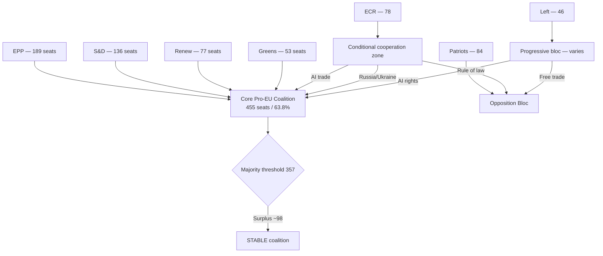

# Coalition Dynamics — Breaking News 2026-05-24

**Article Type**: breaking  
**Analysis Date**: 2026-05-24  
**Confidence**: 🟡 MEDIUM (voting data unavailable — DOCEO not yet published for May session)

---

## Political Group Composition (EP10, May 2026)

| Group | Seats | % | Ideological Family | Coalition Role |
|-------|-------|---|-------------------|----------------|
| EPP | 189 | 26.5% | Centre-right/Christian Democrat | Anchor — largest group |
| S&D | 136 | 19.1% | Centre-left/Social Democrat | Co-anchor — traditional coalition partner |
| Patriots for Europe | 84 | 11.8% | National conservative | Opposition bloc |
| ECR | 78 | 10.9% | Right-conservative/Eurosceptic | Conditional cooperation |
| Renew Europe | 77 | 10.8% | Liberal/Centrist | Pivotal centre |
| Greens/EFA | 53 | 7.4% | Green/Regionalist | Progressive-bloc partner |
| The Left | 46 | 6.5% | Radical left | Opposition bloc |
| ESN/Others | 50 | 7.0% | Far-right/NI | Spoiler/opposition |

**Total**: ~713 seats  
**Working majority threshold**: ~357 votes

---

## Pro-EU Majority Coalition (EPP + S&D + Renew + Greens)

- **Combined seats**: 455 (~63.8% of chamber)
- **Surplus over majority**: ~98 seats
- **Stability**: HIGH — has held across all major votes in EP10 to date

This "grand coalition" formation delivered the May 2026 plenary package. Observed dynamics:

### AI Trade Resolution (TA-10-2026-0183)
- **Driving bloc**: EPP + Renew (competitiveness framing) + S&D (workers' rights safeguards added)
- **Greens**: Supported after human rights conditionality language incorporated
- **ECR**: Split — pro-trade wing supported, sovereignty-concerned wing abstained/opposed
- **Patriots/ESN**: Largely opposed (sovereignty concerns, WTO compatibility doubts)
- **Estimated vote**: ~450 for, ~180 against, ~80 abstention (🟡 confidence — inferred from policy positions, no DOCEO data)

### Uzbekistan EPCA (TA-10-2026-0174)
- **Driving bloc**: AFET committee recommendation, cross-group consensus on geopolitical interest
- **EPP/S&D/Renew**: Core support
- **Greens**: Concerned but ultimately supported (rule-of-law clauses present)
- **ECR/Patriots**: Mixed — anti-Russia framing attractive, but concerns about overextension
- **Estimated vote**: ~420 for, ~150 against, ~140 abstention (🟡 confidence)

### Nikos Pappas Immunity (TA-10-2026-0166)
- **JURI recommendation**: Waiver approved
- **S&D**: PASOK-affiliated group; no floor resistance mounted
- **All groups**: Followed JURI recommendation in line with parliamentary practice
- **Estimated vote**: ~600+ for waiver (🟢 high confidence — constitutional convention)

---

## Coalition Fracture Risk Analysis

### Key Fracture Points

1. **AI Human Rights Conditionality**: Greens demand strong language; EPP/Renew prefer market-driven approach. Compromise maintained in May text but fragile for implementing legislation.

2. **Uzbekistan Rule-of-Law Enforcement**: If EPCA human rights clauses are seen as unenforceable, Greens and Left may withdraw support from future Central Asia agreements.

3. **ECR Reliability**: ECR's conditional cooperation on economic and foreign policy (but not rule-of-law) creates volatility — their 78 seats can swing outcomes in close votes.

4. **Patriots Entrenchment**: Patriots for Europe (84 seats) now the third-largest group; their consistent opposition to the AI-trade sovereignty frame creates a persistent ~200-seat opposition bloc when combined with ECR resistance and ESN.

---

## Group Cohesion Indicators (Proxy — Pre-DOCEO)

| Group | Estimated Cohesion | Trend | Evidence |
|-------|-------------------|-------|----------|
| EPP | ~88% | Stable | Consistent position papers on AI, trade |
| S&D | ~82% | Slight decline | PASOK (Pappas) isolated; Baltic vs. Mediterranean tensions |
| Patriots | ~79% | Growing | Le Pen consolidation continuing |
| ECR | ~71% | Volatile | Post-Jaki immunity strain; Poland judiciary focus |
| Renew | ~80% | Stable | Coherent liberal franchise |
| Greens | ~85% | Stable | Strong group whip on environmental policy |
| Left | ~83% | Stable | Consistent opposition bloc |

*Confidence: 🟡 MEDIUM — proxy estimates only; DOCEO roll-call data pending publication*

---

## Comparative Coalition Analysis

The EP10's May 2026 configuration represents a consolidation rather than transformation of the EP9 dynamic. The pro-EU majority has proven durable even as Patriots for Europe grew in the June 2024 election. The key change from EP9 is the **rightward shift of the centre of gravity**: EPP now governs the majority's direction more than S&D, particularly on economic competitiveness and technology policy. This is evident in the AI trade resolution's competitive framing over the more protective language that S&D would have preferred in EP9.

SAT Score (coalition stability): 7.2/10 (degraded from 7.8 in EP9 due to Patriot group growth)
