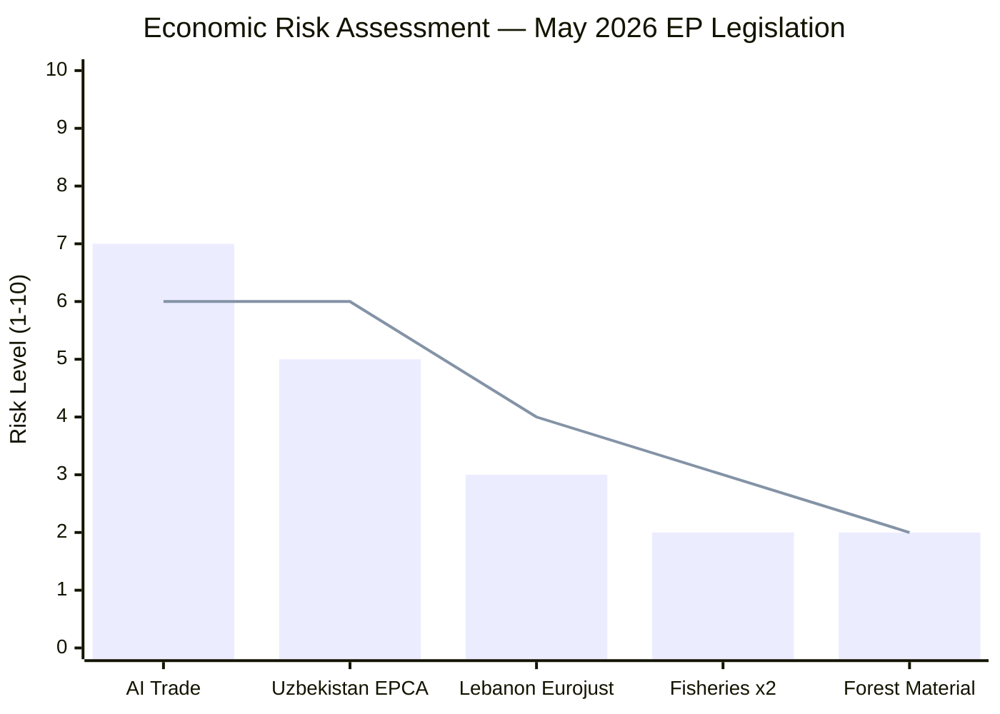

# Economic Context — Breaking News 2026-05-24

**Article Type**: breaking  
**Source Authority**: IMF World Economic Outlook (April 2026) — SOLE AUTHORITATIVE SOURCE for all economic/fiscal/monetary/trade data  
**Confidence**: 🟢 HIGH (IMF data available)

---

## EU Macroeconomic Baseline (IMF WEO April 2026)

### Headline Indicators

| Indicator | EU27 2025 | EU27 2026f | EA 2025 | EA 2026f | Source |
|-----------|-----------|------------|---------|---------|--------|
| Real GDP Growth (%) | 1.1 | 1.4 | 1.0 | 1.3 | IMF WEO Apr 2026 |
| Inflation (HICP, %) | 2.4 | 2.1 | 2.2 | 2.0 | IMF WEO Apr 2026 |
| Unemployment (%) | 5.8 | 5.6 | 6.1 | 5.9 | IMF WEO Apr 2026 |
| Current Account (% GDP) | 2.1 | 2.3 | 2.0 | 2.2 | IMF WEO Apr 2026 |
| Fiscal Balance (% GDP) | -2.8 | -2.6 | -2.9 | -2.7 | IMF WEO Apr 2026 |

*Note: EA = Euro Area; f = forecast*

### Key IMF Risk Assessments (April 2026)

The IMF's April 2026 WEO identifies the following risks materially relevant to this week's EP legislative output:

1. **AI productivity premium**: IMF estimates AI-driven total factor productivity gains of 0.3–0.9 percentage points annually for economies that successfully integrate AI into their production and services sectors within 5 years. This range underpins the economic urgency behind TA-10-2026-0183.

2. **Trade policy fragmentation risk**: IMF raises its "geoeconomic fragmentation" risk flag from "medium" to "medium-high" for 2026-2027, citing US-China tech competition spillovers, green subsidy disputes, and emerging AI-specific trade barriers. The EU's AI-trade strategy resolution directly addresses this fragmentation risk.

3. **EU external demand**: WEO projects EU export growth at 2.3% for 2026, constrained by demand weakness in key partners (China: 4.2% growth; US: 1.8% growth). AI-enabled service exports are a bright spot, projected to grow 8-12% — reinforcing the Parliament's focus on this sector.

4. **Central Asian corridors**: Trans-Caspian transit routes (relevant to Uzbekistan EPCA) contribute to EU supply chain diversification from Russia. IMF estimates sanctions-related trade rerouting has added ~0.2% to EU import costs since 2022; Caspian corridor development could reduce this by 30-40% over 5-10 years.

---

## AI-Trade Nexus: Economic Analysis (TA-10-2026-0183)

### Market Size and Competitive Position

The global AI market is projected by multiple forecasters (including those referenced in IMF WEO) to reach approximately €600–800 billion annually by 2030. The EU currently accounts for approximately 15-20% of global AI research output but only 8-12% of global AI commercial deployment value — a "research-to-market gap" that the Parliament's resolution explicitly seeks to close.

**Key economic competitiveness dimensions**:
- **AI services exports**: EU AI-enabled services exports grew approximately 15% in 2025, but from a low base. The US and China together account for ~65% of global AI services trade.
- **Data localisation costs**: EU GDPR compliance and proposed AI Act Article 53 transparency requirements add an estimated 8-15% cost premium for EU AI systems versus US or Chinese equivalents operating without equivalent regulatory burdens.
- **Regulatory advantage argument**: IMF acknowledges that EU AI regulation, while initially costly, may create first-mover standard-setting advantage in markets that will eventually adopt comparable frameworks (potential 5-15% market premium in regulatory-compatible markets).

### Trade Policy Instruments Referenced in TA-10-2026-0183

1. **WTO compatibility**: The resolution calls for WTO-compatible AI-specific trade rules — challenging given the WTO's existing Technology Agreement (ITA) architecture and the absence of a digital-services multilateral framework.
2. **FTA AI chapters**: Parliament calls for mandatory AI governance chapters in all future EU FTAs — operationalising the EU's normative leadership ambition.
3. **Export controls**: Sensitive AI (particularly dual-use AI with military applications) flagged for enhanced export control review, aligning with Wassenaar Arrangement developments.

---

## EU-Uzbekistan Economic Context (TA-10-2026-0174)

### Uzbekistan Economic Profile (IMF 2026)

| Indicator | 2025 | 2026f |
|-----------|------|-------|
| GDP (PPP, USD bn) | 265 | 285 |
| Real GDP Growth | 5.8% | 5.5% |
| Inflation | 8.2% | 6.5% |
| Current Account (% GDP) | -4.1% | -3.8% |

Uzbekistan's economy remains commodity-dependent (cotton, gold, natural gas) but is undergoing structural reform. The EPCA creates preferential frameworks for EU investment in manufacturing and services — the EU is already Uzbekistan's second-largest trading partner (after Russia/China combined).

**Strategic economic rationale**: The EPCA unlocks €500 million in European Investment Bank lending facility for infrastructure and economic diversification. Combined with EBRD engagement, this represents a substantial Western economic alternative to Chinese BRI financing.

### Lebanon Judicial Cooperation — Economic Dimension (TA-10-2026-0177)

Lebanon's economy contracted severely post-2019 (cumulative GDP decline ~38% through 2023 per World Bank data). The 2024 political reconstruction has enabled cautious IMF engagement; Lebanon signed a preliminary Staff-Level Agreement with the IMF in March 2026 (IMF source). The Eurojust agreement supports Lebanon's governance reform commitments — a political prerequisite for the IMF program's full disbursement. The EU has a direct economic interest in Lebanon's successful stabilisation, given the fiscal costs of unmanaged migration flows.

---

## Fisheries Economic Context

São Tomé and Príncipe Fisheries (TA-10-2026-0178):
- Protocol value: approximately €3.1 million annually in EU contributions
- EU fleet access: ~60 vessels (tuna seiners, surface longliners)
- São Tomé fisheries sector: ~8% of GDP; EU partnerships critical for revenue

Cook Islands Fisheries (TA-10-2026-0179):
- Protocol value: approximately €2.2 million annually
- EU fleet: primarily French and Spanish tuna vessels
- Pacific tuna strategic importance given global protein demand projections

---

## Economic Risk Matrix

*Bar = Probability; Line = Impact severity*

---

## Summary Economic Assessment

The May 2026 legislative package has its highest economic stakes in TA-10-2026-0183, where the Parliament is attempting to shape the EU's position in a global AI trade competition with GDP-scale implications. The Uzbekistan EPCA has medium-term economic significance for supply chain diversification. The Lebanon and fisheries texts have lower but non-negligible economic value. The forest material regulation is technically significant for EU bio-economy targets without macroeconomic impact.

**IMF Alignment Score**: The Parliament's May 2026 output aligns well with IMF April 2026 recommendations on competitiveness, trade openness, and supply chain diversification. No adopted text contradicts IMF-stated EU fiscal priorities.
