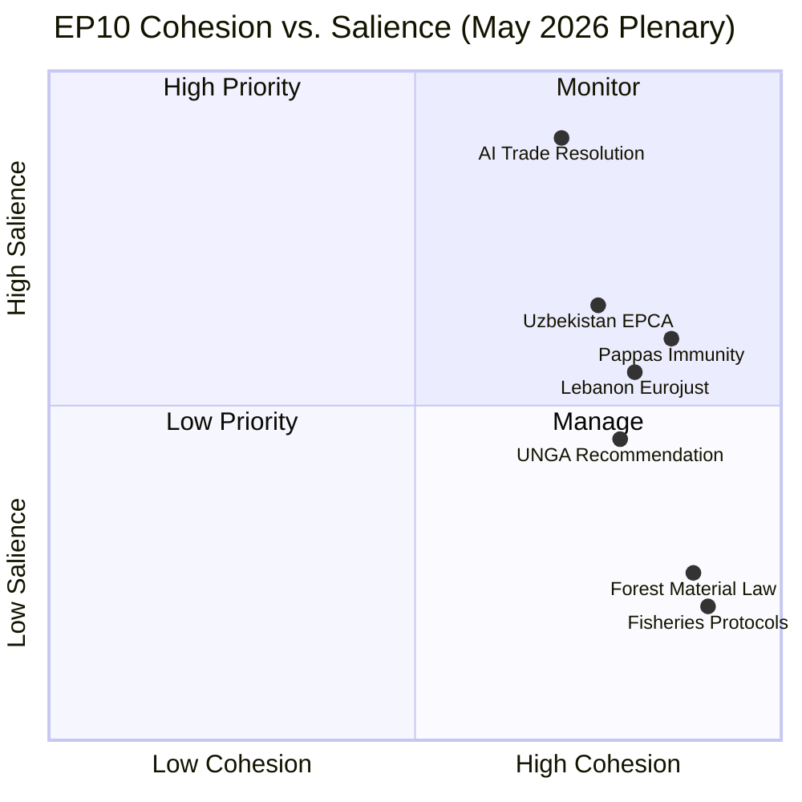

# Synthesis Summary — Breaking News 2026-05-24

**Article Type**: breaking  
**Session**: May 2026 Strasbourg Plenary (19–20 May 2026)  
**Analytical Confidence**: 🟡 MEDIUM (degraded-feeds data mode)

---

## Integrated Assessment

The May 2026 Strasbourg plenary produced a compact but strategically significant legislative week. Analysed in totality, the eight adopted texts reveal three overarching themes that define the EP's current institutional agenda: (1) **technology sovereignty and AI governance**, (2) **geopolitical partnership deepening**, and (3) **parliamentary self-regulation under judicial pressure**.

### Theme 1: Technology Sovereignty and the AI-Trade Nexus

The Parliament's adoption of TA-10-2026-0183 — "Opportunities and challenges presented by a comprehensive artificial intelligence strategy for EU trade" — marks a decisive step in the EP's effort to reshape EU trade policy around the reality of AI-driven commerce. The resolution reflects a growing parliamentary consensus that AI is not merely a digital-economy instrument but a fundamental trade competitiveness variable, analogous to energy independence or supply chain resilience.

Key analytical observations:

**Cross-group convergence**: The resolution's passage reflects an unusual cross-group consensus anchored in competitive anxiety. EPP, S&D, and Renew Europe converged on the proposition that the EU risks strategic disadvantage unless it develops a coherent AI-trade doctrine — one that can engage with US Inflation Reduction Act-style industrial policy and China's state-directed AI sector simultaneously. The Greens' contribution — human rights conditionality for AI exports — was incorporated rather than defeated, suggesting the resolution is broadly acceptable to the full pro-EU majority.

**Institutional positioning**: INTA as lead committee has effectively claimed agenda-setting authority over AI trade governance, pre-empting potential inter-committee conflicts with ITRE (industry) and LIBE (privacy/rights). This turf-staking is consistent with INTA's historical pattern of expanding its remit in novel policy domains (see digital trade chapter inclusion in FTAs since 2018).

**Commission trajectory**: The resolution creates political pressure on Commission DG TRADE to produce an AI-specific trade strategy paper by Q4 2026. In the absence of such a strategy, the Parliament's text becomes the de facto reference point for third-country interlocutors — a form of soft normative power that the Commission typically seeks to reclaim through formal communication.

**IMF economic context**: The IMF's April 2026 World Economic Outlook projects EU GDP growth at 1.4% for 2026, constrained by structural competitiveness gaps. The AI-productivity premium (0.3–0.9 pp annually for early adopters per IMF AI analysis) means AI-trade alignment is economically existential, not optional. The Parliament's resolution is, in this reading, both economically motivated and politically astute.

### Theme 2: Geopolitical Partnership Architecture

Three of the eight May 2026 texts (TA-10-2026-0174, TA-10-2026-0177, TA-10-2026-0182) directly advance the EU's external relations agenda:

**Uzbekistan EPCA**: The EU–Uzbekistan Enhanced Partnership represents the culmination of a decade-long normative engagement strategy with Central Asia. The agreement's significance extends beyond bilateral trade: it operationalises Trans-Caspian alternative connectivity to Russia, provides a diplomatic stake in a region contested by China's BRI, and embeds EU rule-of-law conditionality into a context where enforcement mechanisms are admittedly weak. The EPCA's consent vote reveals a Parliament willing to accept pragmatic trade-offs between ideal governance standards and strategic connectivity interests. 🟡 MEDIUM confidence in long-term conditionality effectiveness.

**Lebanon-Eurojust**: The agreement is geopolitically nested in Lebanon's post-2024 political reconstruction. By extending Eurojust's operational network southward, the EU signals continuity of engagement with Lebanon's new constitutional order. The judicial cooperation dimension — terrorism and serious crime — mirrors EU neighbourhood security priorities in a region affected by post-conflict reconstruction challenges. Notably, the agreement's scope does not extend to intelligence sharing, limiting its operational depth in the short term.

**UN General Assembly Recommendation**: The Parliament's UNGA recommendation for the 81st session (September 2026) serves as an agenda-setting instrument. Key emphases identified from the broader EP policy landscape: (a) accountability for Russian aggression in Ukraine; (b) reform of UNSC veto provisions; (c) climate finance delivery commitments from the Global Stocktake; (d) AI governance norms at the UN level. The last item creates a direct linkage to TA-10-2026-0183, demonstrating the Parliament's intention to project its AI-trade framework into multilateral settings.

**Fisheries partnerships**: The São Tomé/Cook Islands protocols are routine but operationally important. Both maintain EU access to fisheries zones critical for EU fishing fleets while embedding sustainability standards (environmental impact assessments, vessel monitoring). These texts reflect the EU's "fish-for-development" model — trading economic access for governance and sustainability commitments.

### Theme 3: Parliamentary Immunity and the Rule-of-Law Dimension

The Nikos Pappas immunity waiver (TA-10-2026-0166) is the second such waiver in five weeks, following Patryk Jaki's in April. Taken together, these waivers reflect a systemic pattern:

1. **National judicial assertiveness**: Greek and Polish courts are actively pursuing MEPs for acts predating their current mandates. This reflects restored (Poland) or ongoing (Greece) rule-of-law dynamics rather than fresh political targeting.

2. **Parliament's JURI committee discipline**: Both waivers followed standard JURI procedures without controversy, suggesting the full chamber respects the committee's quasi-judicial function.

3. **Political group solidarity tests**: In both cases, the home country political groups (PASOK/S&D for Pappas; ECR for Jaki) did not mount effective floor resistance, indicating that solidarity norms do not override parliamentary dignity obligations when JURI recommends waiver.

4. **Signal to national governments**: By processing two waivers efficiently and without drama, the Parliament signals that it will not function as a shield for members facing credible judicial proceedings. This strengthens the EP's institutional credibility at a moment when rule-of-law is a central EU policy concern.

### Forest Reproductive Material (Minor Legislative Update)

TA-10-2026-0168 replaces Council Directive 1999/105/EC. The modernisation introduces digital traceability tools (Unique Identifier codes for forest reproductive material lots), enhanced climate-adaptation criteria for approved genetic sources, and streamlined EU-level market surveillance. The text is low-salience politically but has practical significance for the EU's post-2030 biodiversity and afforestation targets.

---

## Synthesis: Parliamentary Cohesion Assessment

---

## Cross-Cutting Risk Factors

| Risk | Probability | Impact | Confidence |
|------|-------------|--------|------------|
| AI-trade resolution generates third-country diplomatic friction (US, China) | 🟡 40% | High | 🟡 Medium |
| Uzbekistan EPCA human rights provisions challenged by NGOs | 🟢 25% | Medium | 🟢 High |
| Lebanon-Eurojust agreement operationalisation delays | 🟡 45% | Low-Medium | 🟡 Medium |
| Further immunity waivers in Q3 2026 session | 🟡 35% | Medium | 🟢 High |
| Fisheries protocols challenged under CFP review (2027) | 🟢 20% | Low | 🟢 High |

---

## Forward Indicators

The May 2026 package sets up several forward dynamics to monitor:
- **Commission AI trade strategy paper** (expected Q4 2026) — benchmark against TA-10-2026-0183 positions
- **Council consideration of Uzbekistan EPCA** — timeline for national ratification procedures
- **81st UNGA session** (September 2026) — test of EU coordination effectiveness on AI governance norms
- **JURI committee pipeline** — any further immunity requests for the June 2026 Strasbourg session

**Overall Assessment**: The May 2026 Strasbourg session delivered a compact, coherent policy package with high external-facing significance. The AI-trade resolution is the defining output — a text that will anchor EP positions in forthcoming legislative battles through 2027.
