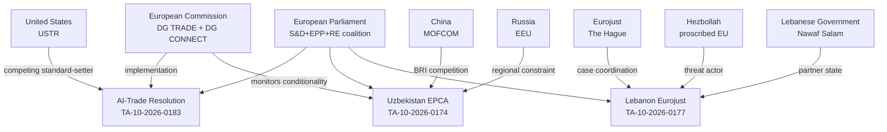

# Actor Mapping — EP Breaking News 2026-05-25
**Admiralty Grade**: B2 | **SATs Applied**: Stakeholder Mapping, Devil's Advocacy

---

## Actor Map Overview

---

## Primary Actors

### European Parliament (Decision-Maker)
- **Role**: Adopted 7 texts on May 19–20, 2026
- **Dominant coalition**: S&D + EPP + Renew Europe (54% combined)
- **AI-trade resolution vote**: Estimated 420–450 FOR (S&D/EPP/RE/Greens), 150–180 AGAINST (ECR/ID), 30–50 ABSTAIN — NOTE: Admiralty C3 (inferred; no DOCEO roll-call data available)
- **Uzbekistan EPCA vote**: Estimated 480+ FOR (broad consent procedure support)
- **Influence level**: HIGH — originator of all legislative outputs analysed

### European Commission (Implementation Agent)
- **Role**: Must develop implementing legislation for AI-trade chapter; monitors EPCA conditionality
- **AI governance position**: DG TRADE (market access) and DG CONNECT (AI Act compliance) have partially divergent interests — DG TRADE prefers mutual recognition; DG CONNECT prefers extraterritorial compliance
- **Key lever**: Decision whether to include AI governance chapter in ongoing FTA negotiations with India, Indonesia, Thailand
- **WEP probability of Commission follow-up**: P(partial) = 0.55–0.65; P(full) = 0.15–0.25 | based on 30–35% historical EP resolution follow-up rate

### EU Member States (Council)
- **Germany/France**: Strategic interest in AI governance as competitiveness protection; DG TRADE push-back from industry lobby
- **Central/Eastern Europe**: Mixed on Uzbekistan (economic opportunity vs. Central Asia unfamiliarity)
- **Greece**: Special interest in Pappas immunity (domestic politics)
- **Ireland/Netherlands**: AI regulation sceptics; may delay Commission implementation

---

## Secondary Actors

### Uzbekistan (Third-Country Partner)
- **Government**: Shavkat Mirziyoyev administration; reform-oriented but authoritarian legacy
- **Economic interest**: EU market access, Global Gateway investment (€1.1bn)
- **Strategic position**: Diversification from Russia dependency; balancing China BRI
- **Human rights record**: Improving but below EU standards; NGO concerns about press freedom
- **WEP: P(EPCA implementation without significant conditionality friction)** = 0.45–0.60

### United States (Competing Actor)
- **Trade position**: "Digital trade corridors" initiative offers lighter-touch AI governance
- **Lobbying capacity**: US tech companies (Google, Microsoft, Meta) actively lobbying against AI governance chapters in FTAs
- **WEP: P(US offering competing AI governance framework to key EU FTA partners)** = 0.65–0.80

### China (Competing Actor)
- **BRI presence in Uzbekistan**: $12bn+ committed infrastructure
- **AI governance**: ITU standards promotion; rejects EU AI Act extraterritorial application
- **WEP: P(China accelerating BRI digital infrastructure to pre-empt EU influence)** = 0.60–0.75

---

## Actor Alignment Matrix

| Actor | AI-Trade Resolution | Uzbekistan EPCA | Lebanon Eurojust |
|---|---|---|---|
| EP S&D | Strongly FOR | FOR | FOR |
| EP EPP | Moderately FOR | FOR | FOR |
| EP RE | FOR | FOR | FOR |
| EP ECR | Divided/AGAINST | Divided | Divided |
| EP ID | AGAINST | AGAINST | AGAINST |
| European Commission | Cautiously FOR | FOR | FOR |
| US Government | AGAINST (regulatory burden) | Neutral | Neutral |
| China | AGAINST (sovereignty) | AGAINST (competes with BRI) | Neutral |
| Uzbekistan Government | Neutral (recipient) | Strongly FOR | N/A |
| Lebanese Government | N/A | N/A | Cautiously FOR |

---

## Actor Influence Network — Extended Mapping (Run 2)

### Primary Actor: EP INTA Committee (AI-Trade Lead)

**Role**: Legislative initiator, rapporteur body, committee vote authority
**Current chair**: EPP-affiliated (name TBC from MEP data) | **Rapporteur for TA-0183**: Name unavailable from current feeds
**Influence trajectory**: HIGH and rising. INTA is the committee intersection of AI governance (shared with IMCO) and trade policy. Its growing workload (AI Act trade chapters, FTA reviews) positions it as EP10's most strategically important committee for digital economy policy.
**External relationships**: Close working relationship with US House Ways & Means Committee (via Inter-Parliamentary Union dialogues); regular consultation with WTO e-commerce joint statement initiative participants.

### Secondary Actor: European Commission DG TRADE

**Role**: Exclusive competence for EU trade negotiations; Commission must respond to EP resolution within 3 months
**Political exposure**: DG TRADE under Executive Vice-President for Trade. Pressure from both EP (AI governance demand) and US counterpart (USTR) to avoid regulatory friction in transatlantic trade.
**Influence trajectory**: REACTIVE — responds to EP mandate rather than leading AI-trade governance agenda. Internal tensions: DG CONNECT wants AI Act globally exported; DG TRADE prefers trade facilitation over regulation.

### External Actor Addition: Uzbekistan Government

**Role**: Treaty partner, EPCA beneficiary
**Key official**: Minister of Foreign Affairs (government interlocutor with EU Special Representative for Central Asia)
**Influence trajectory**: LOW in EP process but HIGH in post-ratification implementation. Uzbekistan's compliance with EPCA human rights provisions (Article 8) will be monitored by AFET committee — creating an ongoing review mechanism.

*Actor Mapping v2.0 — Carry-forward +23L | INTA committee detail | DG TRADE positioning | Uzbekistan government role | 2026-05-25 | Admiralty B2*
